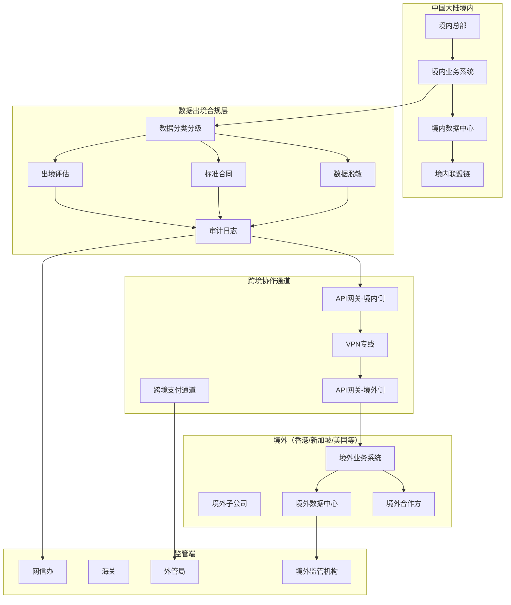
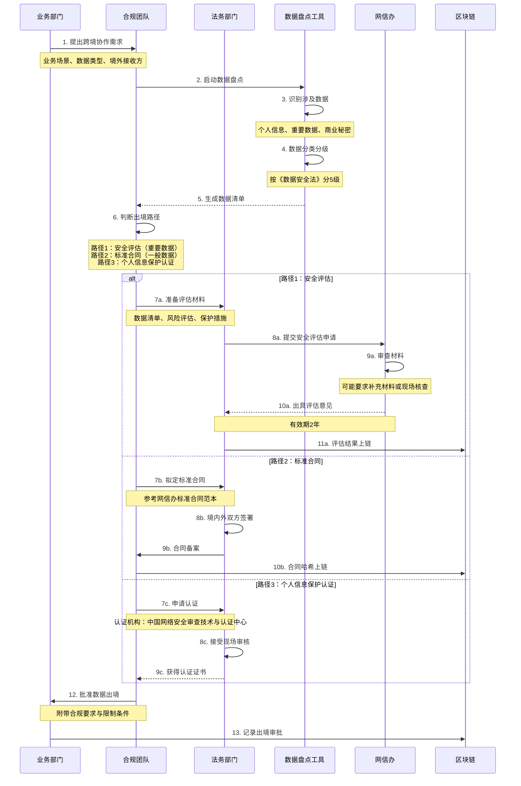
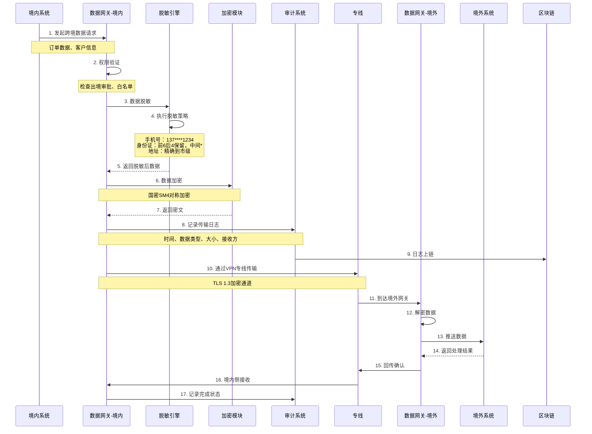
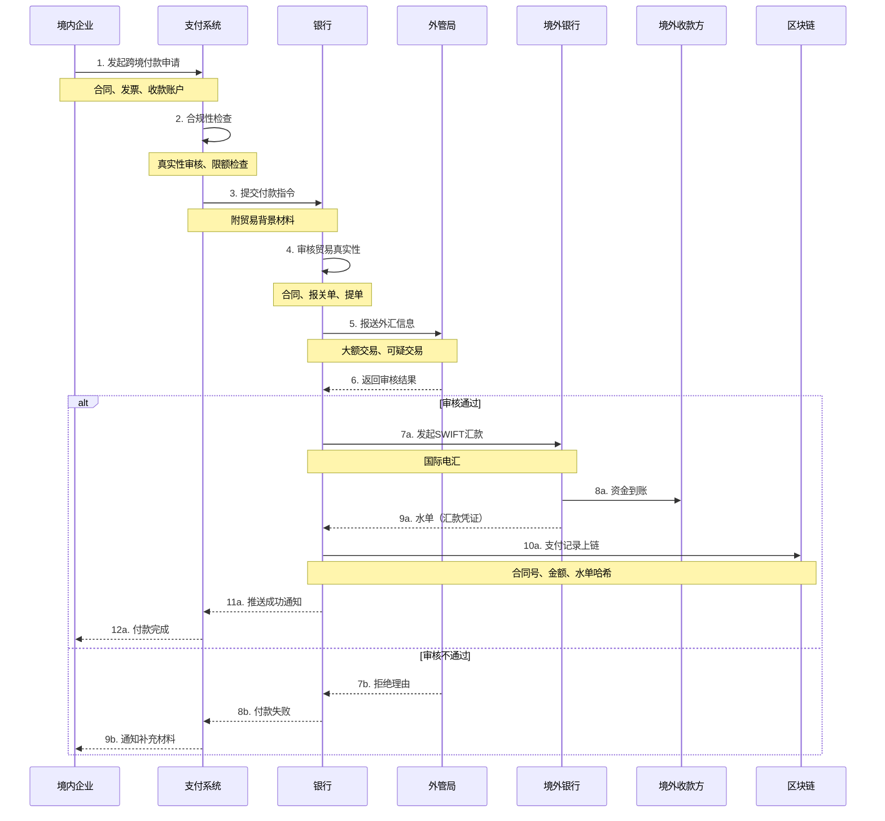
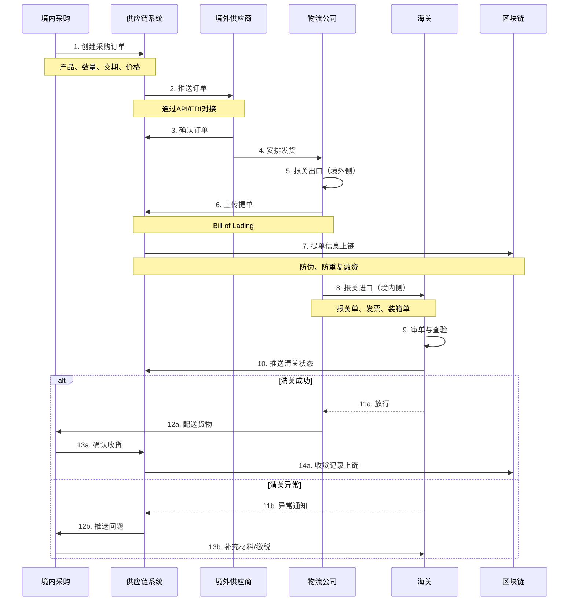

# J. 跨境合规协作（可选）详细方案设计

## 一、方案概述

### 1.1 业务目标
- 支持有境外业务的集团企业合规开展跨境数据协作
- 满足《数据出境安全评估办法》等监管要求
- 实现境内外系统与数据的合规隔离与有限互通
- 提供跨境支付、跨境物流、跨境供应链协同能力

### 1.2 核心价值
- **合规先行**：严格遵守境内外监管要求
- **风险隔离**：境内外系统物理隔离，数据最小化传输
- **高效协同**：支持跨境业务流程自动化
- **可审计**：全流程操作留痕，满足监管审计

### 1.3 重要说明
> ⚠️ **边界声明**：本方案**严格遵守中国大陆监管要求**，不触碰以下限制事项：
> - ❌ 代币发行、交易、ICO
> - ❌ 境内稳定币发行与流通
> - ❌ 未经批准的跨境资金转移
> - ❌ 绕开外汇管制的灰色通道
> - ✅ 合规路径：境内主体 + 境外合作方 + 数据出境评估 + 标准合同

---

## 二、业务架构图



---

## 三、核心业务流程

### 3.1 数据出境评估流程



**三种出境路径对比：**

| 路径 | 适用场景 | 主管部门 | 周期 | 成本 |
|-----|---------|---------|------|------|
| 安全评估 | 重要数据、100万+个人信息 | 国家网信办 | 3-6个月 | 50-200万元 |
| 标准合同 | 一般数据、<100万个人信息 | 自行签署 | 1-2个月 | 10-30万元 |
| 个人信息保护认证 | 持续出境个人信息 | 认证机构 | 3-6个月 | 30-80万元 |

---

### 3.2 跨境数据传输流程



**数据脱敏规则：**

| 数据类型 | 原始数据 | 脱敏规则 | 脱敏后 |
|---------|---------|---------|--------|
| 手机号 | 13712345678 | 中间4位* | 137****5678 |
| 身份证号 | 310104199001011234 | 前6后4保留 | 310104********1234 |
| 姓名 | 张三 | 姓保留，名* | 张* |
| 银行卡号 | 6222021234567890123 | 前6后4保留 | 622202**********0123 |
| 地址 | 上海市浦东新区XX路XX号 | 精确到区 | 上海市浦东新区 |
| 邮箱 | zhangsan@example.com | @前2位@后全部 | zh**@example.com |

---

### 3.3 跨境支付合规流程



**跨境支付合规要点：**

1. **贸易真实性**
   - 货物贸易：报关单 + 提单 + 发票
   - 服务贸易：合同 + 完工证明 + 发票
   - 投资收益：股权证明 + 董事会决议

2. **外汇额度管理**
   - 经常项目：银行审核，原则上无额度限制
   - 资本项目：需外管局审批，有额度限制

3. **反洗钱**
   - 大额交易报告（≥20万美元）
   - 可疑交易报告
   - 受益所有人识别

4. **税务合规**
   - 代扣代缴预提所得税（通常10%）
   - 提供税务证明（避免双重征税）

---

### 3.4 跨境供应链协同流程



**跨境物流关键单据：**

| 单据 | 签发方 | 用途 | 是否上链 |
|-----|--------|------|---------|
| 商业发票 | 供应商 | 报关、付汇 | ✓ |
| 装箱单 | 供应商 | 报关 | ✓ |
| 提单（B/L） | 船公司 | 物权凭证 | ✓ |
| 报关单 | 海关 | 证明进口 | ✓ |
| 原产地证 | 商检局 | 享受关税优惠 | ✓ |
| 检验检疫证 | 商检局 | 证明合格 | ✓ |

---

## 四、核心功能模块

### 4.1 数据出境合规管理

**功能清单：**
1. 数据资产盘点（参考E方案）
2. 数据分类分级（个人信息、重要数据、一般数据）
3. 出境评估材料生成（自动填表）
4. 标准合同管理（模板、签署、归档）
5. 出境审批流程（内部审批链）
6. 白名单管理（允许出境的数据类型与接收方）

**标准合同模板（简化版）：**

```
个人信息出境标准合同

甲方（境内个人信息处理者）：XX科技有限公司
乙方（境外接收方）：XX (HK) Limited

鉴于甲方在中国大陆境内处理个人信息，因业务需要向乙方提供个人信息，
双方根据《个人信息保护法》及《个人信息出境标准合同办法》订立本合同：

第一条 个人信息出境目的、范围
1.1 出境目的：跨境订单处理
1.2 个人信息类型：姓名、手机号、收货地址（已脱敏）
1.3 敏感个人信息：无
1.4 个人信息主体数量：≤10万人/年
1.5 个人信息数量：≤50万条/年

第二条 境外接收方处理个人信息的义务
2.1 不得超出约定的目的、范围处理个人信息
2.2 不得向第三方提供或披露个人信息
2.3 采取必要措施保障个人信息安全
2.4 发生泄露及时通知甲方并采取补救措施

第三条 个人信息主体权利保障
3.1 个人信息主体有权查询、更正、删除其个人信息
3.2 乙方应配合甲方响应个人信息主体的请求

第四条 争议解决
本合同适用中华人民共和国法律，争议由甲方所在地人民法院管辖

......
```

---

### 4.2 跨境API网关

**架构设计：**

```
境内系统
    ↓
境内API网关
    ├─ 身份认证（OAuth2.0）
    ├─ 权限控制（白名单）
    ├─ 数据脱敏
    ├─ 加密（国密SM4）
    ├─ 审计日志
    └─ 流量控制（Rate Limiting）
    ↓
VPN专线（或跨境专线）
    ↓
境外API网关
    ├─ 解密
    ├─ 身份验证
    ├─ 日志记录
    └─ 转发到境外系统
    ↓
境外系统
```

**API接口示例：**

```http
POST /api/v1/cross-border/order/sync
Host: gateway-domestic.example.com
Authorization: Bearer {access_token}
X-Data-Classification: 一般数据
X-Approval-No: APPROVAL-20251020-001

{
  "order_id": "ORD-20251020-12345",
  "customer": {
    "name": "张*",           // 已脱敏
    "phone": "137****5678",  // 已脱敏
    "address": "上海市浦东新区" // 已脱敏
  },
  "items": [...],
  "amount": 1000.00
}
```

**安全措施：**
- 双向TLS认证
- API密钥定期轮换（30天）
- 请求签名（防重放攻击）
- IP白名单
- 流量限制（1000次/小时）

---

### 4.3 跨境支付对接

**支持渠道：**

| 渠道 | 适用场景 | 手续费 | 到账时效 |
|-----|---------|-------|---------|
| SWIFT | B2B大额汇款 | 0.1%-0.5% + 电报费 | 1-3个工作日 |
| Western Union | 小额汇款 | 1%-3% | 即时 |
| 支付宝国际 | 个人跨境收付 | 1%-2% | T+1 |
| 香港银行账户 | 离岸结算 | 较低 | 1-2个工作日 |
| e-CNY跨境试点 | 深圳/海南试点 | 免费 | 即时 |

**跨境支付流程示例（B2B）：**

```
1. 境内企业发起付款申请
   ↓
2. 银行审核贸易背景（真实性）
   ↓
3. 外管局审批（大额）
   ↓
4. 发起SWIFT汇款
   ↓
5. 境外银行收款
   ↓
6. 水单（汇款凭证）回传
   ↓
7. 区块链存证
```

---

### 4.4 监管报送模块

**报送内容：**

1. **网信办报送**（数据出境）
   - 数据出境清单（季度）
   - 安全事件报告（实时）
   - 年度合规报告

2. **海关报送**（跨境物流）
   - 报关单数据
   - 舱单数据
   - 进出口许可证

3. **外管局报送**（跨境支付）
   - 大额交易报告（≥5万美元）
   - 可疑交易报告
   - 外汇收支申报

**报送接口示例：**

```xml
<!-- 数据出境报告（简化版） -->
<DataExportReport>
  <ReportPeriod>2025Q1</ReportPeriod>
  <Organization>XX科技有限公司</Organization>
  <ExportItems>
    <Item>
      <DataType>客户订单信息</DataType>
      <Classification>一般数据</Classification>
      <Volume>50000条</Volume>
      <Destination>香港子公司</Destination>
      <LegalBasis>标准合同</LegalBasis>
      <ContractNo>CONTRACT-2024-001</ContractNo>
    </Item>
  </ExportItems>
  <SecurityIncidents>无</SecurityIncidents>
  <Signature>数字签名</Signature>
</DataExportReport>
```

---

## 五、系统集成接口

### 5.1 境内系统
- ERP系统：采购、销售、财务数据
- CRM系统：客户信息（脱敏后）
- 订单系统：跨境订单
- 支付系统：跨境支付指令

### 5.2 境外系统
- 境外ERP：同步订单与库存
- 境外电商平台：订单推送
- 境外物流系统：物流追踪

### 5.3 外部平台
- 海关系统：报关单申报
- 外管局系统：外汇申报
- 国际物流平台：货物追踪

---

## 六、部署架构

### 6.1 网络架构

```
┌─────────────────────────────────────────┐
│          中国大陆境内                    │
│  ┌─────────────────────────────────┐   │
│  │ 业务系统                         │   │
│  └──────────┬──────────────────────┘   │
│             ↓                            │
│  ┌─────────────────────────────────┐   │
│  │ API网关（境内）                  │   │
│  │  - 鉴权                          │   │
│  │  - 脱敏                          │   │
│  │  - 加密                          │   │
│  │  - 审计                          │   │
│  └──────────┬──────────────────────┘   │
└─────────────┼───────────────────────────┘
              ↓
      VPN专线/跨境专线
      （加密传输）
              ↓
┌─────────────────────────────────────────┐
│          境外（香港/新加坡/美国）         │
│  ┌─────────────────────────────────┐   │
│  │ API网关（境外）                  │   │
│  │  - 解密                          │   │
│  │  - 验证                          │   │
│  │  - 日志                          │   │
│  └──────────┬──────────────────────┘   │
│             ↓                            │
│  ┌─────────────────────────────────┐   │
│  │ 境外业务系统                     │   │
│  └─────────────────────────────────┘   │
└─────────────────────────────────────────┘
```

### 6.2 数据隔离策略

- **物理隔离**：境内外数据中心物理分离
- **网络隔离**：专线连接，不走公网
- **逻辑隔离**：不同数据库实例
- **最小化原则**：仅传输必要数据，非必要不出境

---

## 七、KPI 指标体系

### 7.1 合规指标
- 数据出境合规率：**100%**（有评估/合同/认证）
- 跨境支付合规率：**100%**（有真实贸易背景）
- 监管报送及时率：**100%**
- 合规审计通过率：**100%**

### 7.2 业务指标
- 跨境订单处理时效：≤ **2小时**
- 跨境支付成功率：≥ **99%**
- 清关通过率：≥ **95%**
- 跨境API可用性：≥ **99.5%**

### 7.3 风险指标
- 数据泄露事件：**0起**
- 违规出境事件：**0起**
- 外汇违规：**0起**
- 监管处罚：**0次**

---

## 八、成本与收益分析

### 8.1 建设成本
- 跨境协作平台开发：100-150万元
- 数据出境合规工具：50-80万元
- API网关部署（境内+境外）：60-100万元
- 法律合规咨询：50-100万元
- VPN专线（年费）：30-50万元
- 实施与培训：40-60万元
- **总计**：330-540万元

### 8.2 年运营成本
- 跨境专线：30-50万元
- 云服务（境内+境外）：50-80万元
- 法律合规维护：30-50万元
- 系统维护：30-50万元
- 人员运营：80-120万元
- **总计**：220-350万元

### 8.3 收益评估

- **业务拓展**：
  - 开拓境外市场，跨境订单年增长30%
  - 价值：**数千万元/年**

- **合规避险**：
  - 避免因数据出境违规被罚（单次可达千万）
  - 避免外汇违规处罚
  - 价值：**不可估量**

- **效率提升**：
  - 跨境协作自动化，人工成本下降50%
  - 节省：**100-200万元/年**

**投资回收期**：约 **2-3年**（取决于业务规模）

---

## 九、典型应用场景

### 场景1：跨境电商
- **企业**：中国品牌出海
- **需求**：境内订单 → 境外仓 → 当地配送
- **方案**：订单数据脱敏 + API同步 + 跨境物流追踪
- **效果**：订单处理时效从2天→2小时

### 场景2：跨国集团
- **企业**：总部在中国，境外有多家子公司
- **需求**：统一ERP、财务合并报表
- **方案**：数据出境评估 + 专线 + 数据最小化
- **效果**：合规运营，监管审查零问题

### 场景3：供应链金融
- **企业**：境内核心企业 + 境外供应商
- **需求**：应收凭证跨境流转
- **方案**：区块链跨链 + 标准合同 + 跨境支付
- **效果**：境外供应商融资可得性提升

### 场景4：研发协同
- **企业**：境内研发中心 + 境外研发团队
- **需求**：代码、文档协同
- **方案**：Git仓库境内外同步 + 敏感数据隔离
- **效果**：研发效率提升，知识产权保护

---

## 十、风险与应对

| 风险类型 | 风险描述 | 应对措施 |
|---------|---------|---------|
| 政策变化 | 数据出境政策收紧 | 持续跟踪政策 + 快速调整方案 |
| 数据泄露 | 跨境传输被截获 | 加密传输 + 专线 + 访问控制 |
| 外汇风险 | 汇率波动、管制加强 | 套期保值 + 合规路径 |
| 境外合规 | GDPR、CCPA等境外法规 | 聘请境外律师 + 双向合规 |
| 技术故障 | 专线中断 | 冗余专线 + 应急预案 |

---

## 十一、境外主要市场合规要点

### 11.1 欧盟（GDPR）

- **数据保护官（DPO）**：需指定DPO
- **数据处理协议**：与境外接收方签署DPA
- **数据主体权利**：查询、删除、可携带
- **违规罚款**：最高2000万欧元或全球营收4%

### 11.2 美国（CCPA/CPRA）

- **适用范围**：加州居民个人信息
- **消费者权利**：知情权、删除权、选择退出权
- **罚款**：每条记录$2500（故意）/$750（非故意）

### 11.3 香港（PDPO）

- **六项数据保护原则**
- **跨境数据转移**：需采取合理保护措施
- **罚款**：HK$50万 + 监禁2年

### 11.4 新加坡（PDPA）

- **同意原则**：需取得同意
- **跨境转移**：需确保境外接收方提供可比保护
- **罚款**：S$100万

---

## 十二、实施路线图

### Phase 1：合规准备（3-4个月）
- 数据资产盘点
- 数据分类分级
- 选择出境路径（评估/合同/认证）
- 准备合规材料

### Phase 2：基础设施（3-4个月）
- 境内API网关部署
- 境外API网关部署（香港/新加坡）
- VPN专线开通
- 数据脱敏工具上线

### Phase 3：业务对接（4-6个月）
- 跨境订单同步
- 跨境支付对接
- 跨境物流追踪
- 试运行与调优

### Phase 4：持续运营（长期）
- 监管报送
- 合规审计
- 政策跟踪
- 系统优化

---

## 十三、交付物清单

1. 数据出境合规管理平台
2. 跨境API网关（境内+境外）
3. 数据脱敏工具
4. 跨境支付对接系统
5. 跨境物流协同平台
6. 审计日志系统
7. 区块链存证系统
8. 监管报送工具
9. 合规材料包（评估报告/标准合同模板）
10. 数据出境风险评估报告
11. 境外合规指南（GDPR/CCPA对标）
12. 应急预案
13. 操作手册与培训
14. 跨境业务合规手册

---

## 十四、重要法律免责声明

> ⚠️ **免责声明**：
> 
> 1. 本方案仅为技术解决方案建议，不构成法律意见。
> 2. 企业在实施跨境业务前，**必须咨询专业律师**，获取针对性法律意见。
> 3. 数据出境、跨境支付等事项受多部法律法规监管，政策可能变化，请以最新法规为准。
> 4. 本方案提供方**不承担**因使用本方案而产生的任何法律责任。
> 5. 建议聘请：
>    - 境内律师：熟悉《个保法》《数据安全法》《网安法》
>    - 境外律师：熟悉GDPR、CCPA等境外法规
>    - 外汇顾问：熟悉外汇管理政策
> 
> **合规是红线，切勿违规操作！**

---

**方案版本**：v1.0  
**最后更新**：2025-10-20  
**适用场景**：跨国集团、跨境电商、出海企业、外资企业

