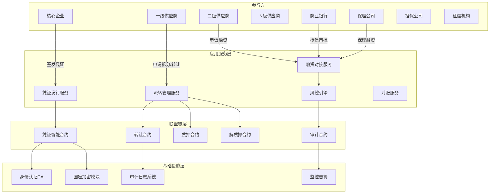
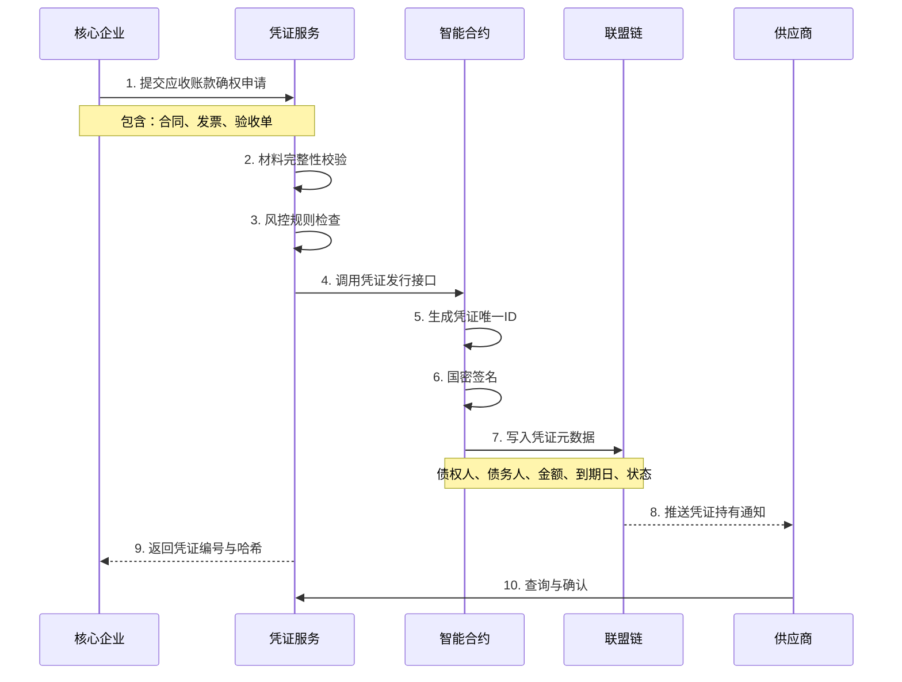
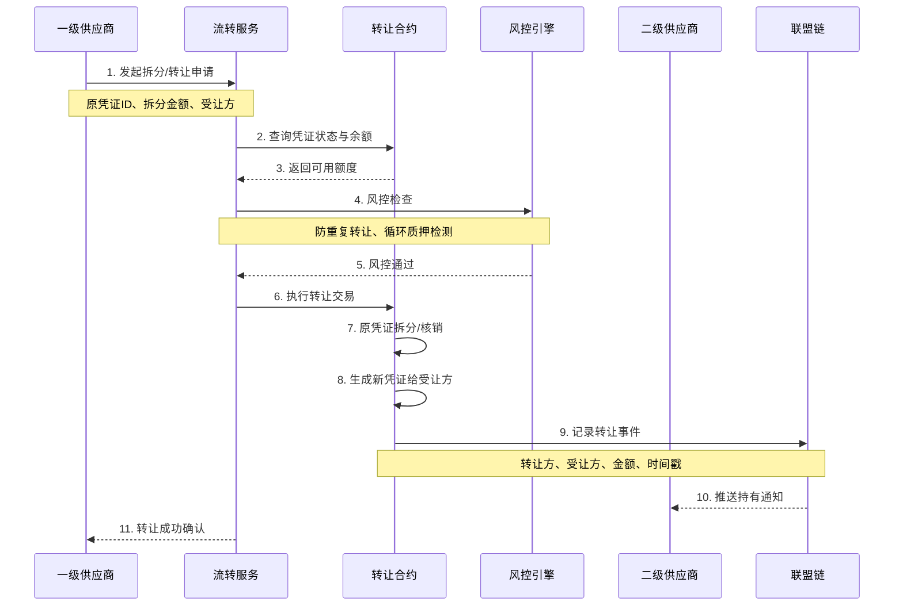
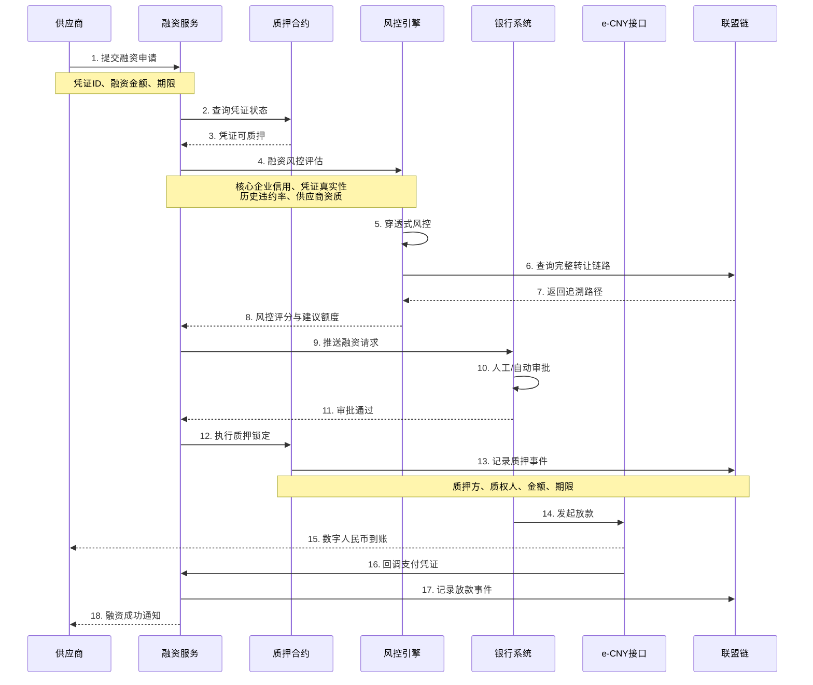
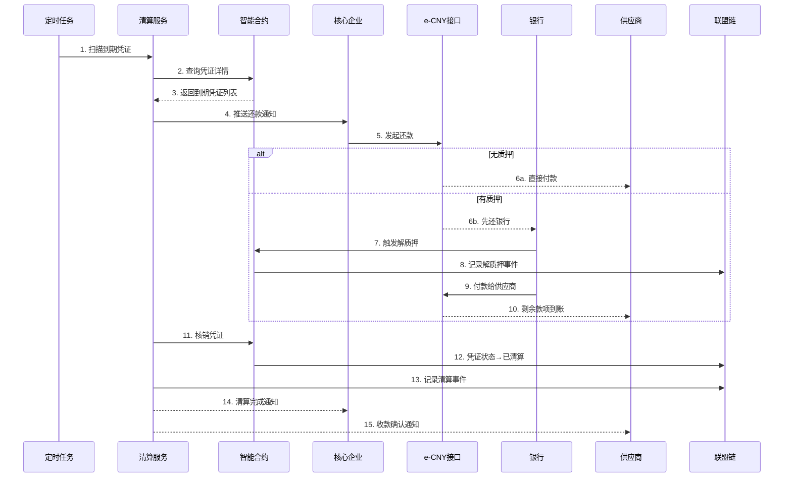

# A. 供应链金融 & 数字凭证 详细方案设计

## 一、方案概述

### 1.1 业务目标
- 实现应收账款、预付账款、票据、仓单等凭证的可信数字化流转
- 支持凭证的转让、质押、融资等全生命周期管理
- 实现供应链金融业务的穿透式风控和审计
- 降低中小企业融资成本，提高资金周转效率

### 1.2 核心价值
- **可信流转**：基于联盟链的不可篡改凭证流转记录
- **穿透核验**：从核心企业到多级供应商的穿透式校验
- **融资对接**：与银行/保理公司系统对接，加速融资审批
- **风险管控**：防重复融资、反质押循环检测、额度实时监控

---

## 二、业务架构图



---

## 三、核心业务流程

### 3.1 凭证签发流程



**关键控制点：**
1. 核心企业数字签名验证（国密SM2）
2. 凭证金额与合同、发票三单匹配
3. 唯一性校验（防重复签发）
4. 凭证状态初始化为"持有中"

---

### 3.2 凭证拆分与转让流程



**关键控制点：**
1. 转让方持有凭证有效性校验
2. 拆分金额不超过凭证可用余额
3. 受让方身份合规性检查
4. 转让链路穿透记录（追溯到核心企业）
5. 防止循环转让（图算法检测环路）

---

### 3.3 凭证质押融资流程



**关键控制点：**
1. 凭证未被质押/转让状态检查
2. 穿透式风控：验证到核心企业的完整链路
3. 质押冻结期间凭证不可转让
4. 放款与质押原子性（事务保证）
5. e-CNY 支付回单关联存证

---

### 3.4 凭证到期清算流程



**关键控制点：**
1. 到期日自动触发清算流程
2. 质押凭证优先还款给质权人
3. 支付顺序：银行本息 → 担保费用 → 供应商余额
4. 凭证核销后不可再次使用
5. 全流程审计日志留存

---

## 四、核心功能模块

### 4.1 凭证智能合约模块

**主要功能：**
- 凭证发行（Issue）
- 凭证拆分（Split）
- 凭证转让（Transfer）
- 凭证质押（Pledge）
- 凭证解质押（Unpledge）
- 凭证核销（Redeem）
- 状态查询（Query）

**数据结构：**
```
凭证对象 {
  凭证ID: string
  原始凭证ID: string (拆分后)
  债权人: string (核心企业)
  债务人: string (当前持有人)
  初始金额: decimal
  剩余金额: decimal
  签发日期: timestamp
  到期日期: timestamp
  状态: enum (持有中|已转让|已质押|已核销)
  转让历史: array
  质押信息: object
  合同哈希: string
  发票哈希: string
  国密签名: string
}
```

**状态机：**
```
初始化 → 持有中 → [转让/拆分] → 持有中
                 ↓
               已质押 → 解质押 → 持有中
                 ↓
               到期 → 已核销
```

---

### 4.2 风控引擎模块

**核心规则：**

1. **防重复融资规则**
   - 检查凭证是否已质押
   - 跨平台黑名单查询（征信接口）
   - 历史融资记录去重

2. **循环质押检测**
   - 图算法检测转让链路中的环路
   - 关联企业持股关系穿透
   - 异常转让频率告警

3. **额度风控**
   - 核心企业总授信额度控制
   - 单笔凭证融资比例限制（如70%）
   - 供应商融资余额上限

4. **真实性校验**
   - 三单匹配：合同+发票+验收单
   - 核心企业确权接口回调
   - 历史贸易背景审查

**风控评分模型：**
```
总分 = 核心企业评级(40%) 
     + 凭证真实性(30%) 
     + 供应商资质(20%) 
     + 历史履约率(10%)

评级  | 分数      | 建议融资比例
-----|-----------|-------------
AAA  | 90-100    | 80%
AA   | 80-89     | 70%
A    | 70-79     | 60%
BBB  | 60-69     | 50%
拒绝  | <60       | 0%
```

---

### 4.3 穿透式审计模块

**审计维度：**

1. **凭证生命周期审计**
   - 签发 → 转让 → 质押 → 清算全流程
   - 每步操作人、时间戳、IP地址
   - 国密签名验证记录

2. **资金流审计**
   - e-CNY 支付回单关联
   - 放款 → 还款闭环追踪
   - 资金分账明细（本金、利息、手续费）

3. **风险事件审计**
   - 逾期事件记录
   - 异常转让告警
   - 风控拒绝原因留存

**审计报表输出：**
- 按核心企业维度：授信使用率、逾期率
- 按供应商维度：融资笔数、平均利率
- 按银行维度：放款规模、不良率
- 按时间维度：日报、月报、季度报

---

## 五、系统集成接口

### 5.1 核心企业ERP对接
- 应收账款数据同步
- 供应商白名单同步
- 付款计划导入

### 5.2 银行核心系统对接
- 授信额度查询
- 放款审批回调
- 还款指令推送

### 5.3 e-CNY 对接
- 对公钱包开通
- 支付指令发起
- 支付回单查询与存证

### 5.4 征信接口
- 企业征信查询
- 黑名单校验
- 历史违约记录

### 5.5 电子签章平台
- 合同在线签署
- 签名验证
- CA证书管理

---

## 六、部署架构

### 6.1 联盟链网络拓扑
```
核心企业节点 (Orderer)
    ↓
├── 银行1节点 (Peer + Endorser)
├── 银行2节点 (Peer + Endorser)
├── 保理公司节点 (Peer)
├── 担保公司节点 (Peer)
└── 平台运营节点 (Peer + CA)
```

### 6.2 高可用部署
- 应用服务：K8s 多副本（≥3）
- 数据库：PostgreSQL 主从复制
- 联盟链：多组织多节点（≥4）
- 缓存层：Redis Cluster

### 6.3 安全加固
- 国密SSL通信（SM2证书）
- API网关鉴权（OAuth2.0）
- 敏感数据加密存储（SM4）
- 密钥托管（HSM硬件加密机）

---

## 七、KPI 指标

### 7.1 业务指标
- 融资放款时效：从申请到到账 ≤ **4小时**（自动审批）/ **24小时**（人工审批）
- 凭证真伪核验耗时：≤ **5秒**
- 差错率：≤ **0.1%**
- 融资成本下降：**2-3个百分点**

### 7.2 技术指标
- 链上写入TPS：≥ **500 TPS**
- 查询响应时间：P99 ≤ **200ms**
- 系统可用性：≥ **99.9%**
- 穿透审计查询：≤ **3秒**（5级穿透）

### 7.3 合规指标
- 等保三级测评：**通过**
- 国密改造覆盖率：**100%**
- 审计日志留存：≥ **7年**
- 隐私数据加密率：**100%**

---

## 八、成本与收益分析

### 8.1 成本节约
- 人工对账成本：↓ **80%**
- 融资审批时长：↓ **70%**
- 纸质单据成本：↓ **90%**
- 中间环节费用：↓ **30-50%**

### 8.2 效率提升
- 供应商融资可得性：从 30% → **80%**
- 中小企业融资成功率：↑ **50%**
- 资金周转率：↑ **30%**

### 8.3 风险控制
- 重复融资检出率：**99%**
- 虚假凭证拦截率：**95%**
- 逾期预警准确率：**85%**

---

## 九、实施路线图

### 阶段一：MVP试点（4-6周）
- 单一核心企业 + 3-5家供应商
- 凭证签发与转让功能
- 基础风控规则
- 与1家银行对接

### 阶段二：功能完善（6-8周）
- 增加质押融资功能
- e-CNY 对接上线
- 完整风控引擎
- 多银行接入

### 阶段三：规模推广（3-6个月）
- 多核心企业接入
- 跨链互通（与其他联盟链）
- 监管报送接口
- 智能合约升级机制

---

## 十、风险与应对

| 风险类型 | 风险描述 | 应对措施 |
|---------|---------|---------|
| 技术风险 | 联盟链性能瓶颈 | 分片技术、状态通道、异步共识 |
| 业务风险 | 核心企业违约 | 担保/保险、多核心企业分散 |
| 合规风险 | 监管政策变化 | 预留合规接口、灵活配置规则 |
| 集成风险 | 银行系统对接复杂 | 统一适配层、分阶段灰度 |
| 数据风险 | 隐私泄露 | 零知识证明、数据脱敏、权限细粒度控制 |

---

## 十一、交付物清单

1. 联盟链智能合约代码与部署脚本
2. 应用服务源码与API文档
3. 风控规则配置手册
4. 系统操作手册（角色：核心企业/供应商/银行）
5. 等保三级合规材料包
6. 国密改造验收报告
7. 审计报表模板（20+报表）
8. 运维监控面板
9. 应急预案与演练记录
10. 培训视频与FAQ文档

---

**方案版本**：v1.0  
**最后更新**：2025-10-20  
**适用行业**：制造业、汽车、电子、化工、零售等

