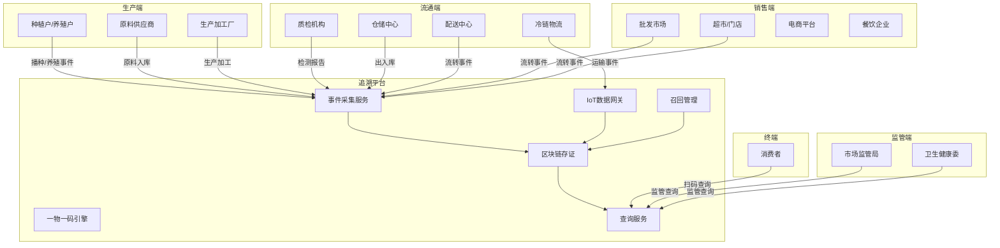
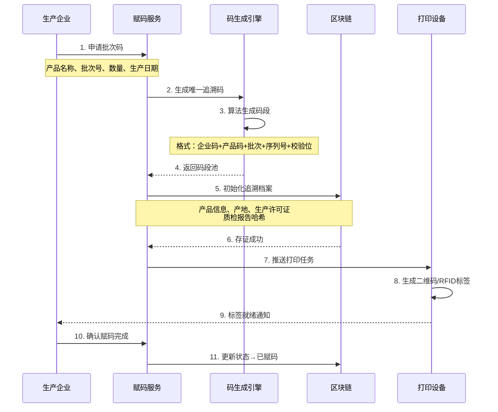
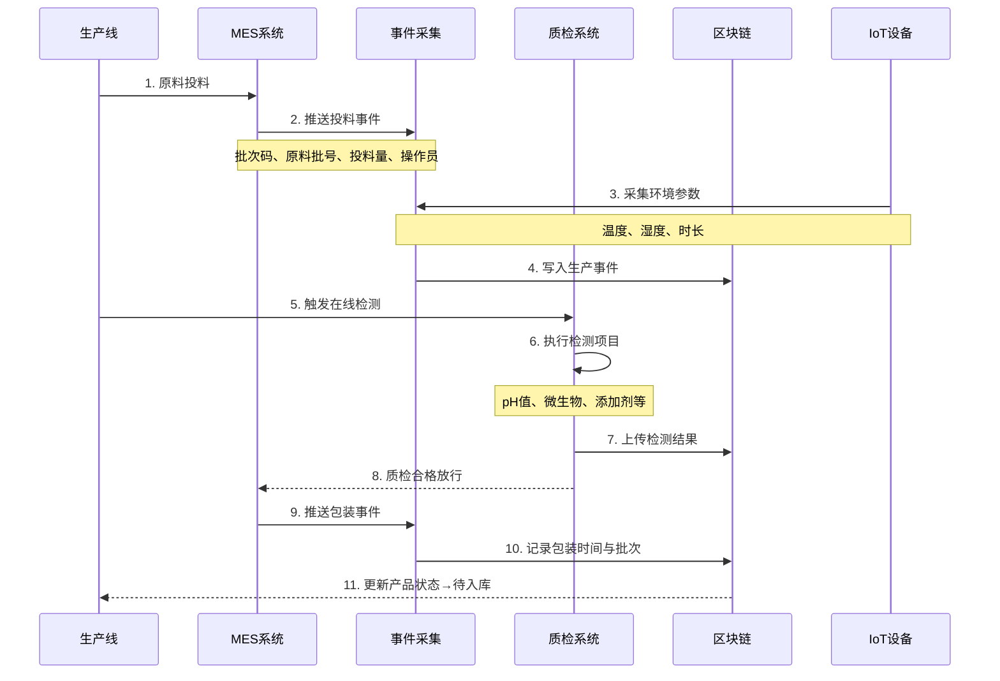
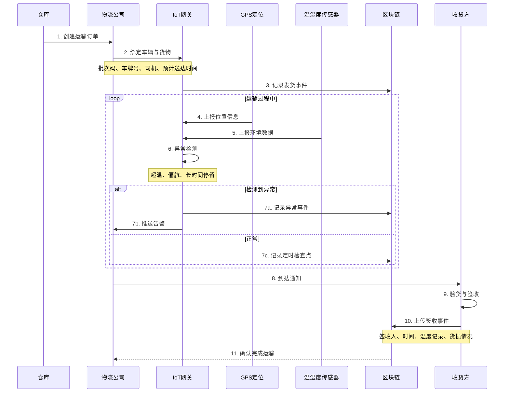
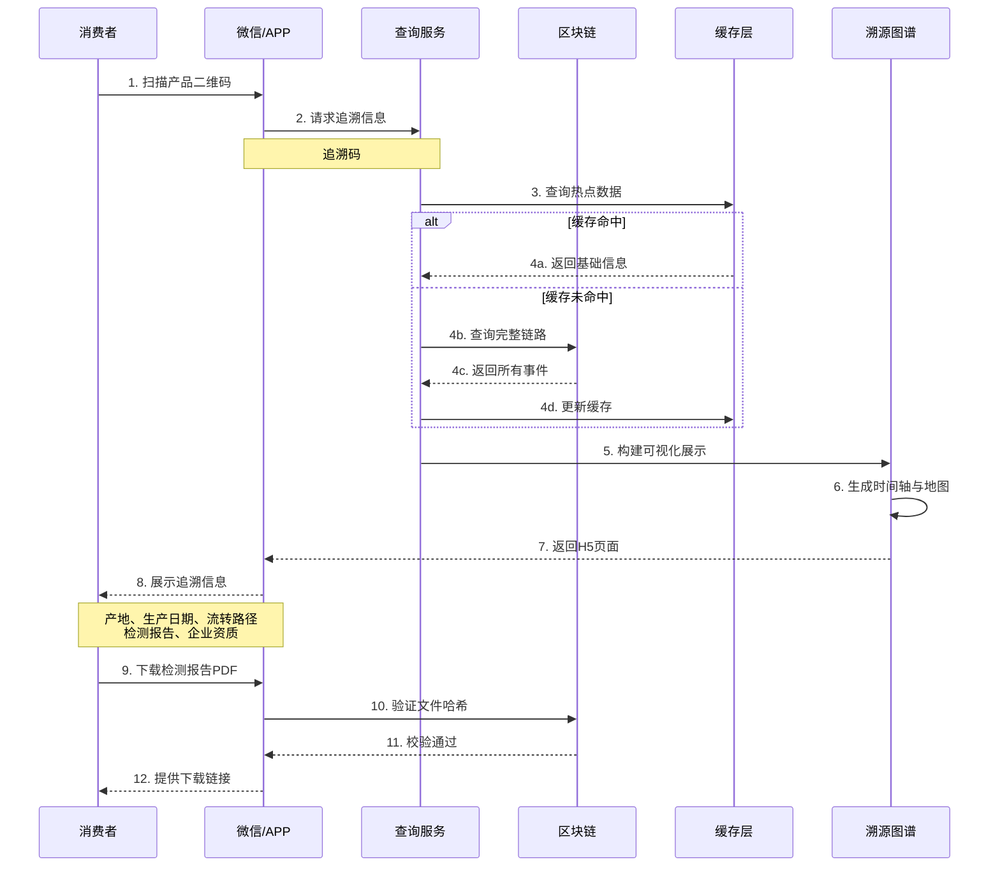
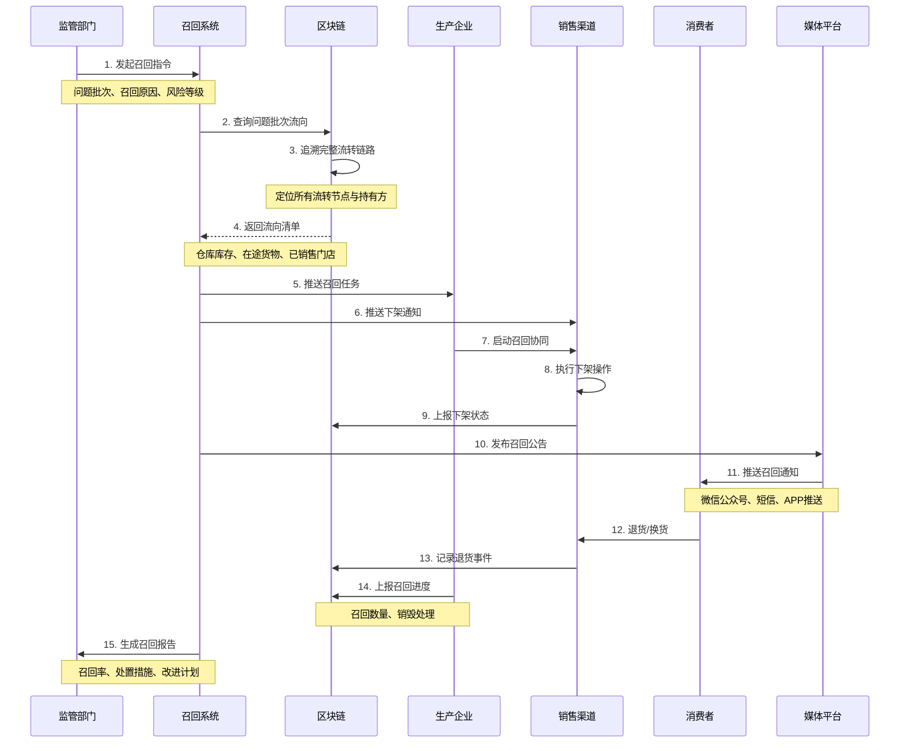

# B. 食品/农产品全链路可追溯 详细方案设计

## 一、方案概述

### 1.1 业务目标
- 实现从产地到餐桌的全链路可追溯体系
- 建立一物一码的数字身份管理机制
- 实现食品安全事件快速召回与追责
- 提升消费者信任度与品牌价值

### 1.2 核心价值
- **全程透明**：种植/养殖 → 加工 → 仓储 → 物流 → 销售全链可视
- **快速召回**：问题批次定位从数天缩短至分钟级
- **责任明确**：每个环节操作人员与时间戳可追溯
- **消费者信任**：扫码查询完整溯源信息

---

## 二、业务架构图



---

## 三、核心业务流程

### 3.1 产品赋码与初始化流程



**关键控制点：**
1. 追溯码全局唯一性校验
2. 与国家平台编码规则对接（如GS1）
3. 二维码防伪加密（动态密钥）
4. 批次码与单品码两级管理

---

### 3.2 生产加工环节上链流程



**关键控制点：**
1. 原料批次与成品批次关联（配方BOM）
2. 关键工艺参数自动采集（防人工篡改）
3. 质检不合格自动阻断后续流程
4. 操作员身份认证与签名

---

### 3.3 物流运输追踪流程



**关键控制点：**
1. 冷链全程温度记录（每5分钟一次）
2. GPS轨迹与预设路线偏差告警
3. 签收时货物外观与数量验证
4. 运输异常自动触发保险理赔流程

---

### 3.4 消费者查询流程



**展示内容：**
1. **基础信息**：产品名称、品牌、规格、生产日期、保质期
2. **产地信息**：种植/养殖基地、地理位置、环境照片
3. **流转路径**：时间轴展示各环节（生产→仓储→物流→销售）
4. **检测报告**：农残检测、重金属、微生物等
5. **企业资质**：生产许可证、有机认证、ISO认证
6. **防伪验证**：查询次数、首次查询时间（防倒卖）

---

### 3.5 问题产品召回流程



**KPI指标：**
- 批次定位时效：≤ **5分钟**
- 通知覆盖率：≥ **95%**
- 召回完成率：≥ **90%**（30天内）
- 责任定位准确率：**100%**

---

## 四、核心功能模块

### 4.1 一物一码管理模块

**编码规则设计：**
```
追溯码结构（20位）：
[企业代码6位] + [产品类别2位] + [生产日期6位] + [批次2位] + [序列号3位] + [校验位1位]

示例：310115 01 20251020 01 001 7
     ↑      ↑   ↑        ↑  ↑   ↑
     企业   果蔬 日期     批次 序号 校验
```

**防伪技术：**
1. **动态二维码**：每次扫码生成新密钥，防复制
2. **区块链锚定**：码与链上记录哈希绑定
3. **查询次数统计**：异常查询告警（如单码被扫100+次）
4. **地理位置校验**：扫码地点与预期销售区域匹配

---

### 4.2 IoT 数据采集模块

**采集设备类型：**

| 设备类型 | 采集参数 | 采集频率 | 应用场景 |
|---------|---------|---------|---------|
| 温湿度传感器 | 温度、湿度 | 5分钟 | 冷链运输、仓储 |
| GPS定位器 | 经纬度、速度 | 1分钟 | 物流车辆 |
| RFID读写器 | 标签UID、状态 | 实时 | 出入库自动识别 |
| 智能摄像头 | 图像、视频 | 事件触发 | 生产线取证 |
| 光照传感器 | 光照强度 | 10分钟 | 农产品种植 |
| 土壤传感器 | pH、养分 | 1小时 | 种植环境监测 |

**数据可信采集：**
- TEE可信执行环境：传感器数据在硬件层签名
- 防篡改时间戳：NTP校时 + 区块链时间锚定
- 异常检测：传感器故障、数据突变告警
- 数据压缩：时序数据本地聚合后上链

---

### 4.3 事件上链模块

**事件类型定义：**

```
事件基础结构 {
  事件ID: string
  追溯码: string
  事件类型: enum
  发生时间: timestamp
  操作主体: string (企业/人员)
  操作地点: GPS坐标
  事件内容: json
  附件哈希: array
  数字签名: string
}

事件类型枚举：
- 生产类：播种、施肥、收获、加工、包装
- 质检类：农残检测、营养成分、微生物检测
- 流通类：入库、出库、装车、运输、到货、上架
- 异常类：温度异常、质检不合格、货损、召回
```

**上链策略：**
1. **实时上链**：关键事件（质检、交接）立即上链
2. **批量上链**：高频事件（温度采集）定时批量上链
3. **分层存储**：链上存哈希+摘要，链下存完整数据（IPFS/OSS）
4. **跨链互通**：与国家追溯平台数据同步接口

---

### 4.4 智能预警模块

**预警规则引擎：**

1. **温控预警**
   - 冷藏产品：2°C - 8°C超出30分钟告警
   - 冷冻产品：-18°C以下，超出1小时告警
   - 常温产品：<30°C，高温季节放宽至35°C

2. **时效预警**
   - 配送超时：与计划送达时间对比
   - 库存积压：超保质期50%未销售
   - 流转异常：某环节停留>72小时

3. **质量预警**
   - 质检不合格自动隔离
   - 同批次投诉>3次启动复检
   - 供应商连续不合格列入观察

4. **安全预警**
   - 扫码频率异常（疑似造假）
   - 物流偏航>20公里
   - 未授权人员操作

---

## 五、系统集成接口

### 5.1 生产系统对接
- MES制造执行系统：生产订单、工艺参数
- ERP企业资源计划：原料BOM、产品档案
- 质检LIMS系统：检测项目、结果数据

### 5.2 物流系统对接
- TMS运输管理系统：运单、车辆、司机
- WMS仓储管理系统：出入库、库存
- GPS/北斗平台：车辆定位

### 5.3 销售系统对接
- POS收银系统：销售数据
- 电商平台：订单、物流状态
- 会员系统：消费者画像

### 5.4 监管平台对接
- 国家追溯平台：数据上报接口
- 市场监管系统：企业资质、抽检结果
- 海关系统：进出口商品检验检疫

---

## 六、数据模型设计

### 6.1 产品档案
```
产品对象 {
  产品ID: string
  产品名称: string
  品牌: string
  类别: string (水果/蔬菜/肉类/水产)
  规格: string
  生产企业: {
    企业名称: string
    社会信用代码: string
    生产许可证: string
    地址: string
  }
  产地信息: {
    省市区: string
    GPS坐标: [lat, lng]
    基地认证: array (有机、绿色、无公害)
  }
}
```

### 6.2 批次档案
```
批次对象 {
  批次号: string
  追溯码前缀: string
  产品ID: string
  生产日期: date
  保质期: int (天)
  数量: int
  单位: string
  原料溯源: array [{
    原料名称: string
    原料批次: string
    用量: decimal
  }]
  质检报告: array [{
    检测项目: string
    检测结果: string
    检测机构: string
    报告编号: string
    报告哈希: string
  }]
  状态: enum (生产中|合格|不合格|已召回)
}
```

### 6.3 流转记录
```
流转事件 {
  事件ID: string
  追溯码: string
  上游节点: string
  下游节点: string
  交接时间: timestamp
  数量: int
  运输方式: enum (冷链车|常温车|空运|铁路)
  温湿度记录: array
  签收人: string
  签收照片: string
  区块高度: int
  交易哈希: string
}
```

---

## 七、用户界面设计

### 7.1 消费者端（小程序/H5）

**首页展示：**
```
┌─────────────────────────────┐
│  [产品照片]                  │
│  有机草莓                    │
│  规格：500g/盒               │
│  生产日期：2025-10-18        │
│  保质期至：2025-10-25        │
├─────────────────────────────┤
│  ✓ 产地认证  ✓ 质检合格      │
│  ✓ 全程冷链  ✓ 区块链存证    │
├─────────────────────────────┤
│  [产地] 山东烟台             │
│  [检测] 农残未检出            │
│  [查询次数] 第1次             │
└─────────────────────────────┘
  [查看完整溯源] [下载报告]
```

**溯源时间轴：**
```
2025-10-18 08:30  🌱 采摘
  ↓ 烟台市XX农场
2025-10-18 10:00  📦 分拣包装
  ↓ 温度：5°C
2025-10-18 14:00  🚚 发货
  ↓ 冷链车 鲁YA1234
2025-10-19 06:00  🏪 到达配送中心
  ↓ 上海市XX区
2025-10-20 09:00  🏬 上架销售
  ↓ XX超市（浦东店）
```

---

### 7.2 企业端（PC管理后台）

**批次管理界面：**
```
批次号：2025102001
┌──────┬──────┬──────┬──────┐
│ 基本信息 │ 流转记录 │ 质检报告 │ 预警信息 │
├──────────────────────────┤
│ 产品：有机草莓 500g           │
│ 生产日期：2025-10-18         │
│ 数量：5000盒                │
│ 状态：流通中                 │
│                              │
│ 流向分布：                   │
│  └ 仓库A：1200盒             │
│  └ 在途：800盒               │
│  └ 门店：2000盒              │
│  └ 已售：1000盒              │
│                              │
│ [查看完整链路] [导出报表]    │
└──────────────────────────┘
```

---

## 八、部署架构

### 8.1 系统拓扑

```
                 [负载均衡]
                     ↓
        ┌────────────┼────────────┐
        ↓            ↓            ↓
   [Web服务1]   [Web服务2]   [Web服务3]
        └────────────┼────────────┘
                     ↓
        ┌────────────┼────────────┐
        ↓            ↓            ↓
   [API网关]    [查询服务]   [事件采集]
                     ↓
        ┌────────────┼────────────┐
        ↓            ↓            ↓
   [区块链节点] [时序数据库] [对象存储]
        ↓            ↓            ↓
   [PostgreSQL]  [ClickHouse]  [MinIO/OSS]
```

### 8.2 数据存储策略

| 数据类型 | 存储位置 | 保留期限 | 备份策略 |
|---------|---------|---------|---------|
| 产品档案 | PostgreSQL | 永久 | 每日全量+实时增量 |
| 事件摘要 | 区块链 | 永久 | 链上多节点冗余 |
| IoT原始数据 | ClickHouse | 3年 | 每周全量 |
| 附件文件 | OSS | 5年 | 冷热分离 |
| 查询缓存 | Redis | 24小时 | 主从复制 |

---

## 九、KPI 指标体系

### 9.1 业务指标
- 追溯覆盖率：产品SKU ≥ **80%**
- 消费者查询量：月活扫码 ≥ **10万次**
- 召回响应时效：问题定位 ≤ **10分钟**
- 批次定位准确率：≥ **99%**

### 9.2 技术指标
- 扫码查询响应：P95 ≤ **500ms**
- IoT数据上链延迟：≤ **30秒**
- 系统可用性：≥ **99.5%**
- 并发查询能力：≥ **5000 QPS**

### 9.3 合规指标
- 数据真实性：关键环节人工审核率 ≥ **30%**
- 审计留痕完整性：**100%**
- 隐私保护：消费者信息脱敏率 **100%**
- 与国家平台对接率：**100%**

---

## 十、成本与收益分析

### 10.1 建设成本（中型企业，年产10万吨）
- 软件开发与部署：80-120万元
- 硬件设备（IoT传感器、RFID等）：50-80万元
- 区块链节点与存储：30-50万元
- 人员培训与运维：20-30万元
- **总计**：180-280万元

### 10.2 年运营成本
- 云服务与带宽：30-50万元
- IoT设备维护：10-20万元
- 人员运营：40-60万元
- **总计**：80-130万元

### 10.3 收益评估
- **品牌溢价**：追溯产品售价提升 **10-20%**
- **召回损失降低**：问题产品精准召回，损失减少 **60-80%**
- **监管合规**：避免因追溯不完整被罚（单次罚款可达数百万）
- **营销价值**：消费者信任度提升，复购率 ↑ **30%**

**投资回收期**：约 **1.5-2年**

---

## 十一、典型应用场景

### 场景1：有机蔬菜
- 种植环节：土壤检测、施肥记录、灌溉数据
- 采收环节：人工采摘时间、称重记录
- 加工环节：清洗、分拣、包装
- 配送环节：冷链车温度、配送时效

### 场景2：生鲜肉类
- 养殖环节：饲料来源、疫苗接种、生长周期
- 屠宰环节：检疫证明、屠宰时间
- 分割环节：部位切割、包装日期
- 冷链环节：-18°C全程监控

### 场景3：婴幼儿奶粉
- 奶源环节：牧场认证、生鲜乳检测
- 生产环节：配方、罐装、喷码
- 仓储环节：温湿度、先进先出
- 销售环节：防窜货、防伪验证

### 场景4：进口水果
- 产地环节：海外种植园信息
- 报关环节：检验检疫证书
- 国内流通：港口入库、分销路径
- 零售环节：商超/电商销售

---

## 十二、风险与应对

| 风险类型 | 风险描述 | 应对措施 |
|---------|---------|---------|
| 数据造假 | 人工录入数据不真实 | IoT自动采集+随机抽查+举报机制 |
| 标签掉落 | 物流中标签损坏脱落 | RFID+二维码双备份 |
| 系统故障 | 上链服务中断 | 本地缓存+异步补传 |
| 成本压力 | 中小企业难以承担 | SaaS按量付费模式 |
| 隐私泄露 | 企业配方等机密信息 | 数据分级+权限控制 |

---

## 十三、实施路线图

### Phase 1：试点阶段（2-3个月）
- 选择1-2个产品线试点
- 核心环节上链（生产、质检、销售）
- 消费者端小程序上线
- 培训50-100人

### Phase 2：扩展阶段（3-6个月）
- 增加IoT设备覆盖
- 物流环节全程追踪
- 与国家平台对接
- 扩展到全产品线

### Phase 3：优化阶段（6-12个月）
- AI质检预警
- 供应链金融对接
- 跨企业联盟链互通
- 数据增值服务（供应链优化建议）

---

## 十四、交付物清单

1. 一物一码赋码系统（含SDK）
2. 区块链存证合约与节点部署
3. IoT数据采集网关（支持10+协议）
4. 消费者查询小程序/H5源码
5. 企业管理后台系统
6. 召回管理系统
7. 数据看板与报表（20+报表）
8. 与国家平台对接适配器
9. 运维监控系统
10. 培训手册与操作视频
11. 合规材料包（食品安全法对标）

---

**方案版本**：v1.0  
**最后更新**：2025-10-20  
**适用行业**：食品、农产品、生鲜、母婴用品

