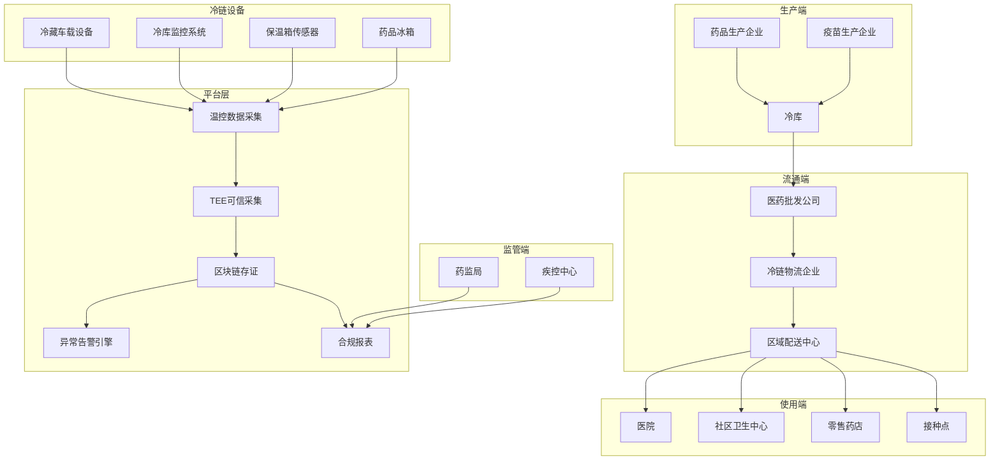
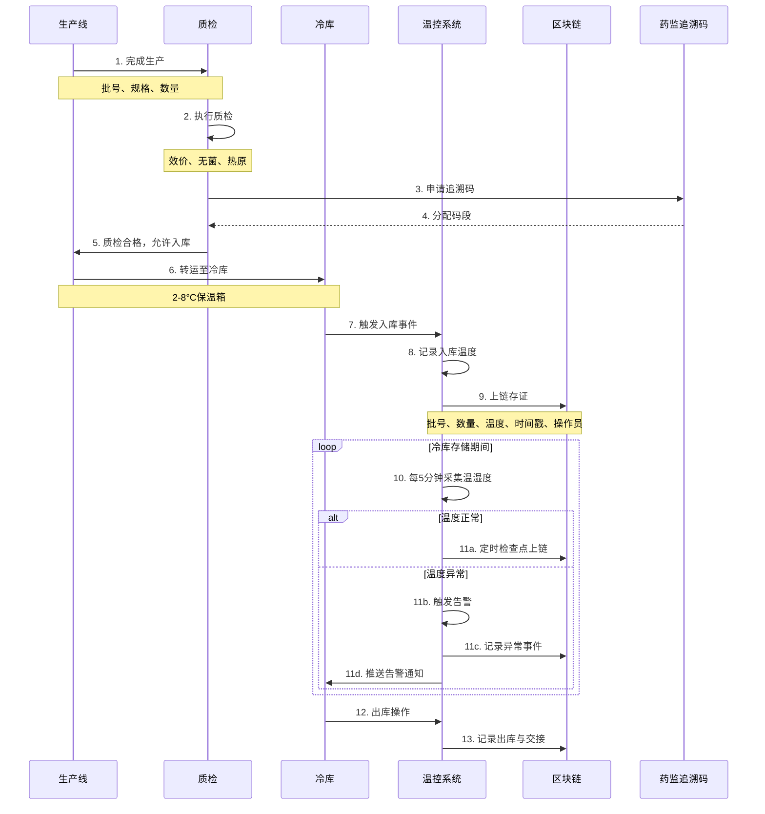
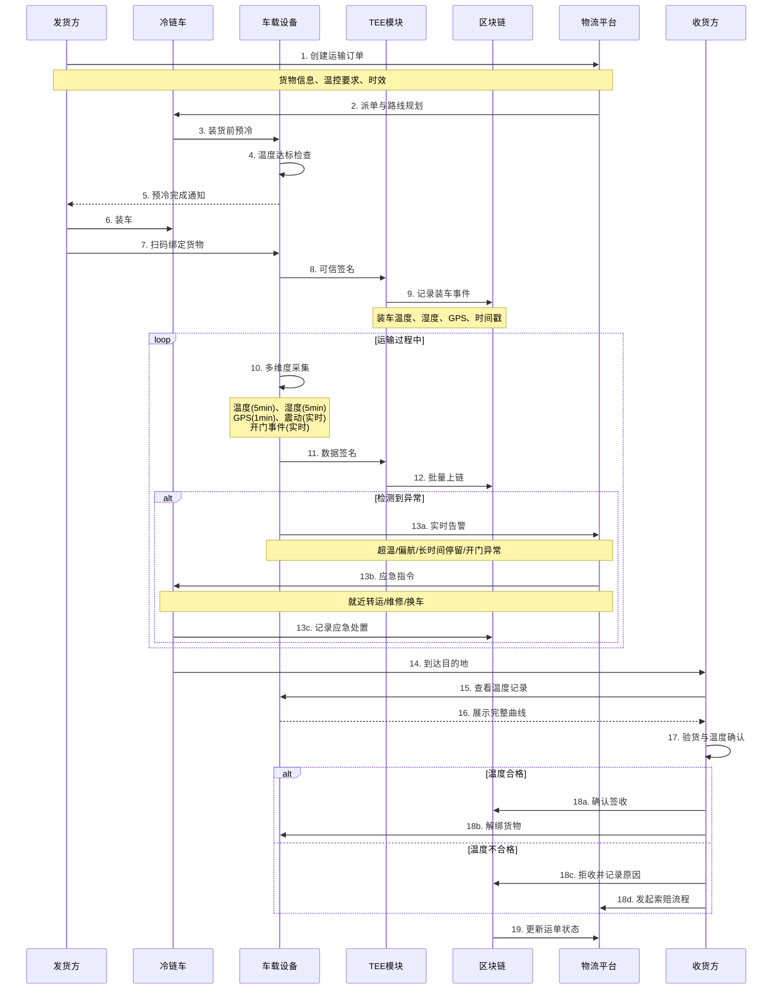
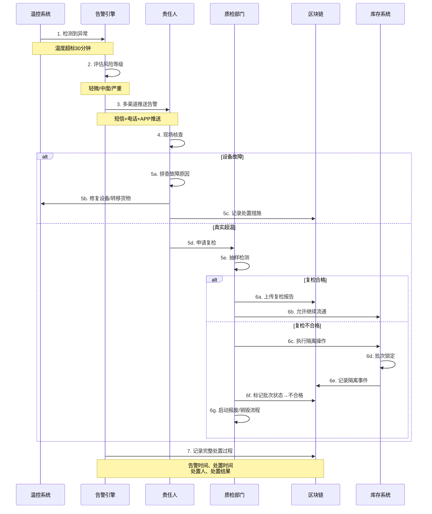
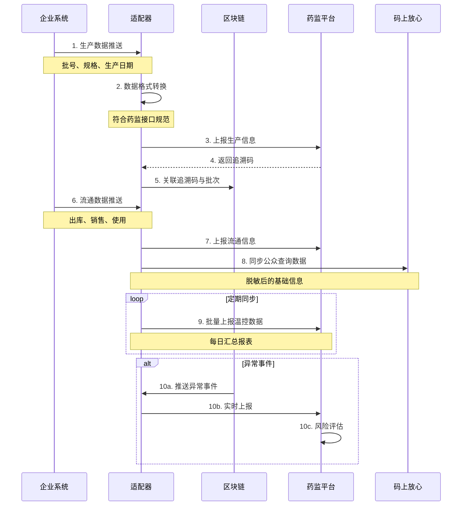

# C. 冷链/医药流通（温控合规）详细方案设计

## 一、方案概述

### 1.1 业务目标
- 实现疫苗、生物制剂、冷藏药品的全程温控监管
- 符合GSP（药品经营质量管理规范）与GMP（药品生产质量管理规范）要求
- 实现温湿度、光照、震动等多维度数据可信采集
- 支持药监部门实时查询与应急追溯

### 1.2 核心价值
- **合规留痕**：满足药监局追溯码与温控要求
- **异常预警**：超温/断链实时告警与处置
- **责任界定**：每个环节责任主体明确
- **降低损耗**：精准定位问题批次，减少全批次报废

---

## 二、业务架构图



---

## 三、核心业务流程

### 3.1 生产与出库流程



**关键控制点：**
1. 质检不合格批次禁止入库
2. 入库温度验证（2-8°C范围检查）
3. 冷库温度24小时不间断监控
4. 异常告警30分钟内必须响应
5. 出库前温度记录完整性检查

---

### 3.2 冷链运输流程（重点）



**温控标准（药品分类）：**

| 药品类型 | 温度范围 | 告警阈值 | 处置时限 |
|---------|---------|---------|---------|
| 疫苗（冷藏） | 2-8°C | 超出30分钟 | 立即处置 |
| 疫苗（冷冻） | -15°C以下 | 超出1小时 | 立即处置 |
| 生物制剂 | 2-8°C | 超出20分钟 | 30分钟内 |
| 胰岛素 | 2-8°C | 超出1小时 | 1小时内 |
| 冷藏药品 | 2-8°C | 超出2小时 | 2小时内 |
| 阴凉药品 | <20°C | 超出4小时 | 4小时内 |

---

### 3.3 异常处置与隔离流程



**异常分级响应：**

| 风险等级 | 触发条件 | 响应时限 | 处置动作 |
|---------|---------|---------|---------|
| 严重 | 疫苗超温>2小时 | 立即 | 批次隔离+强制复检+上报药监 |
| 中度 | 冷藏药品超温1-2小时 | 30分钟 | 风险评估+选择性复检 |
| 轻微 | 短暂超温<30分钟 | 2小时 | 记录留档+跟踪观察 |

---

### 3.4 药监追溯对接流程



**对接标准：**
- 国家药监局《药品信息化追溯体系建设导则》
- 中检院《疫苗追溯协同服务平台技术规范》
- GSP附录3《冷藏冷冻药品储存与运输管理》

---

## 四、核心功能模块

### 4.1 可信温控采集模块（基于TEE）

**技术架构：**
```
传感器硬件层
    ↓
TEE安全区（SGX/ARM TrustZone）
    ├─ 数据加密
    ├─ 时间戳签名
    └─ 防篡改校验
    ↓
数据上链层
    ├─ 批量聚合
    ├─ 压缩存储
    └─ 链上锚定
```

**数据结构：**
```json
{
  "deviceId": "SENSOR-20251020-001",
  "batchNo": "2025102001",
  "timestamp": 1729410000,
  "data": {
    "temperature": 5.2,
    "humidity": 65,
    "location": {
      "lat": 31.2304,
      "lng": 121.4737
    },
    "vibration": 0.3,
    "doorStatus": "closed"
  },
  "signature": "TEE签名值",
  "certChain": "证书链"
}
```

**防篡改机制：**
1. 传感器芯片级加密（不可破解）
2. TEE内数据签名（硬件隔离）
3. 时间戳与区块链时钟校准
4. 异常断电/拔线立即记录

---

### 4.2 智能告警引擎

**告警规则配置：**

```yaml
疫苗冷藏告警:
  监控指标: 温度
  正常范围: [2, 8]
  告警阈值:
    - 级别: 预警
      条件: 温度 > 8 或 < 2
      持续时间: 10分钟
      通知方式: [APP推送]
    
    - 级别: 严重
      条件: 温度 > 10 或 < 0
      持续时间: 30分钟
      通知方式: [短信, 电话, APP推送]
      
  处置要求:
    - 30分钟内必须响应
    - 记录处置措施
    - 批次风险评估

开门异常告警:
  监控指标: 门磁传感器
  告警条件: 
    - 非工作时间开门
    - 开门时长 > 5分钟
  通知方式: [实时推送]
```

**告警升级机制：**
```
告警触发 → 责任人推送（1分钟内）
    ↓（未响应）
5分钟后 → 部门主管推送
    ↓（未响应）
15分钟后 → 公司管理层推送
    ↓（未响应）
30分钟后 → 自动上报药监局
```

---

### 4.3 温度合规验证模块

**验证维度：**

1. **时效性验证**
   - 数据采集间隔是否符合要求（≤5分钟）
   - 是否存在数据空窗期

2. **完整性验证**
   - 整个流转链路温度记录是否完整
   - 交接环节是否有断点

3. **真实性验证**
   - TEE签名验证
   - 传感器设备合规性检查
   - 异常数据模式识别（如曲线异常平滑）

4. **合规性验证**
   - 是否符合GSP温控标准
   - 超温时长是否超过允许范围
   - 应急处置是否及时

**合规评分算法：**
```
合规分 = 数据完整性(30%) 
       + 温度达标率(40%) 
       + 异常响应及时性(20%) 
       + 设备可靠性(10%)

分数  | 评级 | 处置建议
-----|------|----------
≥95  | A    | 放行
85-94| B    | 抽检后放行
70-84| C    | 强制复检
<70  | D    | 禁止流通
```

---

### 4.4 可视化分析模块

**温度曲线图：**
```
温度 (°C)
10 ├────────────────────────────
 8 ├─────────╱‾‾‾‾╲─────────── 上限
 6 ├────────╱      ╲────────
 4 ├───────╱        ╲───────
 2 ├──────────────────────────── 下限
 0 ├────────────────────────────
   0   2   4   6   8  10  12 小时
   
   ✓ 正常  ⚠️ 预警  ❌ 超标
```

**地理轨迹图：**
```
[起点] 北京仓库
   ↓ 350km (5小时)
[检查点1] 天津中转站 ✓
   ↓ 120km (2小时)
[异常点] 高速服务区 ⚠️ 停留1.5小时
   ↓ 180km (3小时)
[终点] 石家庄医院 ✓
```

---

## 五、系统集成接口

### 5.1 企业内部系统
- **ERP系统**：采购订单、销售订单、库存数据
- **WMS仓储系统**：出入库、货位管理
- **TMS运输系统**：运单、车辆、司机

### 5.2 设备集成
- **冷库监控系统**：温湿度、压缩机状态
- **车载冷机**：制冷状态、能耗数据
- **便携式冷箱**：蓝牙/4G数据传输

### 5.3 外部平台
- **国家药监局追溯平台**：数据上报接口
- **疾控中心系统**：疫苗流向报告
- **保险公司**：理赔数据接口

---

## 六、部署架构

### 6.1 边缘计算部署

```
┌─────────────────────────────┐
│   冷链车/冷库（边缘侧）        │
│  ┌─────────────────────────┐ │
│  │ 传感器采集模块            │ │
│  │  - 温湿度传感器           │ │
│  │  - GPS模块                │ │
│  │  - 门磁/震动传感器        │ │
│  └──────────┬──────────────┘ │
│             ↓                 │
│  ┌─────────────────────────┐ │
│  │ 边缘网关                  │ │
│  │  - 数据预处理             │ │
│  │  - 本地告警               │ │
│  │  - 断网缓存               │ │
│  │  - TEE安全芯片            │ │
│  └──────────┬──────────────┘ │
└─────────────┼───────────────┘
              ↓ 4G/5G/WiFi
┌─────────────────────────────┐
│   云端平台                    │
│  ┌─────────────────────────┐ │
│  │ IoT数据接收               │ │
│  └──────────┬──────────────┘ │
│             ↓                 │
│  ┌─────────────────────────┐ │
│  │ 区块链存证                │ │
│  └──────────┬──────────────┘ │
│             ↓                 │
│  ┌─────────────────────────┐ │
│  │ 告警与分析                │ │
│  └─────────────────────────┘ │
└─────────────────────────────┘
```

### 6.2 数据存储策略

| 数据类型 | 存储位置 | 存储周期 | 访问频率 |
|---------|---------|---------|---------|
| 实时监控数据 | Redis | 24小时 | 极高 |
| 历史温控数据 | ClickHouse | 5年 | 中 |
| 事件摘要 | 区块链 | 永久 | 低 |
| 原始传感器日志 | OSS冷存储 | 10年 | 极低 |
| 告警记录 | PostgreSQL | 3年 | 中 |

---

## 七、合规与认证

### 7.1 药品经营质量管理规范（GSP）

**第七十六条**：
> 企业应当按照规定的程序和要求，对冷藏、冷冻药品进行储存、运输的温度监测和记录，确保药品质量。

**满足要求：**
- ✅ 温度自动连续监测（5分钟/次）
- ✅ 数据真实性保障（TEE签名）
- ✅ 异常自动告警
- ✅ 记录保存≥5年（区块链永久存证）

### 7.2 疫苗储存和运输管理规范

**关键要求：**
- 疫苗全程2-8°C冷链运输
- 温度监测设备具有不间断监测、记录和报警功能
- 超温处置：立即停止配送，报告疾控中心

**满足要求：**
- ✅ 全程不断链监测
- ✅ 超温30分钟自动告警
- ✅ 自动生成异常报告
- ✅ 一键上报疾控系统

### 7.3 设备校准与认证

**传感器要求：**
- 精度：±0.5°C
- 校准周期：每6个月
- 认证：CNAS认可实验室出具校准证书

**区块链存证：**
- 校准证书哈希上链
- 设备使用历史可追溯
- 超期未校准自动告警

---

## 八、KPI 指标体系

### 8.1 业务指标
- 温控合规率：≥ **99.5%**
- 异常批次定位时效：≤ **5分钟**
- 报废率下降：**40-60%**（精准定位问题批次）
- 合规稽查通过率：**100%**

### 8.2 技术指标
- 数据采集频率：**5分钟/次**
- 告警响应时延：≤ **10秒**
- 断网缓存容量：≥ **7天**
- 系统可用性：≥ **99.9%**

### 8.3 设备指标
- 传感器在线率：≥ **98%**
- 设备故障率：≤ **2%**
- 电池续航：≥ **30天**（便携设备）
- GPS定位精度：≤ **10米**

---

## 九、成本与收益分析

### 9.1 建设成本（中型医药流通企业）
- 软件平台开发：60-100万元
- IoT设备采购（100套）：50-80万元
  - 冷库固定监测：5千元/套 × 20套
  - 车载设备：2万元/套 × 30套
  - 便携冷箱：5千元/套 × 50套
- 区块链节点与存储：20-30万元
- 集成与实施：30-40万元
- **总计**：160-250万元

### 9.2 年运营成本
- 设备维护：10-15万元
- 云服务费用：15-25万元
- 4G/5G流量费：5-10万元
- 人员运营：30-40万元
- **总计**：60-90万元

### 9.3 收益评估
- **降低报废损失**：冷链药品报废率从5% → 1%，按年流通1亿元计算，节省 **400万元/年**
- **提升通过率**：GSP认证/飞检一次通过，避免整改损失 **50-100万元**
- **优化保险成本**：冷链险保费下降 **20-30%**，节省 **10-20万元/年**
- **效率提升**：纸质记录人工成本下降 **80%**，节省 **20万元/年**

**投资回收期**：约 **6-12个月**

---

## 十、典型应用场景

### 场景1：新冠疫苗配送
- **挑战**：超低温(-70°C)、大规模、时效性强
- **方案**：超低温冷柜 + 干冰监测 + 实时GPS + 应急预案
- **效果**：全国配送无一例失效，温控合规率99.8%

### 场景2：生物制剂医院配送
- **挑战**：多点配送、城市拥堵、频繁开门
- **方案**：保温箱 + 冰排 + 蓝牙温度计 + 最后一公里监控
- **效果**：配送时效提升30%，投诉率下降80%

### 场景3：零售药店日常配送
- **挑战**：小批量、高频次、成本敏感
- **方案**：低成本蓝牙温度标签 + 手机APP扫码
- **效果**：单次监测成本<5元，满足GSP要求

### 场景4：跨省冷链运输
- **挑战**：长距离、多次中转、夜间运输
- **方案**：车载4G设备 + 北斗定位 + 24小时监控中心
- **效果**：异常响应时间从2小时缩短至15分钟

---

## 十一、风险与应对

| 风险类型 | 风险描述 | 应对措施 |
|---------|---------|---------|
| 设备故障 | 传感器失效导致数据缺失 | 双传感器冗余 + 断线告警 |
| 网络中断 | 偏远地区无信号 | 本地缓存7天 + 卫星通信备份 |
| 人为破坏 | 司机拔掉设备 | 防拆卸设计 + 拔线告警 |
| 成本压力 | 中小企业难以承担 | SaaS租赁模式（200元/月/设备） |
| 数据泄露 | 竞争对手获取配送路线 | 数据加密 + 权限控制 |

---

## 十二、实施路线图

### Phase 1：核心冷库试点（1-2个月）
- 3-5个核心冷库部署固定监测设备
- 区块链存证系统上线
- 告警机制建立
- 人员培训

### Phase 2：冷链车辆覆盖（2-3个月）
- 20-30辆冷链车安装车载设备
- 跨城配送路线试运行
- 与TMS系统集成
- 异常处置流程优化

### Phase 3：全网推广（3-6个月）
- 所有冷库与车辆全覆盖
- 便携设备批量部署
- 药监平台对接上线
- 合规材料准备与验收

### Phase 4：智能化升级（6-12个月）
- AI预测性维护（提前预警设备故障）
- 路线优化算法（节省时间与成本）
- 数字孪生冷链网络
- 跨企业联盟链互通

---

## 十三、交付物清单

1. 温控数据采集平台（含边缘网关固件）
2. 区块链存证系统与智能合约
3. 告警引擎与规则配置工具
4. 企业管理后台（PC端）
5. 移动端APP（司机端、收货端）
6. 可视化监控大屏
7. 药监平台对接适配器
8. IoT设备管理系统
9. 合规报表模板（20+）
10. GSP/GMP对标材料包
11. 操作手册与培训视频
12. 设备安装与调试服务
13. 应急预案与演练脚本

---

**方案版本**：v1.0  
**最后更新**：2025-10-20  
**适用行业**：医药流通、疫苗配送、生物制剂、冷链食品

