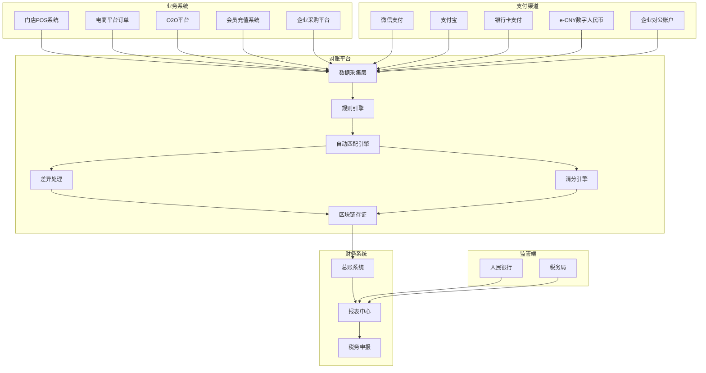
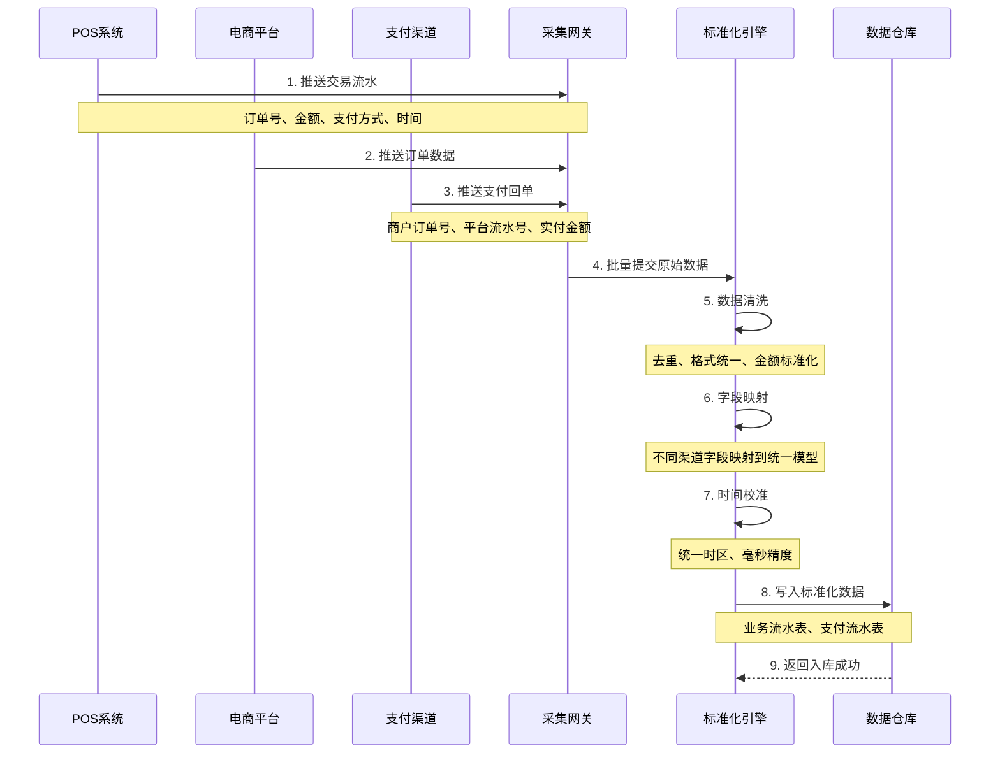
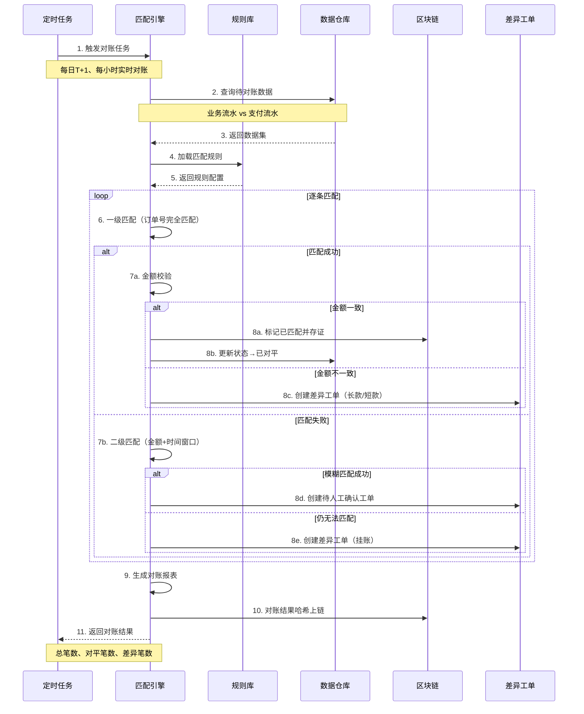
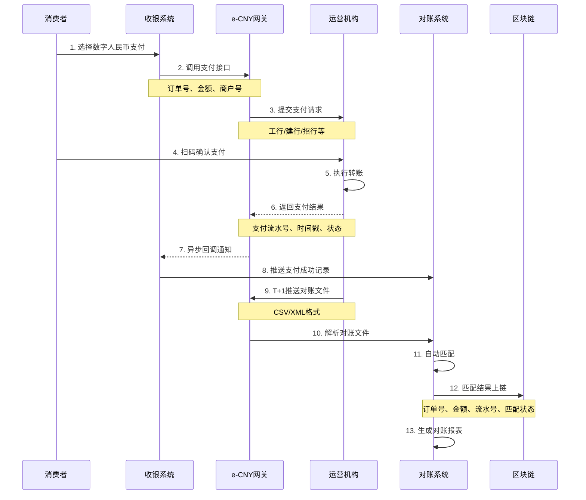
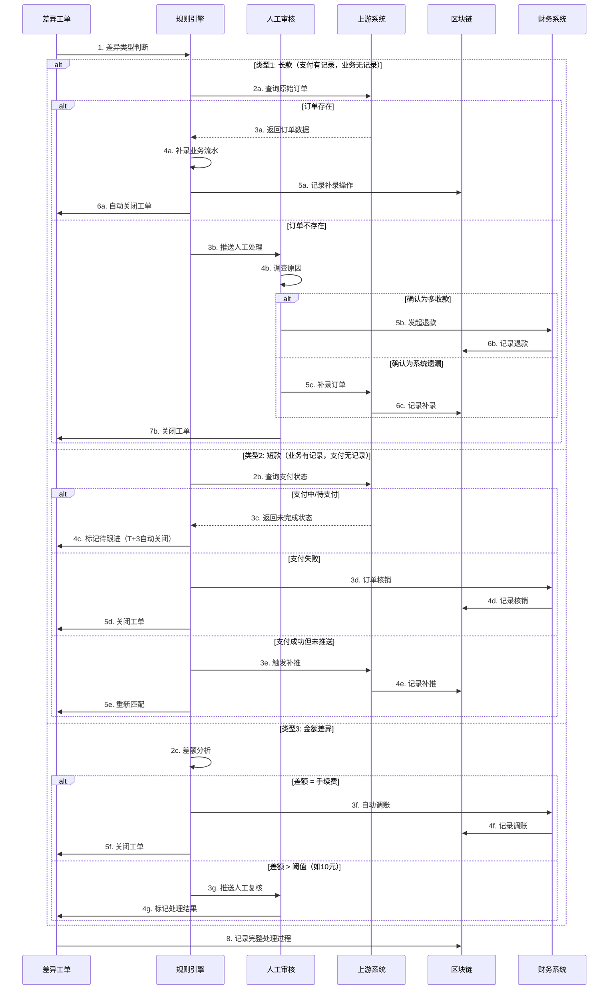

# D. 结算与对账自动化（含e-CNY对接）详细方案设计

## 一、方案概述

### 1.1 业务目标
- 实现多门店、多平台、多支付渠道的自动对账
- 支持数字人民币（e-CNY）对公支付与清分
- 实现T+0/T+1差异自动处理与闭环
- 提供可审计的资金流与业务流匹配记录

### 1.2 核心价值
- **效率提升**：人工对账从数天缩短至分钟级
- **准确性提升**：自动化匹配，差错率<0.01%
- **资金安全**：实时监控异常交易，防止资损
- **合规可审计**：所有对账记录上链存证

---

## 二、业务架构图



---

## 三、核心业务流程

### 3.1 数据采集与预处理流程



**数据标准化模型：**

```json
业务流水 {
  "recordId": "BIZ-20251020-000001",
  "source": "POS/电商/O2O",
  "storeId": "STORE-001",
  "orderId": "ORD-20251020-123456",
  "amount": 299.00,
  "currency": "CNY",
  "paymentMethod": "e-CNY",
  "businessTime": "2025-10-20T10:30:25.123Z",
  "operator": "USER-001",
  "customerId": "CUST-123",
  "items": [...],
  "rawData": {...}
}

支付流水 {
  "recordId": "PAY-20251020-000001",
  "channel": "e-CNY",
  "merchantOrderNo": "ORD-20251020-123456",
  "channelOrderNo": "ECNY-7890123456",
  "payAmount": 299.00,
  "fee": 0.00,
  "payTime": "2025-10-20T10:30:26.456Z",
  "payStatus": "SUCCESS",
  "rawData": {...}
}
```

---

### 3.2 自动对账匹配流程



**匹配规则优先级：**

| 优先级 | 匹配规则 | 匹配字段 | 适用场景 |
|-------|---------|---------|---------|
| 1 | 精确匹配 | 订单号 + 金额 + 时间(±5秒) | 标准交易 |
| 2 | 订单号匹配 | 订单号 + 金额差异<0.1元 | 手续费差异 |
| 3 | 金额时间匹配 | 金额 + 时间窗口(±30分钟) | 订单号映射错误 |
| 4 | 批次匹配 | 门店 + 金额汇总 | 批量结算 |
| 5 | 人工介入 | 无自动匹配 | 特殊情况 |

---

### 3.3 e-CNY支付与对账流程



**e-CNY特殊处理：**
1. **零手续费**：不扣除交易手续费（与传统支付不同）
2. **实时到账**：T+0即时入账，无需等待清算
3. **可编程性**：支持智能合约定时/条件支付
4. **双离线支付**：需特殊对账逻辑（延迟上传）

---

### 3.4 差异处理与闭环流程



**差异处理SLA：**
- 小额差异（≤10元）：T+1 自动处理
- 中额差异（10-1000元）：T+2 人工处理
- 大额差异（>1000元）：T+0 立即告警

---

## 四、核心功能模块

### 4.1 规则引擎模块

**规则配置示例：**

```yaml
对账规则集:
  微信支付:
    匹配字段: [out_trade_no, total_fee, time_end]
    时间容差: 10秒
    金额容差: 0元
    手续费率: 0.6%
    对账周期: T+1
    
  支付宝:
    匹配字段: [out_trade_no, total_amount, gmt_payment]
    时间容差: 10秒
    金额容差: 0元
    手续费率: 0.55%
    对账周期: T+1
    
  e-CNY:
    匹配字段: [merchant_order_no, amount, pay_time]
    时间容差: 5秒
    金额容差: 0元
    手续费率: 0%
    对账周期: T+0
    特殊处理: 双离线交易延迟匹配(T+3)
    
  银行卡:
    匹配字段: [order_no, amount, trade_time]
    时间容差: 30秒
    金额容差: 0元
    手续费率: 0.38% - 1.25%
    对账周期: T+1

差异处理规则:
  长款处理:
    - 金额 ≤ 10元: 自动计入营业外收入
    - 金额 > 10元: 人工核查补录
    - 超过30天未处理: 升级至财务总监
    
  短款处理:
    - 等待3天支付渠道补推
    - 仍未到账: 发起争议处理
    - 确认资损: 计入坏账
    
  金额差异:
    - 差额 = 手续费: 自动调账
    - 差额 ≤ 0.1元: 计入零头处理
    - 差额 > 0.1元: 人工审核
```

---

### 4.2 清分引擎模块

**应用场景：**
- 平台型企业：订单金额拆分（平台佣金 + 商户货款）
- 连锁门店：总部 vs 门店分成
- 联营商户：商场扣点后清分

**清分流程：**

```
原始订单金额: 1000元
    ↓
清分规则计算:
├─ 平台服务费: 1000 × 5% = 50元
├─ 支付手续费: 1000 × 0.6% = 6元
├─ 商户货款: 1000 - 50 - 6 = 944元
    ↓
生成清分指令:
├─ 账户A(平台): +50元
├─ 账户B(支付渠道): +6元
├─ 账户C(商户): +944元
    ↓
e-CNY智能合约执行:
  - 原子性转账
  - 失败自动回滚
  - 全程上链存证
```

**清分规则DSL：**
```javascript
{
  "ruleId": "RULE-001",
  "name": "标准佣金清分",
  "condition": "order.category == '商品' && order.amount > 0",
  "splits": [
    {
      "account": "platform",
      "type": "percentage",
      "value": 5,
      "description": "平台服务费"
    },
    {
      "account": "payment_channel",
      "type": "percentage",
      "value": 0.6,
      "description": "支付手续费"
    },
    {
      "account": "merchant",
      "type": "remainder",
      "description": "商户货款"
    }
  ],
  "settlement_cycle": "T+1"
}
```

---

### 4.3 区块链存证模块

**存证内容：**

```json
对账存证记录 {
  "recordId": "RECON-20251020-000001",
  "reconDate": "2025-10-20",
  "summary": {
    "totalTransactions": 10000,
    "matchedCount": 9950,
    "unmatchedCount": 50,
    "totalAmount": 2580000.00,
    "matchedAmount": 2575000.00
  },
  "details": [
    {
      "businessRecordId": "BIZ-20251020-000001",
      "paymentRecordId": "PAY-20251020-000001",
      "matchStatus": "matched",
      "matchRule": "exact",
      "matchTime": "2025-10-21T02:35:10Z"
    }
  ],
  "exceptions": [
    {
      "ticketId": "EXP-20251020-001",
      "type": "long_款",
      "amount": 299.00,
      "status": "pending",
      "handler": "USER-001"
    }
  ],
  "merkleRoot": "0x1234567890abcdef...",
  "signature": "国密SM2签名值",
  "timestamp": 1729472110,
  "blockHeight": 1234567
}
```

**查询接口：**
- 按日期查询对账结果
- 按订单号查询匹配详情
- 按差异类型统计
- 审计日志完整导出

---

### 4.4 实时监控模块

**监控大屏展示：**

```
┌─────────────────────────────────────────┐
│  今日对账概览 (2025-10-20)               │
├─────────────────────────────────────────┤
│  总交易笔数: 10,234 笔                   │
│  总金额: ¥2,580,000.00                  │
│  对平率: 99.5% ✓                        │
│  差异笔数: 51 笔 ⚠️                     │
│  待处理: 12 笔                           │
├─────────────────────────────────────────┤
│  各渠道明细                              │
│  ┌──────────────────────────────────┐  │
│  │ 微信支付    4,523笔   对平率99.8%  │  │
│  │ 支付宝      3,210笔   对平率99.6%  │  │
│  │ e-CNY       1,890笔   对平率99.9%  │  │
│  │ 银行卡       611笔    对平率98.5%  │  │
│  └──────────────────────────────────┘  │
├─────────────────────────────────────────┤
│  异常告警                                │
│  🔴 门店003 出现连续10笔短款             │
│  🟡 支付宝渠道延迟2小时未推送对账文件     │
└─────────────────────────────────────────┘
```

**告警规则：**
- 对平率 < 95%：发送短信告警
- 单笔大额差异 > 10000元：电话告警
- 连续3天同类型差异：升级至财务总监
- 资金账实不符：立即冻结相关账户

---

## 五、系统集成接口

### 5.1 支付渠道对接

| 渠道 | 接口类型 | 获取方式 | 数据格式 | 时效 |
|-----|---------|---------|---------|------|
| 微信支付 | API拉取 | 交易账单下载 | CSV | T+1 |
| 支付宝 | API拉取 | 对账单查询 | CSV/Excel | T+1 |
| e-CNY | API推送 | 运营机构回调 | JSON | T+0 |
| 银联 | SFTP | 文件传输 | TXT固定格式 | T+1 |
| 快捷支付 | Webhook | 异步通知 | JSON | 实时 |

### 5.2 业务系统对接

- **POS系统**：交易流水实时推送
- **电商平台**：订单状态变更回调
- **ERP系统**：财务科目映射
- **CRM系统**：客户充值与消费记录

### 5.3 e-CNY运营机构对接

**接入流程：**
1. 申请数字人民币商户资质
2. 与运营机构（工行/建行等）签约
3. 获取API密钥与证书
4. 沙箱环境联调测试
5. 生产环境上线

**核心接口：**
- `POST /payment/create`：创建支付订单
- `POST /payment/query`：查询支付状态
- `POST /refund/apply`：发起退款
- `GET /statement/download`：下载对账单
- `POST /webhook/notify`：支付结果回调

---

## 六、部署架构

### 6.1 系统架构图

```
┌─────────────────────────────────────────┐
│          业务系统层（数据源）             │
│  POS | 电商 | O2O | 会员 | 采购          │
└──────────────┬──────────────────────────┘
               ↓
┌─────────────────────────────────────────┐
│          数据采集层                      │
│  ┌─────────┐  ┌─────────┐  ┌─────────┐ │
│  │API网关  │  │MQ消费   │  │文件解析 │ │
│  └─────────┘  └─────────┘  └─────────┘ │
└──────────────┬──────────────────────────┘
               ↓
┌─────────────────────────────────────────┐
│          处理层                          │
│  ┌──────────┐  ┌──────────┐            │
│  │标准化    │  │规则引擎  │            │
│  └──────────┘  └──────────┘            │
│  ┌──────────┐  ┌──────────┐            │
│  │匹配引擎  │  │清分引擎  │            │
│  └──────────┘  └──────────┘            │
└──────────────┬──────────────────────────┘
               ↓
┌─────────────────────────────────────────┐
│          存储层                          │
│  ┌──────────┐  ┌──────────┐  ┌───────┐ │
│  │PostgreSQL│  │区块链    │  │Redis  │ │
│  └──────────┘  └──────────┘  └───────┘ │
└──────────────┬──────────────────────────┘
               ↓
┌─────────────────────────────────────────┐
│          应用层                          │
│  管理后台 | 移动端 | API服务 | 报表    │
└─────────────────────────────────────────┘
```

### 6.2 高可用设计

- **应用层**：K8s部署，≥3副本，支持水平扩展
- **数据库**：PostgreSQL主从复制 + 读写分离
- **消息队列**：Kafka集群，3个Broker
- **缓存层**：Redis Sentinel（1主2从）
- **对账任务**：分布式定时任务（Quartz集群）

### 6.3 性能优化

- **批量处理**：每批1000笔，并行匹配
- **索引优化**：订单号、金额、时间联合索引
- **分库分表**：按日期水平分表（每月一张表）
- **异步解耦**：MQ削峰，匹配结果异步写入

---

## 七、KPI 指标体系

### 7.1 业务指标
- 对账自动化率：≥ **95%**
- 对平率：≥ **99%**
- 差异闭环时效：T+0（实时对账）/ T+1（日终对账）
- 人工介入率：≤ **5%**

### 7.2 技术指标
- 单日对账处理能力：≥ **100万笔**
- 匹配响应时间：P99 ≤ **500ms**
- 对账任务执行时长：≤ **30分钟**（100万笔）
- 系统可用性：≥ **99.9%**

### 7.3 财务指标
- 资金差错率：≤ **0.01%**
- 差异金额占比：≤ **0.1%**
- 对账人力成本下降：**80%**
- 资金周转效率提升：**30%**

---

## 八、成本与收益分析

### 8.1 建设成本
- 软件平台开发：80-120万元
- 支付渠道对接：20-30万元
- e-CNY对接与测试：15-25万元
- 区块链存证系统：25-35万元
- 实施与培训：20-30万元
- **总计**：160-240万元

### 8.2 年运营成本
- 云服务与存储：30-50万元
- 支付渠道手续费：交易额的0.3%-0.6%（e-CNY免费）
- 人员运营：40-60万元
- 系统维护：15-25万元
- **总计**：85-135万元（不含交易手续费）

### 8.3 收益评估

**场景：连锁零售企业，1000家门店，日均交易10万笔**

- **人力成本节约**：
  - 传统对账：20人 × 15万元/年 = **300万元/年**
  - 自动化后：3人 × 15万元/年 = **45万元/年**
  - 节省：**255万元/年**

- **资金效率提升**：
  - T+1对账改为T+0，资金周转加速
  - 按日均沉淀资金500万元，年化利率3%计算
  - 资金收益：**15万元/年**

- **差错损失降低**：
  - 人工差错率约0.5%，自动化后<0.01%
  - 按日均100万元交易额计算
  - 减少损失：**180万元/年**

**投资回收期**：约 **4-6个月**

---

## 九、典型应用场景

### 场景1：连锁零售企业
- **挑战**：1000+门店，多支付渠道，人工对账耗时3天
- **方案**：自动对账平台 + 实时监控 + e-CNY清分
- **效果**：对账时间从3天→30分钟，对平率99.8%

### 场景2：O2O平台
- **挑战**：平台/商家/骑手三方清分，资金链路复杂
- **方案**：智能清分引擎 + 区块链存证
- **效果**：清分准确率100%，争议降低90%

### 场景3：购物中心联营
- **挑战**：数百商户，各自扣点比例不同，月底集中清算压力大
- **方案**：按交易实时清分 + e-CNY即时到账
- **效果**：商户资金T+0到账，满意度提升

### 场景4：跨境电商
- **挑战**：外汇结算、跨境支付手续费高
- **方案**：e-CNY跨境支付试点（深圳/海南）
- **效果**：手续费从3%→0%，到账时效从T+3→T+0

---

## 十、风险与应对

| 风险类型 | 风险描述 | 应对措施 |
|---------|---------|---------|
| 数据延迟 | 支付渠道延迟推送对账文件 | 实时API拉取 + T+3兜底 |
| 系统故障 | 对账服务宕机 | 双活部署 + 自动切换 |
| 规则冲突 | 多规则匹配同一笔交易 | 优先级机制 + 人工复核 |
| 数据泄露 | 财务数据敏感 | 加密存储 + 权限控制 + 审计日志 |
| e-CNY试点限制 | 部分地区暂未开通 | 传统支付渠道并行 |

---

## 十、实施路线图

### Phase 1：核心功能开发（2-3个月）
- 数据采集与标准化
- 自动匹配引擎
- 差异工单管理
- 基础报表

### Phase 2：渠道对接（1-2个月）
- 微信/支付宝对接
- 银行卡渠道对接
- e-CNY沙箱测试

### Phase 3：试点上线（1个月）
- 选择10-20家门店试点
- 双轨运行（人工+自动）
- 规则调优

### Phase 4：全面推广（2-3个月）
- 全门店覆盖
- 区块链存证上线
- e-CNY生产环境
- 智能清分功能

---

## 十二、交付物清单

1. 对账平台核心系统（含源码）
2. 规则引擎配置工具
3. 清分引擎系统
4. 区块链存证合约与节点
5. 管理后台（PC端）
6. 移动端APP（审批/查询）
7. 支付渠道适配器（5+渠道）
8. e-CNY对接SDK
9. 数据可视化大屏
10. 对账报表模板（30+）
11. 操作手册与培训视频
12. 数据迁移工具
13. 压力测试报告
14. 安全合规评估报告

---

**方案版本**：v1.0  
**最后更新**：2025-10-20  
**适用行业**：零售、餐饮、电商、O2O平台、购物中心

