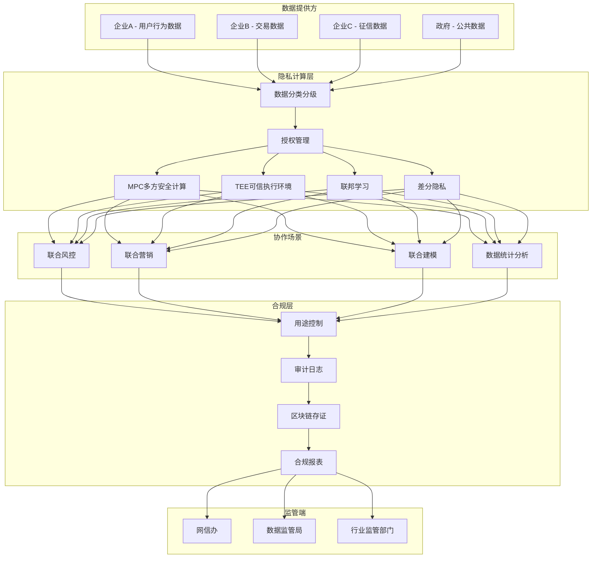
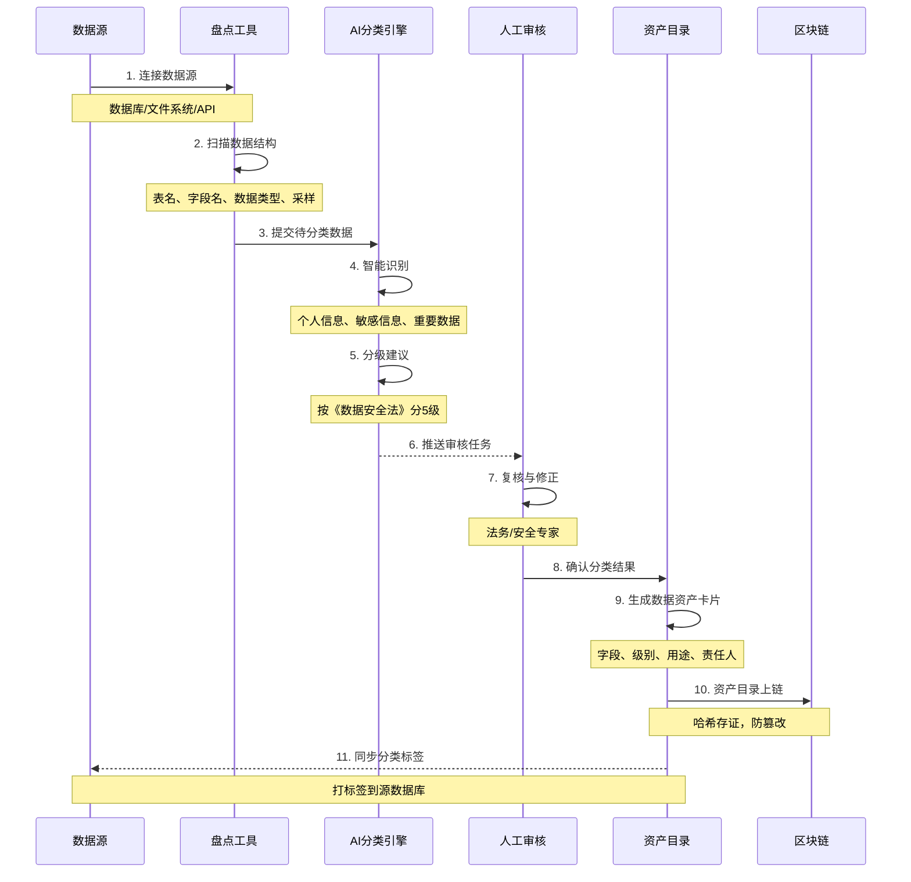
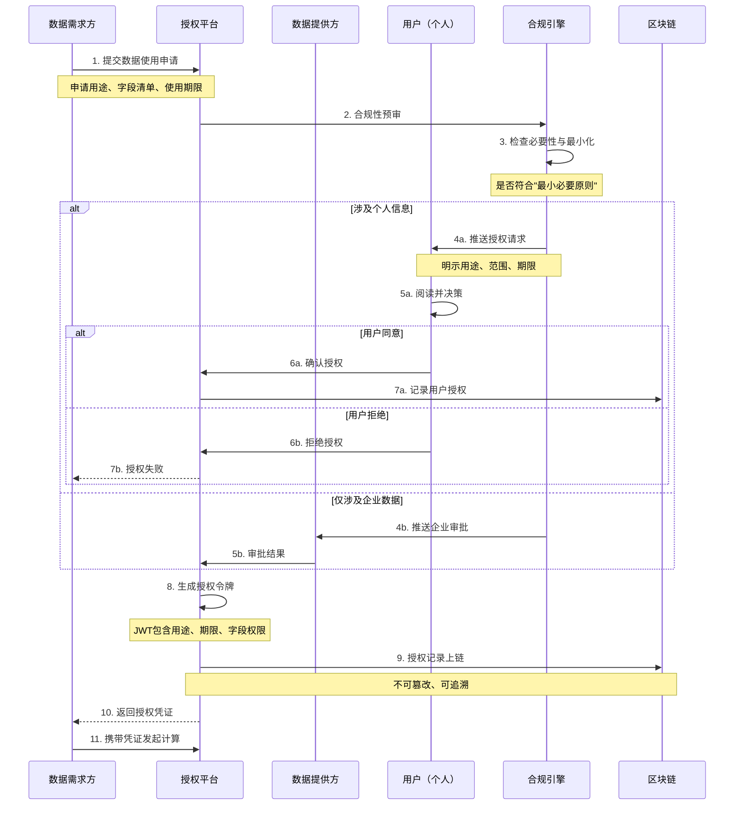
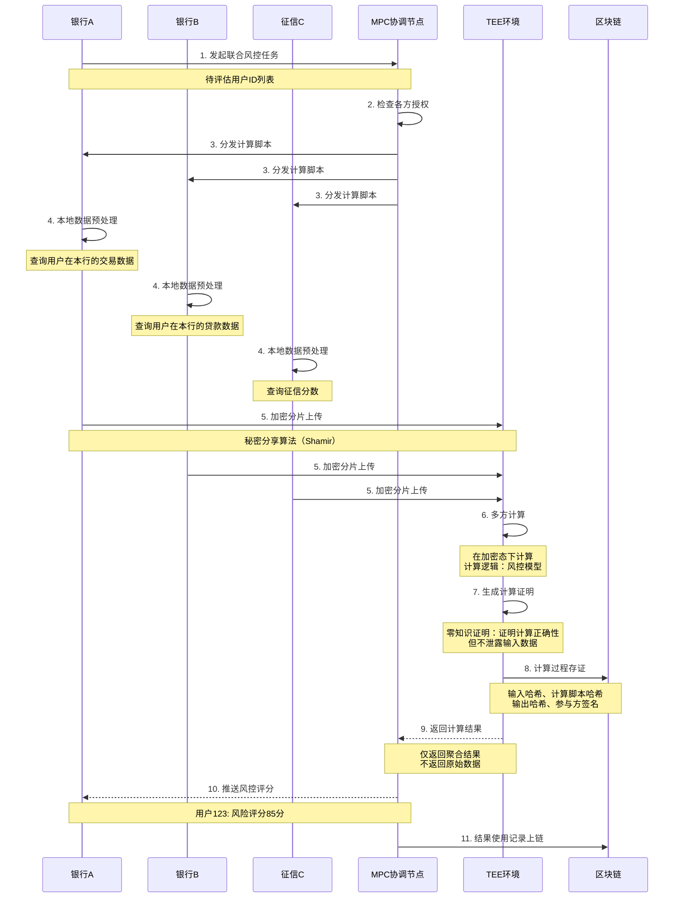
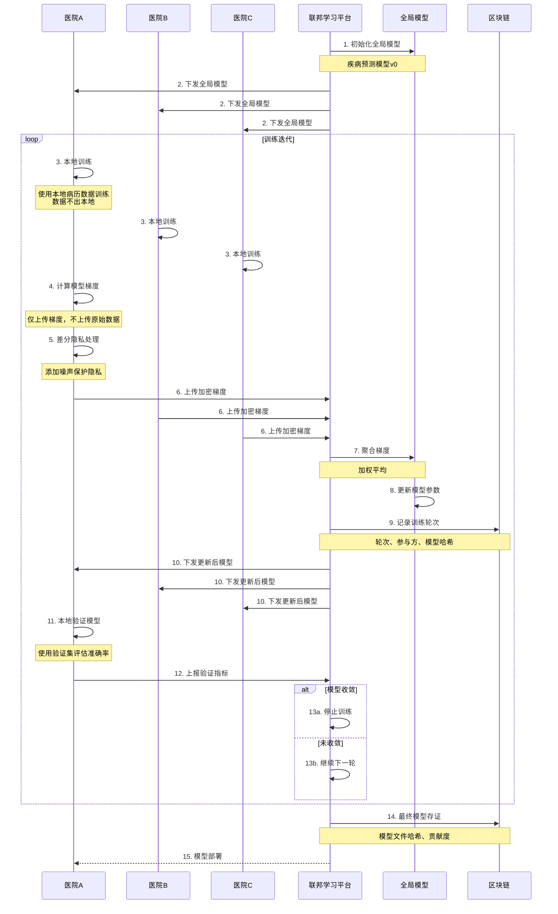
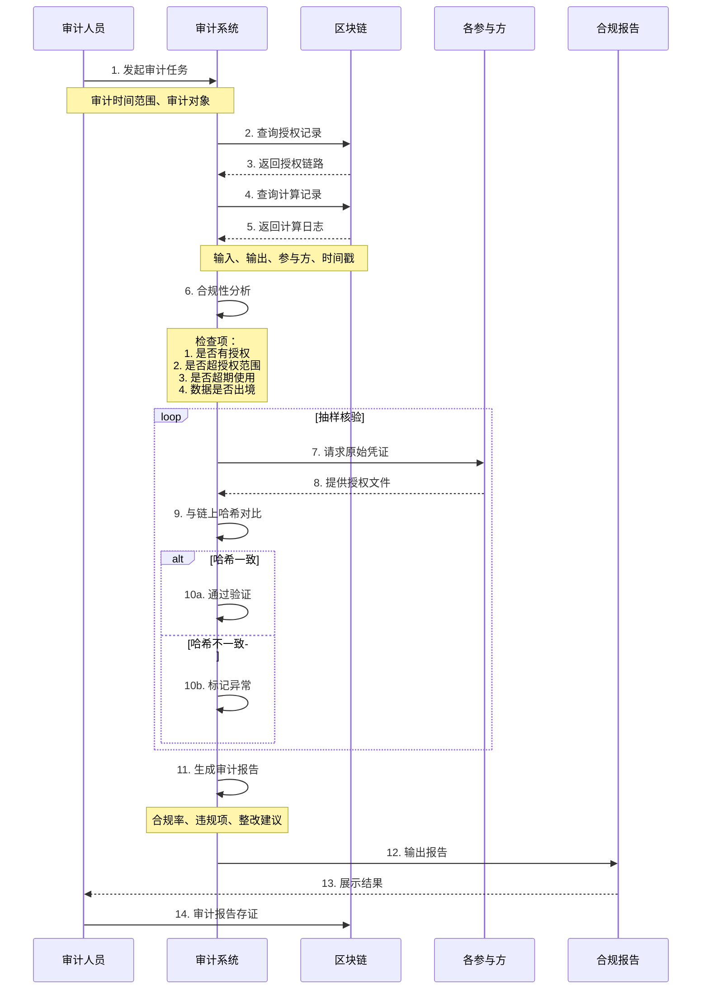

# E. 数据要素合规流通（隐私计算）详细方案设计

## 一、方案概述

### 1.1 业务目标
- 实现"数据不出域"的联合计算与分析
- 满足《个人信息保护法》《数据安全法》《数据出境安全评估办法》要求
- 支持多方安全协作（联合风控、联合营销、联合建模）
- 提供可证明的合规计算过程与审计报告

### 1.2 核心价值
- **合规先行**：内置数据分类分级、授权管理、用途控制
- **隐私保护**：MPC/TEE/联邦学习，原始数据不离开本地
- **可信计算**：区块链存证 + 零知识证明，可验证计算正确性
- **商业价值**：释放数据要素价值，合规变现

---

## 二、业务架构图



---

## 三、核心业务流程

### 3.1 数据资产盘点与分类分级流程



**数据分类分级标准：**

| 级别 | 定义 | 示例 | 保护措施 |
|-----|------|------|---------|
| 5级-核心数据 | 关系国家安全、经济命脉 | 关键基础设施数据 | 禁止出境、最高加密 |
| 4级-重要数据 | 影响行业安全、公共利益 | 百万级用户数据 | 安全评估、审批出境 |
| 3级-敏感个人信息 | 生物识别、金融账号、健康 | 人脸、指纹、病历 | 单独同意、加密存储 |
| 2级-一般个人信息 | 可识别特定自然人 | 姓名、手机、地址 | 合法授权、脱敏处理 |
| 1级-公开数据 | 已公开或匿名化 | 统计数据、产品目录 | 常规保护 |

---

### 3.2 数据使用授权流程



**授权令牌结构：**
```json
{
  "authId": "AUTH-20251020-001",
  "grantee": "企业B",
  "grantor": "企业A",
  "purpose": "联合风控-信用评估",
  "fields": ["age_range", "credit_score", "transaction_count"],
  "dataScope": "用户ID范围: 100001-200000",
  "validFrom": "2025-10-20T00:00:00Z",
  "validTo": "2025-11-20T00:00:00Z",
  "usageLimit": 100000,
  "resultType": "aggregated_only",
  "auditRequired": true,
  "signature": "数字签名"
}
```

---

### 3.3 MPC多方安全计算流程（联合风控场景）



**MPC计算模型示例（风控评分）：**
```
输入：
- 银行A：user_123的近6个月交易笔数 = 45
- 银行B：user_123的贷款逾期次数 = 0
- 征信C：user_123的征信分数 = 720

计算逻辑：
风控分 = 交易活跃度(30%) + 信用记录(40%) + 征信分(30%)
       = normalize(45, 0, 100) * 0.3
       + normalize(0, 10, 0) * 0.4
       + normalize(720, 300, 850) * 0.3
       = 85分

输出：
- 仅返回最终评分：85分
- 不返回任何原始输入数据
```

---

### 3.4 联邦学习流程（联合建模场景）



**联邦学习优势：**
- 数据不出本地，满足《个保法》《数据安全法》
- 多方协作训练，模型效果优于单方
- 差分隐私保护，防止模型反推原始数据

---

### 3.5 合规审计流程



**审计检查项清单：**

| 检查项 | 检查内容 | 合规要求 |
|-------|---------|---------|
| 授权合法性 | 是否取得用户/企业授权 | 100%有授权 |
| 用途一致性 | 实际用途与授权用途是否一致 | 100%一致 |
| 最小必要 | 使用字段是否超出必要范围 | 零超范围 |
| 期限合规 | 是否在授权期限内使用 | 零超期 |
| 数据出境 | 是否未经评估出境 | 零违规出境 |
| 安全措施 | 是否采取加密等安全措施 | 100%加密 |
| 审计留痕 | 是否完整记录使用日志 | 100%留痕 |

---

## 四、核心功能模块

### 4.1 数据分类分级模块

**自动识别规则库：**

```yaml
个人信息识别规则:
  姓名类:
    关键词: [姓名, name, username, realname]
    正则: [\u4e00-\u9fa5]{2,4}
    
  手机号:
    关键词: [手机, mobile, phone, tel]
    正则: 1[3-9]\d{9}
    
  身份证号:
    关键词: [身份证, id_card, id_no]
    正则: \d{17}[\dXx]
    
  银行卡号:
    关键词: [银行卡, card_no, account]
    正则: \d{16,19}

敏感信息识别规则:
  生物识别:
    关键词: [人脸, 指纹, 虹膜, face, fingerprint]
    
  健康医疗:
    关键词: [病历, 诊断, 检测, 药品]
    
  金融账户:
    关键词: [余额, 流水, 贷款, 投资]
```

---

### 4.2 隐私计算引擎选型

| 技术 | 原理 | 优势 | 劣势 | 适用场景 |
|-----|------|------|------|---------|
| MPC | 秘密分享 + 安全多方计算 | 安全性高，数学可证明 | 性能较低，通信开销大 | 高价值小规模计算（风控） |
| TEE | 可信硬件隔离 | 性能好，接近明文计算 | 依赖硬件，侧信道风险 | 大规模计算（数据清洗） |
| 联邦学习 | 本地训练 + 聚合梯度 | 适合AI建模 | 模型泄露风险 | 联合建模 |
| 差分隐私 | 添加噪声 | 数学可证明隐私 | 精度损失 | 统计分析 |
| 同态加密 | 密文计算 | 最强隐私保护 | 性能极差 | 特定场景（投票） |

**推荐组合方案：**
- **联合风控**：MPC + 区块链存证
- **联合营销**：TEE + 差分隐私
- **联合建模**：联邦学习 + 差分隐私
- **数据统计**：差分隐私 + 区块链存证

---

### 4.3 用途控制模块

**用途约束规则：**

```json
{
  "policyId": "POLICY-001",
  "dataAsset": "用户消费行为数据",
  "allowedPurposes": [
    "信用评估",
    "反欺诈"
  ],
  "prohibitedPurposes": [
    "营销推广",
    "转售给第三方"
  ],
  "technicalControls": {
    "queryLimit": 1000,
    "rateLimiting": "100/hour",
    "resultType": "aggregated_only",
    "minGroupSize": 10
  },
  "auditLevel": "detailed"
}
```

**运行时控制：**
1. 请求拦截：检查请求用途与授权用途是否一致
2. 查询限制：防止全量拖库（每次查询≤1000条）
3. 聚合强制：返回结果必须聚合，不可返回明细
4. K-匿名性：分组统计至少K=10条记录
5. 频率限制：防止通过多次查询拼接出全量数据

---

### 4.4 区块链存证模块

**存证内容设计：**

```json
数据使用存证 {
  "recordId": "USAGE-20251020-001",
  "authId": "AUTH-20251020-001",
  "dataProvider": "企业A",
  "dataConsumer": "企业B",
  "purpose": "联合风控",
  "dataScope": "user_ids_hash: 0x1234...",
  "computeMethod": "MPC",
  "inputHash": "0xabcd...",
  "outputHash": "0xef01...",
  "timestamp": 1729472110,
  "participants": [
    {
      "name": "企业A",
      "signature": "0x5678..."
    },
    {
      "name": "企业B",
      "signature": "0x9abc..."
    }
  ],
  "zkProof": "零知识证明数据",
  "blockHeight": 1234567
}
```

**智能合约逻辑：**
```solidity
// 伪代码
contract DataUsageRegistry {
    struct UsageRecord {
        bytes32 authId;
        address provider;
        address consumer;
        string purpose;
        bytes32 inputHash;
        bytes32 outputHash;
        uint256 timestamp;
    }
    
    mapping(bytes32 => UsageRecord) public records;
    
    // 记录数据使用
    function recordUsage(
        bytes32 authId,
        string memory purpose,
        bytes32 inputHash,
        bytes32 outputHash
    ) public {
        // 验证授权
        require(isAuthorized(authId, msg.sender), "Unauthorized");
        
        // 验证用途
        require(isPurposeAllowed(authId, purpose), "Purpose not allowed");
        
        // 存证
        bytes32 recordId = keccak256(abi.encodePacked(
            authId, msg.sender, block.timestamp
        ));
        
        records[recordId] = UsageRecord({
            authId: authId,
            provider: getProvider(authId),
            consumer: msg.sender,
            purpose: purpose,
            inputHash: inputHash,
            outputHash: outputHash,
            timestamp: block.timestamp
        });
        
        emit UsageRecorded(recordId, authId, msg.sender);
    }
    
    // 审计查询
    function auditUsage(bytes32 authId) public view returns (UsageRecord[] memory) {
        // 返回该授权下的所有使用记录
    }
}
```

---

## 五、合规对标

### 5.1 《个人信息保护法》（PIPL）

| 条款 | 要求 | 方案满足方式 |
|-----|------|------------|
| 第5条 | 处理个人信息应取得个人同意 | 授权管理模块，用户明示同意 |
| 第6条 | 最小必要原则 | 字段级权限控制，用途约束 |
| 第13条 | 告知义务 | 授权时明示用途、范围、期限 |
| 第14条 | 单独同意（敏感信息） | 敏感信息单独授权流程 |
| 第38条 | 跨境数据出境评估 | 数据不出境，或走出境评估流程 |

### 5.2 《数据安全法》

| 条款 | 要求 | 方案满足方式 |
|-----|------|------------|
| 第19条 | 采取相应的技术措施和其他必要措施 | MPC/TEE技术保护 |
| 第21条 | 数据分类分级保护 | 自动分类分级模块 |
| 第27条 | 数据安全风险评估 | 合规引擎预审 |

### 5.3 《数据出境安全评估办法》

**三种出境路径：**
1. **安全评估**（适用重要数据）：本方案通过隐私计算实现"数据不出境"
2. **标准合同**（适用一般数据）：提供标准合同模板
3. **个人信息保护认证**：支持对接认证机构

---

## 六、部署架构

### 6.1 系统架构图

```
┌─────────────────────────────────────────┐
│          数据提供方（多个）              │
│  ┌─────────────────────────────────┐   │
│  │ 本地数据库（不出本地）           │   │
│  └──────────┬──────────────────────┘   │
│             ↓                            │
│  ┌─────────────────────────────────┐   │
│  │ 隐私计算节点（TEE/MPC）          │   │
│  │  - 本地预处理                    │   │
│  │  - 加密计算                      │   │
│  │  - 结果脱敏                      │   │
│  └──────────┬──────────────────────┘   │
└─────────────┼───────────────────────────┘
              ↓ 加密通道
┌─────────────────────────────────────────┐
│          协作平台（中立第三方）          │
│  ┌─────────────────────────────────┐   │
│  │ 任务调度                         │   │
│  └──────────┬──────────────────────┘   │
│             ↓                            │
│  ┌─────────────────────────────────┐   │
│  │ 聚合计算（TEE环境）              │   │
│  └──────────┬──────────────────────┘   │
│             ↓                            │
│  ┌─────────────────────────────────┐   │
│  │ 区块链存证                       │   │
│  └──────────┬──────────────────────┘   │
└─────────────┼───────────────────────────┘
              ↓
┌─────────────────────────────────────────┐
│          数据需求方                      │
│  ┌─────────────────────────────────┐   │
│  │ 业务系统（仅获取聚合结果）        │   │
│  └─────────────────────────────────┘   │
└─────────────────────────────────────────┘
```

### 6.2 安全保障

- **网络隔离**：数据提供方节点仅单向连接协作平台
- **密钥管理**：HSM硬件加密机，密钥分片存储
- **访问控制**：零信任架构，每次请求验证身份与权限
- **审计监控**：所有操作实时记录，异常告警

---

## 七、KPI 指标体系

### 7.1 业务指标
- 数据合作项目数：≥ **10个**（年）
- 数据要素交易额：≥ **1000万元**（年）
- 合规审计通过率：**100%**
- 数据出境评估一次通过率：≥ **90%**

### 7.2 技术指标
- 隐私计算性能：MPC ≥ **100 TPS**，TEE ≥ **10000 TPS**
- 计算正确性：零知识证明验证通过率 **100%**
- 系统可用性：≥ **99.5%**
- 数据泄露事件：**0**

### 7.3 合规指标
- 授权覆盖率：**100%**（所有数据使用均有授权）
- 超授权使用：**0**
- 数据出境未评估：**0**
- 审计留痕完整性：**100%**

---

## 八、典型应用场景

### 场景1：银行联合反欺诈
- **参与方**：5家银行
- **数据**：客户交易行为、设备指纹、IP地址
- **技术**：MPC多方安全计算
- **产出**：可疑交易黑名单（不泄露各行数据）
- **价值**：欺诈损失下降60%

### 场景2：医疗机构联合科研
- **参与方**：10家医院
- **数据**：脱敏病历、检查结果
- **技术**：联邦学习 + 差分隐私
- **产出**：疾病预测模型
- **价值**：诊断准确率提升15%，数据不出医院

### 场景3：政企数据融合
- **参与方**：政府（公积金、社保） + 银行
- **数据**：收入流水、社保缴纳记录
- **技术**：TEE可信执行环境
- **产出**：信用贷款自动审批
- **价值**：审批时效从3天→1小时

### 场景4：广告联盟隐私计算
- **参与方**：电商平台 + 广告平台
- **数据**：用户行为、广告曝光
- **技术**：差分隐私 + PSI（隐私集合求交）
- **产出**：精准投放人群包（不泄露用户ID）
- **价值**：ROI提升40%，用户投诉下降80%

---

## 九、成本与收益分析

### 9.1 建设成本
- 隐私计算平台开发：150-250万元
- TEE硬件设备（10台）：50-80万元
- 区块链节点部署：30-50万元
- 数据分类分级工具：20-30万元
- 合规咨询与评估：30-50万元
- **总计**：280-460万元

### 9.2 年运营成本
- 硬件折旧与维护：30-50万元
- 云服务（计算/存储）：50-80万元
- 合规审计（第三方）：20-30万元
- 人员运营：80-120万元
- **总计**：180-280万元

### 9.3 收益评估
- **数据变现**：数据授权使用费 **500-2000万元/年**
- **合规避险**：避免因数据违规被罚（单次可达数千万）
- **业务增效**：联合风控降低坏账率1%，按100亿贷款规模计算，节省 **1亿元/年**
- **品牌价值**：隐私保护领先，用户信任度提升

**投资回收期**：约 **1年**（含数据变现收益）

---

## 十、风险与应对

| 风险类型 | 风险描述 | 应对措施 |
|---------|---------|---------|
| 数据泄露 | 隐私计算被攻破 | 多层防护（MPC+TEE+区块链） |
| 合规变化 | 监管政策调整 | 模块化设计，快速适配 |
| 性能瓶颈 | 大规模计算性能不足 | 混合方案（TEE用于大规模） |
| 互信问题 | 参与方不信任平台 | 去中心化设计，区块链仲裁 |
| 成本压力 | 中小企业难以承担 | SaaS模式，按次付费 |

---

## 十一、实施路线图

### Phase 1：基础能力建设（3-4个月）
- 数据资产盘点工具
- 分类分级系统
- 授权管理平台
- 基础审计功能

### Phase 2：隐私计算上线（3-4个月）
- TEE节点部署
- MPC框架开发
- 区块链存证上线
- 简单场景试点（如PSI求交）

### Phase 3：场景深化（4-6个月）
- 联合风控场景
- 联邦学习平台
- 差分隐私工具
- 与3-5家伙伴联合试点

### Phase 4：生态推广（6-12个月）
- 行业联盟成立
- 标准制定与推广
- 监管沙盒申请
- 商业化运营

---

## 十二、交付物清单

1. 数据资产盘点与分类分级工具
2. 数据授权管理平台
3. MPC多方安全计算引擎
4. TEE可信执行环境（含硬件）
5. 联邦学习框架
6. 差分隐私工具库
7. 区块链存证系统
8. 合规审计系统
9. 用途控制引擎
10. 零知识证明验证工具
11. 管理后台与API
12. 合规材料包（PIPL/数据安全法对标）
13. 数据出境评估模板
14. 标准合同范本
15. 操作手册与培训

---

**方案版本**：v1.0  
**最后更新**：2025-10-20  
**适用行业**：金融、医疗、政务、互联网平台

