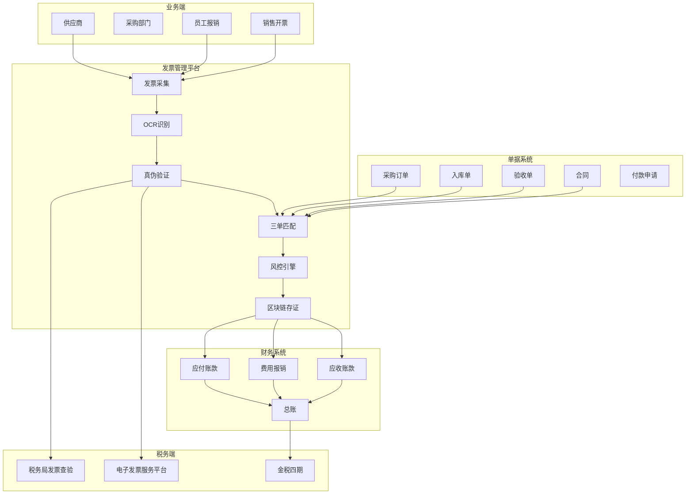
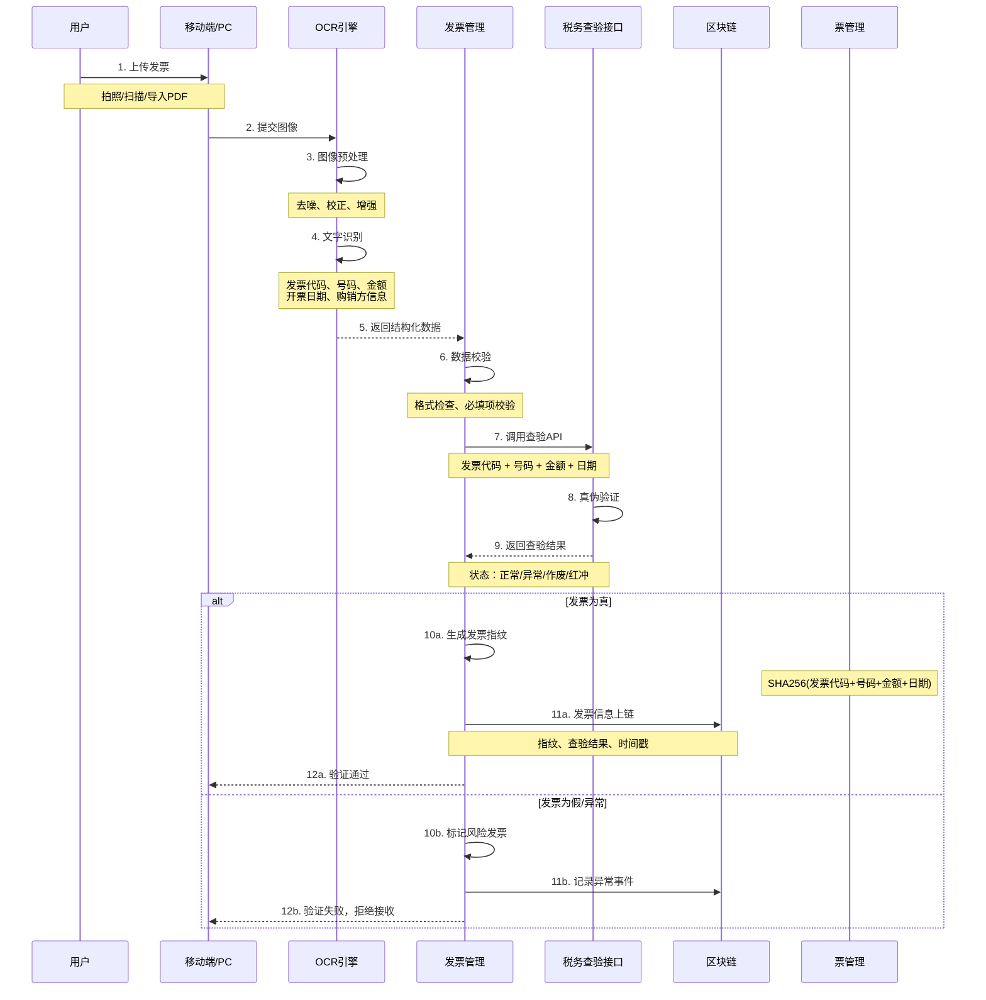
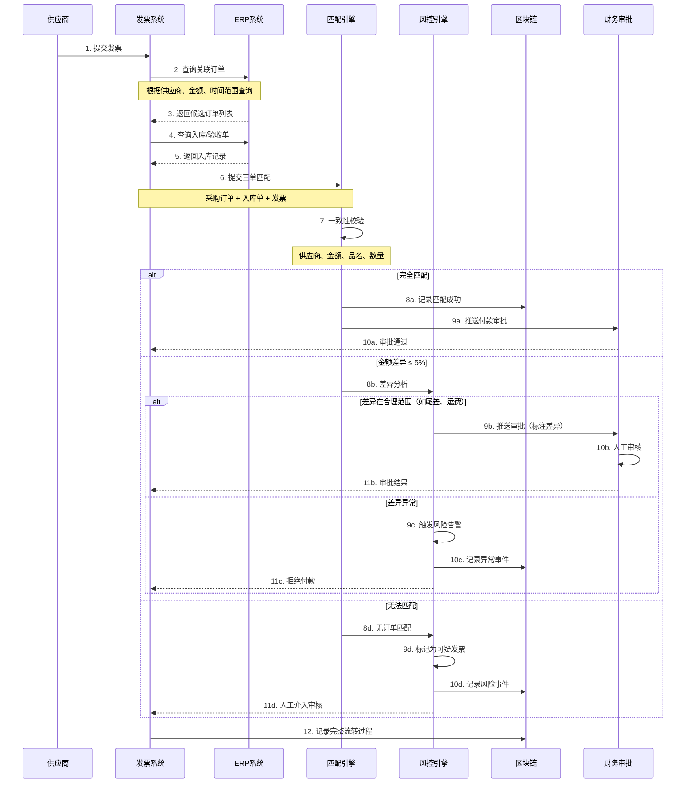
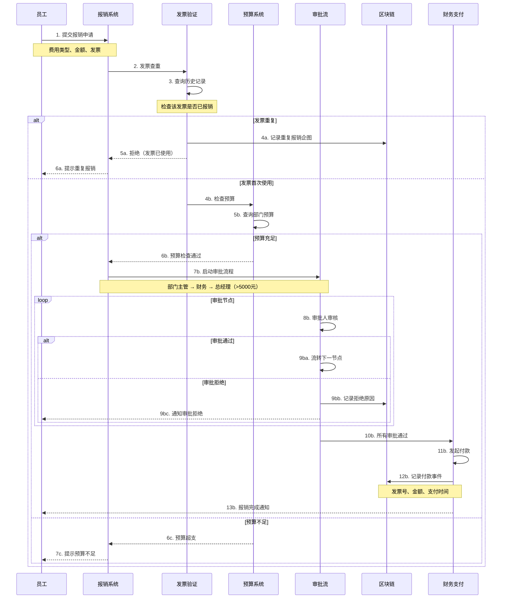
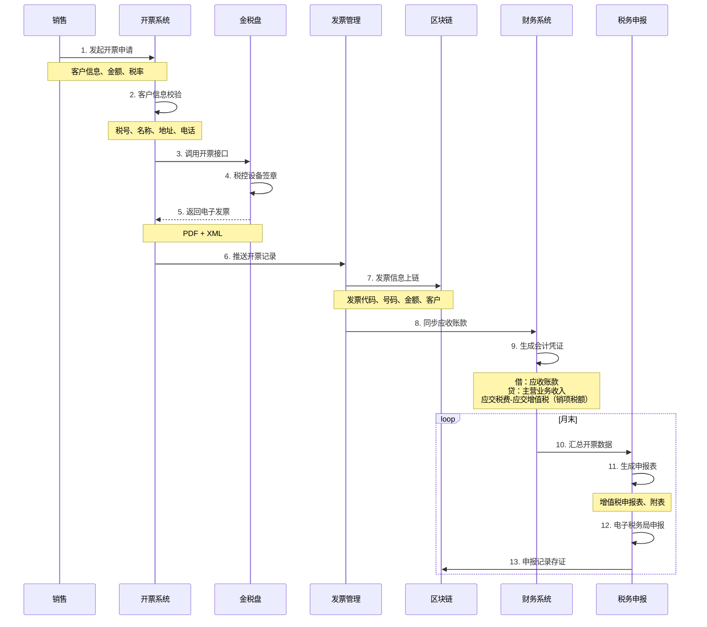

# F. 发票/单据防伪与税务协同 详细方案设计

## 一、方案概述

### 1.1 业务目标
- 实现采购到付款（P2P）、订单到收款（O2C）全流程票据管理
- 防范虚开发票、重复报销、虚假交易等风险
- 支持增值税发票、电子发票、全电发票的验证与流转
- 与税务系统、企业ERP系统无缝对接

### 1.2 核心价值
- **防伪验证**：发票真伪秒级验证，假发票拦截率99.9%
- **税务合规**：自动三单匹配，降低税务稽查风险
- **流程优化**：报销审批从数天缩短至数小时
- **风险预警**：智能识别虚开、串票等异常行为

---

## 二、业务架构图



---

## 三、核心业务流程

### 3.1 发票采集与识别流程



**OCR识别字段清单：**

| 字段 | 说明 | 必填 | 验证规则 |
|-----|------|------|---------|
| 发票代码 | 12位数字 | ✓ | 正则：\d{12} |
| 发票号码 | 8位数字 | ✓ | 正则：\d{8} |
| 开票日期 | YYYY-MM-DD | ✓ | 日期格式 |
| 购买方名称 | 企业全称 | ✓ | 与企业主体一致 |
| 购买方税号 | 18位 | ✓ | 统一社会信用代码 |
| 销售方名称 | 企业全称 | ✓ | - |
| 销售方税号 | 18位 | ✓ | - |
| 金额 | 不含税金额 | ✓ | 数值格式 |
| 税额 | 增值税额 | ✓ | 金额 × 税率 |
| 价税合计 | 总金额 | ✓ | 金额 + 税额 |
| 税率 | 3%/6%/9%/13% | ✓ | 枚举值 |
| 发票类型 | 专票/普票/电票 | ✓ | 枚举值 |

---

### 3.2 三单匹配流程（采购场景）



**匹配规则优先级：**

| 优先级 | 匹配维度 | 容差 | 匹配率 |
|-------|---------|------|-------|
| 1 | 订单号精确匹配 | 金额±0.01元 | 85% |
| 2 | 供应商+日期±30天 | 金额±5% | 10% |
| 3 | 供应商+金额 | 日期±90天 | 3% |
| 4 | 模糊匹配 | 人工确认 | 2% |

---

### 3.3 费用报销流程



**风控检查项：**
1. **重复报销**：发票指纹查重（区块链）
2. **虚假发票**：税务查验接口
3. **金额篡改**：OCR金额 vs 手动录入金额
4. **异常模式**：
   - 同一供应商短期大量报销
   - 发票连号（疑似批量虚开）
   - 金额接近报销限额（如9999元）
   - 周五下班前集中提交

---

### 3.4 销售开票与税务申报流程



**开票风控：**
- 客户税号黑名单检查
- 异常开票模式识别（如大量作废、红冲）
- 税负率监控（行业平均值对比）
- 进项发票与销项发票匹配度分析

---

## 四、核心功能模块

### 4.1 发票防伪验证模块

**验证手段：**

1. **税务局接口查验**（一级验证）
   - 接口：国家税务总局发票查验平台
   - 频率限制：每张发票每天可查5次
   - 返回：发票状态（正常/作废/红冲/查无此票）

2. **区块链指纹对比**（二级验证）
   - 计算发票指纹：SHA256(代码+号码+金额+日期)
   - 查询链上是否已使用
   - 防止一票多报

3. **OCR结果交叉验证**（三级验证）
   - 手动录入金额 vs OCR识别金额
   - 差异>0.01元触发人工复核

4. **供应商黑名单**（四级验证）
   - 虚开发票企业库
   - 已注销企业检查
   - 税务异常企业

**验证流程图：**
```
发票上传
   ↓
OCR识别
   ↓
税务查验 → [查无此票] → 拦截
   ↓ [正常]
区块链查重 → [已报销] → 拦截
   ↓ [首次]
供应商检查 → [黑名单] → 拦截
   ↓ [正常]
三单匹配 → [不匹配] → 人工审核
   ↓ [匹配]
进入审批流程
```

---

### 4.2 风控规则引擎

**异常检测规则库：**

```yaml
虚开发票特征:
  规则1-连号发票:
    条件: 同一供应商，发票号连续，时间间隔<7天
    风险等级: 高
    处置: 人工复核
    
  规则2-金额规律:
    条件: 多张发票金额相同或呈等差数列
    风险等级: 中
    处置: 供应商访谈
    
  规则3-税号异常:
    条件: 供应商税号在黑名单或已注销
    风险等级: 严重
    处置: 立即拦截
    
  规则4-地址电话空:
    条件: 发票上供应商地址、电话为空
    风险等级: 中
    处置: 标记待审核
    
重复报销特征:
  规则5-完全重复:
    条件: 发票代码+号码完全一致
    风险等级: 严重
    处置: 立即拒绝
    
  规则6-部分重复:
    条件: 同一人短期内多次报销同一供应商
    风险等级: 低
    处置: 提示关注
    
异常行为:
  规则7-批量提交:
    条件: 单次提交>10张发票
    风险等级: 低
    处置: 延长审核时间
    
  规则8-临界金额:
    条件: 金额接近审批阈值（如9999元）
    风险等级: 中
    处置: 提高审批级别
```

**机器学习模型：**
- 训练数据：历史发票数据（已标注真假）
- 特征工程：供应商信用、发票特征、报销人行为
- 模型输出：风险评分（0-100）
- 决策阈值：
  - 0-30分：自动通过
  - 31-70分：人工审核
  - 71-100分：自动拦截

---

### 4.3 区块链存证模块

**存证内容：**

```json
发票存证记录 {
  "invoiceId": "INV-20251020-001",
  "fingerprint": "0x1234567890abcdef...",
  "invoiceCode": "044001234567",
  "invoiceNo": "12345678",
  "amount": 10000.00,
  "taxAmount": 1300.00,
  "issueDate": "2025-10-20",
  "seller": {
    "name": "北京XX科技有限公司",
    "taxNo": "91110108XXXXXXXXXX"
  },
  "buyer": {
    "name": "上海YY贸易有限公司",
    "taxNo": "91310115XXXXXXXXXX"
  },
  "verifyStatus": "正常",
  "verifyTime": "2025-10-21T10:30:00Z",
  "firstUseTime": "2025-10-21T10:35:00Z",
  "useScenario": "费用报销",
  "relatedOrder": "PO-20251018-001",
  "signature": "国密SM2签名",
  "blockHeight": 1234567,
  "txHash": "0xabcdef..."
}
```

**智能合约逻辑：**
```solidity
// 伪代码
contract InvoiceRegistry {
    struct Invoice {
        bytes32 fingerprint;
        string invoiceCode;
        string invoiceNo;
        uint256 amount;
        address owner;
        bool used;
        uint256 usedTime;
    }
    
    mapping(bytes32 => Invoice) public invoices;
    
    // 发票登记
    function registerInvoice(
        bytes32 fingerprint,
        string memory invoiceCode,
        string memory invoiceNo,
        uint256 amount
    ) public {
        require(!invoices[fingerprint].used, "Invoice already used");
        
        invoices[fingerprint] = Invoice({
            fingerprint: fingerprint,
            invoiceCode: invoiceCode,
            invoiceNo: invoiceNo,
            amount: amount,
            owner: msg.sender,
            used: true,
            usedTime: block.timestamp
        });
        
        emit InvoiceRegistered(fingerprint, msg.sender, amount);
    }
    
    // 查询发票状态
    function checkInvoice(bytes32 fingerprint) public view returns (bool used, uint256 usedTime) {
        Invoice memory inv = invoices[fingerprint];
        return (inv.used, inv.usedTime);
    }
}
```

---

### 4.4 税务申报协同模块

**申报数据自动汇总：**

```
增值税申报表（主表）:
├─ 销项税额: 自动汇总开票系统
├─ 进项税额: 自动汇总认证发票
├─ 进项税额转出: 手动录入（不得抵扣项）
├─ 免抵退税额: 外贸企业专用
└─ 应纳税额: 自动计算

附表一（销售明细）:
├─ 按税率分类汇总
├─ 13%税率: XX万元
├─ 9%税率: XX万元
├─ 6%税率: XX万元
└─ 免税: XX万元

附表二（进项明细）:
├─ 认证通过发票
├─ 海关进口增值税专用缴款书
└─ 农产品收购发票
```

**与金税四期对接：**
- 实时上传发票开具数据
- 接收税务预警信息
- 电子税务局API对接
- 申报表XML格式生成

---

## 五、系统集成接口

### 5.1 税务系统对接

| 系统 | 接口类型 | 功能 | 调用频率 |
|-----|---------|------|---------|
| 增值税发票查验平台 | REST API | 发票真伪查验 | 实时 |
| 电子税务局 | Webservice | 申报表上传 | 月度 |
| 金税盘/税控盘 | SDK | 开票、抄税 | 实时 |
| 电子发票服务平台 | API | 电票下载 | 实时 |

### 5.2 企业内部系统

- **ERP系统**：采购订单、入库单、合同
- **OA系统**：审批流程
- **财务系统**：会计凭证、科目余额
- **预算系统**：预算执行情况

### 5.3 第三方服务

- **OCR服务**：百度AI、阿里云、腾讯云
- **企查查/天眼查**：供应商资质查询
- **银行**：企业网银支付接口

---

## 六、部署架构

### 6.1 系统架构

```
┌─────────────────────────────────────────┐
│          前端应用层                      │
│  移动端APP | PC管理后台 | 财务看板      │
└──────────────┬──────────────────────────┘
               ↓
┌─────────────────────────────────────────┐
│          应用服务层                      │
│  ┌──────────┐  ┌──────────┐  ┌───────┐ │
│  │发票管理  │  │风控引擎  │  │审批流 │ │
│  └──────────┘  └──────────┘  └───────┘ │
└──────────────┬──────────────────────────┘
               ↓
┌─────────────────────────────────────────┐
│          数据服务层                      │
│  ┌──────────┐  ┌──────────┐  ┌───────┐ │
│  │OCR识别   │  │税务查验  │  │ERP集成│ │
│  └──────────┘  └──────────┘  └───────┘ │
└──────────────┬──────────────────────────┘
               ↓
┌─────────────────────────────────────────┐
│          存储层                          │
│  ┌──────────┐  ┌──────────┐  ┌───────┐ │
│  │PostgreSQL│  │区块链    │  │OSS    │ │
│  │(结构化)  │  │(存证)    │  │(文件) │ │
│  └──────────┘  └──────────┘  └───────┘ │
└─────────────────────────────────────────┘
```

### 6.2 数据流

```
发票图片（OSS存储）
    ↓
OCR识别结果（PostgreSQL）
    ↓
税务查验结果（PostgreSQL + 区块链）
    ↓
三单匹配结果（PostgreSQL）
    ↓
审批记录（PostgreSQL）
    ↓
支付凭证（PostgreSQL + 区块链）
```

---

## 七、KPI 指标体系

### 7.1 业务指标
- 假发票拦截率：≥ **99.9%**
- 重复报销拦截率：**100%**
- 三单匹配自动化率：≥ **90%**
- 报销审批时效：≤ **24小时**（中位数）

### 7.2 技术指标
- OCR识别准确率：≥ **98%**
- 税务查验成功率：≥ **99%**
- 发票查重响应时间：≤ **100ms**
- 系统可用性：≥ **99.9%**

### 7.3 财务指标
- 税务稽查通过率：**100%**
- 虚假发票损失：**0元**
- 人工审核成本下降：**70%**
- 报销流程成本下降：**60%**

---

## 八、成本与收益分析

### 8.1 建设成本
- 软件平台开发：80-120万元
- OCR服务采购：10-20万元/年
- 区块链部署：25-35万元
- ERP/财务系统集成：30-50万元
- 实施与培训：20-30万元
- **总计**：165-255万元

### 8.2 年运营成本
- 云服务与存储：20-30万元
- OCR/税务查验API调用：15-25万元
- 系统维护：15-25万元
- 人员运营：30-50万元
- **总计**：80-130万元

### 8.3 收益评估

**场景：中型企业，年5000张发票**

- **防范假发票损失**：
  - 假发票比例约0.5%，单张平均5000元
  - 潜在损失：5000 × 0.5% × 5000 = **12.5万元/年**
  - 拦截后避免损失：**12万元/年**

- **人工成本节约**：
  - 传统人工审核：3人 × 12万元/年 = **36万元/年**
  - 自动化后：1人 × 12万元/年 = **12万元/年**
  - 节省：**24万元/年**

- **税务合规**：
  - 避免因发票问题被罚（单次可达数十万）
  - 价值：**不可估量**

**投资回收期**：约 **1-1.5年**

---

## 九、典型应用场景

### 场景1：大型集团企业
- **挑战**：数百家子公司，月均10万张发票
- **方案**：集中式发票管理平台 + 分布式OCR
- **效果**：假发票拦截2000+张/年，避免损失1000万元

### 场景2：建筑工程企业
- **挑战**：材料采购发票多，虚开风险高
- **方案**：三单强制匹配 + 供应商黑名单
- **效果**：虚开发票拦截率99%，税务稽查零问题

### 场景3：互联网公司
- **挑战**：员工报销量大，人工审核慢
- **方案**：移动端拍照报销 + 智能审批
- **效果**：报销时效从7天→1天，员工满意度提升

### 场景4：外贸企业
- **挑战**：出口退税发票管理复杂
- **方案**：电子发票自动归档 + 退税申报协同
- **效果**：退税申报准确率100%，审批时效缩短50%

---

## 十、风险与应对

| 风险类型 | 风险描述 | 应对措施 |
|---------|---------|---------|
| OCR识别错误 | 金额识别错误导致误判 | 人工复核 + 多引擎交叉验证 |
| 税务接口限流 | 每天查验次数限制 | 缓存查验结果 + 批量查验 |
| 假发票升级 | 高仿真假发票 | 区块链+税务查验双重验证 |
| 系统故障 | 审批流程中断 | 双活部署 + 灾备切换 |
| 数据泄露 | 发票含企业机密 | 加密存储 + 脱敏展示 |

---

## 十一、实施路线图

### Phase 1：核心功能开发（2-3个月）
- OCR识别与税务查验
- 发票查重与存证
- 基础审批流程

### Phase 2：ERP集成（1-2个月）
- 采购订单对接
- 入库单对接
- 三单匹配上线

### Phase 3：风控强化（1-2个月）
- 风控规则引擎
- 机器学习模型
- 异常告警

### Phase 4：税务协同（2-3个月）
- 申报表自动生成
- 金税四期对接
- 电子税务局对接

---

## 十二、交付物清单

1. 发票管理平台（PC端+移动端）
2. OCR识别引擎（支持增票/普票/电票）
3. 税务查验接口适配器
4. 三单匹配引擎
5. 风控规则引擎
6. 区块链存证系统
7. 审批流程引擎
8. 财务系统集成接口
9. 税务申报协同模块
10. 数据看板与报表
11. 移动端APP（iOS/Android）
12. 操作手册与培训视频
13. 合规材料包（税务合规指南）

---

**方案版本**：v1.0  
**最后更新**：2025-10-20  
**适用行业**：全行业（特别是建筑、制造、贸易、服务业）

