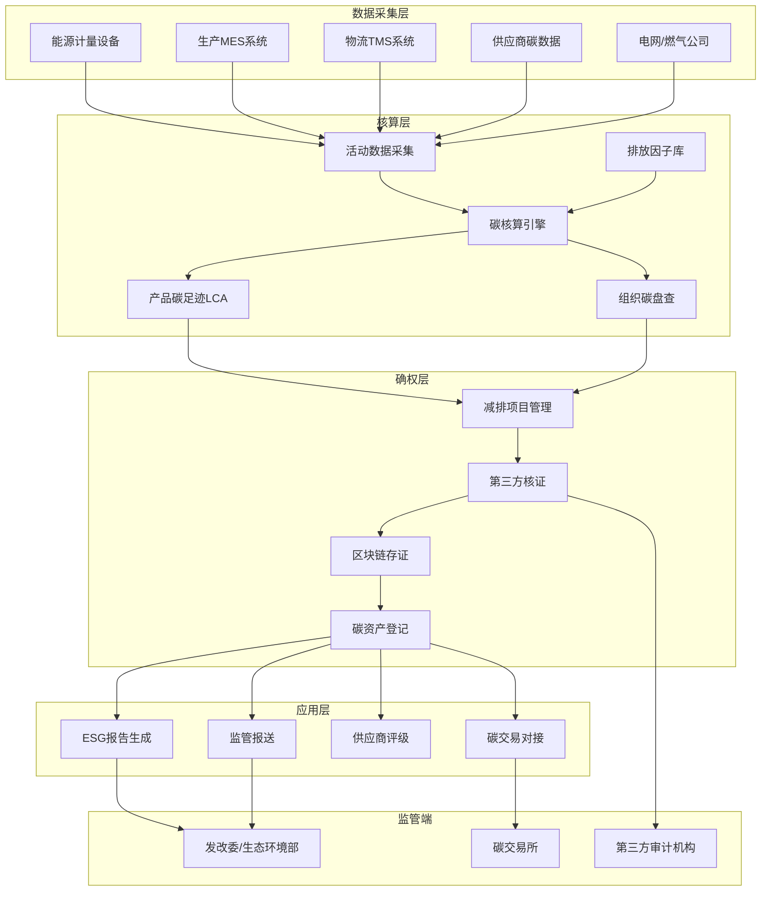
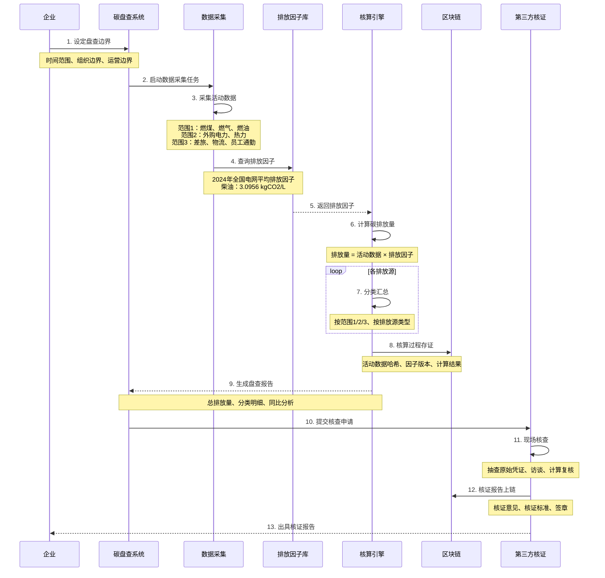
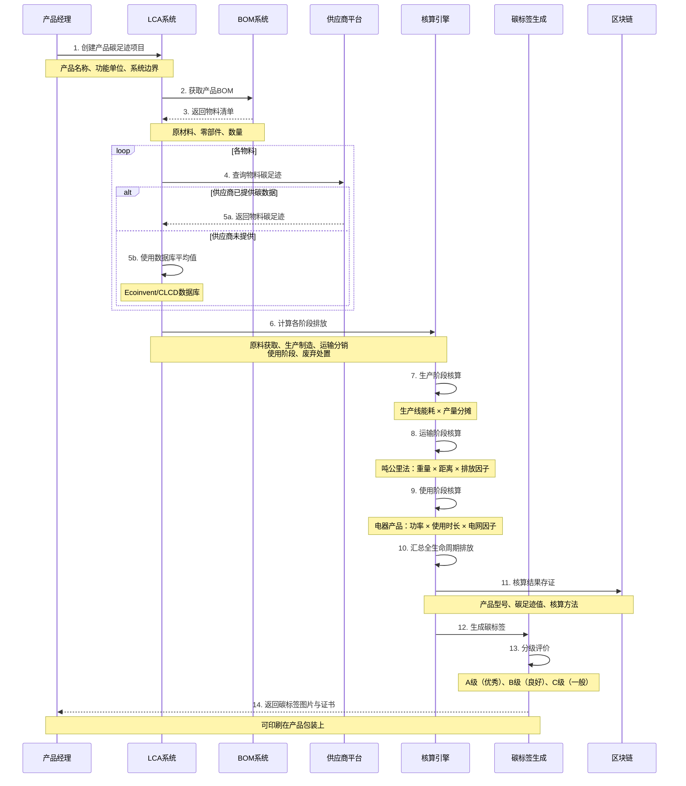
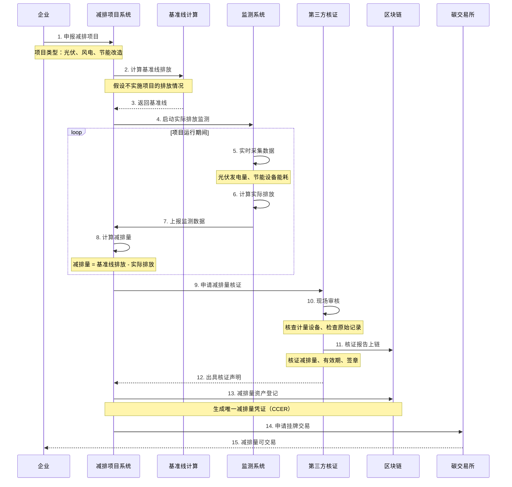
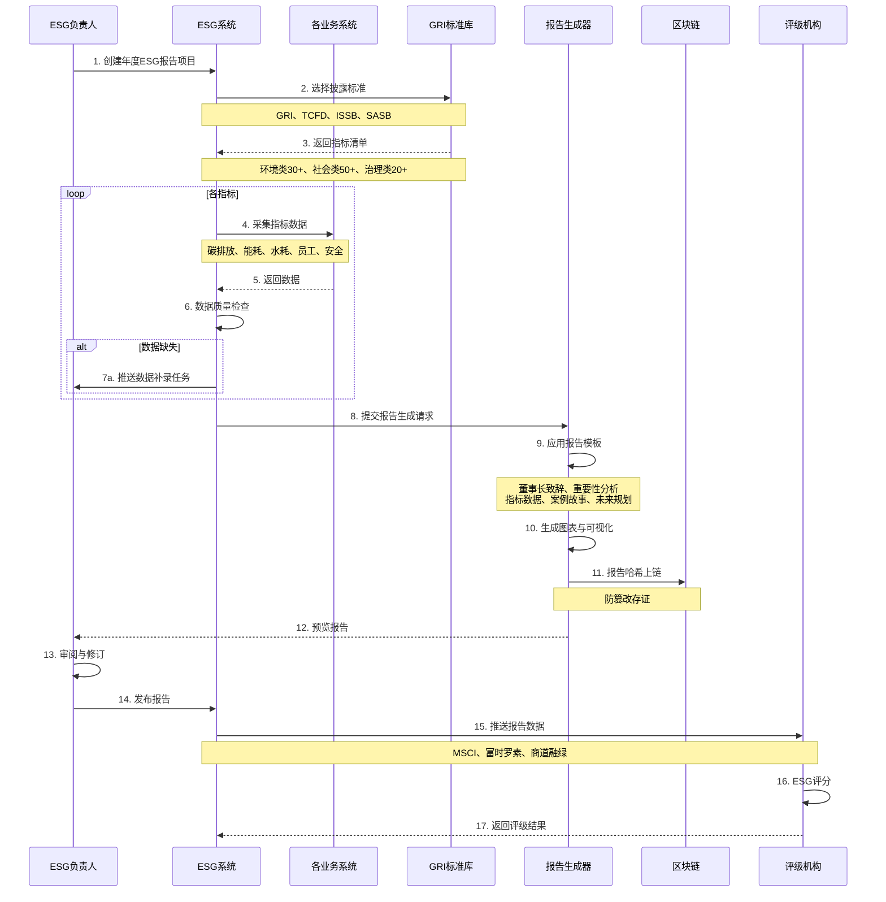

# G. 碳足迹/ESG数据确权与核证 详细方案设计

## 一、方案概述

### 1.1 业务目标
- 实现产品/企业/园区级碳足迹全生命周期核算
- 支持减排量与绿色权益（绿证、碳信用）的确权与交易
- 满足ESG信息披露要求（GRI、TCFD、ISSB等标准）
- 提供第三方可验证的碳核查与审计报告

### 1.2 核心价值
- **双碳合规**：满足国家"双碳"目标与行业减排要求
- **供应链协同**：上下游碳数据协同，产品碳足迹追溯
- **绿色金融**：碳资产确权后可质押融资、碳交易
- **品牌价值**：ESG评级提升，吸引ESG投资

---

## 二、业务架构图



---

## 三、核心业务流程

### 3.1 组织碳盘查流程



**盘查范围说明：**

| 范围 | 定义 | 排放源示例 | 数据来源 |
|-----|------|----------|---------|
| 范围1 | 直接排放 | 燃煤锅炉、公司车辆、生产工艺过程 | 能源账单、车辆油耗 |
| 范围2 | 间接排放（能源） | 外购电力、外购热力、外购蒸汽 | 电费单、热力费单 |
| 范围3 | 其他间接排放 | 采购原料、物流运输、员工差旅、产品使用 | 供应商数据、物流单 |

---

### 3.2 产品碳足迹核算流程（LCA生命周期评价）



**产品碳足迹案例（智能手机）：**

| 生命周期阶段 | 排放量（kgCO2e） | 占比 |
|------------|----------------|------|
| 原材料获取 | 35 | 43.8% |
| 生产制造 | 20 | 25.0% |
| 运输分销 | 5 | 6.2% |
| 使用阶段 | 15 | 18.8% |
| 废弃处置 | 5 | 6.2% |
| **总计** | **80** | **100%** |

---

### 3.3 减排项目确权流程



**减排项目类型与减排量计算：**

| 项目类型 | 基准线 | 实际排放 | 减排量计算 |
|---------|--------|---------|----------|
| 屋顶光伏 | 电网购电排放 | 0 | 发电量 × 电网因子 |
| LED节能改造 | 改造前耗电 | 改造后耗电 | (改造前 - 改造后) × 电网因子 |
| 新能源车队 | 燃油车排放 | 电动车排放 | (燃油车油耗 × 燃油因子) - (电耗 × 电网因子) |
| 林业碳汇 | 无树木吸收 | 树木吸收CO2 | 固碳量（生物量法） |

---

### 3.4 ESG报告生成与披露流程



**GRI标准核心指标示例：**

| 类别 | 指标代码 | 指标名称 | 数据示例 |
|-----|---------|---------|---------|
| 环境 | GRI 305-1 | 范围1温室气体排放 | 5000 tCO2e |
| 环境 | GRI 305-2 | 范围2温室气体排放 | 15000 tCO2e |
| 环境 | GRI 303-3 | 取水量 | 50000 m³ |
| 社会 | GRI 401-1 | 新进员工与离职员工 | 新进200人，离职50人 |
| 社会 | GRI 403-9 | 工伤事故 | 0起死亡事故 |
| 治理 | GRI 205-3 | 反腐败案件 | 0起腐败案件 |

---

## 四、核心功能模块

### 4.1 排放因子库

**数据来源：**
- 国家发改委《省级温室气体清单编制指南》
- 生态环境部《企业温室气体排放核算方法与报告指南》
- IPCC（政府间气候变化专门委员会）数据库
- Ecoinvent国际生命周期数据库

**因子类型：**

| 能源类型 | 排放因子 | 单位 | 数据来源 |
|---------|---------|------|---------|
| 电力（华北电网） | 0.8843 | kgCO2/kWh | 2023年区域电网 |
| 天然气 | 2.1622 | kgCO2/m³ | 国家标准 |
| 汽油 | 2.925 | kgCO2/L | 国家标准 |
| 柴油 | 3.0956 | kgCO2/L | 国家标准 |
| 煤炭（烟煤） | 1.9003 | kgCO2/kg | 国家标准 |

**动态更新机制：**
- 电网排放因子：每年更新（生态环境部发布）
- 燃料因子：每3年更新
- 版本管理：所有历史版本可追溯

---

### 4.2 碳核算引擎

**核算公式：**

```
基础公式：
GHG排放量 = 活动数据 × 排放因子

示例1 - 电力消耗：
排放量 = 10000 kWh × 0.8843 kgCO2/kWh = 8843 kgCO2

示例2 - 柴油车辆：
排放量 = 500 L × 3.0956 kgCO2/L = 1547.8 kgCO2

示例3 - 产品碳足迹（分摊法）：
单位产品排放 = 生产线总排放 / 总产量
             = 100 tCO2 / 10000件
             = 10 kgCO2/件
```

**复杂场景处理：**

1. **混合能源**（如汽电共生）
   ```
   净外购电排放 = 外购电量 × 电网因子
                - 余热发电量 × 电网因子
   ```

2. **物流碳足迹**（多式联运）
   ```
   总排放 = 公路运输排放 + 铁路运输排放 + 海运排放
   公路排放 = 货物重量(t) × 运输距离(km) × 0.12 kgCO2/(t·km)
   ```

3. **范围3上游排放**（采购）
   ```
   采购排放 = Σ(采购金额 × 行业排放强度)
   行业排放强度：钢材 2.1 tCO2/万元，塑料 1.5 tCO2/万元
   ```

---

### 4.3 减排量确权模块

**CCER（国家核证自愿减排量）流程：**

```
项目申报 → 项目审定 → 项目备案 → 监测 → 减排量核证 → 签发 → 交易
```

**区块链NFT碳资产：**

```json
{
  "tokenId": "CCER-20251020-001",
  "projectName": "XX园区屋顶分布式光伏项目",
  "projectType": "可再生能源-光伏",
  "reductionAmount": 1000,
  "unit": "tCO2e",
  "vintage": "2024",
  "methodology": "CM-002-V01",
  "verifier": "中国质量认证中心",
  "verifyDate": "2025-10-20",
  "owner": "0x1234567890abcdef...",
  "status": "active",
  "serialNumber": "CCER-2024-001-0001-1000",
  "metadata": {
    "project_start_date": "2023-01-01",
    "monitoring_period": "2024-01-01 to 2024-12-31",
    "baseline_emission": 1500,
    "actual_emission": 500,
    "leakage": 0
  }
}
```

**交易流程：**
1. 减排量资产铸造（Mint NFT）
2. 挂牌交易（碳交易所/联盟链市场）
3. 买方出价
4. 智能合约自动撮合
5. 资产转移 + 资金结算
6. 注销使用（用于抵消排放，NFT销毁）

---

### 4.4 供应商碳数据协同模块

**供应商门户功能：**
1. 碳数据填报（产品碳足迹、企业碳排放）
2. 数据质量检查（合理性校验）
3. 第三方核证报告上传
4. 碳绩效评分展示

**供应商碳评级模型：**

```
总分 = 碳数据透明度(30%) 
     + 碳排放强度(40%) 
     + 减排目标(20%) 
     + 可再生能源使用率(10%)

评级  | 分数      | 采购优先级
-----|-----------|-------------
A+   | 90-100    | 优先选择
A    | 80-89     | 推荐选择
B    | 70-79     | 正常选择
C    | 60-69     | 需改进
D    | <60       | 限制采购
```

**案例：**
- 苹果公司要求供应链2030年碳中和
- 戴尔要求供应商披露Scope 1+2排放
- 宜家追溯家具产品的原材料碳足迹

---

## 五、系统集成接口

### 5.1 能源管理系统
- 电力监测系统：用电量实时数据
- 燃气表：天然气消耗
- 蒸汽计量：工业蒸汽使用量
- 水表：工业用水、生活用水

### 5.2 生产系统
- MES系统：生产量、产品BOM
- ERP系统：采购数据、物流数据
- 设备管理：设备能耗、运行时长

### 5.3 外部平台
- 电网公司：电力碳因子
- 全国碳市场：碳配额交易
- 地方碳交易所：CCER交易
- 第三方核证机构：核证报告接口

---

## 六、部署架构

### 6.1 系统架构

```
┌─────────────────────────────────────────┐
│          数据采集层                      │
│  IoT网关 | API采集 | 文件导入 | 人工录入 │
└──────────────┬──────────────────────────┘
               ↓
┌─────────────────────────────────────────┐
│          数据处理层                      │
│  数据清洗 | 单位转换 | 异常检测 | 补全   │
└──────────────┬──────────────────────────┘
               ↓
┌─────────────────────────────────────────┐
│          核算层                          │
│  碳核算引擎 | LCA引擎 | 减排量计算      │
└──────────────┬──────────────────────────┘
               ↓
┌─────────────────────────────────────────┐
│          存储层                          │
│  PostgreSQL | 时序数据库 | 区块链       │
└──────────────┬──────────────────────────┘
               ↓
┌─────────────────────────────────────────┐
│          应用层                          │
│  管理后台 | 供应商门户 | 移动APP | 报表 │
└─────────────────────────────────────────┘
```

---

## 七、KPI 指标体系

### 7.1 业务指标
- 碳盘查覆盖率：**100%**（所有重点排放源）
- 产品碳足迹覆盖率：≥ **50%**（重点产品）
- 供应商碳数据收集率：≥ **80%**（前100大供应商）
- ESG报告发布及时性：**100%**（每年4月30日前）

### 7.2 技术指标
- 数据自动采集率：≥ **70%**
- 碳核算准确率：≥ **95%**
- 第三方核证通过率：**100%**
- 系统可用性：≥ **99.5%**

### 7.3 减排指标
- 年度碳排放下降：≥ **5%**
- 可再生能源使用比例：≥ **30%**
- 单位产值碳排放强度：每年下降 **3%**
- 碳中和目标：2050年（或2060年）

---

## 八、成本与收益分析

### 8.1 建设成本
- 碳管理平台开发：100-150万元
- IoT能源监测设备：50-100万元
- 区块链部署：30-50万元
- 第三方核证费用：20-30万元/年
- 实施与培训：30-50万元
- **总计**：230-380万元

### 8.2 年运营成本
- 云服务与存储：20-30万元
- 系统维护：20-30万元
- 第三方核证：20-30万元
- 人员运营：60-80万元
- **总计**：120-170万元

### 8.3 收益评估

- **绿色金融**：
  - 碳资产质押融资：假设年减排1万吨，按50元/吨计算，可质押 **50万元**
  - 碳交易收益：CCER市场价60-80元/吨，年收益 **60-80万元**

- **ESG评级提升**：
  - MSCI评级提升（B → A），吸引ESG基金
  - 绿色债券利率优惠0.5%，按1亿元融资计算，节省利息 **50万元/年**

- **供应链要求**：
  - 满足苹果/特斯拉等客户碳中和要求，获得订单
  - 价值：**不可估量**

- **政策激励**：
  - 节能减排补贴：按实际减排量，可获 **100-200万元/年**

**投资回收期**：约 **2-3年**

---

## 九、典型应用场景

### 场景1：制造企业全厂碳盘查
- **企业**：汽车制造厂
- **范围**：3个生产基地，年产50万辆
- **方案**：物联网能源监测 + 碳核算平台
- **效果**：精准识别高排放环节，节能改造后年减排15%

### 场景2：快消品产品碳足迹
- **企业**：食品饮料公司
- **产品**：瓶装水
- **方案**：LCA全生命周期评价 + 碳标签
- **效果**：碳标签印在包装上，消费者认可，销量提升20%

### 场景3：园区光伏减排项目
- **企业**：产业园区
- **项目**：10MW屋顶分布式光伏
- **方案**：减排量监测 + CCER签发 + 碳交易
- **效果**：年减排1万吨，碳交易收益60万元/年

### 场景4：供应链碳协同
- **企业**：电子产品品牌商
- **供应商**：500家
- **方案**：供应商碳数据平台 + 碳评级
- **效果**：100%一级供应商提交碳数据，供应链碳排放可追溯

---

## 十、风险与应对

| 风险类型 | 风险描述 | 应对措施 |
|---------|---------|---------|
| 数据质量 | 人工填报数据不准确 | 物联网自动采集 + 合理性校验 |
| 政策变化 | 碳市场政策调整 | 模块化设计，快速适配 |
| 核证成本 | 第三方核证费用高 | 自动化报告生成，降低人工成本 |
| 供应商配合度 | 供应商不愿披露数据 | 采购政策引导 + 行业标准推动 |
| 技术复杂性 | LCA核算专业门槛高 | 内置行业模板 + 专家咨询 |

---

## 十一、实施路线图

### Phase 1：组织碳盘查（3-4个月）
- 数据采集体系建设
- 碳核算平台上线
- 首次碳盘查与核证
- 基准排放确定

### Phase 2：产品碳足迹（4-6个月）
- LCA系统开发
- 重点产品碳足迹核算
- 碳标签设计与申请
- 供应商碳数据收集

### Phase 3：减排项目（6-12个月）
- 节能改造项目实施
- 可再生能源项目（光伏）
- 减排量监测与核证
- CCER签发与交易

### Phase 4：ESG体系（持续）
- ESG报告生成
- ESG评级提升
- 绿色金融对接
- 碳中和路线图

---

## 十二、交付物清单

1. 碳管理平台（PC端+移动端）
2. 碳核算引擎（支持组织+产品）
3. 排放因子数据库（含自动更新）
4. LCA生命周期评价工具
5. 减排项目管理系统
6. 供应商碳数据协同平台
7. 区块链存证系统
8. ESG报告生成工具
9. 碳资产管理系统（NFT）
10. 数据可视化大屏
11. 碳盘查报告模板
12. 产品碳足迹报告模板
13. 第三方核证对接接口
14. 操作手册与培训
15. 碳中和路线图咨询报告

---

**方案版本**：v1.0  
**最后更新**：2025-10-20  
**适用行业**：制造、能源、建筑、交通、消费品

