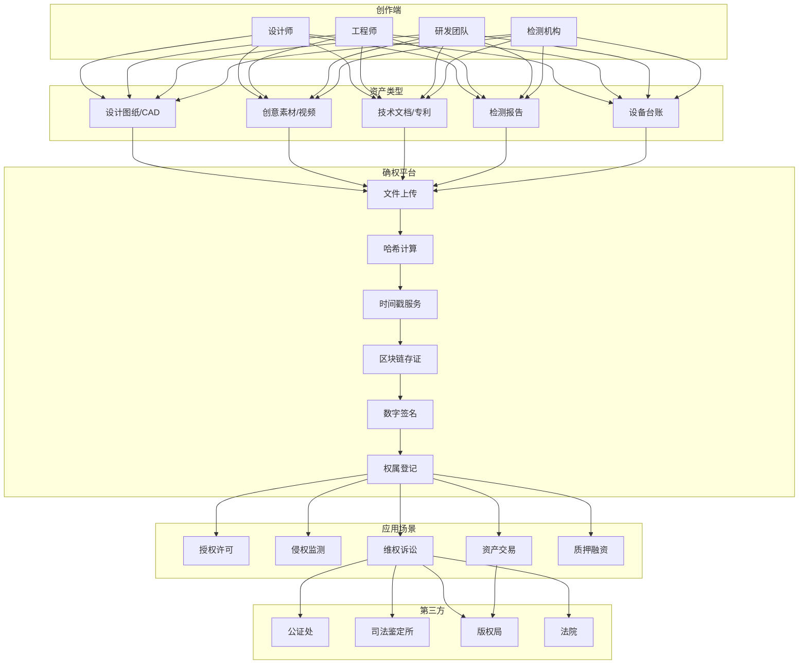
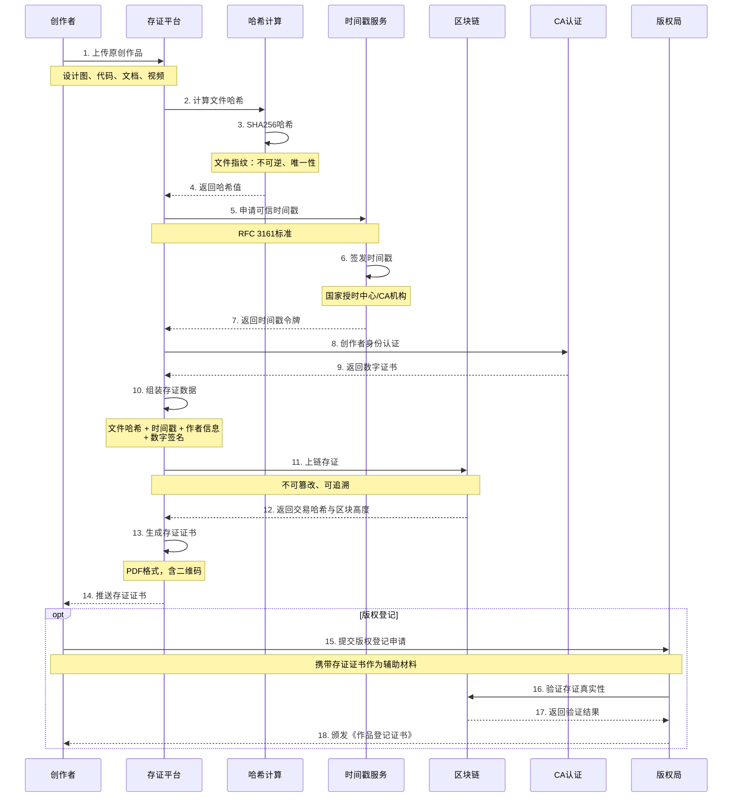
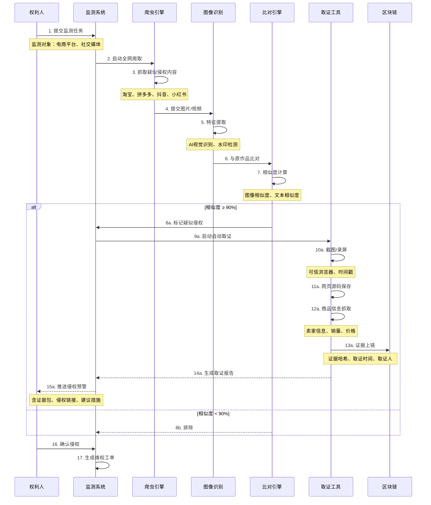
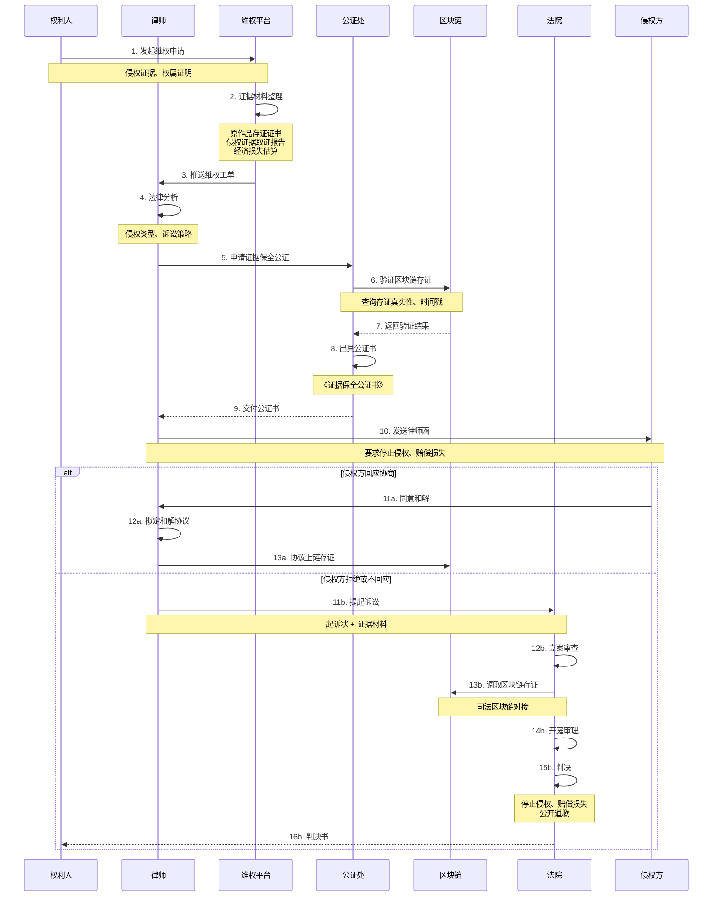
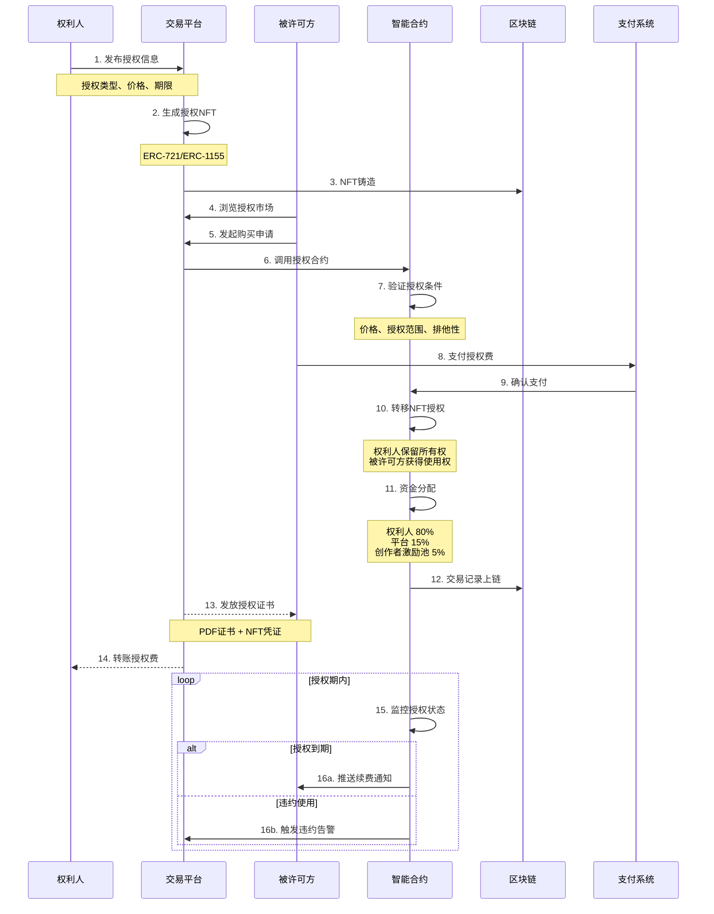
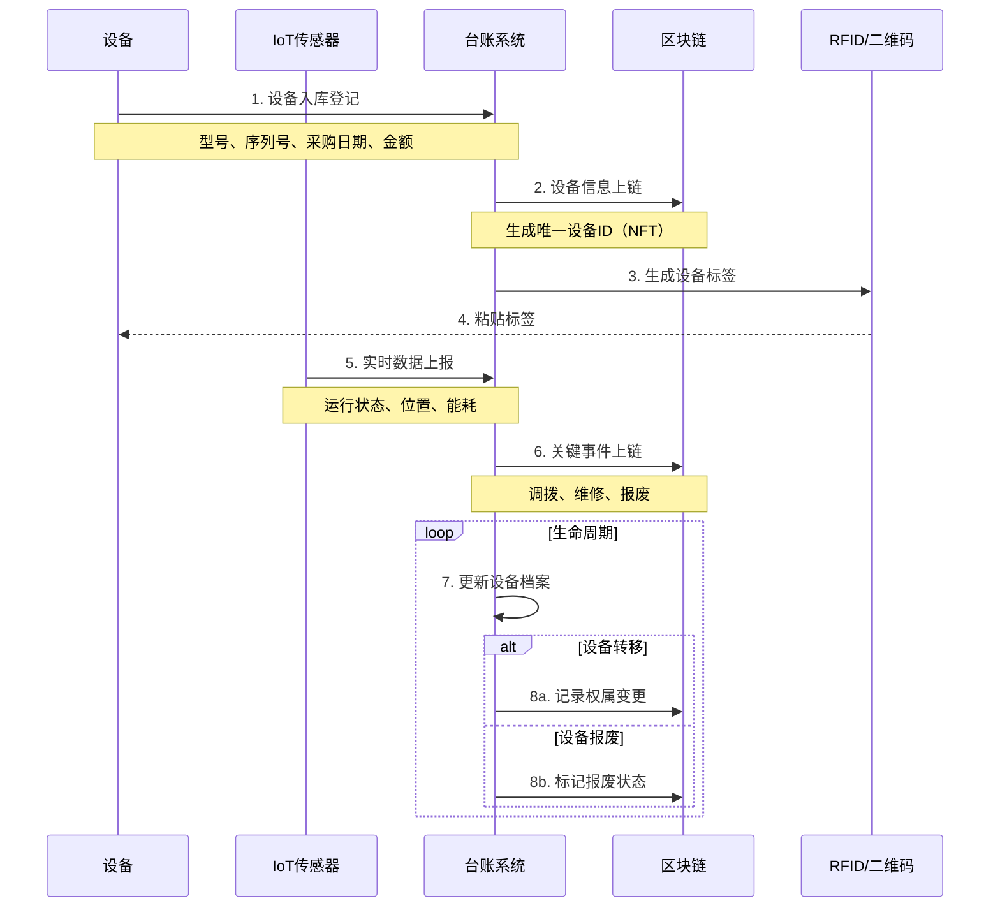

# H. 知识产权/数实资产凭证与维权 详细方案设计

## 一、方案概述

### 1.1 业务目标
- 实现设计图纸、创意素材、技术文档、检测报告等数字资产的确权存证
- 支持版权、专利、商标等知识产权的全生命周期管理
- 提供侵权取证与司法鉴定材料
- 建立数实资产（设备台账、实物资产）的数字孪生与权属证明

### 1.2 核心价值
- **确权存证**：区块链时间戳，证明创作时间与权属
- **快速维权**：侵权证据链完整，法律效力强
- **资产变现**：知识产权可授权、转让、质押融资
- **防伪溯源**：实物资产与数字凭证绑定，防止造假

---

## 二、业务架构图



---

## 三、核心业务流程

### 3.1 知识产权确权存证流程



**存证数据结构：**

```json
{
  "certificateId": "CERT-20251020-001",
  "assetType": "设计图纸",
  "fileName": "产品外观设计v3.dwg",
  "fileHash": "0x1234567890abcdef...",
  "fileSize": 2048576,
  "author": {
    "name": "张三",
    "idCard": "31010419900101****",
    "ca_cert": "数字证书序列号"
  },
  "timestamp": {
    "tsa": "国家授时中心",
    "time": "2025-10-20T14:35:22.123Z",
    "tsa_signature": "0xabcd..."
  },
  "blockchain": {
    "chain": "Fabric",
    "txHash": "0xef01...",
    "blockHeight": 1234567,
    "node": "node1.example.com"
  },
  "metadata": {
    "description": "新款手机外观设计",
    "tags": ["工业设计", "消费电子"],
    "license": "保留所有权利"
  },
  "qrcode": "存证证书二维码"
}
```

---

### 3.2 侵权监测与取证流程



**监测覆盖平台：**
- 电商平台：淘宝、京东、拼多多、1688
- 社交媒体：微信公众号、抖音、小红书、B站
- 设计平台：站酷、花瓣、Dribbble
- 文档平台：百度文库、道客巴巴、豆丁网

**相似度判定标准：**
- 图像相似度 ≥ 95%：高度疑似侵权
- 图像相似度 85-95%：中度疑似
- 文本相似度 ≥ 80%：疑似抄袭
- 商标/Logo完全相同：确认侵权

---

### 3.3 司法维权流程



**维权成本与周期：**

| 维权方式 | 成本 | 周期 | 成功率 | 适用场景 |
|---------|------|------|-------|---------|
| 平台投诉 | 0元 | 7-15天 | 60% | 电商平台售假 |
| 律师函 | 2000-5000元 | 1-2周 | 40% | 轻微侵权、快速施压 |
| 行政投诉 | 0元 | 1-3个月 | 70% | 商标/专利侵权 |
| 民事诉讼 | 1-5万元 | 6-12个月 | 80% | 重大侵权、索赔 |
| 刑事报案 | 0元 | 3-6个月 | 视情况 | 假冒注册商标罪 |

---

### 3.4 知识产权授权与交易流程



**授权类型：**

| 授权类型 | 定义 | 定价方式 | 应用场景 |
|---------|------|---------|---------|
| 非独占许可 | 可同时授权多方 | 按次收费 | 图片素材、字体 |
| 独占许可 | 仅授权一方 | 高价一次性 | 品牌设计、专利 |
| 排他许可 | 仅授权一方+权利人保留使用权 | 中高价 | 技术许可 |
| 区域许可 | 限定地理范围 | 按区域定价 | 商标授权 |
| 期限许可 | 限定时间范围 | 按年收费 | 软件订阅 |

**定价模型：**
```
授权费 = 基础价格 × 授权范围系数 × 排他性系数 × 期限系数

示例：
- 基础价格：1000元
- 全球授权（系数3）
- 非独占（系数1）
- 5年期限（系数2）
- 授权费 = 1000 × 3 × 1 × 2 = 6000元
```

---

## 四、核心功能模块

### 4.1 多类型资产支持

| 资产类型 | 文件格式 | 确权要点 | 特殊处理 |
|---------|---------|---------|---------|
| 设计图纸 | DWG、SKP、3DMAX | 创作时间、作者 | 预览图生成 |
| 创意素材 | JPG、PNG、PSD、AI | 原图哈希 | 水印嵌入 |
| 视频作品 | MP4、MOV、AVI | 分镜哈希 | 关键帧提取 |
| 音频作品 | MP3、WAV、FLAC | 音频指纹 | 频谱分析 |
| 文档资料 | PDF、DOCX、TXT | 全文哈希 | 版本控制 |
| 源代码 | ZIP、GIT仓库 | Git提交记录 | 代码树哈希 |
| 检测报告 | PDF、扫描件 | 报告编号+机构签章 | OCR识别 |

---

### 4.2 时间戳服务（TSA）

**RFC 3161标准：**
```
时间戳请求 (TSR)
    ↓
时间戳机构 (TSA)
    ├─ 验证请求合法性
    ├─ 获取可信时间源（GPS/北斗/原子钟）
    ├─ 对哈希值签名
    └─ 返回时间戳令牌 (TST)
    ↓
验证时间戳
    ├─ 验证TSA签名
    ├─ 验证证书链
    └─ 确认时间准确性
```

**国内TSA机构：**
- 国家授时中心
- 工业和信息化部电子认证服务产业联盟
- 公证处电子存证平台
- 法院司法区块链

---

### 4.3 侵权识别算法

**图像识别：**
1. **感知哈希算法（pHash）**
   - 对比图像内容相似度
   - 抗旋转、缩放、压缩

2. **SIFT特征匹配**
   - 局部特征提取
   - 识别部分抄袭

3. **深度学习模型**
   - 基于CNN的图像相似度
   - 训练数据：已知侵权案例

**文本相似度：**
1. **余弦相似度**
   - TF-IDF向量化
   - 适合长文本

2. **编辑距离（Levenshtein）**
   - 字符级对比
   - 适合短文本

3. **语义相似度（BERT）**
   - 理解语义
   - 识别改写抄袭

---

### 4.4 区块链存证模块

**智能合约示例（Solidity）：**

```solidity
// 简化版知识产权存证合约
contract IPRegistry {
    struct Asset {
        bytes32 fileHash;
        address owner;
        uint256 timestamp;
        string assetType;
        string description;
        bool exists;
    }
    
    mapping(bytes32 => Asset) public assets;
    
    event AssetRegistered(
        bytes32 indexed fileHash,
        address indexed owner,
        uint256 timestamp
    );
    
    // 注册资产
    function registerAsset(
        bytes32 fileHash,
        string memory assetType,
        string memory description
    ) public {
        require(!assets[fileHash].exists, "Asset already registered");
        
        assets[fileHash] = Asset({
            fileHash: fileHash,
            owner: msg.sender,
            timestamp: block.timestamp,
            assetType: assetType,
            description: description,
            exists: true
        });
        
        emit AssetRegistered(fileHash, msg.sender, block.timestamp);
    }
    
    // 验证资产
    function verifyAsset(bytes32 fileHash) 
        public view returns (
            address owner,
            uint256 timestamp,
            bool exists
        ) 
    {
        Asset memory asset = assets[fileHash];
        return (asset.owner, asset.timestamp, asset.exists);
    }
    
    // 转让资产
    function transferAsset(bytes32 fileHash, address newOwner) public {
        require(assets[fileHash].exists, "Asset not found");
        require(assets[fileHash].owner == msg.sender, "Not owner");
        
        assets[fileHash].owner = newOwner;
    }
}
```

---

## 五、设备台账与数实资产管理

### 5.1 设备数字孪生流程



**设备NFT元数据：**
```json
{
  "tokenId": "DEVICE-20251020-001",
  "assetType": "生产设备",
  "name": "数控加工中心 CNC-X500",
  "serialNumber": "SN-2024-10-001",
  "manufacturer": "某某机床有限公司",
  "purchaseDate": "2024-10-20",
  "originalValue": 500000,
  "location": "车间A-区域3",
  "status": "正常运行",
  "owner": "0x1234567890abcdef...",
  "metadata": {
    "model": "X500",
    "weight": "3500kg",
    "power": "15kW",
    "warranty": "2年"
  },
  "iot_deviceId": "IOT-12345",
  "images": ["设备照片URL"],
  "documents": ["采购合同哈希", "验收报告哈希"]
}
```

---

## 六、系统集成接口

### 6.1 版权局接口
- 作品登记系统：提交登记申请
- DCI（数字版权唯一标识符）申领

### 6.2 公证处接口
- 电子公证系统：证据保全
- 区块链验证接口

### 6.3 法院接口
- 司法区块链：天平链（北京）、蜀信链（成都）
- 电子诉讼平台：证据提交

### 6.4 电商平台
- 淘宝/京东：知识产权投诉接口
- 拼多多：假货举报接口

---

## 七、KPI 指标体系

### 7.1 业务指标
- 确权存证数量：年度新增 ≥ **10000件**
- 侵权监测覆盖率：重点平台 **100%**
- 维权成功率：≥ **80%**
- 平均维权周期：≤ **6个月**

### 7.2 技术指标
- 存证上链时延：≤ **5秒**
- 侵权识别准确率：≥ **85%**
- 系统可用性：≥ **99.9%**
- 证据验证成功率：**100%**

### 7.3 经济指标
- 维权挽回损失：年度 ≥ **500万元**
- 授权交易额：年度 ≥ **200万元**
- 资产质押融资：累计 ≥ **1000万元**

---

## 八、成本与收益分析

### 8.1 建设成本
- 确权存证平台开发：80-120万元
- 侵权监测系统：50-80万元
- 区块链部署：30-50万元
- 公证/司法对接：20-30万元
- 实施与培训：20-30万元
- **总计**：200-310万元

### 8.2 年运营成本
- 云服务与存储：20-30万元
- 爬虫与AI识别：30-50万元
- 时间戳服务：10-15万元
- 人员运营：60-80万元
- **总计**：120-175万元

### 8.3 收益评估

- **维权收益**：
  - 年维权案件20起，平均赔偿10万元
  - 收益：**200万元/年**

- **授权收入**：
  - 年授权100次，平均5000元/次
  - 收益：**50万元/年**

- **品牌保护**：
  - 减少假冒产品对品牌的损害
  - 价值：**不可估量**

**投资回收期**：约 **1-1.5年**

---

## 九、典型应用场景

### 场景1：工业设计公司
- **资产**：产品外观设计、CAD图纸
- **痛点**：设计被抄袭，维权困难
- **方案**：设计稿实时存证 + 全网监测
- **效果**：成功维权15起，获赔150万元

### 场景2：摄影师/插画师
- **资产**：照片、插画作品
- **痛点**：作品被盗用于商业广告
- **方案**：图片水印 + 侵权监测 + 快速维权
- **效果**：平台投诉成功率90%，7天下架侵权内容

### 场景3：软件公司
- **资产**：软件源代码、技术文档
- **痛点**：离职员工泄露代码
- **方案**：Git提交实时存证 + 代码对比
- **效果**：法院认定侵权，获赔500万元

### 场景4：制造企业
- **资产**：高价值设备台账
- **痛点**：设备被盗、产权纠纷
- **方案**：设备NFT + RFID标签 + 区块链存证
- **效果**：设备被盗后快速定位，追回资产

---

## 十、风险与应对

| 风险类型 | 风险描述 | 应对措施 |
|---------|---------|---------|
| 证据效力 | 法院不认可区块链证据 | 公证处、司法区块链背书 |
| 误判侵权 | AI识别错误导致误伤 | 人工复核 + 申诉机制 |
| 维权成本 | 诉讼费用高 | 律师费后付 + 保险 |
| 数据泄露 | 原作品被窃取 | 加密存储 + 权限控制 |
| 跨境维权 | 海外侵权难以维权 | 国际合作 + DMCA投诉 |

---

## 十一、实施路线图

### Phase 1：确权存证（2-3个月）
- 存证平台开发
- 区块链节点部署
- 时间戳服务对接
- 试运行与测试

### Phase 2：侵权监测（2-3个月）
- 爬虫系统开发
- AI识别模型训练
- 监测任务自动化
- 预警推送

### Phase 3：维权工具（3-4个月）
- 取证工具开发
- 公证处对接
- 律师协作平台
- 法院电子诉讼对接

### Phase 4：资产交易（4-6个月）
- 授权交易市场
- NFT铸造与流转
- 智能合约自动分账
- 质押融资对接

---

## 十二、交付物清单

1. 知识产权确权存证平台
2. 侵权监测系统（含爬虫+AI）
3. 可信取证工具
4. 区块链存证系统
5. 时间戳服务对接
6. 版权登记辅助工具
7. 维权管理系统
8. 授权交易市场
9. 设备台账管理系统
10. 移动端APP（拍照存证）
11. 公证/司法接口适配器
12. 存证证书模板
13. 维权指南与案例库
14. 操作手册与培训

---

**方案版本**：v1.0  
**最后更新**：2025-10-20  
**适用行业**：设计、创意、软件、制造、文化传媒

