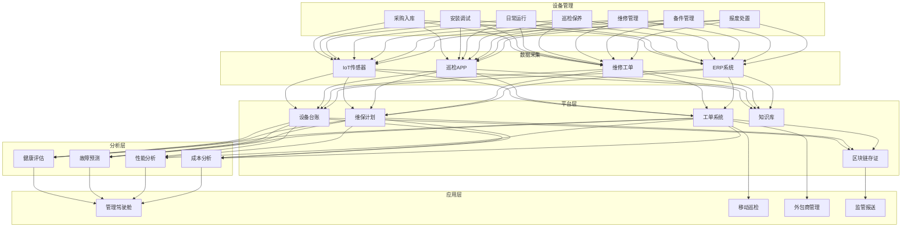
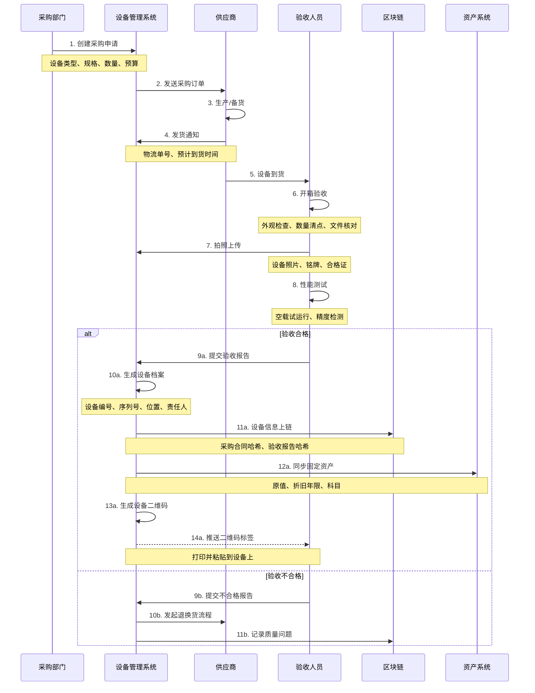
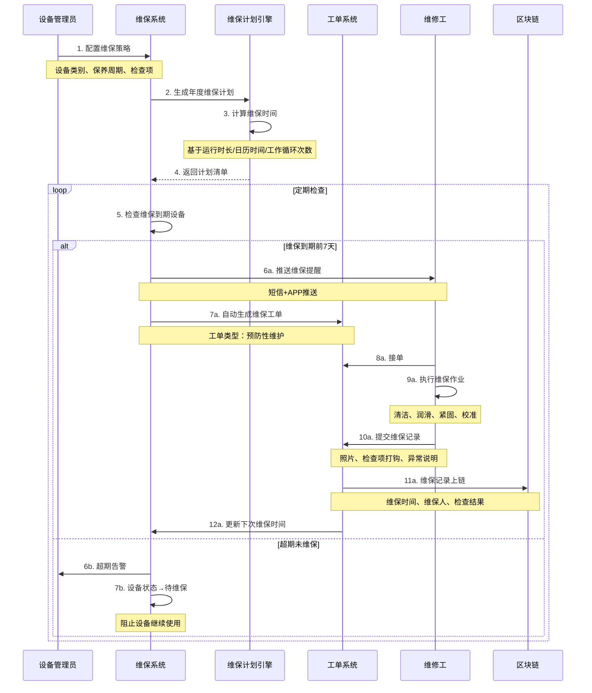
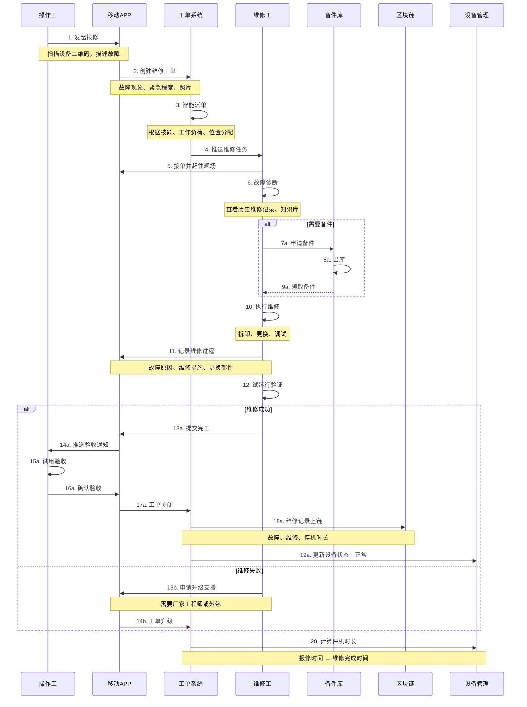
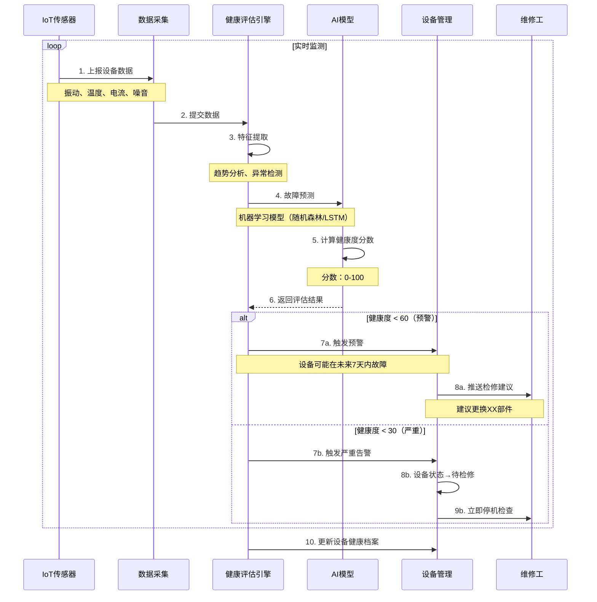

# I. 设备全生命周期与维保记录 详细方案设计

## 一、方案概述

### 1.1 业务目标
- 实现设备从采购、安装、使用、维保到报废的全生命周期数字化管理
- 建立设备维护保养的可追溯体系
- 提高设备OEE（综合设备效率）与可用率
- 降低非计划停机与维修成本

### 1.2 核心价值
- **全程追溯**：设备档案完整记录，责任可追溯
- **预防性维护**：从被动维修转向主动预防
- **合规管理**：满足特种设备监管要求
- **成本优化**：延长设备寿命，降低维保成本

---

## 二、业务架构图



---

## 三、核心业务流程

### 3.1 设备采购与入库流程



**设备档案字段清单：**

| 字段类别 | 字段名称 | 必填 | 说明 |
|---------|---------|------|------|
| 基本信息 | 设备编号 | ✓ | 唯一编码 |
| 基本信息 | 设备名称 | ✓ | 如"数控车床" |
| 基本信息 | 规格型号 | ✓ | 厂家型号 |
| 基本信息 | 序列号 | ✓ | 厂家SN |
| 采购信息 | 供应商 | ✓ | 供应商名称 |
| 采购信息 | 采购日期 | ✓ | YYYY-MM-DD |
| 采购信息 | 原值 | ✓ | 含税价格 |
| 技术参数 | 功率 | - | kW |
| 技术参数 | 重量 | - | kg |
| 位置信息 | 所属车间 | ✓ | 车间A |
| 位置信息 | 安装位置 | ✓ | A区3号工位 |
| 责任信息 | 责任部门 | ✓ | 生产部 |
| 责任信息 | 责任人 | ✓ | 张三 |

---

### 3.2 预防性维护计划流程



**维保策略示例：**

| 设备类型 | 维保级别 | 周期 | 检查项 | 执行人 |
|---------|---------|------|-------|-------|
| 数控机床 | 日常保养 | 每日 | 清洁、加油、目视检查 | 操作工 |
| 数控机床 | 一级保养 | 每月 | 润滑、紧固、校准 | 维修工 |
| 数控机床 | 二级保养 | 每季度 | 部件检查、精度检测 | 专业技师 |
| 数控机床 | 三级保养 | 每年 | 大修、更换易损件 | 厂家工程师 |
| 叉车 | 日常保养 | 每日 | 轮胎、制动、液压油 | 司机 |
| 叉车 | 定期保养 | 每500小时 | 发动机、传动系统 | 维修工 |

---

### 3.3 故障报修与维修流程



**故障分级与响应时效：**

| 故障级别 | 定义 | 响应时效 | 修复时效 |
|---------|------|---------|---------|
| 紧急 | 主线设备停机，影响生产 | 15分钟 | 2小时 |
| 重要 | 辅助设备故障，部分影响 | 30分钟 | 4小时 |
| 一般 | 设备异常，不影响生产 | 2小时 | 8小时 |
| 低优先级 | 小问题，可延后处理 | 1天 | 3天 |

---

### 3.4 设备健康度评估流程



**健康度评估指标：**

| 指标类别 | 指标名称 | 正常范围 | 预警阈值 | 权重 |
|---------|---------|---------|---------|------|
| 振动 | 振动加速度 | <2mm/s | >5mm/s | 30% |
| 温度 | 轴承温度 | <60°C | >80°C | 25% |
| 电流 | 负载电流 | 额定值±10% | 波动>20% | 20% |
| 噪音 | 分贝值 | <75dB | >85dB | 15% |
| 性能 | 加工精度 | ±0.01mm | ±0.05mm | 10% |

**健康度评分模型：**
```
健康度 = 振动评分(30%) + 温度评分(25%) + 电流评分(20%) 
       + 噪音评分(15%) + 性能评分(10%)

评级：
90-100分：优秀（绿色）
70-89分：良好（黄色）
50-69分：一般（橙色）
<50分：差（红色）- 需立即检修
```

---

## 四、核心功能模块

### 4.1 设备台账管理

**功能清单：**
1. 设备档案（一设备一档案）
2. 设备分类（按类型/部门/车间）
3. 设备树（层级结构管理）
4. 设备标签（二维码/RFID）
5. 附件管理（图纸、说明书、视频）
6. 变更记录（改造、迁移、转让）

**设备树示例：**
```
工厂
├─ 生产车间A
│  ├─ 机加工区域
│  │  ├─ 数控车床-001
│  │  ├─ 数控车床-002
│  │  └─ 加工中心-001
│  └─ 装配区域
│     ├─ 装配工作台-001
│     └─ 测试设备-001
└─ 动力车间
   ├─ 空压机-001
   ├─ 变压器-001
   └─ 冷却塔-001
```

---

### 4.2 维保计划引擎

**计划生成逻辑：**

```python
# 伪代码
def generate_maintenance_plan(equipment):
    plan = []
    
    # 基于日历时间
    if equipment.maintenance_type == "calendar":
        next_date = equipment.last_maintenance_date + timedelta(days=equipment.cycle_days)
        plan.append({
            "equipment": equipment.id,
            "type": "preventive",
            "scheduled_date": next_date,
            "tasks": equipment.maintenance_tasks
        })
    
    # 基于运行时长
    elif equipment.maintenance_type == "runtime":
        if equipment.runtime_hours >= equipment.maintenance_hours:
            plan.append({
                "equipment": equipment.id,
                "type": "preventive",
                "scheduled_date": "ASAP",
                "tasks": equipment.maintenance_tasks
            })
    
    # 基于工作循环
    elif equipment.maintenance_type == "cycle":
        if equipment.work_cycles >= equipment.maintenance_cycles:
            plan.append({
                "equipment": equipment.id,
                "type": "preventive",
                "scheduled_date": "ASAP",
                "tasks": equipment.maintenance_tasks
            })
    
    return plan
```

**维保任务模板：**

| 设备类型 | 保养项目 | 标准作业程序 | 预计工时 |
|---------|---------|------------|---------|
| 数控机床 | 润滑系统检查 | 1.检查油位<br/>2.清洁滤网<br/>3.加注润滑油 | 0.5h |
| 数控机床 | 导轨清洁 | 1.停机断电<br/>2.擦拭导轨<br/>3.涂抹润滑脂 | 1h |
| 空压机 | 空滤更换 | 1.拆卸旧空滤<br/>2.清洁安装位<br/>3.安装新空滤 | 0.3h |

---

### 4.3 知识库与专家系统

**故障知识库结构：**

```json
{
  "faultId": "FAULT-001",
  "equipment": "数控车床",
  "symptom": "主轴异响",
  "possibleCauses": [
    "轴承磨损",
    "皮带松动",
    "不平衡"
  ],
  "diagnosticSteps": [
    "1. 听声音判断异响位置",
    "2. 手动转动主轴，检查卡滞",
    "3. 检查轴承游隙",
    "4. 测量振动值"
  ],
  "solutions": [
    {
      "cause": "轴承磨损",
      "solution": "更换主轴轴承",
      "spareparts": ["轴承-NSK-7010"],
      "estimatedTime": "4小时",
      "skillRequired": "高级技师"
    }
  ],
  "relatedCases": ["CASE-123", "CASE-456"],
  "videos": ["维修视频URL"],
  "documents": ["维修手册PDF"]
}
```

**智能推荐：**
- 输入故障现象 → 推荐可能原因
- 输入设备型号 → 推荐历史案例
- 输入故障代码 → 推荐维修手册章节

---

### 4.4 备件管理模块

**功能清单：**
1. 备件库存（实时库存、安全库存、最低库存）
2. 备件申请（维修工单自动申请）
3. 采购管理（采购申请、供应商管理）
4. 出入库管理（扫码出入库）
5. 备件关联（设备-备件关系）
6. 成本分析（备件消耗统计）

**备件ABC分类：**

| 分类 | 定义 | 管理策略 |
|-----|------|---------|
| A类 | 高价值、关键备件（占80%成本） | 精确计划、及时采购、安全库存 |
| B类 | 中等价值备件 | 定期盘点、批量采购 |
| C类 | 低价值、高频备件 | 适量备货、简化流程 |

**备件与设备关联表：**

| 设备型号 | 易损件名称 | 更换周期 | 单价 | 供应商 |
|---------|----------|---------|------|-------|
| CNC-X500 | 主轴轴承 | 8000小时 | 5000元 | SKF |
| CNC-X500 | 导轨油 | 500小时 | 200元 | 壳牌 |
| CNC-X500 | 刀具 | 200件 | 50元 | 株洲钻石 |

---

## 五、IoT数据采集

### 5.1 传感器部署

| 设备类型 | 监测参数 | 传感器类型 | 采集频率 |
|---------|---------|----------|---------|
| 旋转设备 | 振动 | 加速度传感器 | 1次/秒 |
| 电机 | 电流、电压、功率 | 电流互感器 | 1次/5秒 |
| 轴承 | 温度 | 热电偶 | 1次/分钟 |
| 液压系统 | 压力 | 压力传感器 | 1次/5秒 |
| 环境 | 温湿度 | 温湿度传感器 | 1次/5分钟 |

### 5.2 数据处理

```
原始数据
    ↓
边缘计算（异常检测）
    ↓
数据聚合（1分钟均值）
    ↓
时序数据库（InfluxDB）
    ↓
实时告警 + 历史分析
```

---

## 六、系统集成接口

### 6.1 ERP系统
- 固定资产模块：资产编号、折旧
- 采购模块：备件采购订单
- 库存模块：备件出入库

### 6.2 MES系统
- 设备状态：运行/停机/维修
- 生产工单：设备占用
- OEE计算：可用率、性能率、质量率

### 6.3 特种设备监管平台
- 特种设备登记
- 定期检验报送
- 事故报告

---

## 七、KPI 指标体系

### 7.1 设备效率指标
- **OEE（综合设备效率）**：≥ **85%**
  - 可用率 = (计划运行时间 - 停机时间) / 计划运行时间
  - 性能率 = 实际产量 / 理论产量
  - 质量率 = 合格品数量 / 总产量
  
- **MTBF（平均故障间隔时间）**：≥ **500小时**
- **MTTR（平均修复时间）**：≤ **2小时**

### 7.2 维保指标
- 预防性维护占比：≥ **70%**
- 维保计划完成率：≥ **95%**
- 超期未维保设备：**0台**
- 维保及时率：≥ **90%**

### 7.3 成本指标
- 维修成本下降：**30%**（年同比）
- 备件库存周转率：≥ **4次/年**
- 非计划停机损失：下降 **50%**

---

## 八、成本与收益分析

### 8.1 建设成本
- 设备管理平台开发：80-120万元
- IoT传感器部署（100台设备）：50-80万元
- 移动端APP开发：20-30万元
- 区块链部署：25-35万元
- 实施与培训：30-50万元
- **总计**：205-315万元

### 8.2 年运营成本
- 云服务与存储：20-30万元
- 传感器维护：10-20万元
- 系统维护：20-30万元
- 人员运营：50-70万元
- **总计**：100-150万元

### 8.3 收益评估

**场景：制造企业，100台关键设备**

- **减少停机损失**：
  - 非计划停机从月均50小时 → 20小时
  - 每小时停机损失2万元
  - 节省：(50-20) × 12 × 2 = **720万元/年**

- **延长设备寿命**：
  - 预防性维护使设备寿命延长20%
  - 按设备总值5000万元，折旧10年计算
  - 价值：**500万元/年**

- **降低维修成本**：
  - 维修成本从年均200万元 → 140万元
  - 节省：**60万元/年**

**投资回收期**：约 **3-6个月**

---

## 九、典型应用场景

### 场景1：汽车制造厂
- **设备**：冲压、焊接、涂装、总装线
- **痛点**：主线设备停机影响巨大
- **方案**：IoT实时监测 + 预测性维护
- **效果**：OEE从75%提升至88%，停机时长减少60%

### 场景2：电梯维保公司
- **设备**：管理5000台电梯
- **痛点**：维保工单管理混乱，超期维保被罚
- **方案**：移动巡检 + 区块链存证
- **效果**：维保及时率100%，监管检查零问题

### 场景3：化工园区
- **设备**：特种设备（压力容器、锅炉）
- **痛点**：安全监管要求高
- **方案**：设备台账 + 定期检验管理 + 监管报送
- **效果**：特检合格率100%，安全事故0起

### 场景4：医院
- **设备**：CT、MRI等医疗设备
- **痛点**：设备故障影响诊疗，维修成本高
- **方案**：维保计划 + 厂家远程诊断
- **效果**：设备可用率从92%提升至98%

---

## 十、风险与应对

| 风险类型 | 风险描述 | 应对措施 |
|---------|---------|---------|
| 传感器故障 | 监测数据缺失 | 定期校准 + 冗余部署 |
| 维修技能不足 | 新设备维修困难 | 知识库 + 厂家培训 |
| 数据泄露 | 设备参数含商业机密 | 加密存储 + 权限控制 |
| 系统依赖 | 系统故障无法维保 | 离线模式 + 纸质备份 |
| 成本压力 | IoT改造投资大 | 分阶段实施 + ROI评估 |

---

## 十一、实施路线图

### Phase 1：台账与工单（2-3个月）
- 设备台账系统
- 维修工单系统
- 移动APP（报修、巡检）
- 基础数据录入

### Phase 2：维保计划（2-3个月）
- 维保计划引擎
- 维保任务自动生成
- 维保提醒与逾期告警
- 备件管理

### Phase 3：IoT监测（3-4个月）
- 传感器部署（关键设备）
- 数据采集与存储
- 实时监控大屏
- 异常告警

### Phase 4：智能化（6-12个月）
- 健康度评估
- 故障预测模型
- 知识库与专家系统
- 区块链存证上线

---

## 十二、交付物清单

1. 设备台账管理系统（PC端）
2. 维保计划管理系统
3. 维修工单系统
4. 备件管理系统
5. 移动端APP（iOS/Android）
6. IoT数据采集平台
7. 设备健康评估引擎
8. 知识库系统
9. 区块链存证系统
10. 数据可视化大屏
11. 设备二维码标签（可定制）
12. 对接ERP/MES接口
13. 操作手册与培训视频
14. 设备管理制度模板

---

**方案版本**：v1.0  
**最后更新**：2025-10-20  
**适用行业**：制造、化工、医疗、物业、电梯维保、能源

