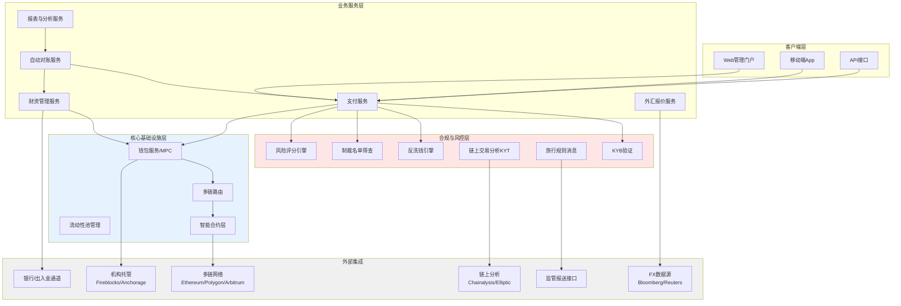
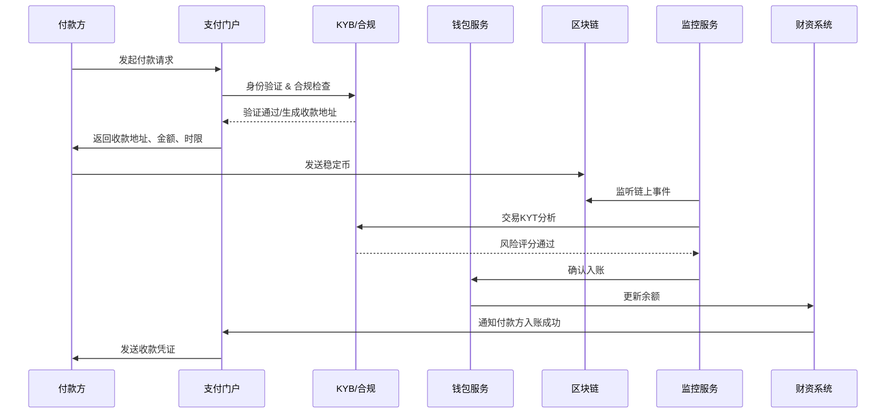
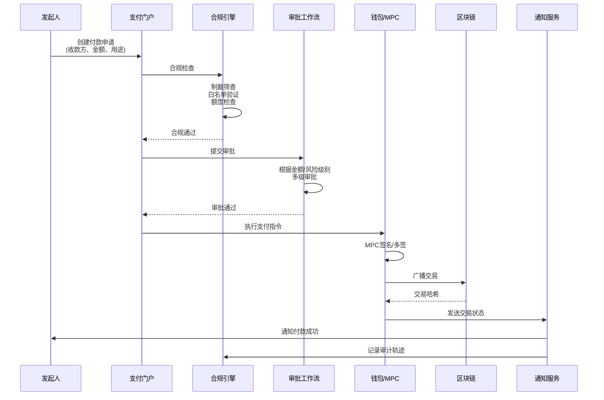
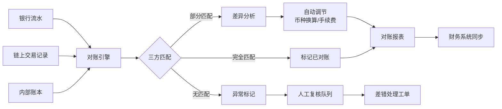
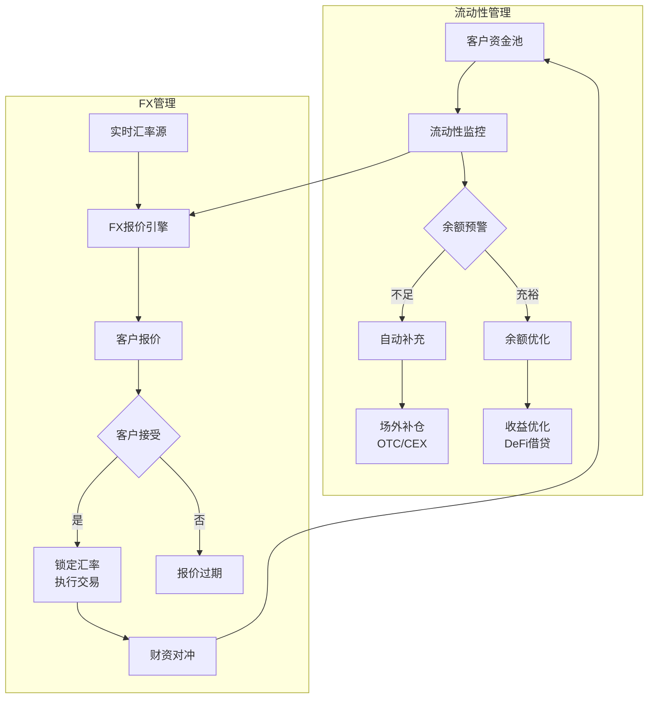

# A. 跨境稳定币支付与财资方案

## 方案概述

本方案旨在为跨境贸易企业、跨国公司、支付机构等提供基于稳定币（USDC/USDT）的跨境支付与财资管理解决方案，显著降低结算成本、加速资金周转、实现自动化对账，并满足全球主要法域的合规要求。

## 业务痛点

1. **结算成本高昂**：传统跨境电汇成本在 2-5%，中间行扣费不透明
2. **到账周期长**：T+2 至 T+5 工作日，影响资金周转效率
3. **对账复杂**：跨币种、跨时区、多银行账户，人工对账差错率高
4. **外汇波动风险**：汇率波动导致实际收付款金额不确定
5. **合规压力**：KYB、反洗钱、制裁名单筛查、旅行规则等要求日益严格

## 解决方案架构

## 核心业务流程

### 1. 收款流程（Inbound Payment）

**关键步骤说明**：
1. **付款方KYB**：验证企业身份、受益所有人、业务性质
2. **生成收款地址**：为单笔交易生成唯一地址（增强可追溯性）
3. **链上监听**：实时监控链上交易状态（Pending → Confirmed）
4. **KYT分析**：检查资金来源、混币历史、与高风险地址关联
5. **风险评分**：超阈值交易触发人工复核
6. **自动入账**：确认后自动记账，实时更新可用余额

### 2. 付款流程（Outbound Payment）

**关键步骤说明**：
1. **制裁筛查**：对照OFAC、UN、EU等制裁名单
2. **白名单验证**：仅允许向预先审核的地址付款
3. **额度控制**：单笔、日累计、月累计额度限制
4. **多级审批**：
   - < $10K：自动审批
   - $10K-$100K：部门主管审批
   - > $100K：财务总监 + CFO 审批
5. **MPC签名**：私钥分片，无单点故障
6. **交易加速**：Gas优化、失败重试、卡住交易替换

### 3. 自动对账流程

**关键逻辑**：
- **多维匹配**：交易哈希、金额、时间窗口、交易方
- **币种换算**：USDC/USDT/USD 等价换算
- **手续费处理**：Gas费、跨链桥费用自动分摊
- **差异容忍度**：<0.01% 视为匹配，>1% 触发告警
- **对账频率**：实时对账 + 日终批量对账

### 4. 流动性与外汇管理

## 核心模块说明

### 1. 支付服务模块
- **多通道收款**：支持白名单地址、单次性地址、子地址标签
- **批量打款**：CSV批量上传，一键发起批量支付
- **支付状态追踪**：Pending → Confirming → Confirmed → Settled
- **失败处理**：Gas不足、Nonce冲突、交易卡住的自动处理

### 2. 合规与风控模块
- **KYB/KYC**：企业四要素核验、受益所有人识别、业务合理性评估
- **制裁筛查**：实时对照OFAC SDN、UN、EU制裁名单
- **KYT链上分析**：交易对手风险评分、资金来源追踪、混币检测
- **旅行规则**：TRISA/IVMS-101协议，跨VASP信息交换
- **风险策略引擎**：可配置规则（国家/地区、金额、交易频率）

### 3. 钱包与密钥管理
- **MPC钱包**：私钥分片（2/3、3/5多签策略）
- **硬件签名**：支持HSM集成
- **密钥轮转**：定期密钥更新
- **紧急冻结**：异常交易的快速响应

### 4. 财资管理模块
- **多币种账本**：USDC、USDT、EURC等
- **余额监控**：实时余额、冻结金额、可用余额
- **流动性预测**：基于历史数据预测资金需求
- **收益优化**：闲置资金接入合规DeFi协议（如Aave机构池）

### 5. 对账与报表模块
- **自动对账**：三方对账（银行/链/内部账本）
- **差异报告**：未匹配交易、差错分析
- **财务报表**：日/周/月报表，支持自定义维度
- **审计导出**：交易明细、审计轨迹、凭证包

## 技术组件

### 后端技术栈
- **语言**：TypeScript（业务逻辑）、Go（高性能服务）、Rust（密码学组件）
- **框架**：NestJS / Express、gRPC（内部服务通信）
- **数据库**：
  - PostgreSQL（关系型数据）
  - TimescaleDB（时序数据，交易记录）
  - Redis（缓存、分布式锁）
- **消息队列**：Kafka（事件流）、NATS（实时通知）

### 区块链交互
- **多链支持**：Ethereum、Polygon、Arbitrum、Optimism、BSC
- **RPC节点**：自建节点 + 第三方节点（Alchemy/Infura）冗余
- **交易广播**：并行发送到多个节点，选择最快确认
- **事件监听**：WebSocket实时监听 + 轮询兜底

### 前端技术栈
- **框架**：Next.js 14（App Router）
- **钱包连接**：viem + wagmi（支持MetaMask、WalletConnect）
- **状态管理**：Zustand / TanStack Query
- **UI组件**：Tailwind CSS + shadcn/ui

### DevOps与可观测性
- **容器编排**：Kubernetes + Helm
- **IaC**：Terraform（AWS/GCP/Azure多云）
- **监控**：Prometheus + Grafana + AlertManager
- **日志**：ELK Stack / Loki
- **追踪**：OpenTelemetry + Jaeger
- **告警**：PagerDuty / Slack集成

## 合规与安全考虑

### 法域合规矩阵

| 法域 | KYB要求 | 旅行规则阈值 | 许可证要求 | 报送要求 |
|------|---------|--------------|-----------|----------|
| 美国 | 企业四要素 + BOI | $3,000 | MSB/州MTL | FinCEN SAR/CTR |
| 欧盟 | AMLD5 | €1,000 | MiCA/EMI | FIU报送 |
| 新加坡 | ACRA + UBO | S$1,500 | MAS PSA | STR/CTR |
| 香港 | TCSP/CR | HK$8,000 | VASP牌照 | JFIU报送 |
| 阿联酋 | VARA注册 | AED 3,500 | VARA许可 | goAML |

### 安全措施
1. **密钥安全**：MPC、硬件签名、密钥仪式
2. **访问控制**：RBAC、双因素认证、IP白名单
3. **数据加密**：传输加密（TLS 1.3）、存储加密（AES-256）
4. **审计日志**：不可篡改日志，7年留存
5. **渗透测试**：季度安全测试 + 年度审计
6. **事件响应**：24/7安全运营中心（SOC）、应急预案

## 交付成果与KPI

### 核心KPI

| 指标 | 目标值 | 测量方式 |
|------|--------|----------|
| 结算成本降低 | ≥60% | 对比传统电汇成本 |
| 到账时间 | T+0（<30分钟） | 从发起到确认入账 |
| 对账自动化率 | ≥95% | 自动匹配成功率 |
| 交易成功率 | ≥99.5% | 成功交易数/总交易数 |
| 合规覆盖率 | 100% | KYB/制裁筛查覆盖 |
| 系统可用性 | ≥99.9% | 月度SLA |

### 交付物清单

**第一阶段（MVP，4-6周）**
- [ ] 基础支付功能（收款/付款/查询）
- [ ] KYB与基础合规（制裁筛查、白名单）
- [ ] 单链支持（如Polygon）
- [ ] Web管理门户
- [ ] 基础监控与告警

**第二阶段（Pro，6-10周）**
- [ ] 多链支持（Ethereum、Arbitrum、Optimism）
- [ ] 自动对账模块
- [ ] FX报价与管理
- [ ] 批量支付
- [ ] 移动端App
- [ ] 高级合规（KYT、旅行规则）

**第三阶段（Enterprise，10-16周）**
- [ ] 流动性优化
- [ ] 机构托管集成
- [ ] 高级报表与BI
- [ ] API对接（ERP/财务系统）
- [ ] 多租户支持
- [ ] SLA与运营服务

### 运营支持
- **监控面板**：实时交易监控、余额预警、异常检测
- **合规更新**：季度合规审查，法规变更快速响应
- **技术支持**：工作日8小时 / 7×24紧急支持
- **培训交付**：管理员培训、用户手册、视频教程

## 成本与收益分析

### 传统跨境支付 vs 稳定币方案

| 项目 | 传统电汇 | 稳定币方案 | 改善幅度 |
|------|----------|------------|----------|
| 手续费 | 2-5% | 0.1-0.5% | **↓90%** |
| 到账时间 | T+2~T+5 | T+0（<30分钟） | **↓95%** |
| 对账成本 | 人工，2-3天/月 | 自动化，<1小时/月 | **↓95%** |
| 汇率损失 | 1-2% | 锁定汇率 | **↓100%** |

### ROI估算（年交易量$10M为例）
- **成本节省**：$200K-$400K/年（手续费）
- **效率提升**：财务人员节省50%对账时间
- **资金利用率**：T+0到账，提升资金周转效率20-30%

## 风险与应对

| 风险类型 | 描述 | 缓解措施 |
|----------|------|----------|
| 监管风险 | 各法域政策变化 | 法律顾问、合规订阅、快速适配 |
| 技术风险 | 智能合约漏洞、链拥堵 | 审计、多链策略、Gas优化 |
| 流动性风险 | 大额支付时余额不足 | 流动性监控、OTC储备、信用额度 |
| 操作风险 | 人为错误、钓鱼攻击 | 多级审批、地址白名单、安全培训 |
| 市场风险 | 稳定币脱锚 | 多币种支持、实时监控、紧急暂停 |

## 下一步行动

1. **需求确认会议**（1小时）
   - 明确业务场景（B2B支付/跨境电商/资金归集）
   - 确定目标法域与合规要求
   - 评估现有系统集成需求

2. **合规尽调**（3-5个工作日）
   - 企业主体资质审查
   - 业务合规性评估
   - 许可证/牌照需求确认

3. **技术方案设计**（1周）
   - 架构设计文档
   - 集成方案（API/Webhook）
   - 测试计划与验收标准

4. **MVP开发与测试**（4-6周）
   - 沙盒环境开发
   - 联调测试
   - 灰度试点（小额交易）

5. **正式上线**（2周）
   - 生产环境部署
   - 监控与告警配置
   - 运营支持与培训

---

**联系方式**：
- 技术咨询：[邮箱/Telegram]
- 合规咨询：[区域律所合作伙伴]
- 演示预约：24小时内安排在线Demo

