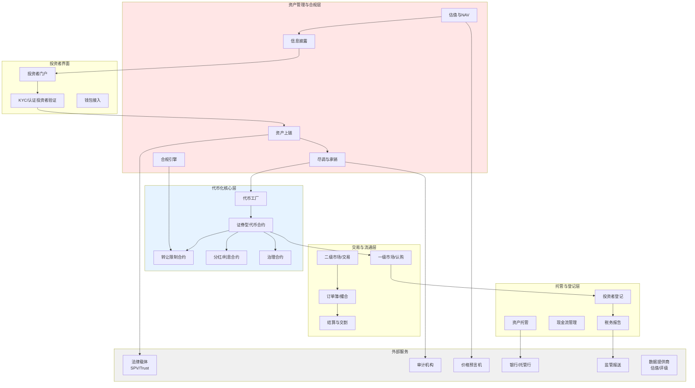
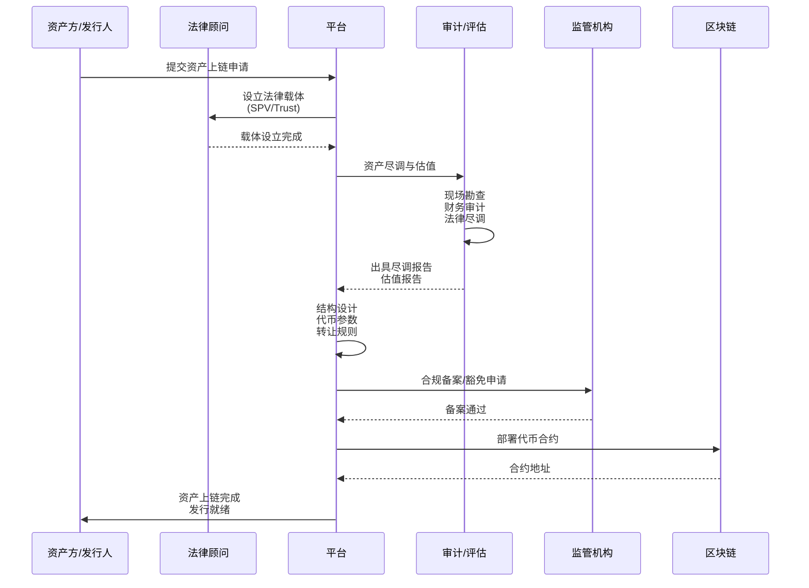
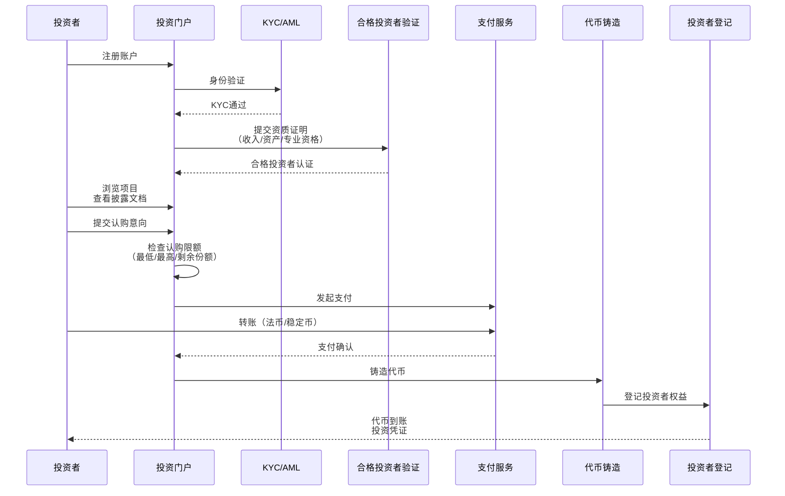
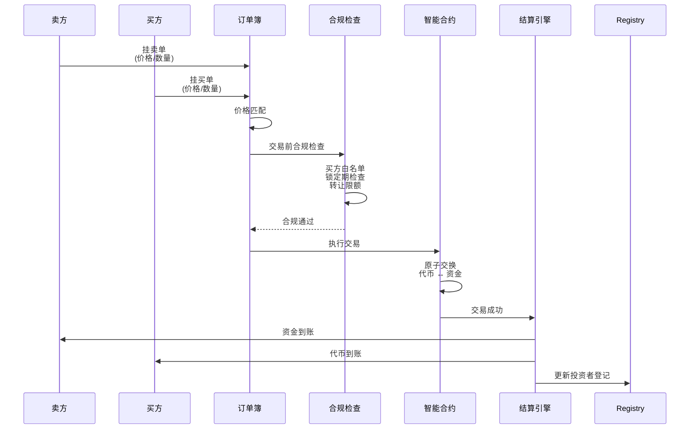
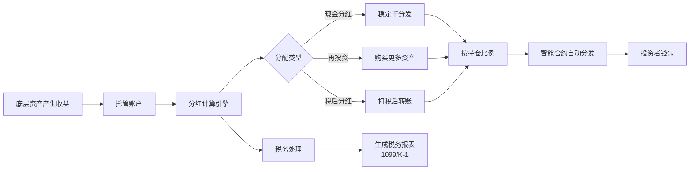
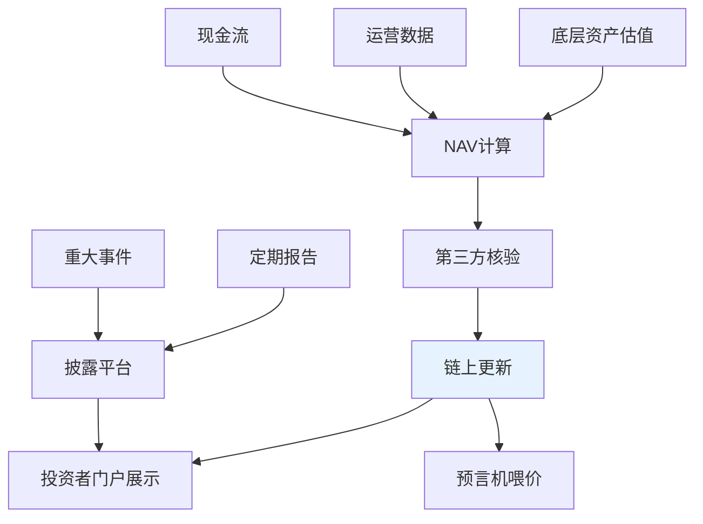
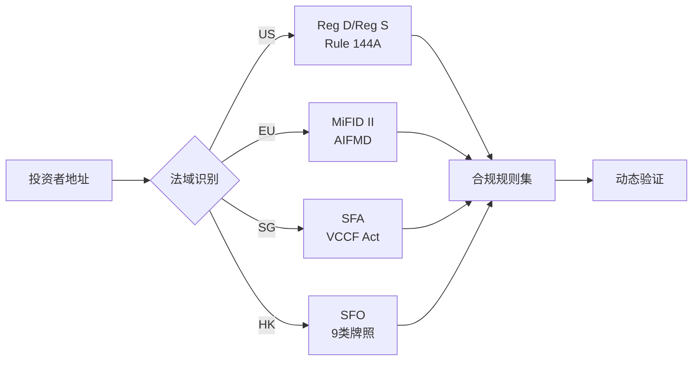

# B. RWA 代币化方案（基金、股权/不动产、应收账款）

## 方案概述

本方案为传统金融资产（房地产、私募股权、基金份额、应收账款等）提供区块链代币化解决方案，实现资产数字化确权、分拆流通、透明披露与合规交易，降低投资门槛、提升流动性、简化运营成本。

## 业务痛点

1. **流动性不足**：传统RWA持有期长、二级市场有限、退出渠道单一
2. **投资门槛高**：房地产/PE基金通常需要百万级起投，中小投资者无法参与
3. **运营成本高**：人工登记、结算、分红、转让登记等流程繁琐
4. **信息不透明**：估值、NAV更新滞后，投资者难以实时了解资产状况
5. **合规复杂**：跨境投资涉及多法域证券法、KYC/AML、税务申报等
6. **分拆困难**：传统资产难以分拆，无法实现小额投资

## 解决方案架构



## 核心业务流程

### 1. 资产上链流程



**关键环节**：

1. **法律架构设计**
   - **SPV（特殊目的载体）**：隔离资产风险，明确权益边界
   - **信托结构**：适用于不动产、艺术品等
   - **基金份额**：对接传统基金架构（LP/GP）
   - **代币权益映射**：代币↔法律权益的双向绑定

2. **尽调与估值**
   - **资产尽调**：所有权清晰、无抵押查封、合规性审查
   - **估值方法**：
     - 不动产：比较法、收益法、成本法
     - 股权：DCF、市场倍数、可比交易
     - 应收账款：账龄分析、坏账准备
   - **第三方评估**：独立评估师出具报告

3. **代币参数设置**
   - **总供应量**：根据资产估值与单位面值
   - **可分拆性**：最小交易单位（如$100）
   - **权益内容**：分红权、投票权、赎回权
   - **转让限制**：锁定期、白名单、法域限制

### 2. 投资者认购流程（一级市场）



**关键控制点**：

1. **合格投资者验证**（针对证券型代币）
   - 美国：年收入>$200K或净资产>$1M（SEC Reg D）
   - 欧盟：投资组合>€500K（MiFID II）
   - 新加坡：年收入>S$300K（SFA）
   - 香港：投资组合>HK$8M（SFO）

2. **认购限制**
   - **最低认购额**：降低小额投资者风险
   - **单一投资者上限**：避免集中度过高
   - **地域限制**：根据法域限制特定国家/地区投资者

3. **支付方式**
   - 法币：银行转账、信用卡
   - 稳定币：USDC、USDT
   - 数字资产：BTC、ETH（自动兑换）

### 3. 二级市场交易流程



**转让限制（Transfer Restrictions）**：

```solidity
// 伪代码示例（非实际代码）
function _beforeTokenTransfer(from, to, amount) {
    // 1. 锁定期检查
    require(block.timestamp > lockUntil[from], "Tokens locked");
    
    // 2. 白名单验证
    require(whitelist[to], "Recipient not whitelisted");
    
    // 3. 持仓限额
    require(balanceOf[to] + amount <= maxHolding, "Exceeds max holding");
    
    // 4. 法域限制
    require(allowedJurisdiction[getCountry(to)], "Jurisdiction restricted");
    
    // 5. 合格投资者验证
    require(isAccredited[to], "Not accredited investor");
}
```

### 4. 分红与现金流分配



**分红机制**：
- **触发条件**：季度分红、年度分红、里程碑分红
- **计算基准**：按持仓快照时间的代币余额比例
- **分发方式**：自动转账到投资者钱包（USDC/USDT）
- **税务处理**：自动扣税（如美国30%预提税）、生成税单

### 5. NAV更新与信息披露



**披露内容**：
- **NAV更新**：月度/季度
- **财务报表**：季度/年度（审计）
- **运营报告**：资产状况、租金收缴率、空置率
- **重大事件**：资产处置、法律诉讼、管理层变更

## 核心模块说明

### 1. 证券型代币（Security Token）

**标准兼容**：
- **ERC-1400**：可分区代币（Partition），支持不同类别股份
- **ERC-3643（T-REX）**：内置合规框架，身份验证与转让限制
- **ERC-1404**：受限代币转让标准

**关键功能**：
- **分区管理**：优先股/普通股、已锁定/已解锁
- **强制转让**：监管要求、法院判决、丢失私钥的恢复
- **代币暂停**：紧急情况下冻结交易
- **权限控制**：发行人、监管者、转让代理

### 2. 合规引擎

**身份验证**：
- **KYC/AML**：对接第三方KYC服务（Onfido、Jumio）
- **合格投资者认证**：收入证明、资产证明、专业资格
- **企业验证（KYB）**：工商注册、受益所有人、业务性质

**转让控制**：
- **白名单管理**：仅允许已验证投资者
- **黑名单**：制裁名单、高风险地址
- **锁定期**：私募锁定期（6-12个月）
- **持仓限额**：单一投资者上限、外资持股比例

**法域适配**：


### 3. 托管与登记

**资产托管**：
- **物理资产**：不动产产权证、艺术品保险库
- **金融资产**：托管行（如BNY Mellon）、券商托管
- **数字资产**：多签钱包、机构托管（Fireblocks）

**投资者登记**：
- **Cap Table管理**：实时股权结构、股东名册
- **转让登记**：二级市场交易的所有权变更
- **企业行动**：分红、投票、赎回的资格确认

### 4. 估值与NAV

**估值方法**：

| 资产类型 | 估值方法 | 更新频率 |
|----------|----------|----------|
| 不动产 | 租金贴现、可比物业 | 季度 |
| 私募股权 | DCF、市场倍数 | 半年度 |
| 应收账款 | 折现现金流 | 月度 |
| 基金份额 | 底层资产NAV | 月度/实时 |
| 艺术品 | 拍卖记录、专家评估 | 年度 |

**NAV计算公式**：
```
NAV = (总资产 - 总负债) / 代币总供应量
```

**链上NAV更新**：
- 链下计算 → 审计师签名 → 预言机喂价 → 链上记录
- 保留历史NAV记录，可追溯审计

## 典型应用场景

### 场景1：商业地产代币化

**资产**：某一线城市写字楼，评估值$50M  
**结构**：
- 设立SPV持有产权
- 发行5000万枚代币（每枚$1）
- 最低投资$10K（1万枚代币）
- 目标年化收益：租金收益5-7%

**收益分配**：
- 租金收入 → 扣除运营成本 → 季度分红（USDC）
- 资产增值 → 退出时一次性分配

**退出机制**：
- 5年锁定期后，发起人回购或资产出售
- 二级市场流通（流动性有限）

### 场景2：私募基金份额流通

**资产**：某PE基金，管理规模$200M，已投资10个项目  
**痛点**：传统LP锁定期10年，中途退出困难  
**方案**：
- 将LP份额代币化（需GP同意）
- 合格投资者间二级市场转让
- 分红自动分发，NAV月度更新

**合规要点**：
- 符合基金章程的转让限制
- 新LP的合格投资者验证
- GP的转让批准权

### 场景3：应收账款保理

**资产**：某供应商对大型企业的应收账款$5M，账期90天  
**方案**：
- 应收账款转让给SPV
- 发行代币，折价融资（年化12%）
- 到期收回款项，自动分红

**风险控制**：
- 债务人信用评级（如AA+）
- 应收账款真实性验证（发票、合同）
- 保理保险

## 技术组件

### 智能合约架构

```
SecurityToken.sol          # 主代币合约（ERC-1400）
├── Compliance.sol         # 合规验证模块
│   ├── WhitelistManager   # 白名单
│   ├── LockupManager      # 锁定期
│   └── JurisdictionCheck  # 法域检查
├── Dividend.sol           # 分红模块
├── Governance.sol         # 治理模块（投票）
└── ForceTransfer.sol      # 强制转让（监管需求）
```

### 后端技术栈

- **语言**：TypeScript（业务逻辑）、Solidity（智能合约）
- **框架**：NestJS、Hardhat（合约开发）
- **数据库**：PostgreSQL（投资者数据）、IPFS（披露文档）
- **队列**：Bull（异步任务，如NAV更新）

### 外部集成

- **KYC服务**：Onfido、Jumio、Sumsub
- **托管**：Fireblocks（数字资产）、BNY Mellon（传统资产）
- **预言机**：Chainlink（NAV喂价）
- **法律服务**：SPV设立、合规意见书

## 合规与监管

### 证券法合规

**美国（SEC）**：
- **Reg D**：私募豁免（Rule 506(b)/506(c)）
- **Reg S**：境外发行豁免
- **Reg A+**：小额公开发行（<$75M）

**欧盟（ESMA）**：
- **MiFID II**：金融工具指令
- **AIFMD**：另类投资基金指令
- **即将实施的MiCA**：加密资产市场法规

**新加坡（MAS）**：
- **SFA**：证券与期货法
- **VCC框架**：可变资本公司（基金结构）

**香港（SFC）**：
- **SFO**：证券及期货条例
- **第1类/第9类牌照**：证券交易/资产管理

### 反洗钱（AML）

- **KYC**：投资者身份验证
- **KYT**：链上交易监控
- **可疑交易报告（STR）**：异常交易上报
- **客户尽调（CDD）**：增强尽调（EDD）针对高风险客户

### 税务合规

| 法域 | 税务处理 | 报告要求 |
|------|----------|----------|
| 美国 | 资本利得税、分红税 | 1099-DIV、K-1（合伙企业） |
| 欧盟 | 各国差异大 | DAC6（跨境安排披露） |
| 新加坡 | 免税（特定条件） | - |
| 香港 | 免资本利得税 | - |

## 交付成果与KPI

### 核心KPI

| 指标 | 目标值 | 说明 |
|------|--------|------|
| 投资门槛降低 | ≥10倍 | 从$100K降至$10K |
| 二级市场流动性 | 日均成交量≥1% | 总流通量的1% |
| 运营成本降低 | ≥40% | vs 传统登记/结算 |
| NAV更新频率 | 月度 | vs 传统季度/半年 |
| 分红自动化 | 100% | 自动分发，T+1到账 |
| 合规覆盖率 | 100% | 所有交易经过合规验证 |

### 交付物清单

**第一阶段（MVP，6-8周）**
- [ ] 法律架构设计（SPV/Trust）
- [ ] 核心智能合约（代币、转让限制）
- [ ] 投资者门户（认购、查询）
- [ ] KYC/合格投资者验证
- [ ] 一级市场认购流程

**第二阶段（Pro，8-12周）**
- [ ] 二级市场交易（订单簿）
- [ ] 分红自动分发
- [ ] NAV更新与披露
- [ ] 治理模块（投票）
- [ ] 移动端App

**第三阶段（Enterprise，12-20周）**
- [ ] 多资产类型支持
- [ ] 机构托管集成
- [ ] 跨链支持
- [ ] 高级报表与BI
- [ ] API对接（OMS/EMS）

## 风险与应对

| 风险类型 | 描述 | 缓解措施 |
|----------|------|----------|
| 法律风险 | 代币被认定为未注册证券 | 法律意见书、合规豁免申请 |
| 估值风险 | 底层资产贬值 | 第三方独立评估、定期审计 |
| 流动性风险 | 二级市场成交清淡 | 做市商、回购承诺 |
| 托管风险 | 物理资产毁损、盗窃 | 保险、多重托管 |
| 技术风险 | 智能合约漏洞 | 审计（CertiK、OpenZeppelin）、漏洞悬赏 |

## 成功案例参考

1. **房地产代币化**（RealT）：美国底特律房产，最低$50投资，租金实时分红
2. **艺术品分拆**（Masterworks）：名画分拆，3-10年退出，年化回报8-13%
3. **私募股权流通**（Securitize）：为PE/VC基金LP提供二级市场流动性

## 下一步行动

1. **初步咨询**（1小时）
   - 确认资产类型与估值
   - 讨论法律架构选项
   - 评估目标投资者与法域

2. **法律尽调**（2-3周）
   - 资产所有权审查
   - 合规路径设计
   - 起草法律文件

3. **技术实施**（6-8周）
   - 智能合约开发与审计
   - 投资者门户搭建
   - 沙盒测试

4. **试点发行**（小额测试）
   - 邀请少数合格投资者
   - 验证全流程
   - 收集反馈优化

5. **正式发行与持续运营**
   - 大规模认购
   - NAV定期更新
   - 分红与信息披露

---

**联系方式**：
- 法律咨询：[区域律所合作伙伴]
- 技术咨询：[邮箱/Telegram]
- 演示预约：24小时内安排在线Demo

