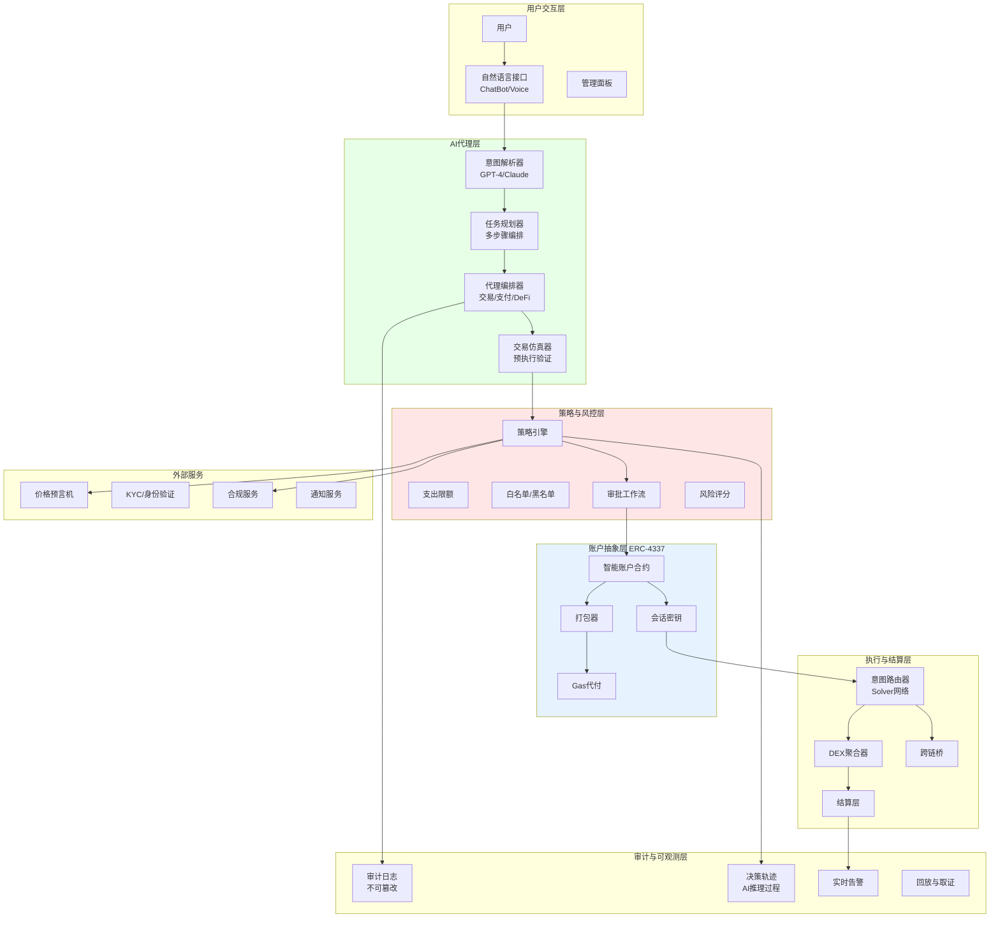
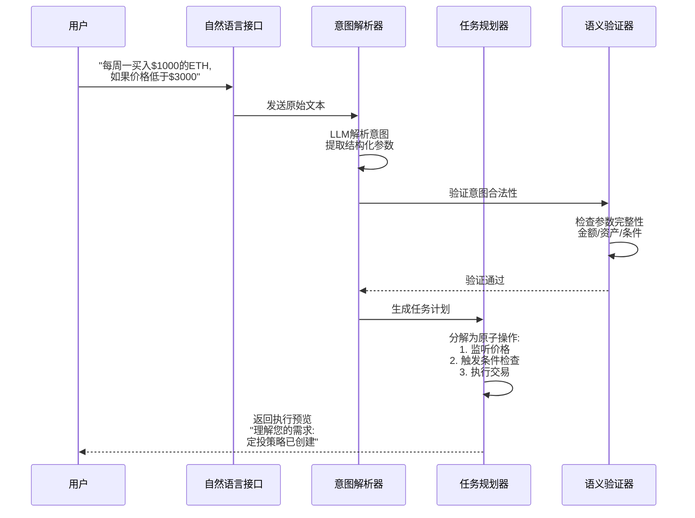
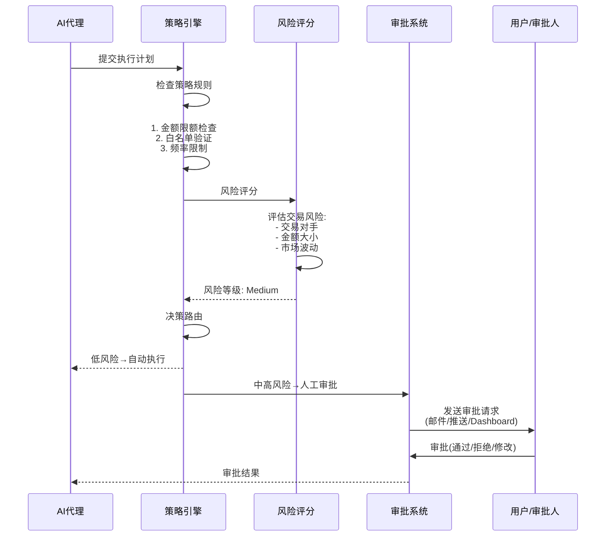
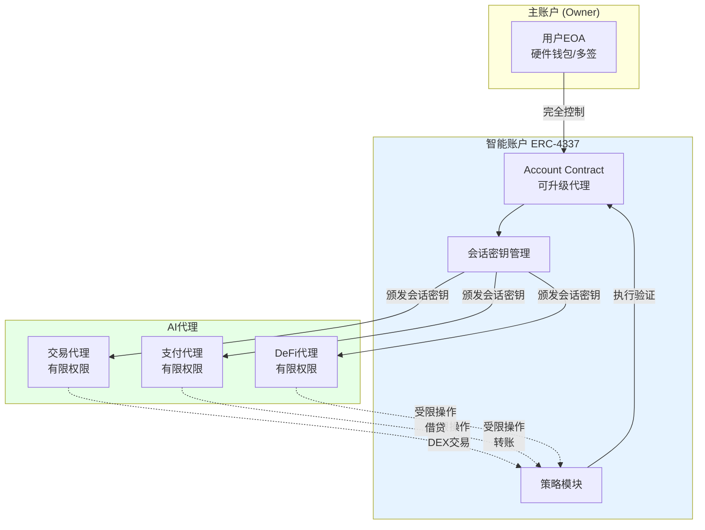
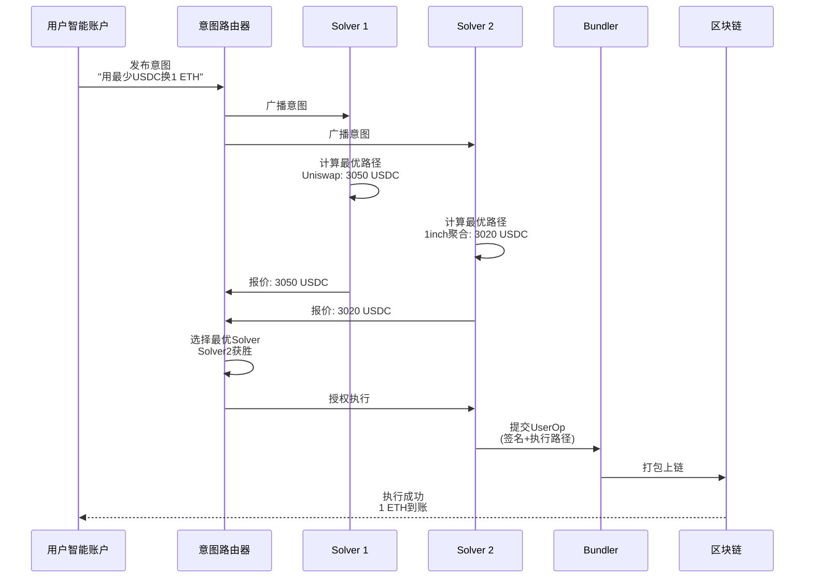
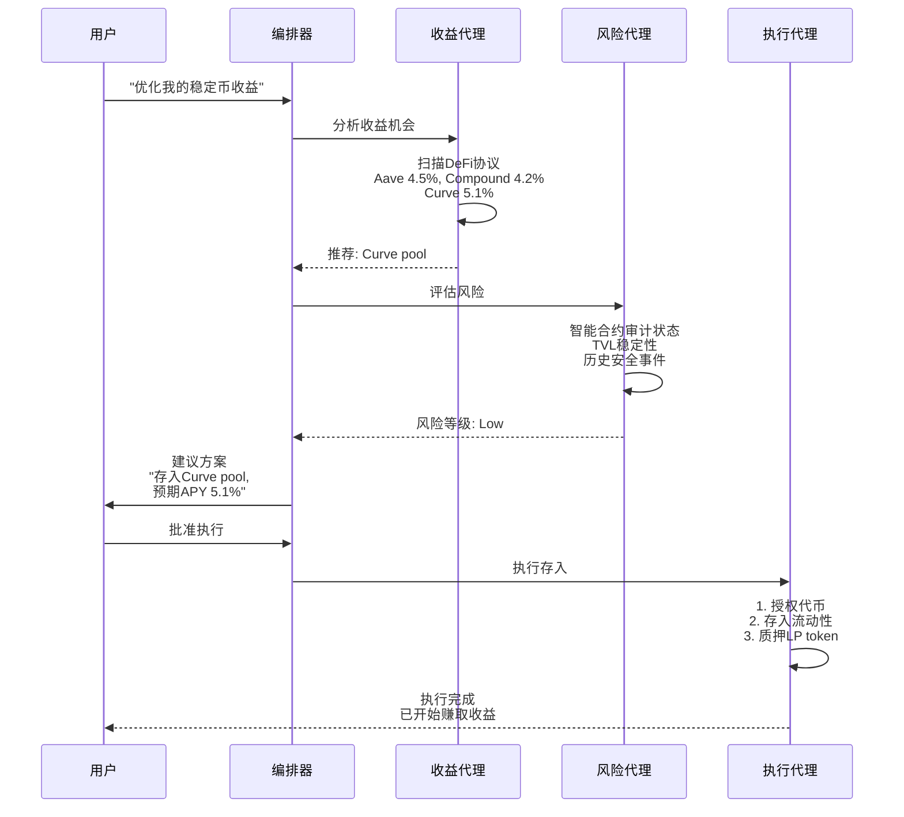

# C. AI×Crypto 代理方案（AA + 意图执行）

## 方案概述

本方案将 AI 代理（AI Agent）与账户抽象（Account Abstraction, ERC-4337）、意图式交易（Intent-Based Execution）相结合,为企业和用户提供智能化的链上操作能力。AI代理可以在严格的合规和风控框架下，自主执行交易、支付、资产管理等任务，实现"意图表达 → 自动执行 → 审计追溯"的闭环。

## 业务痛点

1. **操作复杂**：用户需要理解钱包、Gas、签名等技术细节，门槛高
2. **交易割裂**：跨链、跨协议操作需要多步手动操作，效率低
3. **缺乏智能**：无法根据市场条件自动执行（如止损、套利、定投）
4. **风险失控**：AI代理若无限制访问私钥，可能造成资金损失
5. **审计困难**：AI决策过程黑箱，难以追溯责任
6. **合规缺失**：缺少KYC、额度限制、审批流程等企业级控制

## 解决方案架构



## 核心业务流程

### 1. 意图表达与解析



**意图类型示例**：

| 用户表达 | 结构化意图 | 操作 |
|----------|------------|------|
| "把我的USDC兑换成ETH" | `{action: swap, from: USDC, to: ETH, amount: "balance"}` | 单次交易 |
| "每月15号买入$500 BTC" | `{action: recurring_buy, asset: BTC, amount: 500, schedule: "monthly:15"}` | 定投策略 |
| "ETH跌破$2800就卖出全部" | `{action: stop_loss, asset: ETH, trigger: "price < 2800", amount: "all"}` | 条件订单 |
| "把收益转到储蓄账户" | `{action: yield_harvest, destination: "savings"}` | 收益管理 |
| "支付Bob 100 USDC" | `{action: transfer, to: "bob.eth", asset: USDC, amount: 100}` | 转账支付 |

### 2. 策略评估与审批



**策略规则配置示例**：

```yaml
# 伪配置文件示例
spend_limits:
  per_transaction: 10000  # 单笔最高 $10K
  daily: 50000            # 日限额 $50K
  monthly: 500000         # 月限额 $500K

whitelists:
  addresses:
    - "0x123..." # 已验证的收款地址
  protocols:
    - "Uniswap"
    - "Aave"
    - "Compound"

approval_thresholds:
  auto_approve: 1000      # <$1K 自动
  single_approval: 10000  # $1-10K 单人
  multi_approval: 50000   # >$50K 多人

blacklists:
  high_risk_protocols: ["TornadoCash"]
  sanctioned_addresses: [...]
```

### 3. 智能账户与会话密钥



**会话密钥权限设置**：

```solidity
// 伪代码示例
struct SessionKeyPermission {
    address sessionKey;          // 会话密钥地址
    uint48 validUntil;           // 过期时间
    uint256 spendLimit;          // 支出限额
    address[] allowedContracts;  // 允许调用的合约
    bytes4[] allowedFunctions;   // 允许调用的函数
}

// 为AI交易代理颁发会话密钥
issueSessionKey({
    sessionKey: agentAddress,
    validUntil: now + 7 days,
    spendLimit: 10000 * 1e6,  // $10K USDC
    allowedContracts: [Uniswap, 1inch],
    allowedFunctions: [swap, swapExactTokensForTokens]
});
```

### 4. 意图执行与求解



**Solver网络优势**：
- **竞争机制**：多个Solver竞价，用户获得最优价格
- **路径优化**：聚合多个DEX、跨链桥，找到最佳路径
- **Gas优化**：批量打包，降低Gas成本
- **MEV保护**：私有交易池，防止抢跑

### 5. 多代理协同

```mermaid
graph LR
    A[用户意图<br/>"优化我的投资组合"] --> B[主代理<br/>Portfolio Manager]
    
    B --> C[市场分析代理<br/>评估市场趋势]
    B --> D[风险评估代理<br/>计算风险敞口]
    B --> E[交易执行代理<br/>执行再平衡]
    
    C --> F[数据源<br/>价格/新闻/链上]
    D --> G[风险模型<br/>VaR/波动率]
    E --> H[DEX/CEX]
    
    C --> I[决策汇总]
    D --> I
    E --> I
    
    I --> J[人工复核<br/>(可选)]
    J --> K[执行确认]
    
    style B fill:#e6ffe6
```

**协同案例："智能收益优化"**



## 核心模块说明

### 1. 意图解析器（Intent Parser）

**技术实现**：
- **LLM模型**：GPT-4 Turbo / Claude 3 Opus（理解复杂意图）
- **Function Calling**：结构化输出（JSON Schema）
- **Few-shot Learning**：领域示例增强准确性
- **歧义消解**：多轮对话澄清模糊意图

**解析流程**：
```
原始文本 → 分词/NER → 意图分类 → 参数提取 → 结构化输出
```

**示例**：
```json
输入: "如果ETH涨到$3500就卖出50%"
输出: {
  "action": "conditional_sell",
  "asset": "ETH",
  "trigger": {"type": "price", "operator": ">=", "value": 3500},
  "amount": {"type": "percentage", "value": 50}
}
```

### 2. 任务规划器（Task Planner）

**规划能力**：
- **多步骤编排**：复杂意图分解为原子操作
- **依赖管理**：识别操作间的先后依赖
- **回滚策略**：某步失败时的回滚方案
- **并行优化**：可并行的操作同时执行

**示例：跨链套利**
```
意图: "在Arbitrum买ETH, 转到Optimism卖出"
规划:
1. [Arbitrum] 检查USDC余额
2. [Arbitrum] Swap USDC → ETH
3. [跨链桥] 桥接ETH: Arbitrum → Optimism
4. [Optimism] Swap ETH → USDC
5. [Optimism] 桥接USDC回Arbitrum (可选)
```

### 3. 交易仿真器（Simulator）

**仿真功能**：
- **预执行**：在不上链的情况下模拟交易
- **Gas估算**：精确预测Gas消耗
- **价格滑点**：计算实际成交价
- **失败预测**：提前发现会失败的交易

**技术实现**：
- Tenderly Simulation API
- Foundry `forge test --fork`
- Hardhat forking

### 4. 策略引擎（Policy Engine）

**规则类型**：

| 策略类型 | 示例 | 检查时机 |
|----------|------|----------|
| 金额限制 | 单笔≤$10K | 执行前 |
| 频率限制 | 每小时最多3笔 | 执行前 |
| 白名单 | 仅与Uniswap交互 | 执行前 |
| 时间窗口 | 仅工作时间执行 | 执行前 |
| 地理限制 | 禁止向制裁国家转账 | 执行前 |
| 余额保护 | 保留≥$1K紧急资金 | 执行前 |
| 价格保护 | 滑点≤1% | 执行后验证 |

**动态策略更新**：
- 管理员实时修改策略
- 策略版本管理（可回滚）
- 紧急暂停开关

### 5. 审计日志（Audit Log）

**记录内容**：
```json
{
  "timestamp": "2025-10-21T10:30:00Z",
  "agent_id": "trading-agent-01",
  "user_intent": "Swap 1000 USDC to ETH",
  "parsed_intent": {...},
  "decision_trace": [
    "Step 1: Price check - ETH = $3,050",
    "Step 2: Route planning - Uniswap V3 selected",
    "Step 3: Slippage calc - 0.3%",
    "Step 4: Gas estimate - 150,000 gas"
  ],
  "risk_score": 15,
  "approval_required": false,
  "execution_result": {
    "status": "success",
    "tx_hash": "0xabc...",
    "actual_output": "0.328 ETH",
    "gas_used": 148523
  },
  "compliance_checks": {
    "kyc_verified": true,
    "sanction_check": "pass",
    "aml_score": 8
  }
}
```

**日志存储**：
- 链上存储：关键决策点的哈希（不可篡改）
- 链下存储：完整日志（IPFS / Arweave）
- 索引服务：ElasticSearch（快速查询）

## 应用场景示例

### 场景1：企业财资自动化

**需求**：跨国公司需要每月自动支付供应商款项，并优化外汇成本

**方案**：
1. 用户设置意图："每月1号支付供应商A $50K USDC"
2. AI代理监控汇率，选择最优时机兑换
3. 自动执行KYC/AML检查
4. 多级审批（财务经理+CFO）
5. 自动生成支付凭证与税务报表

**效果**：
- 人工成本降低80%
- 外汇成本优化15-20%
- 合规风险降低（100%覆盖）

### 场景2：DeFi自动化投资

**需求**：用户希望根据市场条件自动调整DeFi投资组合

**方案**：
1. 用户意图："保持50% ETH, 30% BTC, 20% 稳定币"
2. AI代理监控市场价格与组合偏离度
3. 偏离超过5%时自动再平衡
4. 优化Gas时机（低Gas时段执行）
5. 自动harvest收益并复投

**效果**：
- 组合波动率降低25%
- 收益率提升10%（相比人工）
- Gas成本降低40%

### 场景3：NFT自动化交易

**需求**：NFT收藏家希望自动狙击稀有NFT

**方案**：
1. 用户意图："监控Azuki地板价，低于5 ETH时购买"
2. AI代理实时监控OpenSea、Blur
3. 符合条件时自动出价
4. 防止Gas战（智能Gas出价策略）
5. 购买后自动挂单出售（如>6 ETH）

**效果**：
- 捕获机会时间缩短至<5秒
- 成功率提升3倍
- ROI提升40%

## 技术组件

### ERC-4337 实现

**核心合约**：
```
SmartAccount.sol           # 智能账户主合约
├── SessionKeyManager      # 会话密钥管理
├── PolicyValidator        # 策略验证
├── RecoveryModule         # 社交恢复
└── UpgradeableProxy       # 可升级代理

Bundler Service            # 打包器服务（Go/Rust）
Paymaster.sol              # Gas代付合约
EntryPoint.sol             # 入口合约（官方标准）
```

### AI技术栈

- **LLM**：OpenAI GPT-4 / Anthropic Claude / Llama 3（自托管）
- **Agent框架**：LangChain / AutoGPT / crewAI
- **向量数据库**：Pinecone / Weaviate（历史意图检索）
- **推理优化**：vLLM（低延迟推理）

### 后端技术栈

- **语言**：TypeScript（业务逻辑）、Rust（性能关键模块）
- **框架**：NestJS、Actix（Rust）
- **数据库**：PostgreSQL、Redis（缓存）
- **消息队列**：NATS（事件流）
- **调度**：Bull（定时任务）

## 合规与安全

### 合规考虑

1. **KYC/AML**：AI代理操作前验证用户身份
2. **交易监控**：异常交易模式检测（频率、金额、时间）
3. **地域限制**：禁止向制裁国家/地区转账
4. **审计轨迹**：完整记录AI决策过程
5. **数据隐私**：用户意图数据加密存储，符合GDPR

### 安全措施

1. **权限最小化**：会话密钥仅授予必要权限
2. **时间限制**：会话密钥自动过期（如7天）
3. **金额限额**：单笔/日/月限额控制
4. **异常检测**：实时监控异常行为（如短时间大量交易）
5. **紧急暂停**：用户可一键撤销所有AI代理权限
6. **多因素认证**：高风险操作需要2FA确认

### AI安全

1. **提示注入防护**：过滤恶意输入
2. **输出验证**：验证AI输出的合法性
3. **沙盒测试**：AI决策先在测试网验证
4. **人工复核**：高风险操作强制人工审批
5. **模型监控**：检测模型性能退化

## 交付成果与KPI

### 核心KPI

| 指标 | 目标值 | 说明 |
|------|--------|------|
| 意图理解准确率 | ≥95% | 正确解析用户意图 |
| 任务成功率 | ≥99% | 成功执行的任务比例 |
| 端到端延迟 | <10秒 | 从意图到执行完成 |
| Gas节省 | ≥30% | vs 手动操作 |
| 合规覆盖率 | 100% | 所有操作经过合规检查 |
| 误操作率 | <0.1% | AI错误决策导致的损失 |

### 交付物清单

**第一阶段（MVP，4-6周）**
- [ ] 基础意图解析（转账、交易）
- [ ] ERC-4337智能账户
- [ ] 基础策略引擎（金额限额、白名单）
- [ ] 单链支持（如Polygon）
- [ ] 管理面板

**第二阶段（Pro，6-10周）**
- [ ] 高级意图（条件订单、定投、止损）
- [ ] 多代理协同
- [ ] 交易仿真与优化
- [ ] 多链支持
- [ ] 审批工作流

**第三阶段（Enterprise，10-16周）**
- [ ] 企业级策略管理
- [ ] 完整审计系统
- [ ] 合规报告自动化
- [ ] API对接（ERP/财务系统）
- [ ] 高级AI能力（市场分析、风险预测）

## 风险与应对

| 风险类型 | 描述 | 缓解措施 |
|----------|------|----------|
| AI决策错误 | LLM理解偏差导致错误操作 | 仿真测试、人工复核、小额试运行 |
| 权限滥用 | 会话密钥被盗用 | 时间/金额限制、异常检测、紧急撤销 |
| 合约漏洞 | 智能账户合约被攻击 | 审计、形式化验证、漏洞悬赏 |
| Oracle失效 | 价格数据异常导致错误决策 | 多数据源、异常值检测、熔断机制 |
| 网络故障 | 交易卡住或失败 | 自动重试、失败回滚、状态恢复 |

## 下一步行动

1. **需求确认**（1小时）
   - 明确应用场景（企业财资/个人投资/DeFi自动化）
   - 确定核心意图类型
   - 评估风险承受能力

2. **策略设计**（1周）
   - 设计权限模型
   - 制定审批流程
   - 配置策略规则

3. **技术实施**（4-6周）
   - 智能账户开发与审计
   - AI代理开发与测试
   - 集成测试

4. **试点运行**（小额测试）
   - 沙盒环境测试
   - 真实场景小额验证
   - 收集反馈优化

5. **正式上线**
   - 生产环境部署
   - 监控与告警配置
   - 用户培训与文档

---

**联系方式**：
- 技术咨询：[邮箱/Telegram]
- 演示预约：24小时内安排在线Demo
- 开源参考：[GitHub示例代码]

