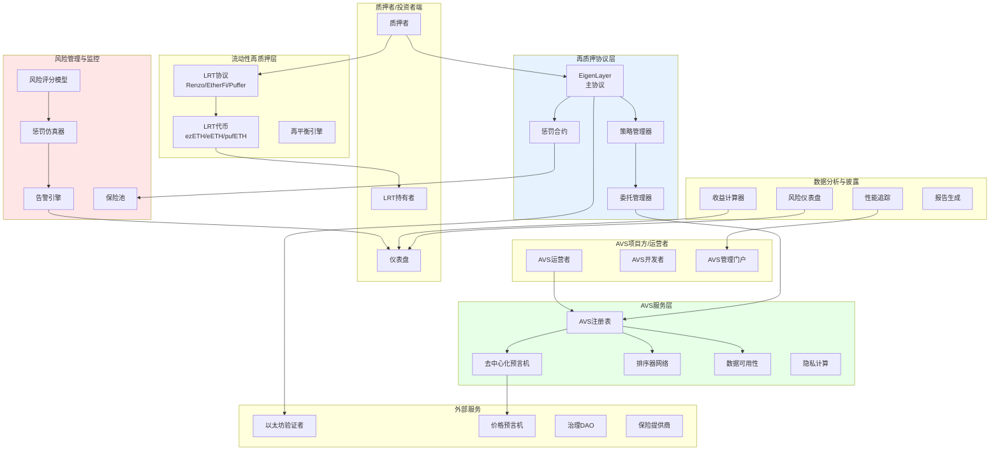
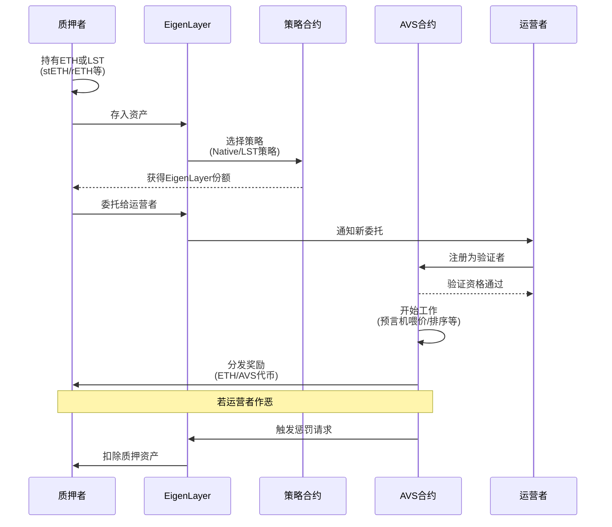
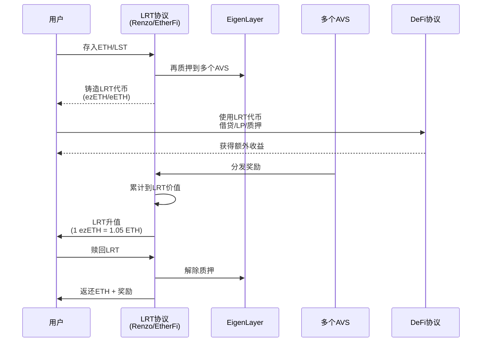
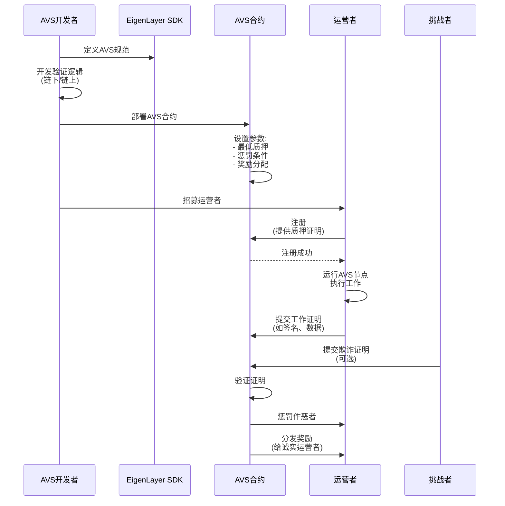
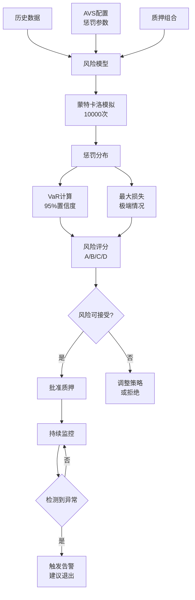
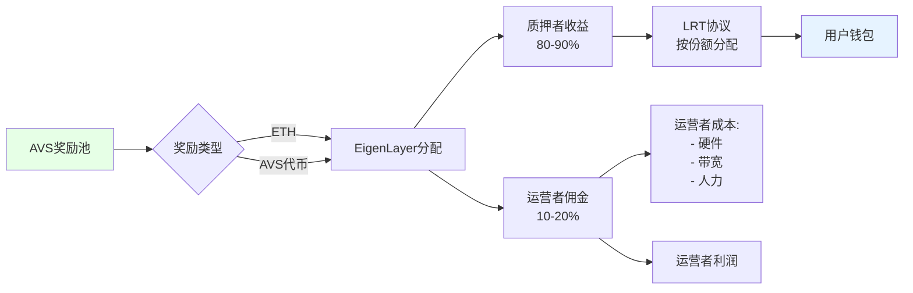

# D. 再质押与 AVS 赋能方案

## 方案概述

本方案基于 EigenLayer 等再质押（Restaking）协议，帮助企业和项目方利用以太坊的经济安全性构建主动验证服务（AVS, Actively Validated Services），或帮助质押者通过再质押获取额外收益。涵盖流动性再质押代币（LRT）接入、风险管理、AVS适配、惩罚仿真等全链路能力。

## 业务痛点

1. **冷启动困难**：新区块链/中间件需自建验证者网络，成本高、周期长
2. **安全性不足**：小规模网络易受攻击，质押价值低导致作恶成本低
3. **资本效率低**：ETH质押者资金锁定，无法参与其他协议获取收益
4. **运营复杂**：运行验证者节点需要技术能力、硬件投入、持续维护
5. **惩罚风险**：再质押增加额外惩罚风险，缺少风险量化工具
6. **信息不透明**：AVS收益、惩罚条件、运营状态缺乏透明披露

## 解决方案架构



## 核心业务流程

### 1. 再质押流程（Restaking）



**关键环节**：

1. **原生再质押 vs LST再质押**

| 类型 | 描述 | 优势 | 劣势 |
|------|------|------|------|
| 原生再质押 | 直接质押ETH到EigenLayer Pod | 无中间代币风险 | 需运行验证者节点 |
| LST再质押 | 质押stETH/rETH等LST | 操作简单，保留流动性 | 额外智能合约风险 |

2. **委托（Delegation）**
   - 质押者将再质押权益委托给专业运营者
   - 运营者负责运行AVS验证者节点
   - 收益按比例分成（如运营者收取10%管理费）

3. **AVS注册**
   - 运营者需满足AVS最低质押要求（如1000 ETH）
   - 提供服务保证金（Slashable Stake）
   - 配置硬件节点，开始工作

### 2. 流动性再质押（LRT）流程



**LRT优势**：
- **流动性**：无需锁定期，随时交易
- **收益叠加**：再质押收益 + DeFi收益
- **风险分散**：协议自动分散到多个AVS
- **简化操作**：无需手动管理委托

**风险**：
- **智能合约风险**：LRT协议本身的合约漏洞
- **脱锚风险**：LRT价格偏离其底层资产（如1 ezETH ≠ 1 ETH）
- **流动性风险**：大量赎回时可能需要等待解除质押

### 3. AVS开发与部署流程



**AVS类型示例**：

1. **去中心化预言机**
   - 运营者从多个数据源获取价格
   - 聚合并提交到链上
   - 惩罚条件：提交明显错误的价格

2. **排序器网络**（如Rollup Sequencer）
   - 运营者负责交易排序
   - 保证活性与公平性
   - 惩罚条件：审查交易、宕机

3. **数据可用性层**
   - 运营者存储并证明数据可用
   - 响应数据检索请求
   - 惩罚条件：数据丢失、不响应

4. **隐私计算**（MPC/TEE）
   - 运营者执行安全多方计算
   - 保证隐私与正确性
   - 惩罚条件：泄露隐私、计算错误

5. **桥接器/跨链消息传递**
   - 运营者中继跨链消息
   - 验证源链状态
   - 惩罚条件：伪造消息

### 4. 惩罚仿真与风险评估



**风险指标**：

```
风险评分 = f(
    AVS代码审计评分,
    运营者历史表现,
    质押集中度,
    惩罚条件严苛度,
    保险覆盖率
)
```

**风险分级**：

| 等级 | 评分 | 最大潜在损失 | 建议操作 |
|------|------|--------------|----------|
| A（低风险） | 80-100 | <5%质押资产 | 推荐质押 |
| B（中风险） | 60-79 | 5-15% | 适度质押 |
| C（高风险） | 40-59 | 15-30% | 小额测试 |
| D（极高风险） | <40 | >30% | 不建议质押 |

### 5. 收益分配流程



**收益来源**：
1. **AVS奖励**：AVS协议发放的原生代币
2. **用户付费**：使用AVS服务的手续费（如预言机查询费）
3. **MEV**：排序器捕获的MEV收益
4. **协议补贴**：早期AVS的激励计划

**APY计算**：
```
APY = (AVS奖励 + 服务费收入 - 运营成本 - 潜在惩罚损失) / 质押TVL
```

## 核心模块说明

### 1. 策略管理器（Strategy Manager）

**功能**：
- **多AVS组合**：自动分配质押到多个AVS（分散风险）
- **动态再平衡**：根据收益/风险调整配置
- **阈值管理**：设置单个AVS的最大质押比例（如≤20%）

**策略示例**：
```json
{
  "strategy_name": "Balanced Risk",
  "allocation": [
    {"avs": "EigenDA", "weight": 30, "max_exposure": 40},
    {"avs": "Hyperlane", "weight": 25, "max_exposure": 30},
    {"avs": "AltLayer", "weight": 20, "max_exposure": 25},
    {"avs": "Omni Network", "weight": 15, "max_exposure": 20},
    {"avs": "Lagrange", "weight": 10, "max_exposure": 15}
  ],
  "rebalance_threshold": 5,  // 偏离5%时触发再平衡
  "min_apy": 3.5,            // 低于3.5%时考虑退出
  "max_slashing_risk": 10    // 单个AVS最大惩罚风险≤10%
}
```

### 2. 惩罚模拟器（Slashing Simulator）

**输入参数**：
- AVS惩罚条件与概率
- 运营者历史表现
- 质押金额与期限

**输出**：
- 预期惩罚金额（Expected Slashing）
- VaR（Value at Risk）：95%置信度下的最大损失
- CVaR（Conditional VaR）：极端情况下的平均损失

**示例**：
```
输入: 质押1000 ETH到预言机AVS, 期限1年
输出:
- 预期惩罚: 5 ETH (0.5%)
- VaR(95%): 50 ETH (5%)
- CVaR: 150 ETH (15%)
- 建议: 风险可控，建议购买保险覆盖尾部风险
```

### 3. AVS注册与发现

**注册表功能**：
- **AVS元数据**：名称、描述、官网、审计报告
- **经济参数**：最低质押、当前APY、惩罚条件
- **技术要求**：硬件规格、带宽、存储
- **运营者列表**：已注册运营者及其声誉评分

**发现与筛选**：
```
用户筛选条件:
- APY > 5%
- 风险评分 ≥ B
- TVL > $10M (成熟度指标)
- 审计: CertiK/OpenZeppelin
- 惩罚历史: 无重大事故

返回推荐AVS列表
```

### 4. 运营者管理

**运营者职责**：
- 运行AVS验证者节点（高可用、低延迟）
- 及时响应AVS工作请求
- 保持节点在线率（如>99%）
- 升级软件（安全补丁、协议更新）

**运营者评分**：
```
评分 = f(
    在线率,
    响应速度,
    惩罚历史,
    管理的总质押量,
    社区声誉
)
```

**激励对齐**：
- 运营者自身也需质押（Self-stake）
- 佣金与表现挂钩（表现差则降低佣金率）
- 惩罚优先扣除运营者自有质押

### 5. 保险池

**保险机制**：
- 质押者可购买保险，覆盖惩罚损失
- 保费基于风险评分（高风险AVS保费更高）
- 惩罚事件发生时，保险池自动赔付

**保险池资金来源**：
- 质押者支付的保费
- 协议收入的一部分
- 流动性提供者（LP）的资本（赚取保费收益）

**示例**：
```
质押1000 ETH, 年化保费2%
→ 支付20 ETH保费
→ 若发生惩罚≤100 ETH, 全额赔付
→ 净成本: APY - 保费率
```

## 应用场景示例

### 场景1：LRT协议运营

**项目方**：构建LRT协议，吸引用户存入ETH/LST

**方案**：
1. 接入EigenLayer，支持再质押
2. 自动分配到10+个AVS（分散风险）
3. 发行LRT代币（如ezETH）
4. 对接DeFi协议（Aave、Curve），提供流动性
5. 实时披露APY、风险评分、AVS组合

**收益模型**：
- 协议收取1-2%管理费
- 用户获得再质押收益（5-10% APY）
- LRT代币在DeFi中获得额外收益（2-5%）

### 场景2：企业运营AVS

**项目方**：开发去中心化预言机，需要验证者网络

**方案**：
1. 开发AVS合约与链下验证者软件
2. 设置经济参数（最低质押、奖励、惩罚）
3. 通过EigenLayer招募运营者
4. 利用以太坊的经济安全性（$10B+）
5. 快速启动，无需自建质押网络

**成本对比**：
- 传统方式：自建网络，需$100M+ TVL，耗时6-12个月
- EigenLayer方式：租用安全性，1-2个月启动，初期成本<$1M

### 场景3：机构参与再质押

**机构**：持有大量ETH的基金/公司，希望提高收益

**方案**：
1. 尽调AVS风险（审计、运营者、惩罚历史）
2. 分配10-20%的ETH到再质押
3. 选择低风险AVS（风险评分A/B）
4. 购买保险覆盖尾部风险
5. 定期监控，动态调整

**收益提升**：
- 原ETH质押: 3.5% APY
- 再质押: +3-7% APY
- 总收益: 6.5-10.5% APY
- 风险: 小幅增加，但通过分散和保险可控

## 技术组件

### 智能合约架构

```
EigenLayerCore.sol          # 核心协议
├── StrategyManager.sol     # 策略管理
├── DelegationManager.sol   # 委托管理
├── Slasher.sol             # 惩罚执行
└── AVSDirectory.sol        # AVS注册表

AVSContract.sol             # AVS示例合约
├── OperatorRegistry        # 运营者注册
├── TaskManager             # 任务分配
├── RewardsDistributor      # 奖励分发
└── ChallengeSystem         # 挑战机制

LRTProtocol.sol             # LRT协议
├── Deposit                 # 存款
├── Withdrawal              # 取款
├── RebalanceEngine         # 再平衡
└── YieldAccumulator        # 收益累积
```

### 链下基础设施

**运营者节点**：
- AVS验证者软件（Go/Rust）
- 监控与告警（Prometheus/Grafana）
- 自动故障转移（热备节点）

**风险引擎**：
- 历史数据采集（The Graph）
- 风险模型（Python/NumPy）
- 实时告警（WebSocket推送）

### 技术栈

- **合约**：Solidity
- **链下验证者**：Go、Rust
- **风险分析**：Python（pandas、numpy、scipy）
- **监控**：Prometheus、Grafana、AlertManager
- **数据索引**：The Graph（查询历史事件）

## 合规与风险披露

### 风险披露要求

1. **智能合约风险**：EigenLayer、AVS、LRT协议的合约风险
2. **惩罚风险**：可能的惩罚场景与历史数据
3. **运营者风险**：运营者作恶或失职的风险
4. **流动性风险**：LRT脱锚、解除质押等待期
5. **系统性风险**：以太坊网络风险、大规模惩罚事件

### 合规考虑

- **证券法**：LRT代币可能被视为证券（需法律意见）
- **托管要求**：机构客户可能需要合规托管
- **税务**：再质押收益的税务处理
- **披露**：定期披露风险、收益、惩罚事件

## 交付成果与KPI

### 核心KPI

| 指标 | 目标值 | 说明 |
|------|--------|------|
| APY提升 | +3-7% | vs 单纯ETH质押 |
| 惩罚率 | <1% | 年化惩罚损失/总质押 |
| 在线率 | >99.5% | 运营者节点在线时间 |
| 风险评分准确性 | >85% | 预测与实际惩罚的相关性 |
| 用户增长 | 3个月内TVL达$50M | LRT协议吸引力 |

### 交付物清单

**对于质押者/LRT协议**（6-8周）
- [ ] LRT智能合约（存款、取款、收益分配）
- [ ] 多AVS集成
- [ ] 风险仪表盘（实时APY、风险评分）
- [ ] 自动再平衡策略
- [ ] 用户前端（存款、查询、赎回）

**对于AVS项目方**（8-12周）
- [ ] AVS合约开发（任务管理、奖励、惩罚）
- [ ] 运营者节点软件
- [ ] EigenLayer集成（注册、验证者管理）
- [ ] 监控与告警系统
- [ ] 文档与运营者手册

**对于运营者**（4-6周）
- [ ] 节点部署脚本（Docker/K8s）
- [ ] 监控面板
- [ ] 自动化工具（重启、升级、备份）
- [ ] 收益与成本追踪

## 风险与应对

| 风险类型 | 描述 | 缓解措施 |
|----------|------|----------|
| 智能合约漏洞 | EigenLayer/AVS合约被攻击 | 多轮审计、形式化验证、漏洞悬赏 |
| 大规模惩罚事件 | 多个运营者同时被罚 | 分散质押、保险、紧急退出机制 |
| LRT脱锚 | 赎回挤兑导致LRT价格<ETH | 流动性储备、赎回限流、熔断机制 |
| AVS作恶 | AVS恶意惩罚诚实运营者 | 治理审查、争议解决、退出权 |
| 运营者集中化 | 少数运营者控制大量质押 | 去中心化激励、小运营者补贴 |

## 成功案例参考

1. **EigenDA**：数据可用性层，已有$2B+ TVL
2. **AltLayer**：Rollup-as-a-Service，使用EigenLayer的快速最终性
3. **Hyperlane**：跨链消息传递，通过再质押保障安全
4. **Renzo Protocol**：LRT协议，ezETH已达$1.5B TVL

## 下一步行动

1. **需求确认**（1小时）
   - 明确角色（质押者/AVS项目方/运营者）
   - 评估风险承受能力
   - 确定目标收益

2. **技术评估**（1-2周）
   - AVS技术可行性分析
   - 运营者节点硬件/网络要求
   - 智能合约设计

3. **实施开发**（6-12周）
   - 智能合约开发与审计
   - 链下基础设施搭建
   - 测试网试运行

4. **主网启动**
   - 小额试点（1-10 ETH）
   - 逐步扩大规模
   - 持续监控优化

---

**联系方式**：
- 技术咨询：[邮箱/Telegram]
- AVS合作：[商务邮箱]
- 演示预约：24小时内安排在线Demo

