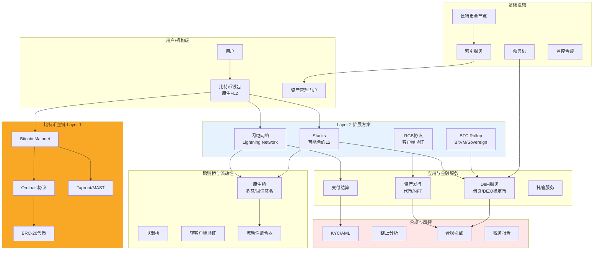
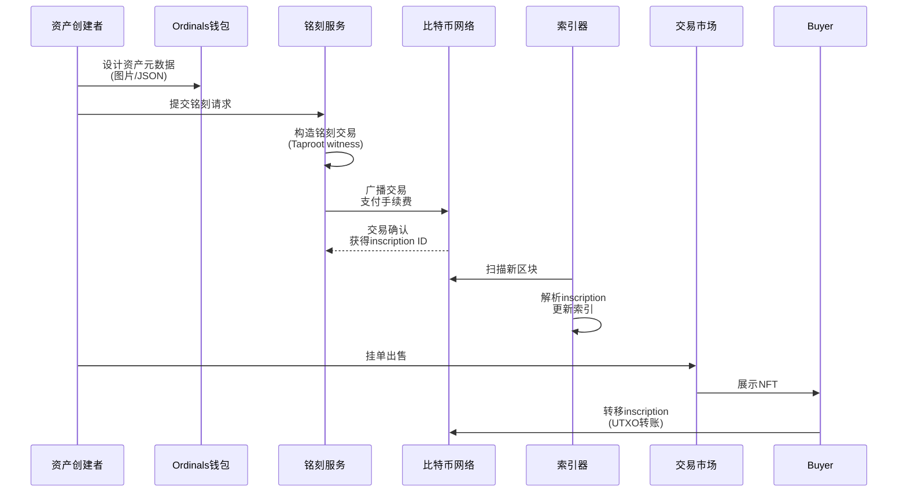
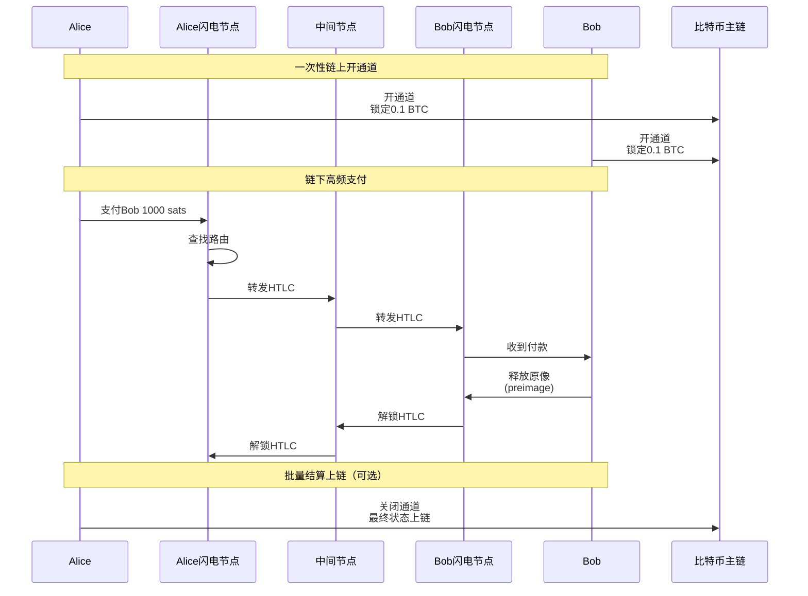
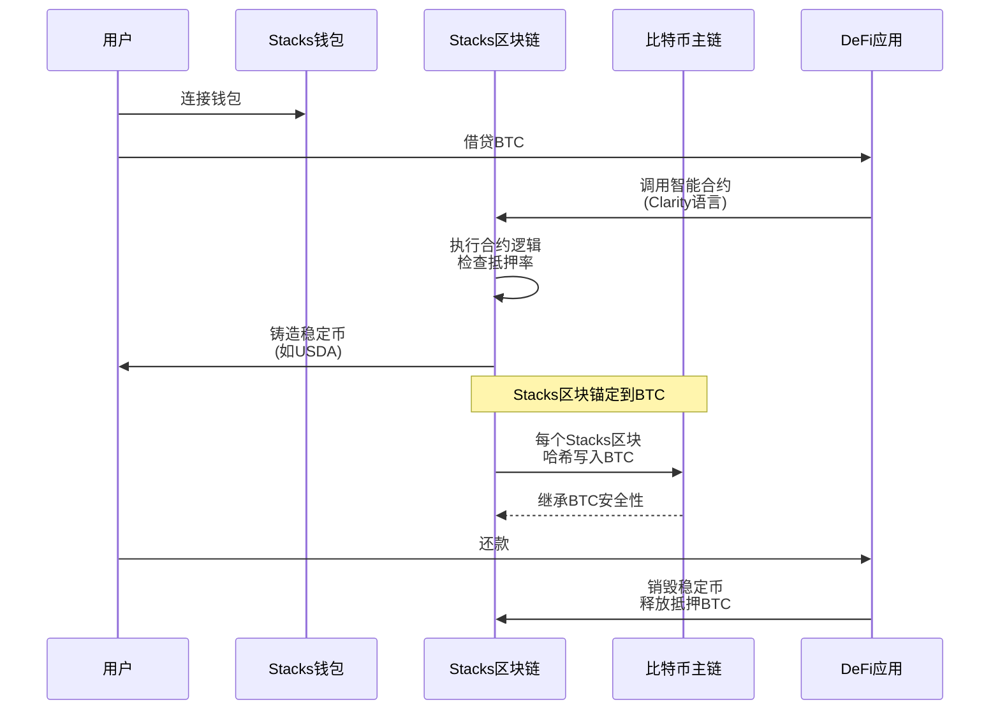
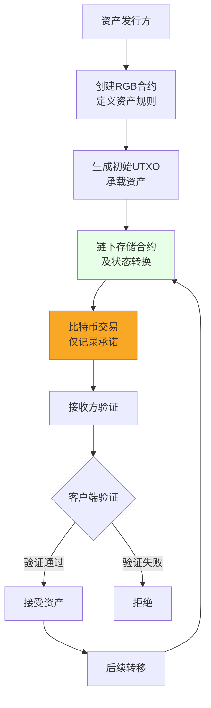
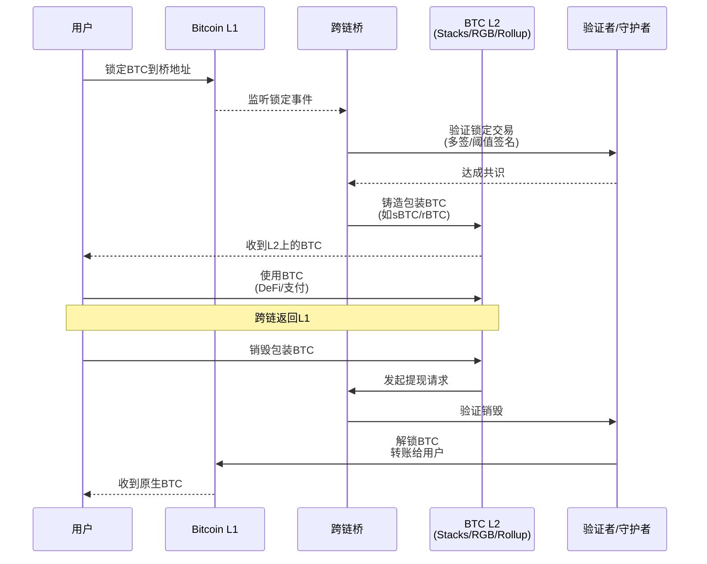

# E. BTC 生态方案（L2 / Ordinals / 原生金融）

## 方案概述

本方案为比特币生态提供全栈解决方案，涵盖 BTC Layer 2（如Lightning Network、Stacks、RGB）、Ordinals/BRC-20资产发行、比特币原生DeFi等场景，帮助用户和机构在保留比特币安全性的同时，实现可编程性、资产发行与金融应用。

## 业务痛点

1. **可编程性不足**：比特币脚本功能有限，难以实现复杂智能合约
2. **扩展性瓶颈**：主链TPS低（~7 TPS）、手续费高、确认慢（~10分钟）
3. **资产发行复杂**：缺乏原生代币标准，Ordinals/BRC-20操作门槛高
4. **流动性割裂**：BTC在不同L2间无法互通，流动性分散
5. **托管风险**：跨链桥方案（如WBTC）依赖中心化托管，信任假设强
6. **合规空白**：比特币金融应用缺乏KYC/AML等合规框架

## 解决方案架构



## 核心业务流程

### 1. Ordinals/BRC-20 资产发行



**Ordinals原理**：
- 利用Taproot升级，将数据嵌入见证脚本（witness）
- 每个聪（satoshi）有唯一序号，追踪聪的转移即追踪NFT
- 无需侧链或代币，纯比特币原生方案

**BRC-20代币发行**：
```json
// 部署（Deploy）
{
  "p": "brc-20",
  "op": "deploy",
  "tick": "ordi",
  "max": "21000000",
  "lim": "1000"
}

// 铸造（Mint）
{
  "p": "brc-20",
  "op": "mint",
  "tick": "ordi",
  "amt": "1000"
}

// 转账（Transfer）
{
  "p": "brc-20",
  "op": "transfer",
  "tick": "ordi",
  "amt": "100"
}
```

**挑战与解决方案**：

| 挑战 | 解决方案 |
|------|----------|
| 手续费高（高峰期>$50/笔） | 批量铭刻、低峰期执行 |
| 确认慢（~10分钟） | 支付高额手续费加速 |
| 索引器依赖 | 运行自有索引器 + 多源验证 |
| 流动性分散 | 聚合多个市场（Unisat/Magic Eden） |

### 2. 闪电网络支付流程



**闪电网络优势**：
- **高TPS**：理论无上限，实际>1M TPS
- **低手续费**：<1 sat/笔，约$0.0003
- **即时确认**：<1秒
- **隐私性**：链下交易不公开

**企业级闪电网络应用**：
1. **跨境微支付**：汇款、打赏、订阅
2. **供应链结算**：高频小额供应商支付
3. **游戏内支付**：道具购买、奖励发放
4. **流媒体计费**：按秒计费的视频/音频流

### 3. Stacks智能合约与DeFi



**Stacks特性**：
- **Proof of Transfer (PoX)**：矿工支付BTC参与共识
- **Clarity智能合约**：可判定性（无图灵完备陷阱）、可读性强
- **BTC结算**：每个Stacks区块锚定到BTC，继承安全性
- **sBTC**：无需信任的BTC锚定资产（开发中）

**Stacks DeFi生态**：
1. **借贷**：Arkadiko（超额抵押BTC铸造稳定币）
2. **DEX**：ALEX（自动做市商）
3. **NFT**：Gamma（NFT交易市场）
4. **稳定币**：USDA（算法稳定币）

### 4. RGB协议资产发行



**RGB特性**：
- **客户端验证**：状态转换链下执行，仅哈希上链
- **极致隐私**：交易细节仅交易双方可见
- **扩展性强**：不受比特币区块大小限制
- **资产多样性**：可发行代币、NFT、稳定币、债券等

**应用场景**：
1. **私募股权**：非公开转让，隐私性强
2. **供应链金融**：票据、应收账款代币化
3. **合规稳定币**：链下合规检查，链上仅记录承诺

### 5. BTC L2跨链桥接



**桥接方案对比**：

| 方案 | 信任假设 | 速度 | 成本 | 安全性 |
|------|----------|------|------|--------|
| 联盟多签 | 信任多签成员 | 快 | 低 | 中 |
| 阈值签名(MPC) | 信任阈值>2/3 | 快 | 低 | 中高 |
| 轻客户端验证 | 最小化信任 | 慢 | 高 | 高 |
| BitVM | 无需信任 | 慢 | 高 | 最高 |

**BitVM方案**（未来方向）：
- 在比特币上实现图灵完备计算（链下）
- 欺诈证明：挑战者可证明计算错误
- 无需信任：纯密码学保证

## 核心模块说明

### 1. 比特币钱包服务

**功能**：
- **多地址类型**：Legacy、SegWit、Taproot（推荐）
- **UTXO管理**：智能选币、手续费优化
- **Ordinals支持**：铭刻、转移、查询
- **闪电网络**：开通道、支付、关闭通道
- **多链支持**：同时管理L1和多个L2

**技术实现**：
```typescript
// 伪代码示例
class BTCWalletService {
  // Taproot地址生成
  generateTaprootAddress(publicKey): string
  
  // Ordinals铭刻
  inscribeData(data: Buffer, feeRate: number): Transaction
  
  // 闪电网络支付
  lightningPay(invoice: string): PaymentResult
  
  // 跨链桥接
  bridgeToL2(amount: bigint, l2Network: string): Transaction
  
  // UTXO优化选择
  selectUTXOs(targetAmount, feeRate): UTXO[]
}
```

### 2. Ordinals索引器

**功能**：
- 扫描比特币区块，提取Ordinals数据
- 解析BRC-20操作（deploy/mint/transfer）
- 追踪聪（satoshi）的转移历史
- 计算BRC-20余额（账本模型）
- 提供REST API供前端查询

**索引逻辑**：
```
1. 扫描新区块 → 解析交易
2. 识别Taproot输入 → 提取witness数据
3. 解析inscription内容 → 存入数据库
4. 追踪UTXO流转 → 更新所有权
5. 计算BRC-20余额 → 生成账本快照
```

**数据结构**：
```sql
-- Inscriptions表
CREATE TABLE inscriptions (
  id TEXT PRIMARY KEY,
  inscription_number BIGINT,
  content_type TEXT,
  content BYTEA,
  creator_address TEXT,
  genesis_height INT,
  genesis_tx TEXT
);

-- BRC-20余额表
CREATE TABLE brc20_balances (
  address TEXT,
  tick TEXT,
  balance NUMERIC,
  PRIMARY KEY (address, tick)
);
```

### 3. 闪电网络节点管理

**节点运营**：
- **流动性管理**：维护足够通道余额
- **路由优化**：选择低手续费、高成功率路径
- **通道平衡**：Circular rebalancing
- **费率调整**：根据需求动态调整路由费率

**企业级LN服务**：
```
LND/CLN节点 + 定制中间件
├── 高可用部署（热备）
├── 自动化流动性管理
├── 路由费优化算法
├── 发票生成与跟踪
└── 会计与对账API
```

**监控指标**：
- 通道数量与总容量
- 入账/出账流动性比例
- 路由成功率
- 平均手续费
- 节点在线时间

### 4. Stacks智能合约开发

**Clarity语言特性**：
```clarity
;; Clarity智能合约示例（借贷）
(define-public (borrow (amount uint))
  (let ((collateral (get-collateral tx-sender)))
    (asserts! (> collateral (collateral-ratio amount)) 
              (err u1))
    (try! (mint-stablecoin tx-sender amount))
    (ok true)))

(define-read-only (get-collateral (user principal))
  (default-to u0 
    (map-get? collaterals user)))
```

**优势**：
- **可判定性**：编译时知道Gas消耗
- **无重入攻击**：语言层面防护
- **可读性**：接近自然语言

### 5. 合规模块

**KYC/AML**：
- 地址白名单/黑名单
- 交易金额阈值监控
- 制裁名单筛查（OFAC）

**链上分析**：
- Chainalysis集成
- 风险评分（资金来源）
- 混币检测

**税务报告**：
- 交易历史导出
- 成本基础计算
- 资本利得/损失报告

## 应用场景示例

### 场景1：比特币原生NFT平台

**目标**：构建Ordinals NFT交易市场

**方案**：
1. 铭刻服务：批量铭刻，降低成本
2. 索引器：实时更新NFT元数据与所有权
3. 市场：挂单、出价、交易撮合
4. 钱包：支持Ordinals NFT展示与转移
5. 稀有度分析：基于聪的序号判断稀有性

**收益模型**：
- 铭刻服务费：$5-10/个
- 交易手续费：2-5%
- 高级功能订阅

### 场景2：闪电网络跨境汇款

**目标**：为海外劳工提供低成本汇款

**方案**：
1. 法币入金：本地支付渠道（银行/移动支付）
2. BTC购买：OTC/交易所
3. 闪电网络转账：即时到账，费用<$0.01
4. 法币出金：目标国家的出金渠道
5. 合规：KYC、限额、监管报送

**成本对比**：
- 传统汇款（Western Union）：5-10%手续费，1-3天
- 闪电网络方案：1-2%手续费，<1分钟

### 场景3：BTC抵押借贷

**目标**：持有BTC的机构/个人获取流动性

**方案**：
1. 用户锁定BTC到Stacks智能合约
2. 超额抵押（如150%）
3. 铸造稳定币（如USDA）
4. 稳定币用于支付/投资
5. 还款后解锁BTC

**风险管理**：
- 抵押率监控：<120%触发清算
- 预言机喂价：BTC/USD实时价格
- 清算机制：自动拍卖清算

### 场景4：比特币资产证券化

**目标**：将实物资产（房地产）代币化到RGB

**方案**：
1. 设立SPV持有资产
2. 使用RGB发行资产代币
3. 代币转让完全隐私
4. 分红通过RGB合约分发
5. 合规：线下KYC + 链上白名单

**优势**：
- 隐私性强（RGB客户端验证）
- 继承比特币安全性
- 无需侧链或其他代币

## 技术组件

### 区块链基础设施

**比特币全节点**：
- Bitcoin Core（C++）
- 完整区块链数据（>600GB）
- RPC接口供服务调用

**闪电网络节点**：
- LND（Go）或CLN（C）
- 通道管理
- 路由守护进程

**Stacks节点**：
- Stacks区块链全节点
- Clarity虚拟机
- 与Bitcoin同步

### 后端技术栈

- **语言**：Rust（高性能）、TypeScript（业务逻辑）
- **框架**：Actix-web（Rust）、NestJS（TypeScript）
- **数据库**：PostgreSQL（索引数据）、Redis（缓存）
- **消息队列**：Kafka（事件流）

### 前端技术栈

- **钱包集成**：Leather Wallet（Stacks）、Xverse（Ordinals）
- **框架**：Next.js、React
- **库**：bitcoinjs-lib、@stacks/transactions

### DevOps

- **容器**：Docker + Kubernetes
- **监控**：Prometheus + Grafana
- **日志**：ELK Stack
- **告警**：PagerDuty

## 合规与安全

### 安全措施

1. **私钥管理**：MPC、硬件签名、冷热钱包分离
2. **多签地址**：桥接资金使用多签保护
3. **代码审计**：智能合约审计（CertiK等）
4. **Bug Bounty**：漏洞悬赏计划
5. **应急响应**：熔断机制、紧急升级

### 合规考虑

1. **KYC/AML**：特别是涉及法币出入金
2. **证券法**：代币化资产可能受证券监管
3. **税务**：BTC交易的资本利得税
4. **跨境**：不同国家对BTC的法律地位差异

### 风险披露

- **技术风险**：闪电网络通道耗尽、路由失败
- **市场风险**：BTC价格波动导致清算
- **监管风险**：政策变化影响业务合规性
- **托管风险**：跨链桥的信任假设

## 交付成果与KPI

### 核心KPI

| 指标 | 目标值 | 说明 |
|------|--------|------|
| 交易成功率 | >99% | 闪电网络支付成功率 |
| 支付延迟 | <3秒 | 端到端时间 |
| 手续费节省 | >90% | vs 链上交易 |
| 索引延迟 | <1分钟 | Ordinals新铭刻被索引 |
| 桥接安全性 | 零重大事故 | 6个月内无资金损失 |

### 交付物清单

**第一阶段（MVP，6-8周）**
- [ ] 比特币钱包（Taproot支持）
- [ ] Ordinals铭刻与查询
- [ ] 基础索引器
- [ ] 简单交易市场
- [ ] Web管理门户

**第二阶段（Pro，8-12周）**
- [ ] 闪电网络集成
- [ ] BRC-20代币支持
- [ ] Stacks智能合约
- [ ] 跨链桥（L1↔L2）
- [ ] 移动端钱包

**第三阶段（Enterprise，12-20周）**
- [ ] RGB协议支持
- [ ] DeFi应用（借贷、DEX）
- [ ] 机构托管集成
- [ ] 完整合规模块
- [ ] 高级分析与BI

## 风险与应对

| 风险类型 | 描述 | 缓解措施 |
|----------|------|----------|
| 技术风险 | 闪电网络流动性不足 | 自动化流动性管理、多节点部署 |
| 合规风险 | BTC监管政策变化 | 法律顾问、灵活架构、多法域 |
| 市场风险 | 手续费飙升影响Ordinals | 批量操作、低峰期执行 |
| 安全风险 | 私钥泄露、合约漏洞 | MPC、审计、保险 |
| 流动性风险 | 跨链桥流动性枯竭 | 流动性激励、多桥聚合 |

## 行业趋势与展望

1. **BitVM**：比特币上的图灵完备计算，无需信任的L2
2. **OP_CAT复活**：比特币脚本增强，更多链上功能
3. **sBTC**：Stacks的去中心化BTC锚定资产
4. **Taproot Assets**：基于Taproot的资产协议（Lightning Labs）
5. **BTC质押**：Babylon等项目实现BTC为其他链提供安全性

## 下一步行动

1. **需求确认**（1小时）
   - 明确应用场景（NFT/支付/DeFi/资产发行）
   - 评估技术路线（Ordinals/闪电/Stacks/RGB）
   - 确定合规要求

2. **技术设计**（1-2周）
   - 架构设计文档
   - 选择L2方案
   - 安全模型

3. **开发实施**（6-12周）
   - 核心功能开发
   - 测试网部署
   - 安全审计

4. **主网上线**（小额试点）
   - 灰度发布
   - 监控与优化
   - 逐步扩大规模

---

**联系方式**：
- 技术咨询：[邮箱/Telegram]
- 演示预约：24小时内安排在线Demo
- 开源参考：[GitHub示例代码]

