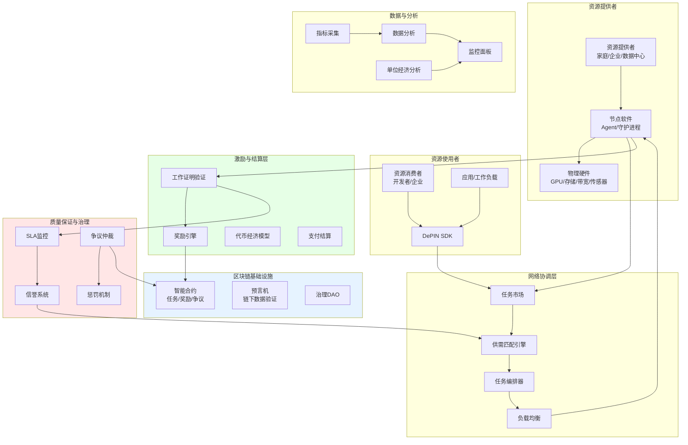
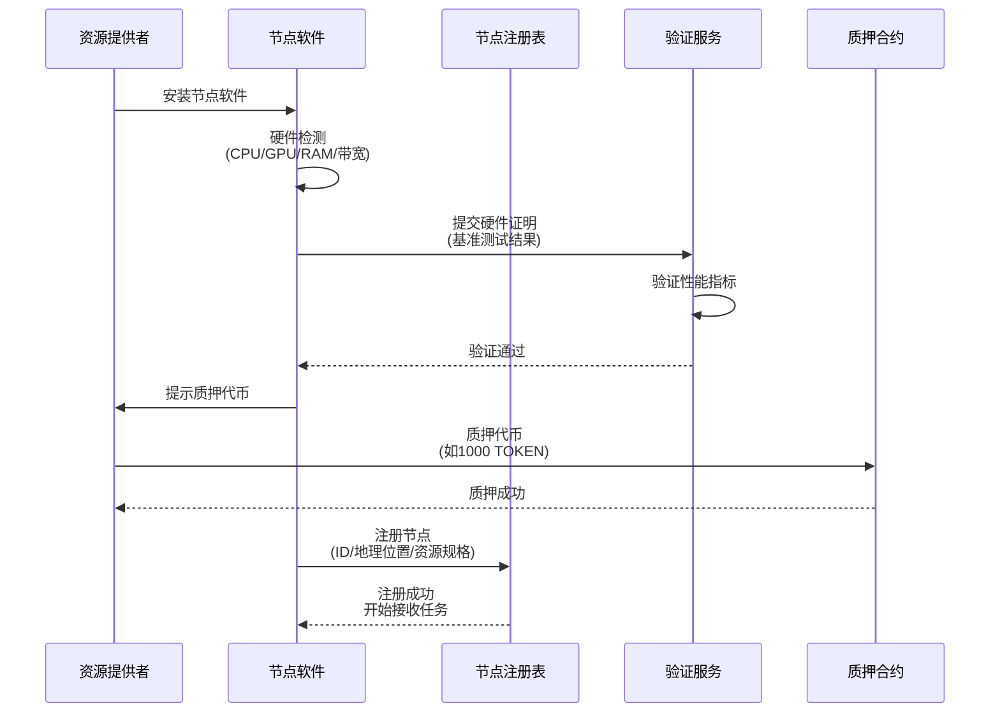
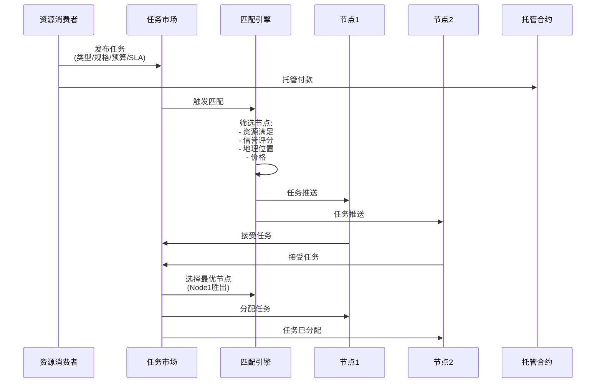
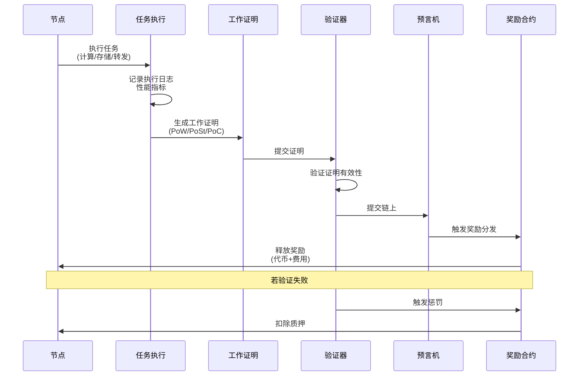
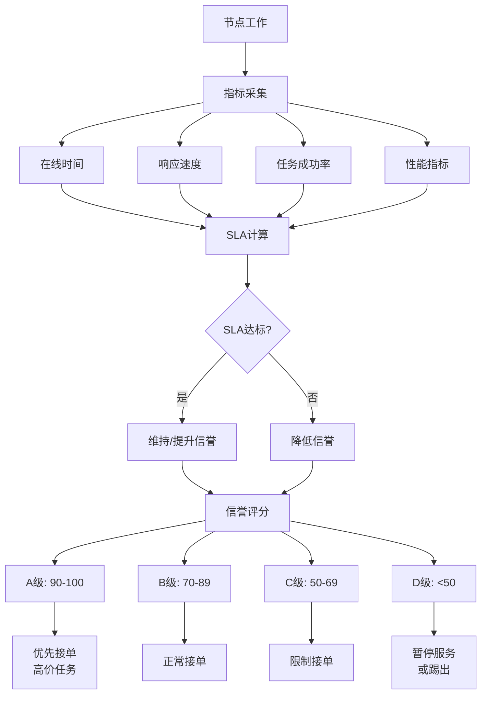
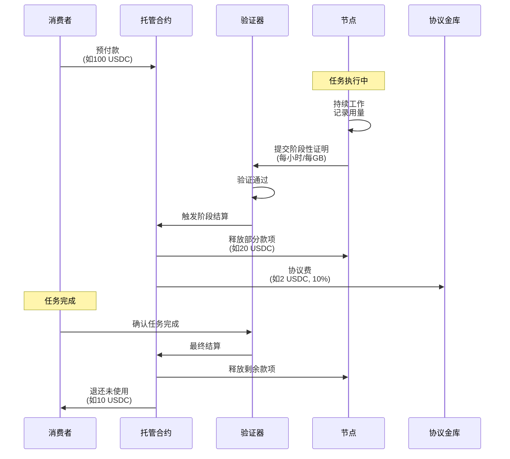

# F. DePIN 方案（去中心化物理基础设施网络）

## 方案概述

本方案为去中心化物理基础设施网络（DePIN, Decentralized Physical Infrastructure Networks）提供全栈解决方案，涵盖算力、存储、带宽、传感器/IoT、能源、移动网络等物理资源的共享、计费、激励与治理，实现"闲置资源货币化 + 需求方低成本获取"的双赢模式。

## 业务痛点

1. **资源闲置浪费**：个人/企业闲置算力、存储、带宽未被利用
2. **中心化成本高**：AWS/GCP/Azure等中心化服务价格昂贵
3. **信任问题**：资源提供方与需求方缺乏信任机制
4. **结算复杂**：跨地域、小额、高频结算依赖人工
5. **质量难保证**：资源提供的SLA、性能无法验证
6. **冷启动困难**：新网络缺少节点，供需两侧鸡蛋问题

## 解决方案架构



## 核心业务流程

### 1. 节点入驻与注册



**节点注册要求**：

| 资源类型 | 最低要求 | 质押要求 | 示例项目 |
|----------|----------|----------|----------|
| 算力(GPU) | RTX 3080 Ti+ | $1000 | Render Network |
| 存储 | 1TB可用空间 | $100 | Filecoin/Arweave |
| 带宽 | 100Mbps上行 | $50 | Theta Network |
| 传感器 | 认证设备 | $200 | Helium |
| 移动信号 | 5G小基站 | $500 | Helium Mobile |

**硬件验证方式**：
- **基准测试**：运行标准workload（如渲染、转码）
- **可信执行环境（TEE）**：Intel SGX、ARM TrustZone
- **远程证明**：证明硬件与软件的真实性
- **地理位置证明**：GPS、网络延迟三角定位

### 2. 任务发布与匹配



**匹配算法考量**：

```python
# 伪代码
def match_task_to_node(task, available_nodes):
    # 1. 硬约束过滤
    eligible = filter(nodes, lambda n:
        n.resources >= task.requirements and
        n.reputation >= task.min_reputation and
        n.location in task.allowed_regions
    )
    
    # 2. 打分排序
    scored = []
    for node in eligible:
        score = (
            node.reputation * 0.4 +          # 信誉权重40%
            (1 - node.price/task.budget) * 0.3 +  # 价格权重30%
            node.completion_rate * 0.2 +     # 完成率20%
            network_latency_score(node) * 0.1  # 延迟权重10%
        )
        scored.append((node, score))
    
    # 3. 返回最高分节点
    return max(scored, key=lambda x: x[1])[0]
```

### 3. 工作证明与验证



**工作证明类型**：

| 证明类型 | 适用场景 | 验证方式 | 示例 |
|----------|----------|----------|------|
| PoW (Proof of Work) | 算力 | 解决数学难题 | Render（渲染帧数） |
| PoSt (Proof of Spacetime) | 存储 | 证明持续存储数据 | Filecoin |
| PoC (Proof of Coverage) | 无线网络 | 证明信号覆盖范围 | Helium |
| PoB (Proof of Bandwidth) | 带宽 | 证明数据传输量 | Theta |
| PoL (Proof of Location) | 位置 | GPS+时间戳 | FOAM/XYO |

**示例：Filecoin的PoSt**
```
1. 存储提供者承诺存储数据（Commit）
2. 定期提交Spacetime证明（每24小时）
3. 证明包含：
   - 数据仍然存储（Merkle proof）
   - 时间窗口内持续存储
4. 随机挑战：网络随机抽查特定数据块
5. 未能证明 → 惩罚（Slashing）
```

### 4. SLA监控与信誉评分



**信誉评分公式**：
```
信誉评分 = f(
    在线率 * 25%,
    任务完成率 * 30%,
    平均响应时间 * 15%,
    用户评价 * 20%,
    历史表现 * 10%
)

在线率 = 实际在线时间 / 承诺在线时间
完成率 = 成功任务数 / 总任务数
响应时间评分 = 1 - (实际响应时间 / SLA上限)
```

**动态调整**：
- 新节点初始评分70（中等），观察期1个月
- 连续30天SLA>95% → 评分+5
- 单次严重违约（如数据丢失）→ 评分-20
- 长期停机（>7天未通知）→ 评分清零，踢出网络

### 5. 计费与结算



**计费模型**：

| 资源类型 | 计费单位 | 定价示例 | 对比中心化 |
|----------|----------|----------|------------|
| GPU算力 | $/GPU·小时 | $0.5-1/小时 | AWS $3-5 (↓70%) |
| 存储 | $/GB·月 | $0.002/GB·月 | S3 $0.023 (↓90%) |
| 带宽 | $/GB | $0.01/GB | CDN $0.08 (↓87%) |
| 传感器数据 | $/条记录 | $0.0001/条 | 定制方案 |

**动态定价**：
- **供需平衡**：需求高峰时价格上涨，引导更多供给
- **地理溢价**：特定区域（如欧美）资源稀缺，价格更高
- **质量溢价**：高信誉节点可收取更高价格
- **长期折扣**：承诺长期使用（如包月）享受折扣

## 核心模块说明

### 1. 节点软件（Node Agent）

**功能**：
- **资源管理**：监控CPU/GPU/内存/磁盘/带宽使用
- **任务执行**：接收并执行工作负载
- **工作证明**：生成并提交证明
- **自动化运维**：故障检测、日志上报、自动重启

**技术架构**：
```
Node Agent (Go/Rust)
├── Resource Monitor      # 资源监控
├── Task Executor         # 任务执行器
│   ├── Docker Runtime   # 容器化workload
│   ├── GPU Driver       # GPU管理
│   └── Network Proxy    # 网络代理
├── Proof Generator       # 证明生成器
├── P2P Networking        # 节点间通信
└── Blockchain Client     # 链上交互
```

**安全性**：
- 任务沙箱隔离（Docker/Firecracker）
- 敏感数据加密
- 定期安全更新

### 2. 任务市场（Marketplace）

**撮合机制**：
- **公开市场**：任务公开发布，节点竞价
- **私有池**：企业预约特定节点集群
- **拍卖机制**：稀缺资源（如特定地理位置）竞拍

**订单簿**：
```json
{
  "buy_orders": [
    {
      "task_id": "task-123",
      "type": "gpu_render",
      "requirements": {"gpu": "RTX 4090", "duration": "2h"},
      "max_price": 2.0,
      "preferred_region": "US-West"
    }
  ],
  "sell_orders": [
    {
      "node_id": "node-456",
      "resources": {"gpu": "RTX 4090", "available": "24/7"},
      "price": 1.5,
      "region": "US-West",
      "reputation": 95
    }
  ]
}
```

### 3. 单位经济看板（Unit Economics Dashboard）

**供给侧指标**：
```
节点收益 = 任务收入 - 电费 - 硬件折旧 - 网络费用
ROI = (年收益 / 硬件投入) * 100%
回本周期 = 硬件投入 / 月收益
```

**需求侧指标**：
```
有效成本 = 实际支付 / 实际使用量
成本节省 = (中心化方案成本 - DePIN成本) / 中心化成本
质量评分 = SLA达标率 * 用户满意度
```

**网络指标**：
```
活跃节点数
总算力/存储容量
日均任务量
网络利用率 = 已用资源 / 总资源
```

### 4. 反欺诈机制

**Sybil攻击防护**：
- 质押要求：创建节点需质押代币
- 硬件验证：防止虚拟化节点冒充物理硬件
- IP多样性：限制单一IP注册过多节点

**工作证明作弊**：
- 随机挑战：不可预测的验证请求
- 时间锁：证明生成需要真实计算时间
- 交叉验证：多个验证者同时验证

**女巫攻击（Reputation Gaming）**：
- 初始信誉期：新节点限制接单量
- 异常检测：突然的高评分变化触发审查
- 链上身份：关联真实世界身份（可选）

### 5. AI工作负载适配

**适配场景**：
- **模型推理**：分布式GPU集群运行LLM推理
- **模型训练**：联邦学习、分布式训练
- **数据标注**：众包数据标注任务
- **视频转码**：去中心化转码网络

**示例：分布式LLM推理**
```
用户请求 → 任务分解
├── Layer 1-10  → GPU节点A
├── Layer 11-20 → GPU节点B
└── Layer 21-32 → GPU节点C
→ 结果聚合 → 返回用户
```

## 应用场景示例

### 场景1：去中心化GPU渲染网络

**项目方**：3D艺术家、动画工作室

**方案**：
1. 艺术家上传Blender/Maya项目文件
2. 任务分解为多个渲染帧
3. 分发给全球GPU节点并行渲染
4. 渲染完成后合成视频
5. 按渲染时间自动结算

**单位经济**：
- 传统渲染农场：$2-5/GPU·小时
- DePIN方案：$0.5-1/GPU·小时
- 节省：60-75%

**示例项目**：Render Network（$RNDR）

### 场景2：去中心化存储

**项目方**：需要大规模存储的应用（备份、视频、归档）

**方案**：
1. 数据分片+冗余编码（erasure coding）
2. 分散存储到全球存储节点
3. 定期提交存储证明（PoSt）
4. 数据检索时并行下载多个分片
5. 按存储量+时间计费

**优势**：
- 成本：↓80-90% vs AWS S3
- 隐私：数据分片，单节点无法读取完整数据
- 抗审查：去中心化无单点故障

**示例项目**：Filecoin、Arweave

### 场景3：去中心化无线网络

**项目方**：物联网设备、移动应用

**方案**：
1. 个人部署LoRaWAN/5G热点
2. 设备通过热点连接网络
3. 热点所有者获得代币奖励
4. 按数据传输量计费
5. 覆盖证明（PoC）验证信号范围

**网络效应**：
- 前期：高激励吸引热点部署
- 中期：覆盖密度提升，用户增长
- 后期：使用费收入支撑网络运营

**示例项目**：Helium（IoT）、Pollen Mobile（5G）

### 场景4：去中心化数据采集

**项目方**：气象、交通、环境监测

**方案**：
1. 个人/企业部署传感器（温度、湿度、空气质量）
2. 传感器定期上传数据
3. 数据消费者（气象公司、政府）购买数据
4. 数据质量验证（交叉对比临近传感器）
5. 按数据条数+质量评分付费

**数据市场**：
- 供给侧：传感器所有者货币化闲置设备
- 需求侧：低成本获取高密度数据
- 平台：撮合+质量保证

**示例项目**：Hivemapper（行车记录仪地图）、WeatherXM（气象站）

## 技术组件

### 智能合约架构

```
DePINCore.sol               # 核心协议
├── NodeRegistry.sol        # 节点注册
├── TaskMarketplace.sol     # 任务市场
├── StakingPool.sol         # 质押池
├── RewardDistributor.sol   # 奖励分发
└── DisputeResolver.sol     # 争议解决

ProofValidator.sol          # 工作证明验证
ReputationSystem.sol        # 信誉系统
Treasury.sol                # 协议金库
GovernanceDAO.sol           # 治理DAO
```

### 链下基础设施

**节点软件技术栈**：
- **语言**：Rust（性能）、Go（并发）
- **容器**：Docker（任务隔离）
- **网络**：libp2p（P2P通信）
- **存储**：RocksDB（本地状态）

**协调服务**：
- **任务调度**：Kubernetes（集群管理）
- **消息队列**：NATS/Kafka（事件流）
- **监控**：Prometheus + Grafana

### 数据索引与分析

- **The Graph**：链上事件索引
- **ClickHouse**：时序数据分析
- **Metabase**：BI仪表盘

## 代币经济模型

### 代币作用

1. **质押**：节点注册需质押代币
2. **支付**：消费者使用代币支付服务
3. **奖励**：节点完成任务获得代币奖励
4. **治理**：持币者投票决定协议参数

### 激励设计

```
总供应: 1,000,000,000 TOKEN

分配:
├── 40% 节点激励（10年线性释放）
├── 20% 团队+顾问（4年vest）
├── 15% 早期投资者（2年vest）
├── 15% 生态基金
└── 10% 流动性

通胀率: 初期5%/年（吸引供给）→ 逐步降至1%
```

### 激励曲线

```
早期（0-2年）: 高额补贴 → 吸引节点入驻
中期（2-5年）: 补贴递减 → 使用费收入增长
后期（5年+）: 可持续 → 使用费完全支撑网络
```

## 合规与治理

### 法律考虑

1. **代币性质**：功能型代币 vs 证券型代币
2. **节点责任**：内容托管的法律责任（DMCA、隐私法）
3. **数据主权**：GDPR、数据本地化要求
4. **税务**：节点收入的税务处理

### 治理机制

**提案类型**：
- 协议参数调整（质押要求、手续费率）
- 新功能开发（预算分配）
- 争议裁决（重大纠纷）
- 协议升级

**投票权重**：
```
投票权 = f(
    持币量 * 0.5,
    质押量 * 0.3,
    节点贡献 * 0.2
)
```

## 交付成果与KPI

### 核心KPI

| 指标 | 目标值 | 说明 |
|------|--------|------|
| 活跃节点数 | 6个月达1000+ | 供给侧增长 |
| 网络利用率 | >30% | 资源实际使用率 |
| 节点ROI | >20%/年 | 吸引力指标 |
| 成本节省 | >60% | vs 中心化方案 |
| SLA达标率 | >95% | 服务质量 |
| 月活用户 | 6个月达10K+ | 需求侧增长 |

### 交付物清单

**第一阶段（MVP，8-12周）**
- [ ] 节点软件（基础版）
- [ ] 任务市场智能合约
- [ ] 简单工作证明（如PoW）
- [ ] 基础监控面板
- [ ] 文档与部署指南

**第二阶段（Pro，12-18周）**
- [ ] 高级工作证明（PoSt/PoC）
- [ ] 信誉系统
- [ ] 自动化运维工具
- [ ] 单位经济看板
- [ ] 移动端监控App

**第三阶段（Enterprise，18-30周）**
- [ ] 企业级SLA保证
- [ ] 私有资源池
- [ ] 高级分析与预测
- [ ] 合规模块（KYC/数据主权）
- [ ] 治理DAO

## 风险与应对

| 风险类型 | 描述 | 缓解措施 |
|----------|------|----------|
| 供需失衡 | 早期供给过剩或不足 | 动态激励、补贴调整 |
| 质量不稳定 | 节点性能参差不齐 | 信誉系统、SLA监控、惩罚机制 |
| 欺诈攻击 | Sybil攻击、虚假证明 | 质押、硬件验证、随机挑战 |
| 法律风险 | 内容托管、数据主权 | 合规审查、地域限制、免责条款 |
| 中心化风险 | 少数大节点控制网络 | 去中心化激励、节点多样性要求 |

## 成功案例参考

1. **Filecoin**：去中心化存储，18 EiB存储容量
2. **Render Network**：GPU渲染，10K+节点
3. **Helium**：IoT网络，100万+热点
4. **Livepeer**：视频转码，7万+GPU小时/月
5. **Akash Network**：去中心化云计算，1K+活跃部署

## 下一步行动

1. **需求确认**（1小时）
   - 明确DePIN类型（算力/存储/带宽/传感器）
   - 评估目标市场与竞争对手
   - 确定代币经济模型

2. **技术设计**（2-3周）
   - 工作证明方案设计
   - 节点软件架构
   - 智能合约设计
   - 安全模型

3. **MVP开发**（8-12周）
   - 节点软件开发
   - 智能合约开发与审计
   - 测试网启动
   - 早期节点招募

4. **主网启动**
   - 激励测试网
   - 主网上线
   - 生态建设与BD
   - 持续优化

---

**联系方式**：
- 技术咨询：[邮箱/Telegram]
- 节点部署支持：[Discord/论坛]
- 演示预约：24小时内安排在线Demo

