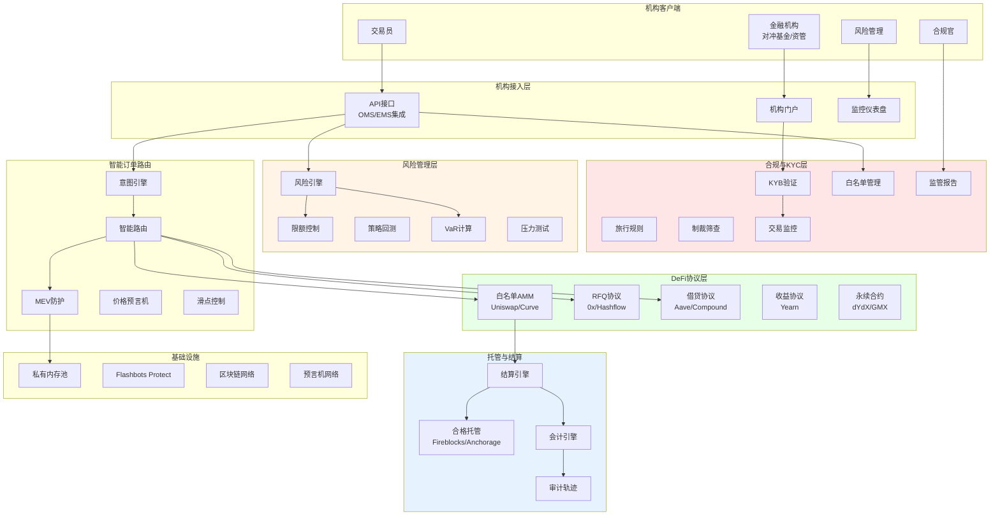
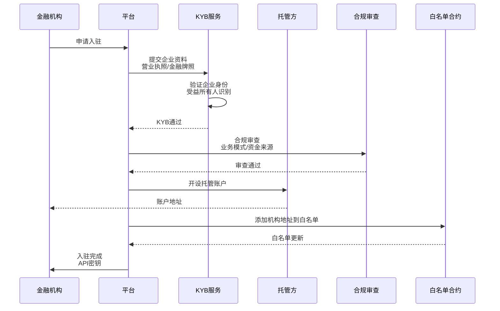
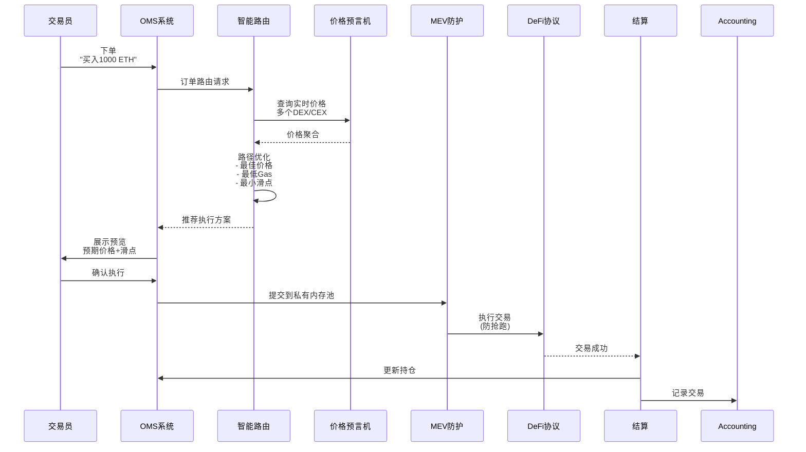
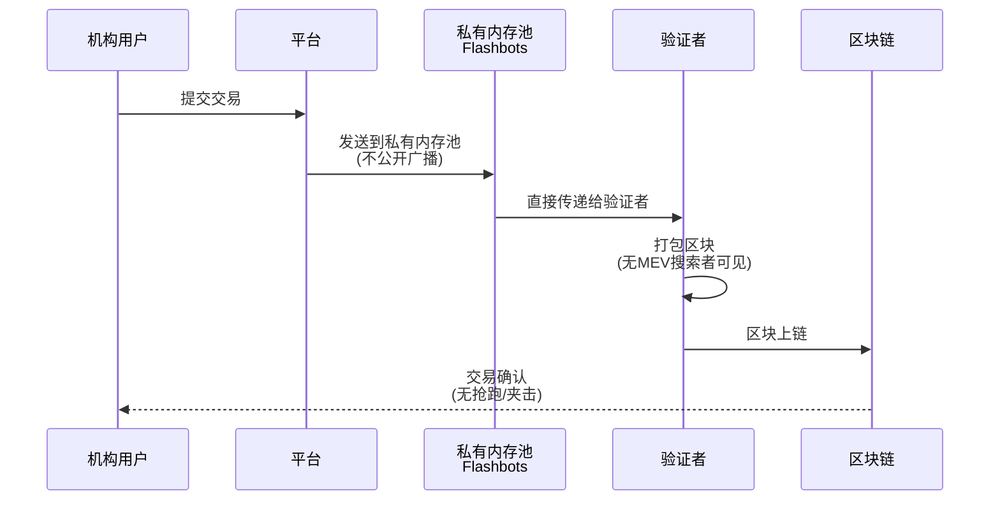
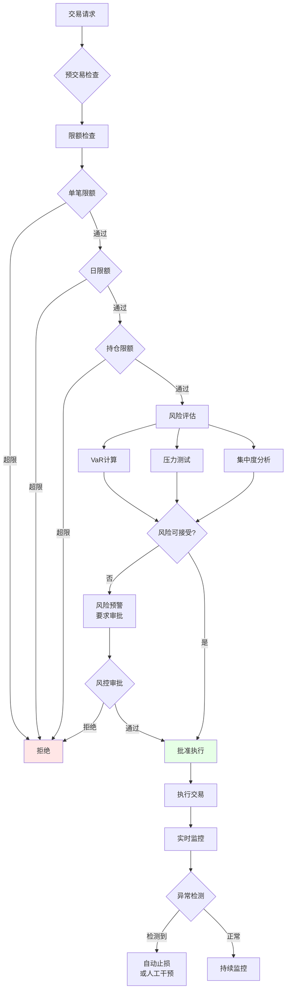
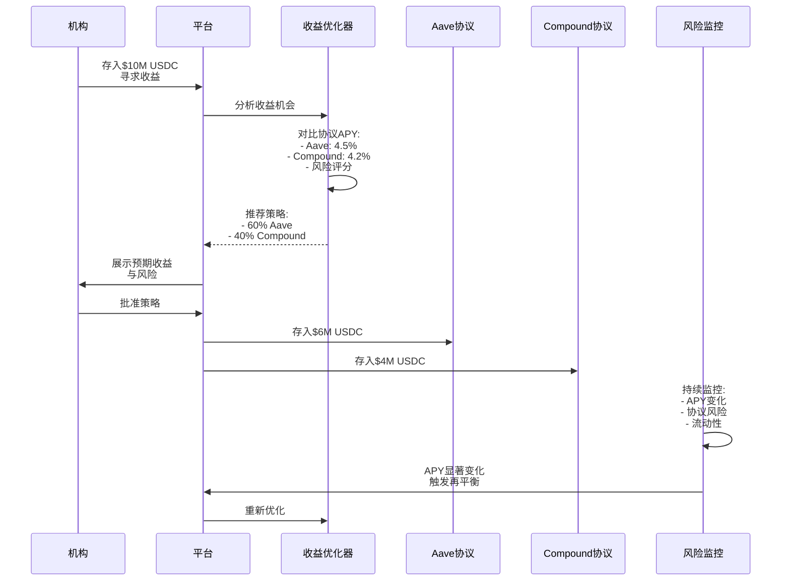

# G. 机构级 DeFi 访问方案（合规优先）

## 方案概述

本方案为传统金融机构、资产管理公司、对冲基金提供安全、合规的DeFi访问通道，在保持监管合规的前提下，利用DeFi的高效率、低成本、透明性优势，支持交易、借贷、收益生成等金融活动。

## 业务痛点

1. **合规空白**：公链DeFi缺少KYC/AML，机构无法直接参与
2. **风险失控**：智能合约漏洞、无常损失、清算风险难以量化
3. **操作复杂**：机构习惯传统金融工具（OMS/EMS/PMS），DeFi门槛高
4. **托管问题**：机构需要符合监管要求的托管解决方案
5. **审计困难**：链上交易记录难以对接传统会计与审计流程
6. **流动性割裂**：DeFi与CeFi流动性隔离，价格发现效率低
7. **MEV风险**：交易被抢跑、夹击，造成隐性成本

## 解决方案架构



## 核心业务流程

### 1. 机构入驻与KYB



**KYB验证要点**：
- 企业注册信息验证
- 金融牌照确认（如资管牌照、经纪商牌照）
- 受益所有人（UBO）识别
- 反洗钱（AML）政策审查
- 资金来源合法性验证

**准入标准**：
| 机构类型 | 最低AUM | 牌照要求 | 审查周期 |
|----------|---------|----------|----------|
| 对冲基金 | $50M | 注册投资顾问 | 2-4周 |
| 资产管理 | $100M | SEC/MAS注册 | 3-6周 |
| 做市商 | $10M | 经纪商牌照 | 2-3周 |
| 家族办公室 | $25M | 合格投资者证明 | 1-2周 |

### 2. 智能订单路由与执行



**智能路由策略**：

1. **流动性聚合**
```
查询多个DEX:
- Uniswap V3: 价格 $3,051.20, 流动性 $50M
- Curve: 价格 $3,050.80, 流动性 $30M
- Balancer: 价格 $3,052.00, 流动性 $20M

选择: 拆单
- 60% → Curve (最优价格)
- 40% → Uniswap (深度充足)
预期平均价格: $3,051.00
```

2. **RFQ vs AMM**
```
小额订单(<$100K): AMM (Uniswap)
大额订单(>$100K): RFQ (专业做市商报价)
超大额(>$1M): 场外OTC
```

3. **时间加权执行**
```
TWAP策略:
总订单: 10,000 ETH
拆分: 100笔 × 100 ETH
间隔: 每5分钟执行一次
→ 降低市场冲击
```

### 3. MEV防护



**MEV攻击类型与防护**：

| 攻击类型 | 描述 | 损失示例 | 防护方案 |
|----------|------|----------|----------|
| Front-running | 机器人抢先交易 | 滑点+3% | 私有内存池 |
| Sandwich攻击 | 前后夹击 | 滑点+5% | Flashbots Protect |
| Back-running | 尾随套利 | 机会成本 | 原子化批量交易 |
| 清算狙击 | 抢先清算 | 清算罚金 | 健康度监控+预警 |

**Flashbots Protect优势**：
- 交易不进入公共内存池
- 仅验证者可见
- 失败交易不消耗Gas
- 可设置最低接受价格（limit order）

### 4. 风险管理与限额控制



**风险指标**：

```yaml
limits:
  per_transaction: 1000000  # 单笔$1M
  daily: 10000000           # 日限额$10M
  position:
    single_asset: 20%       # 单资产≤20%总资产
    single_protocol: 30%    # 单协议≤30%总资产
    
risk_metrics:
  var_95: 5%                # 95% VaR ≤ 5%
  max_drawdown: 15%         # 最大回撤≤15%
  leverage: 2x              # 最大杠杆2倍
  
concentration:
  top_5_holdings: 60%       # 前5大持仓≤60%
```

**VaR计算**（历史模拟法）：
```python
# 伪代码
def calculate_var(portfolio, confidence=0.95):
    # 1. 获取历史收益率
    returns = get_historical_returns(portfolio, days=250)
    
    # 2. 模拟未来损失分布
    simulated_losses = monte_carlo_simulation(returns, iterations=10000)
    
    # 3. 计算VaR
    var = percentile(simulated_losses, 1 - confidence)
    
    return var

# 示例输出
VaR(95%) = $500,000
解读: 95%置信度下，日最大损失≤$500K
```

### 5. 借贷与收益生成



**收益策略矩阵**：

| 策略类型 | 预期APY | 风险等级 | 流动性 | 适用场景 |
|----------|---------|----------|--------|----------|
| 稳定币借贷 | 3-5% | 低 | 高 | 现金管理 |
| ETH质押 | 4-6% | 低 | 中 | 长期持仓 |
| LP做市 | 10-30% | 中高 | 中 | 主动管理 |
| 杠杆挖矿 | 20-100% | 高 | 低 | 风险偏好高 |
| Delta中性 | 8-15% | 中 | 中 | 套利策略 |

**风险监控**：
```
实时监控指标:
1. 协议TVL变化（异常流出→风险）
2. 利用率（接近100%→提款风险）
3. 清算风险（抵押率监控）
4. 智能合约审计状态
5. 治理提案（影响协议安全的提案）

触发条件:
- TVL单日流出>20% → 警告
- 利用率>90% → 部分撤出
- 审计报告新漏洞 → 立即撤出
```

## 核心模块说明

### 1. 白名单协议管理

**协议准入标准**：
```yaml
requirements:
  audit:
    - 至少2家顶级审计机构（CertiK/Trail of Bits）
    - 无Critical/High级别未修复漏洞
  tvl: ">$100M"  # 成熟度指标
  track_record: ">1年无重大安全事故"
  insurance: "协议保险覆盖"
  governance: "去中心化治理，无后门"

approved_protocols:
  dex:
    - Uniswap V3
    - Curve Finance
    - Balancer V2
  lending:
    - Aave V3
    - Compound V3
    - Morpho
  derivatives:
    - dYdX V4
    - GMX V2
```

### 2. OMS/EMS集成

**FIX协议适配**：
```
传统金融 FIX消息 ↔ DeFi交易

FIX NewOrderSingle (D)
├── Symbol: ETH/USD
├── OrderQty: 1000
├── OrdType: Limit
└── Price: 3050

转换为:
DeFi Swap Intent
├── tokenIn: USDC
├── tokenOut: ETH
├── amountIn: 3050000 (1000 × 3050)
├── minAmountOut: 999 ETH (0.1%滑点)
└── deadline: now + 5分钟
```

**支持的订单类型**：
- Market Order（市价单）
- Limit Order（限价单，通过意图协议）
- Stop Loss（止损单）
- TWAP（时间加权平均价格）
- Iceberg（冰山单，大单拆分）

### 3. 合规报告引擎

**监管报告类型**：

| 报告类型 | 频率 | 监管机构 | 内容 |
|----------|------|----------|------|
| SAR（可疑交易报告） | 事件触发 | FinCEN/FIU | 异常交易详情 |
| CTR（现金交易报告） | $10K阈值 | FinCEN | 大额交易记录 |
| CFTC报告 | 日报 | CFTC | 衍生品持仓 |
| MiFID II | 日报 | ESMA | 交易透明度 |
| 审计包 | 年度/按需 | 审计师 | 完整交易轨迹 |

**自动化报告生成**：
```python
# 伪代码
class ComplianceReporter:
    def generate_sar(self, transaction):
        """生成可疑交易报告"""
        if self.is_suspicious(transaction):
            report = {
                "transaction_id": transaction.id,
                "amount": transaction.amount,
                "counterparty": transaction.to_address,
                "risk_indicators": self.get_risk_indicators(transaction),
                "narrative": self.generate_narrative(transaction)
            }
            self.submit_to_regulator(report, "FinCEN")
    
    def is_suspicious(self, transaction):
        """异常检测"""
        return (
            transaction.amount > THRESHOLD or
            self.is_sanctioned(transaction.to_address) or
            self.is_high_risk_jurisdiction(transaction) or
            self.is_structuring_pattern(transaction)
        )
```

### 4. 永续合约/衍生品

**机构级永续合约需求**：
```
传统:
- BitMEX/Binance: 中心化，托管风险
- 杠杆高（100x），风险失控

机构级DeFi永续:
- 去中心化结算（如dYdX V4）
- 合理杠杆（2-10x）
- 机构托管集成
- 完整审计轨迹
```

**风险管理**：
```yaml
position_limits:
  max_leverage: 5x
  maintenance_margin: 30%  # vs 2.5% in retail
  
liquidation_protection:
  early_warning: 健康度<1.5时告警
  auto_deleverage: 健康度<1.3时自动减仓
  
funding_rate_hedging:
  monitor: 实时监控资金费率
  action: 费率异常时对冲或平仓
```

### 5. 策略回测与仿真

**回测引擎**：
```python
# 伪代码
class StrategyBacktester:
    def backtest(self, strategy, start_date, end_date):
        """历史回测"""
        portfolio = Portfolio(initial_capital=10_000_000)
        
        for date in daterange(start_date, end_date):
            # 获取历史数据
            market_data = self.get_market_data(date)
            
            # 策略生成信号
            signals = strategy.generate_signals(market_data)
            
            # 模拟执行
            for signal in signals:
                self.simulate_trade(portfolio, signal, market_data)
            
            # 记录每日PnL
            self.record_metrics(portfolio, date)
        
        # 生成报告
        return self.generate_report(portfolio)

# 回测结果示例
{
    "total_return": 0.15,  # 15%收益
    "sharpe_ratio": 1.8,
    "max_drawdown": 0.08,  # 8%最大回撤
    "win_rate": 0.62,
    "trades": 1247
}
```

## 应用场景示例

### 场景1：对冲基金DeFi套利

**策略**：跨CEX-DEX套利

**流程**：
1. 监控CEX（Binance）与DEX（Uniswap）价差
2. 发现ETH价差>0.5%
3. CEX买入ETH → 转账到DeFi → DEX卖出
4. 赚取价差，扣除Gas费与滑点

**风险控制**：
- 价差阈值：仅>0.5%执行
- 单笔限额：<$500K
- 执行时间：<2分钟（避免价格变化）

### 场景2：资产管理公司收益增强

**目标**：为客户资产生成稳定收益

**方案**：
1. 客户资金托管在合规托管方
2. 经客户授权，存入白名单DeFi协议
3. 分散策略：
   - 40% Aave稳定币借贷（低风险）
   - 30% Curve LP（中风险）
   - 20% ETH质押（低风险）
   - 10% 储备（应对赎回）
4. 季度再平衡，优化收益

**合规**：
- 客户签署风险披露
- 定期报告（月度）
- 审计师验证策略执行

### 场景3：做市商流动性提供

**角色**：专业做市商为DeFi提供流动性

**方案**：
1. 在Uniswap V3提供集中流动性
2. 动态调整价格区间（跟随市场）
3. 赚取交易手续费 + 流动性挖矿
4. 对冲无常损失（衍生品套保）

**收益来源**：
- 手续费：0.3% × 交易量
- 流动性挖矿：协议代币激励
- 净收益：8-15% APY（扣除IL）

## 技术组件

### 智能合约架构

```
InstitutionalGateway.sol    # 机构网关
├── WhitelistRegistry       # 白名单注册表
├── ComplianceHook          # 合规钩子
├── LimitController         # 限额控制
└── AuditLogger             # 审计日志

SmartRouter.sol             # 智能路由
├── PriceAggregator         # 价格聚合
├── PathOptimizer           # 路径优化
├── MEVProtector            # MEV防护
└── SlippageController      # 滑点控制

YieldVault.sol              # 收益金库
├── StrategyManager         # 策略管理
├── RebalanceEngine         # 再平衡
└── EmergencyWithdraw       # 紧急提款
```

### 后端技术栈

- **语言**：TypeScript（业务）、Rust（高性能组件）
- **数据库**：PostgreSQL（交易数据）、TimescaleDB（时序数据）
- **消息队列**：Kafka（事件流）
- **缓存**：Redis（价格缓存、会话）
- **监控**：Prometheus + Grafana

### 外部集成

- **托管**：Fireblocks、Anchorage、Copper
- **价格数据**：Chainlink、Pyth Network
- **链上分析**：Chainalysis、Elliptic
- **审计**：CertiK、OpenZeppelin、Trail of Bits

## 合规与监管

### 监管框架

| 法域 | 监管机构 | 关键要求 | 牌照 |
|------|----------|----------|------|
| 美国 | SEC/CFTC | 投资顾问注册、反洗钱 | RIA/CPO |
| 欧盟 | ESMA | MiFID II、AIFMD | UCITS |
| 新加坡 | MAS | CMS牌照、反洗钱 | CMS (Fund Mgmt) |
| 香港 | SFC | 第9类牌照 | Asset Management |

### AML/KYT

**链上交易监控**：
```
实时监控:
1. 交易对手地址风险评分
2. 资金来源追踪（上溯3-5跳）
3. 混币检测（Tornado Cash等）
4. 制裁名单匹配

风险分级:
- 低风险（绿）：知名CEX、白名单地址
- 中风险（黄）：新地址、无历史
- 高风险（红）：混币、暗网、勒索地址

动作:
- 绿：自动通过
- 黄：增强尽调
- 红：拒绝交易 + SAR报告
```

## 交付成果与KPI

### 核心KPI

| 指标 | 目标值 | 说明 |
|------|--------|------|
| 执行成本 | 低于CeFi 30% | 包含Gas+滑点+MEV |
| 交易成功率 | >99.5% | 无失败交易 |
| MEV损失率 | <0.1% | 防护有效性 |
| 合规覆盖率 | 100% | 所有交易经过合规检查 |
| 系统延迟 | <2秒 | 订单提交到执行 |
| 收益稳定性 | 夏普比率>1.5 | 风险调整后收益 |

### 交付物清单

**第一阶段（MVP，8-10周）**
- [ ] 机构KYB流程
- [ ] 基础智能路由（单链）
- [ ] 白名单DeFi协议集成（3-5个）
- [ ] 托管集成（Fireblocks）
- [ ] 基础风控（限额）

**第二阶段（Pro，10-16周）**
- [ ] MEV防护
- [ ] 多链支持
- [ ] OMS/EMS API集成
- [ ] 高级风控（VaR、压力测试）
- [ ] 策略回测引擎

**第三阶段（Enterprise，16-24周）**
- [ ] 完整合规报告
- [ ] 衍生品支持
- [ ] 高级收益策略
- [ ] 定制化风控规则
- [ ] 7×24运营支持

## 风险与应对

| 风险类型 | 描述 | 缓解措施 |
|----------|------|----------|
| 智能合约风险 | DeFi协议漏洞 | 白名单审核、保险、分散配置 |
| 监管风险 | 政策变化 | 法律顾问、合规优先架构 |
| 流动性风险 | 大额交易滑点 | 拆单执行、RFQ、场外OTC |
| 托管风险 | 密钥管理 | 合格托管方、MPC、保险 |
| 操作风险 | 人为错误 | 多级审批、限额、熔断 |

## 下一步行动

1. **需求确认**（1小时）
   - 明确交易策略（套利/做市/收益）
   - 评估合规要求（法域、牌照）
   - 确定风险承受度

2. **合规设计**（2-3周）
   - 法律架构设计
   - KYB流程
   - 监管报告方案

3. **技术实施**（8-16周）
   - 智能合约开发与审计
   - 托管集成
   - OMS/EMS对接
   - 测试与验证

4. **试点上线**（小额交易）
   - 沙盒环境测试
   - 小额真实交易验证
   - 逐步放大规模

---

**联系方式**：
- 机构咨询：[邮箱/专属客户经理]
- 技术演示：24小时内安排
- 合规咨询：[法律顾问]

