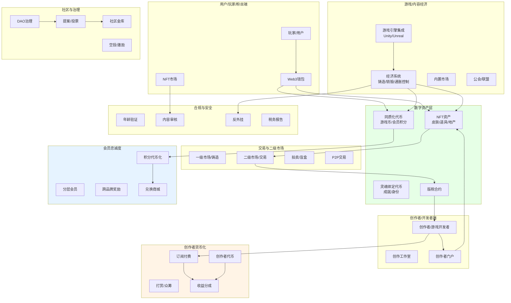
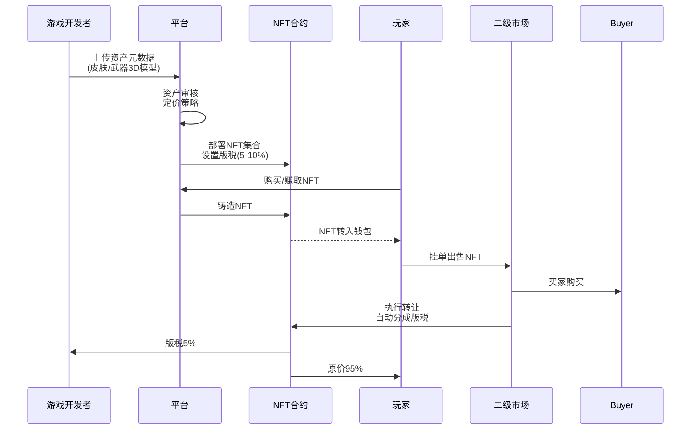
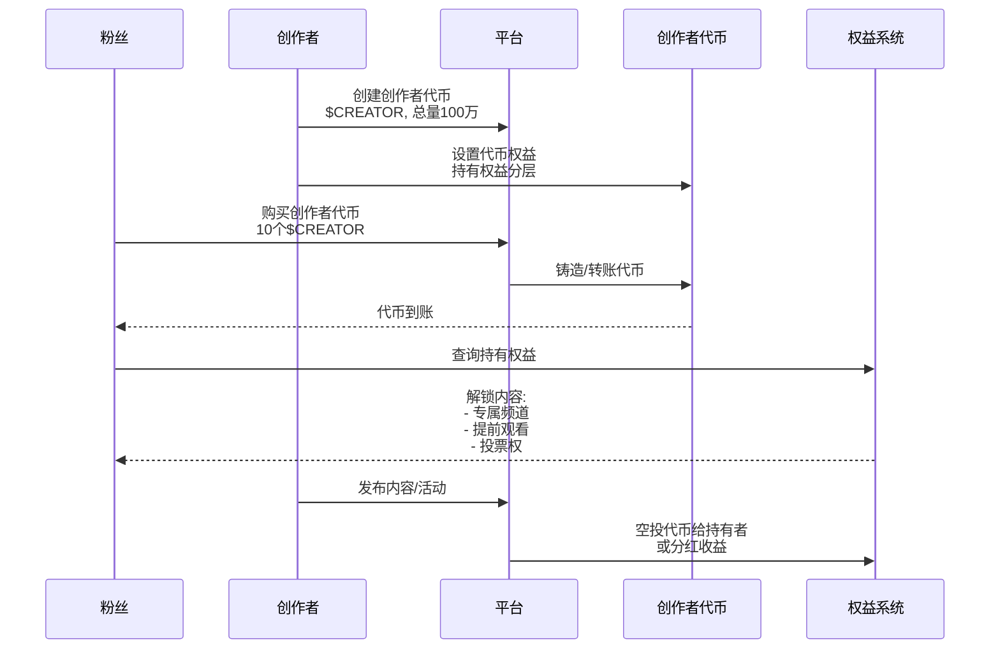
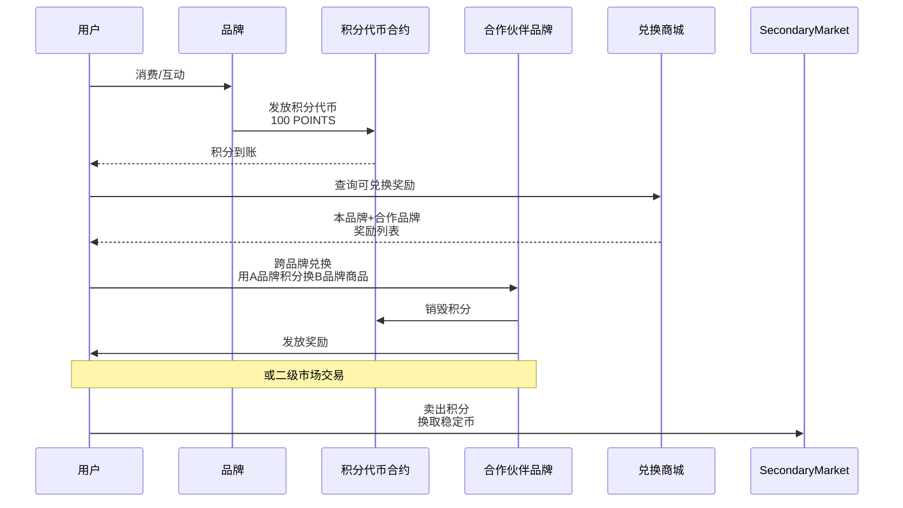
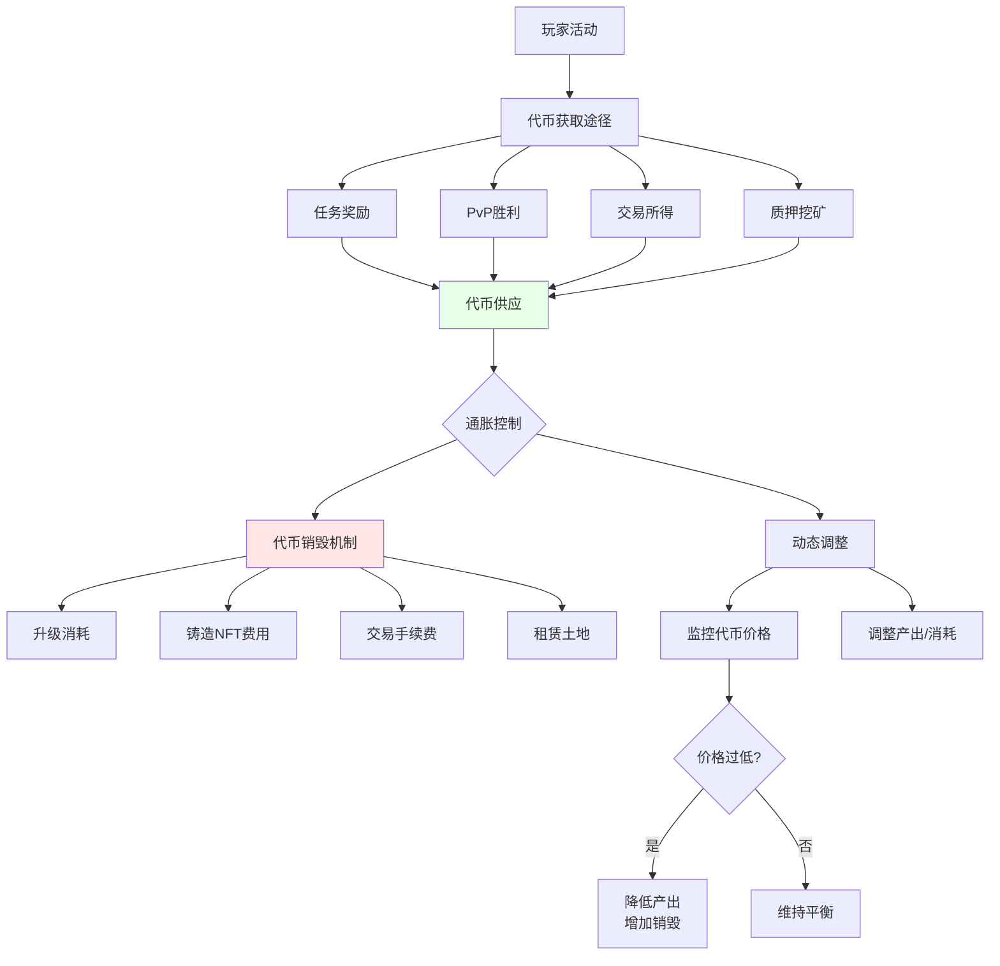
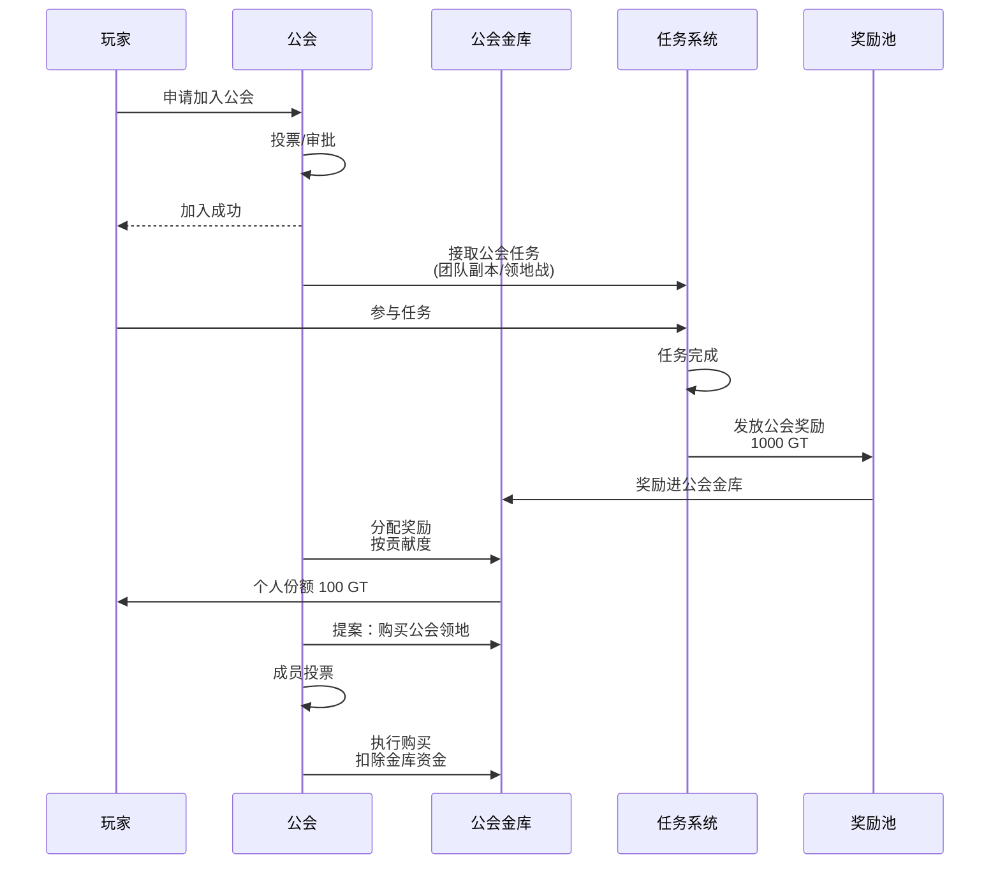

# H. 游戏 / 创作者经济 / 会员忠诚度方案

## 方案概述

本方案为游戏、内容创作平台、品牌会员体系提供 Web3 基础设施，实现资产真实所有权、创作者直接变现、会员积分代币化、社区治理等能力，构建可持续的创作者经济生态。

## 业务痛点

1. **平台抽佣高**：传统平台抽成30-50%（如App Store、Steam）
2. **资产不归用户**：游戏道具、会员积分由平台控制，无法跨平台流通
3. **创作者变现难**：依赖广告分成或打赏，收入不稳定
4. **会员体系孤岛**：积分仅限单一品牌，价值受限
5. **二级市场缺失**：用户无法交易虚拟资产
6. **缺乏社区治理**：用户无参与平台决策的权利

## 解决方案架构



## 核心业务流程

### 1. 游戏资产NFT化



**资产类型**：

| 类型 | 示例 | 稀有度 | 流通性 |
|------|------|--------|--------|
| 装备/道具 | 神器武器、稀有装备 | 普通-传奇 | 高 |
| 皮肤/外观 | 角色皮肤、载具涂装 | 限定/联名 | 高 |
| 虚拟地产 | 元宇宙土地、房产 | 区域稀缺 | 中 |
| 消耗品 | 药水、弹药 | 普通 | 低（即用） |
| 成就/徽章 | 灵魂绑定（SBT） | 不可转让 | 无 |

**版税机制**：
```solidity
// 伪代码：ERC-2981版税标准
function royaltyInfo(uint256 tokenId, uint256 salePrice) 
    returns (address receiver, uint256 royaltyAmount) {
    
    receiver = originalCreator;
    royaltyAmount = (salePrice * royaltyBasisPoints) / 10000;  // 5% = 500 basis points
    
    return (receiver, royaltyAmount);
}
```

### 2. 创作者订阅与代币化



**创作者代币权益设计**：

| 持有量 | 会员等级 | 权益 |
|--------|----------|------|
| 1-10 TOKEN | 青铜 | 专属频道访问 |
| 11-50 TOKEN | 白银 | +提前观看新内容 |
| 51-200 TOKEN | 黄金 | +月度直播互动 |
| 201-1000 TOKEN | 铂金 | +参与内容投票 |
| 1000+ TOKEN | 钻石 | +年度见面会邀请 |

**收益分配**：
```
创作者收入来源:
1. 代币首发销售（70%归创作者，30%平台）
2. 内容订阅收入（90%归创作者，10%平台）
3. 打赏（95%归创作者，5%平台）
4. 广告分成（60%创作者，40%平台+代币持有者）
```

### 3. 会员积分代币化



**跨品牌积分联盟**：

```
联盟架构:
- 航空公司 + 酒店 + 信用卡
- 统一积分标准（如1 TOKEN = $0.01价值）
- 跨品牌自由兑换
- 联盟治理（投票决定新成员准入）

用户价值:
- 积分流动性↑，贬值风险↓
- 选择多样性（多品牌奖励）
- 可在二级市场变现

品牌价值:
- 客户粘性↑（跨品牌生态）
- 新客获取（联盟流量共享）
- 降低积分负债（二级市场承接）
```

### 4. 游戏内经济平衡



**代币经济学设计**：

```yaml
token_model:
  name: GameToken (GT)
  total_supply: 1_000_000_000
  distribution:
    - play_to_earn: 40%  # 玩家激励，5年释放
    - team: 15%          # 团队，4年vest
    - treasury: 20%      # 金库（开发、运营）
    - liquidity: 10%     # 流动性
    - marketing: 10%     # 市场推广
    - investors: 5%      # 早期投资者

inflation_control:
  daily_mint_cap: 1_000_000 GT  # 日产出上限
  burn_mechanisms:
    - crafting: 50% burnt        # 合成消耗50%代币
    - nft_minting: 100 GT/NFT    # 铸造NFT销毁
    - marketplace_fee: 2.5%      # 交易费销毁
  target_inflation: 5% annually  # 目标年通胀率
```

**平衡调控**：
```
监控指标:
1. 代币价格（vs 稳定币）
2. 流通量 vs 锁定量
3. 日活用户数 vs 代币产出
4. 新用户留存率

调控手段:
- 价格过低 → ↓任务奖励，↑销毁需求
- 价格过高 → ↑活动奖励，吸引新玩家
- 流动性枯竭 → 金库注入流动性
- 通胀失控 → 临时暂停部分产出
```

### 5. 公会/联盟系统



**公会经济**：
- **公会金库**：DAO多签管理，成员投票决定资金用途
- **贡献度系统**：参与任务、捐赠资源累计贡献值
- **奖励分配**：按贡献度比例分配公会收益
- **公会资产**：共同拥有的土地、建筑、稀有道具

## 核心模块说明

### 1. NFT铸造与管理

**批量铸造工具**：
```typescript
// 伪代码
class NFTFactory {
  // 延迟铸造（Lazy Minting）
  async lazyMint(metadata: Metadata, signature: Signature) {
    // 元数据链下存储，仅在首次转让时上链
    // 节省创作者Gas费
    const voucher = {
      tokenId: generateId(),
      uri: uploadToIPFS(metadata),
      minPrice: metadata.price,
      signature: await creator.sign(voucher)
    };
    return voucher;
  }
  
  // 批量空投
  async batchAirdrop(recipients: Address[], tokenIds: number[]) {
    // 优化Gas：单笔交易空投给多个地址
    await nftContract.batchTransfer(recipients, tokenIds);
  }
}
```

**动态NFT**：
```solidity
// 伪代码：NFT属性可升级
contract DynamicNFT is ERC721 {
    struct Attributes {
        uint256 level;
        uint256 power;
        uint256 experience;
    }
    
    mapping(uint256 => Attributes) public tokenAttributes;
    
    function levelUp(uint256 tokenId) external {
        require(ownerOf(tokenId) == msg.sender);
        Attributes storage attr = tokenAttributes[tokenId];
        
        require(attr.experience >= 1000, "Not enough XP");
        attr.level += 1;
        attr.power += 10;
        attr.experience -= 1000;
        
        emit LevelUp(tokenId, attr.level);
    }
}
```

### 2. 内容分发与DRM

**去中心化内容存储**：
```
内容类型: 视频/音频/电子书/游戏资产

存储方案:
├── 公开预览: IPFS（免费访问）
├── 完整内容: Arweave（永久存储）+ 加密
└── 访问控制: NFT持有验证 → 解密密钥

流程:
1. 创作者上传加密内容到Arweave
2. 购买者持有NFT门票
3. 前端验证NFT持有 → 从智能合约获取解密密钥
4. 解密内容 → 本地播放
```

**防盗版**：
- 内容加密（AES-256）
- 密钥与NFT绑定
- 水印嵌入（追踪泄露源）
- 限制同时在线设备数

### 3. 打赏与众筹

**微支付通道**：
```
场景: 直播打赏、按章节付费阅读

方案: 状态通道/Rollup
- 链下高频小额支付（<$1）
- 批量结算上链（每日/每周）
- 降低Gas成本95%

流程:
1. 用户开通支付通道，预存$100
2. 每次打赏$1，链下签名
3. 创作者累积100笔后，批量提现
```

**众筹（类Kickstarter）**：
```
项目: 游戏开发/专辑制作

智能合约逻辑:
1. 设定目标金额（如$50K）和截止日期
2. 支持者pledge资金（锁定在合约）
3. 达到目标 → 资金释放给创作者
4. 未达目标 → 自动退款
5. 支持者获得NFT凭证（早鸟奖励/署名）
```

### 4. 社交图谱与信誉

**链上社交关系**：
```
Lens Protocol / CyberConnect集成

功能:
- 关注/粉丝关系链上记录
- 内容发布永久存储（IPFS）
- 评论/点赞可验证
- 社交图谱可跨平台迁移

创作者价值:
- 粉丝资产真实拥有（非平台控制）
- 换平台时粉丝可迁移
- 社交数据变现（广告商按真实粉丝计价）
```

**信誉系统**：
```
链上信誉评分:
- 交易历史（买卖记录）
- 社区贡献（DAO投票参与）
- 内容质量（点赞/评论比）
- 争议记录（退款/投诉）

应用:
- 高信誉用户优先展示
- 信誉抵押（发布内容需质押，违规扣除）
- 信誉贷款（DeFi信用借贷）
```

## 应用场景示例

### 场景1：Web3 MMORPG

**游戏**：大型多人在线角色扮演游戏

**Web3特性**：
1. **装备NFT化**：神器武器可交易，稀有度真实稀缺
2. **土地所有权**：玩家购买虚拟土地，建造房屋、商店
3. **Play-to-Earn**：打怪获得代币，可兑换法币
4. **公会DAO**：公会资产共同拥有，民主决策
5. **跨游戏资产**：某些NFT可在多个游戏使用

**经济模型**：
- 代币获取：任务（60%）、PvP（20%）、质押（20%）
- 代币消耗：升级（40%）、修理（30%）、交易税（20%）、其他（10%）
- 平衡目标：稳定的代币价格 + 可持续的玩家收益

### 场景2：音乐NFT平台

**创作者**：独立音乐人

**方案**：
1. 发行音乐NFT（限量版专辑）
2. NFT持有者权益：
   - 无损音质下载
   - 演唱会门票优先购买
   - 版税分成（歌曲被平台使用时，NFT持有者分享收益）
3. 二级市场流通：稀有专辑增值
4. 众筹新专辑：粉丝预购NFT，达到目标后制作

**收益对比**：
- 传统模式（Spotify）：$0.003-0.005/播放，平台抽成70%
- NFT模式：$10-100/张NFT，创作者收入90%，版税永续

### 场景3：品牌会员NFT

**品牌**：连锁咖啡店

**方案**：
1. 发行会员NFT（如年费会员卡）
2. NFT权益：
   - 每日免费咖啡
   - 生日特权
   - 新品优先体验
   - 持有1年后可mint限定NFT艺术品
3. 可转让/出租：用户不需要时可在二级市场卖出
4. 跨品牌联盟：咖啡店+书店+健身房互通会员权益

**创新**：
- 传统会员卡：不可转让，过期作废
- 会员NFT：可交易，持续赋能，增值潜力

### 场景4：电竞战队粉丝代币

**战队**：职业电竞战队

**方案**：
1. 发行战队粉丝代币 $TEAM
2. 代币权益：
   - 投票决定队服设计、新成员招募
   - 专属粉丝频道
   - 比赛胜利时空投奖励
   - 赛事门票折扣
3. 代币上涨驱动：战队成绩好 → 粉丝增加 → 需求上升
4. 收益分享：战队赞助收入的一部分分配给代币持有者

## 技术组件

### 智能合约架构

```
GameAssets.sol              # 游戏资产NFT
├── ERC721Enumerable       # 可枚举NFT
├── DynamicAttributes      # 动态属性
├── Royalty (ERC2981)      # 版税标准
└── Marketplace            # 内置市场

GameToken.sol              # 游戏代币
├── ERC20                  # 标准代币
├── Burnable               # 可销毁
├── Mintable (controlled)  # 受控铸造
└── Staking                # 质押挖矿

CreatorToken.sol           # 创作者代币
├── Tiered Benefits        # 分层权益
├── Revenue分配           # 收益分配
└── Governance             # 治理投票

LoyaltyPoints.sol          # 会员积分
├── Cross-brand Redemption # 跨品牌兑换
├── Expiration (optional)  # 可选过期机制
└── Burn to Redeem         # 销毁兑换
```

### 游戏引擎集成

**Unity SDK**：
```csharp
// C#伪代码
using Web3Unity;

public class GameManager : MonoBehaviour {
    // 连接钱包
    async void ConnectWallet() {
        string address = await Web3Unity.Connect();
        Debug.Log($"Connected: {address}");
    }
    
    // 查询玩家NFT资产
    async Task<List<NFT>> GetPlayerAssets(string address) {
        return await Web3Unity.ERC721.BalanceOf(
            contractAddress, 
            address
        );
    }
    
    // 铸造游戏内获得的NFT
    async void MintReward(string playerAddress, string tokenURI) {
        await Web3Unity.ERC721.Mint(
            contractAddress,
            playerAddress,
            tokenURI
        );
    }
}
```

**Unreal Engine插件**：
- Web3.Unreal插件
- 钱包连接（MetaMask、WalletConnect）
- 智能合约调用
- NFT元数据查询与渲染

### 后端技术栈

- **语言**：TypeScript、Solidity
- **框架**：NestJS（API）、Hardhat（合约）
- **数据库**：PostgreSQL（用户数据）、MongoDB（元数据缓存）
- **缓存**：Redis（实时数据，如排行榜）
- **存储**：IPFS（元数据）、Arweave（永久内容）
- **队列**：Bull（异步任务，如NFT铸造）

## 合规与内容审核

### 内容审核

**自动化审核**：
- AI识别违规内容（暴力、色情、仇恨言论）
- 关键词过滤
- 用户举报机制

**社区治理审核**：
```
去中心化审核:
1. 用户举报内容
2. 提交给审核DAO
3. 审核员（质押代币）投票
4. 多数通过 → 删除内容，创作者扣信誉
5. 审核员获得奖励
```

### 未成年人保护

- 年龄验证（KYC）
- 消费限额（未成年人每日<$50）
- 家长控制（家长账户审批子账户交易）
- 成瘾防护（游戏时长提醒）

### 税务合规

**玩家收入报税**：
```
Play-to-Earn收入属于应税收入

自动生成税务报表:
- 年度代币收入汇总
- 成本基础（NFT购买价）
- 资本利得/损失（NFT交易）
- 导出1099/类似表格
```

## 交付成果与KPI

### 核心KPI

| 指标 | 目标值 | 说明 |
|------|--------|------|
| 日活用户（DAU） | 1万+ | 6个月目标 |
| 月度交易量 | $1M+ | NFT+代币交易 |
| 创作者留存率 | >70% | 6个月留存 |
| 玩家平均收益 | $50-200/月 | Play-to-Earn |
| 代币价格稳定性 | 波动率<30% | vs法币 |
| NFT二级市场活跃度 | 日均100+笔 | |

### 交付物清单

**第一阶段（MVP，6-8周）**
- [ ] NFT智能合约（ERC-721）
- [ ] 游戏代币（ERC-20）
- [ ] 基础市场（铸造、交易）
- [ ] 钱包集成（MetaMask）
- [ ] Unity/Unreal SDK

**第二阶段（Pro，8-12周）**
- [ ] 动态NFT（可升级属性）
- [ ] 创作者代币与订阅
- [ ] 会员积分系统
- [ ] 公会/DAO功能
- [ ] 移动端支持

**第三阶段（Enterprise，12-20周）**
- [ ] 跨游戏资产互操作
- [ ] 高级经济平衡工具
- [ ] 社交图谱集成
- [ ] 内容审核系统
- [ ] 完整分析与BI

## 风险与应对

| 风险类型 | 描述 | 缓解措施 |
|----------|------|----------|
| 经济崩溃 | 代币通胀失控、价格暴跌 | 动态供需调控、储备金池 |
| 外挂/作弊 | 机器人刷代币 | 反作弊检测、人机验证 |
| 监管风险 | 代币被认定为证券 | 法律意见书、功能型代币设计 |
| 内容风险 | 违规内容导致平台被诉 | 审核机制、免责条款 |
| 用户流失 | 经济不平衡导致玩家退出 | 持续平衡调整、听取社区反馈 |

## 成功案例参考

1. **Axie Infinity**：Play-to-Earn先驱，高峰期DAU 270万
2. **The Sandbox**：虚拟世界，土地NFT销售额$3.5亿
3. **Sorare**：足球NFT游戏，获软银$6.8亿投资
4. **Decentraland**：虚拟地产，虚拟时装周吸引50+品牌
5. **Mirror.xyz**：Web3创作者平台，众筹$2M+项目

## 下一步行动

1. **需求确认**（1小时）
   - 明确应用类型（游戏/内容平台/会员体系）
   - 确定核心功能优先级
   - 评估目标用户规模

2. **经济模型设计**（2-3周）
   - 代币供需平衡设计
   - NFT稀有度与定价
   - 收益分配方案

3. **技术开发**（6-12周）
   - 智能合约开发与审计
   - 游戏引擎集成
   - 市场与钱包开发

4. **测试与上线**
   - 封闭测试（经济平衡调优）
   - 公开测试
   - 主网上线与运营

---

**联系方式**：
- 游戏开发咨询：[邮箱/Discord]
- 创作者入驻：[创作者门户]
- 技术演示：24小时内安排

