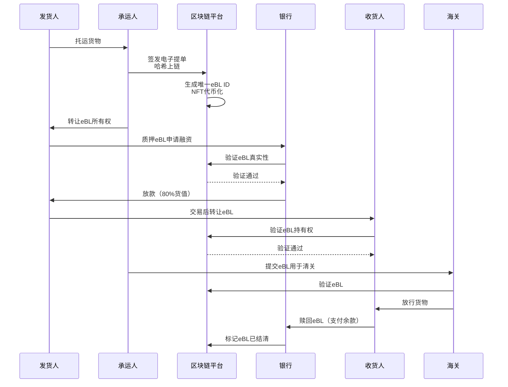
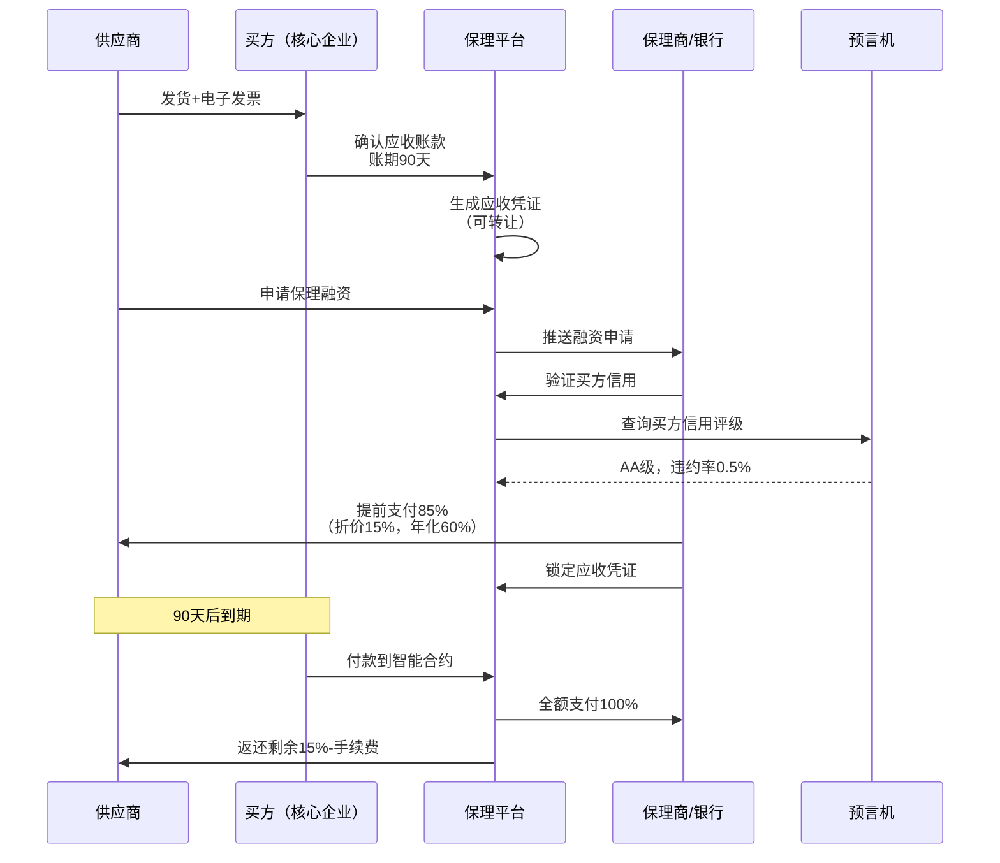
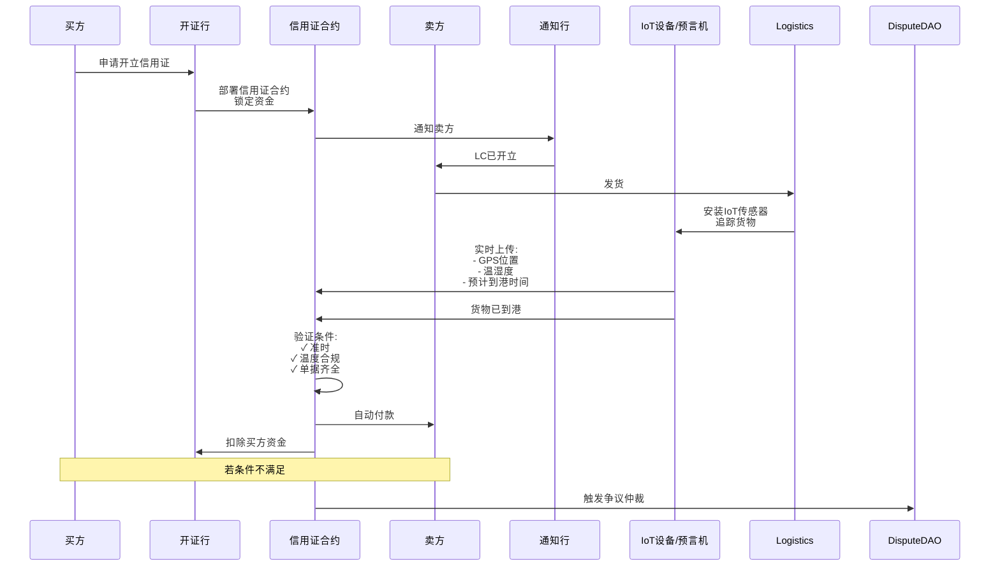
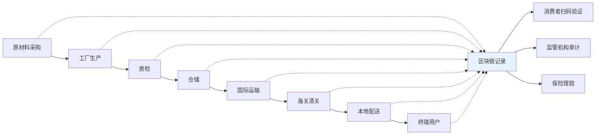
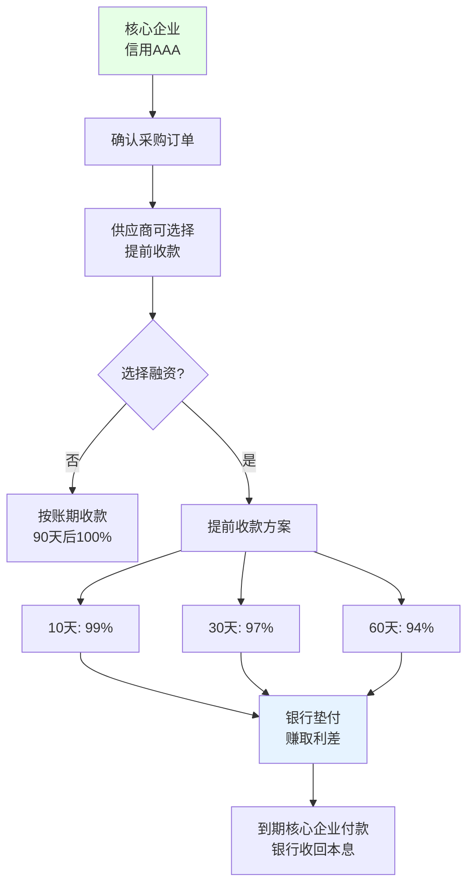
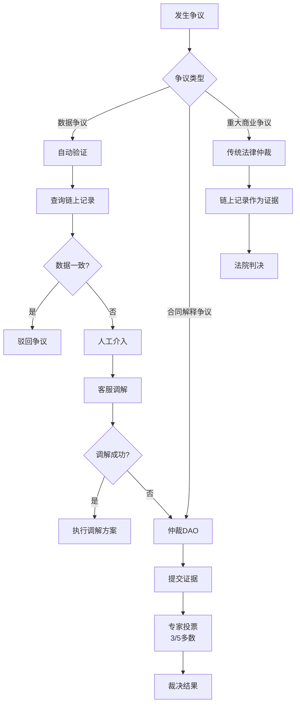

# I. 全球供应链与贸易金融方案

## 方案概述

本方案利用区块链技术为全球供应链与贸易金融提供端到端解决方案，涵盖电子提单/提货单、发票融资、应收账款保理、信用证、跨境物流追溯等场景，实现贸易流程数字化、融资便利化、风险可控化。

## 业务痛点

1. **纸质单据依赖**：提单、发票、报关单等纸质流转，效率低、易伪造
2. **融资困难**：中小供应商缺乏信用，难以获得贸易融资
3. **信息孤岛**：供应链参与方系统割裂，数据不互通
4. **信任成本高**：跨境贸易依赖中介（银行、货代），费用高昂
5. **货物追溯难**：假货、调包、物流延误难以追责
6. **结算周期长**：传统信用证流程复杂，结算需30-90天

## 解决方案架构

```mermaid
graph TB
    subgraph 参与方["供应链参与方"]
        Supplier[供应商]
        Manufacturer[制造商]
        Logistics[物流商]
        Buyer[买方/采购商]
        Bank[银行/金融机构]
        Customs[海关]
    end

    subgraph 单据层["电子单据层"]
        eBL[电子提单]
        eInvoice[电子发票]
        PO[采购订单]
        PackingList[装箱单]
        Certificate[原产地证明]
    end

    subgraph 融资层["贸易融资层"]
        Factoring[应收账款保理]
        PO_Financing[订单融资]
        LC[信用证/LC]
        SupplyChainFinance[供应链金融]
        Insurance[贸易保险]
    end

    subgraph 追溯层["物流追溯层"]
        IoTSensors[IoT传感器<br/>温湿度/GPS]
        RFID[RFID标签]
        QRCode[二维码/防伪码]
        Blockchain[区块链存证]
    end

    subgraph 智能合约["智能合约层"]
        EscrowContract[托管合约]
        LC_Contract[信用证合约]
        PaymentTrigger[自动付款触发]
        DisputeResolution[争议仲裁]
    end

    subgraph 合规层["合规与监管"]
        KYB_Check[KYB验证]
        SanctionCheck[制裁筛查]
        CustomsClearance[报关清关]
        TaxCompliance[税务合规]
    end

    subgraph 数据层["数据与分析"]
        SupplyChainVis[供应链可视化]
        RiskAnalytics[风险分析]
        PredictiveAnalytics[预测分析]
        ESG_Tracking[ESG追踪]
    end

    Supplier --> PO
    Manufacturer --> eInvoice
    Logistics --> eBL
    Buyer --> PO
    
    PO --> Factoring
    eInvoice --> PO_Financing
    eBL --> LC
    
    Logistics --> IoTSensors
    IoTSensors --> Blockchain
    RFID --> Blockchain
    
    eBL --> EscrowContract
    LC --> LC_Contract
    PaymentTrigger --> Bank
    
    Supplier --> KYB_Check
    Buyer --> SanctionCheck
    eBL --> CustomsClearance
    
    Blockchain --> SupplyChainVis
    RiskAnalytics --> Bank
    ESG_Tracking --> SupplyChainVis

    style 融资层 fill:#e6ffe6
    style 追溯层 fill:#fff4e6
    style 合规层 fill:#ffe6e6
```



## 核心业务流程

### 1. 电子提单（eBL）流转



**eBL优势对比**：

| 特性 | 纸质提单 | 电子提单 |
|------|----------|----------|
| 流转时间 | 7-14天（快递） | 实时（<1分钟） |
| 伪造风险 | 高 | 几乎为零 |
| 遗失风险 | 有（需补单） | 无（链上永久） |
| 转让成本 | $50-100/次 | <$1 |
| 融资便利性 | 困难 | 即时质押 |

### 2. 应收账款保理



**保理定价模型**：
```
保理费率 = f(
    买方信用评级,
    账期长度,
    历史违约率,
    行业风险,
    抵押品价值
)

示例:
买方: 世界500强，信用AAA
账期: 60天
保理费率: 年化8%
供应商实际融资成本: 60/365 * 8% = 1.3%
→ 提前拿到98.7%货款
```

### 3. 智能信用证（LC）



**传统LC vs 智能LC**：

| 环节 | 传统LC | 智能LC | 改善 |
|------|--------|--------|------|
| 开证时间 | 3-7天 | <1天 | ↓85% |
| 单据审核 | 人工5-7天 | 自动化实时 | ↓99% |
| 修改LC | 3-5天 | 即时 | ↓95% |
| 结算时间 | 7-14天 | T+0 | ↓100% |
| 手续费 | 1.5-3% | 0.3-0.5% | ↓80% |
| 欺诈风险 | 伪造单据 | 链上验证，低 | ↓90% |

### 4. 供应链全链路追溯



**追溯信息记录**：
```json
{
  "product_id": "P123456",
  "batch_number": "B2025001",
  "events": [
    {
      "timestamp": "2025-01-01T08:00:00Z",
      "event": "原材料采购",
      "location": "印度尼西亚·雅加达",
      "party": "供应商A",
      "证书": "有机认证证书#12345",
      "hash": "0xabc..."
    },
    {
      "timestamp": "2025-01-05T10:30:00Z",
      "event": "工厂生产",
      "location": "中国·深圳",
      "party": "工厂B",
      "质检报告": "QC-2025-001",
      "hash": "0xdef..."
    },
    {
      "timestamp": "2025-01-10T14:20:00Z",
      "event": "冷链运输",
      "温度范围": "2-8°C",
      "GPS轨迹": "链接",
      "承运人": "物流公司C",
      "hash": "0xghi..."
    }
  ],
  "current_status": "已送达",
  "verification_url": "https://trace.example.com/P123456"
}
```

### 5. 动态折扣融资（Reverse Factoring）



**多方受益**：
- **核心企业**：延长账期，改善现金流，无需提前付款
- **供应商**：灵活选择收款时间，成本可控（<10%年化）
- **银行**：低风险（核心企业信用背书），稳定收益

## 核心模块说明

### 1. 可验证凭证（Verifiable Credentials）

**W3C VC标准实现**：
```json
{
  "@context": ["https://www.w3.org/2018/credentials/v1"],
  "type": ["VerifiableCredential", "BillOfLading"],
  "issuer": "did:example:carrier123",
  "issuanceDate": "2025-01-10T12:00:00Z",
  "credentialSubject": {
    "id": "did:example:shipper456",
    "blNumber": "BL-2025-001",
    "vessel": "MSC Oscar",
    "portOfLoading": "Shanghai",
    "portOfDischarge": "Los Angeles",
    "containerNumber": "MSCU1234567",
    "cargoDescription": "1000箱电子产品",
    "grossWeight": "20000 kg"
  },
  "proof": {
    "type": "EcdsaSecp256k1Signature2019",
    "created": "2025-01-10T12:00:00Z",
    "proofPurpose": "assertionMethod",
    "verificationMethod": "did:example:carrier123#key-1",
    "jws": "eyJhbGc...signature"
  }
}
```

**选择性披露**（Zero-Knowledge Proofs）：
```
场景: 供应商向银行申请融资，需证明订单存在但不想泄露价格

使用ZKP:
- 证明: "我有来自买方A的订单，金额>$100K"
- 验证: 银行验证证明有效
- 隐私: 银行无法得知具体金额、商品细节
```

### 2. IoT集成与数据上链

**支持的IoT设备**：
- **GPS追踪器**：实时位置、运输路线
- **温湿度传感器**：冷链运输监控
- **冲击传感器**：检测暴力装卸
- **光照传感器**：检测集装箱是否被打开
- **RFID/NFC标签**：产品身份识别

**数据上链策略**：
```
链上存储（昂贵）:
- 关键哈希（Merkle Root）
- 状态变更事件（发货、到港）
- 争议证据

链下存储（IPFS/Arweave）:
- 完整IoT数据（每分钟采样）
- 照片/视频证据
- 详细单据扫描件

混合验证:
- 定期将链下数据哈希提交到链上
- 争议时提供完整数据，验证哈希匹配
```

### 3. 跨境支付结算

**多币种支持**：
```
场景: 中国出口商 → 美国进口商

支付路径:
1. 买方: USD → 稳定币USDC
2. 智能合约托管
3. 货物确认到达
4. USDC → 卖方
5. 卖方: USDC → CNY（通过OTC/CEX）

优势:
- 实时结算（vs 传统T+3）
- 成本<1%（vs 银行3-5%）
- 汇率锁定（USDC价格稳定）
```

### 4. 争议解决与仲裁

**分层争议解决**：



### 5. ESG与碳足迹追踪

**供应链ESG评分**：
```yaml
esg_metrics:
  environmental:
    - carbon_footprint: 每公里CO2排放
    - renewable_energy_usage: 工厂清洁能源占比
    - waste_management: 废弃物回收率
  
  social:
    - labor_standards: 工人工资、工时合规
    - safety_record: 安全事故记录
    - community_impact: 社区贡献
  
  governance:
    - transparency: 信息披露完整性
    - anti_corruption: 反腐败政策
    - data_privacy: 数据保护措施

overall_score: 加权平均 (0-100分)

应用:
- 高ESG评分供应商优先采购
- 低分供应商限期整改或淘汰
- ESG报告自动生成（符合CSRD/TCFD）
```

**碳足迹计算**：
```
产品碳足迹 = 
  原材料碳排放 + 
  生产过程碳排放 + 
  运输碳排放 + 
  包装碳排放

示例: 一件T恤
- 棉花种植: 2.1 kg CO2e
- 纺织生产: 3.5 kg CO2e
- 海运(中国→美国): 0.8 kg CO2e
- 包装: 0.3 kg CO2e
- 总计: 6.7 kg CO2e

消费者扫码可见完整碳足迹
企业可购买碳抵消额度
```

## 应用场景示例

### 场景1：跨境电商供应链

**参与方**：中国工厂 → 跨境物流 → 美国电商平台

**流程**：
1. 电商平台下采购订单（PO）上链
2. 工厂生产，每批次质检报告上链
3. 物流公司揽件，生成电子运单
4. IoT追踪：实时位置+海关清关状态
5. 到达仓库，自动触发付款
6. 消费者下单后，快递追溯到工厂批次

**价值**：
- 平台：货源可追溯，假货↓95%
- 消费者：扫码查看完整供应链
- 工厂：订单融资，提前回款

### 场景2：食品农产品追溯

**产品**：有机咖啡豆

**追溯链**：
```
咖农种植（哥伦比亚） 
  → 有机认证（第三方检测） 
  → 烘焙厂加工 
  → 出口报关 
  → 海运（温湿度监控） 
  → 进口清关 
  → 咖啡馆零售 
  → 消费者
```

**链上记录**：
- 咖农：GPS坐标、种植方式、采摘日期
- 认证机构：有机证书、检测报告
- 烘焙厂：烘焙参数、批次号
- 物流：温湿度曲线、运输时间
- 零售：入库时间、保质期

**消费者体验**：扫描包装二维码 → 查看完整溯源信息 + 视频

### 场景3：汽车零部件供应链

**痛点**：多层级供应商，核心企业账期长（90-120天），中小供应商资金压力大

**解决方案**：
1. **核心企业**（如大众汽车）确认采购订单上链
2. **一级供应商**获得应收凭证（可拆分、可转让）
3. **一级供应商**将凭证部分转让给**二级供应商**（传递信用）
4. **二级供应商**持凭证向银行融资，成本低（核心企业信用背书）
5. 到期核心企业付款，银行/保理商自动收回

**创新**：信用穿透多层级，让长尾供应商也能低成本融资

### 场景4：奢侈品防伪

**产品**：名牌手袋

**方案**：
1. 工厂生产时植入NFC芯片（唯一ID）
2. 芯片ID关联链上数字证书（VC）
3. 经销商、零售商流转时更新持有者
4. 消费者购买后，转移所有权到个人钱包
5. 二手转售时，验证链上所有权历史

**防伪**：
- 仿品：无法复制链上记录
- 调包：芯片ID不匹配则报警
- 来源：一键查询是否正品、是否被盗

## 技术组件

### 智能合约架构

```
TradeFinance.sol            # 贸易融资核心
├── Factoring.sol          # 保理合约
├── LetterOfCredit.sol     # 信用证
├── EscrowPayment.sol      # 托管支付
└── InvoiceNFT.sol         # 发票NFT化

SupplyChainTrack.sol       # 供应链追溯
├── ProductRegistry        # 产品注册
├── EventLogger            # 事件记录
├── VerificationOracle     # 验证预言机
└── DisputeResolution      # 争议解决

DigitalDocument.sol        # 电子单据
├── BillOfLading          # 提单
├── Invoice               # 发票
├── Certificate           # 证书
└── TransferRights        # 转让权利
```

### 技术栈

- **区块链**：Hyperledger Fabric（联盟链）、以太坊L2（公链）
- **存储**：IPFS（文档）、Arweave（永久存证）
- **IoT平台**：AWS IoT Core、Azure IoT Hub
- **身份**：DID（去中心化身份）、VC（可验证凭证）
- **预言机**：Chainlink（外部数据）、API3
- **后端**：Go（高性能）、Node.js（业务逻辑）

### 联盟链 vs 公链选择

| 特性 | 联盟链（Fabric） | 公链（Ethereum L2） |
|------|------------------|---------------------|
| 隐私性 | 高（通道私有） | 中（需额外加密） |
| TPS | 高（>1000） | 中（~100） |
| 成本 | 低（无Gas） | 低（L2优化） |
| 互操作性 | 弱 | 强 |
| 去中心化 | 弱（联盟控制） | 强 |
| 适用场景 | 企业内部/联盟 | 跨企业/公开 |

**推荐**：混合架构
- **核心业务**（敏感数据）：联盟链
- **公开追溯**（消费者查询）：公链L2
- **跨链桥**：定期同步关键哈希到公链

## 合规与监管

### 国际贸易合规

**跨境数据传输**：
- 符合GDPR（欧盟）、PIPL（中国）
- 数据本地化要求（如俄罗斯、印尼）
- 敏感数据加密存储

**海关监管对接**：
- 电子口岸系统API集成
- 报关单自动生成
- AEO（经认证的经营者）资质验证

**反洗钱（AML）**：
- 交易方KYB验证
- 大额交易（>$10K）报送
- 制裁名单实时筛查

### 行业标准

**采用标准**：
- **ISO 20022**：金融报文标准
- **DCSA**：数字集装箱航运协会（eBL标准）
- **GS1**：全球产品编码（条形码/RFID）
- **EPCIS**：电子产品代码信息服务（供应链事件）

## 交付成果与KPI

### 核心KPI

| 指标 | 目标值 | 说明 |
|------|--------|------|
| 单据流转时间 | ↓70% | vs 纸质流程 |
| 融资成本 | ↓40% | 中小企业融资成本 |
| 供应链透明度 | >95% | 关键节点可追溯 |
| 欺诈减少 | ↓80% | 伪造单据、货物调包 |
| 结算周期 | T+0 | vs T+30-90 |
| 客户满意度 | >85% | NPS评分 |

### 交付物清单

**第一阶段（MVP，8-12周）**
- [ ] 电子发票/提单系统
- [ ] 基础供应链追溯（扫码查询）
- [ ] 简单保理融资
- [ ] 联盟链部署（Fabric）
- [ ] 移动端App

**第二阶段（Pro，12-20周）**
- [ ] 智能信用证
- [ ] IoT设备集成
- [ ] 跨境支付结算
- [ ] 公链桥接（L2）
- [ ] 监管报送接口

**第三阶段（Enterprise，20-32周）**
- [ ] 多方协同平台（买方/卖方/物流/银行）
- [ ] ESG追踪与报告
- [ ] AI风险分析
- [ ] 全球多法域支持
- [ ] API生态（ERP/WMS对接）

## 风险与应对

| 风险类型 | 描述 | 缓解措施 |
|----------|------|----------|
| 数据孤岛 | 各方不愿共享数据 | 隐私计算、选择性披露、激励机制 |
| 标准不统一 | 各国单据格式差异 | 采用国际标准、灵活适配 |
| 技术采纳慢 | 传统企业抵触新技术 | 简化UI、提供培训、展示ROI |
| 监管不确定性 | 电子单据法律效力 | 与监管机构合作、试点先行 |
| 系统集成复杂 | 对接遗留系统困难 | API适配层、分阶段迁移 |

## 成功案例参考

1. **TradeLens**（Maersk+IBM）：全球航运区块链平台，150+组织
2. **we.trade**：欧洲银行联盟贸易融资平台
3. **Marco Polo**：R3 Corda贸易金融网络
4. **蚂蚁链Trusple**：跨境贸易可信数字化平台
5. **Contour**（ex-Voltron）：电子信用证网络，50+银行

## 下一步行动

1. **需求调研**（1-2周）
   - 识别核心痛点（单据/融资/追溯）
   - 访谈参与方（供应商/买方/银行）
   - 评估现有系统

2. **解决方案设计**（2-4周）
   - 流程优化设计
   - 技术架构选型（联盟链/公链）
   - 智能合约设计
   - 集成方案

3. **MVP开发**（8-12周）
   - 核心功能开发
   - 试点企业联调
   - 小规模真实交易验证

4. **规模化推广**
   - 生态伙伴招募
   - 多法域扩展
   - 持续优化

---

**联系方式**：
- 企业咨询：[邮箱/销售]
- 技术演示：24小时内安排
- 合作伙伴：[BD邮箱]

