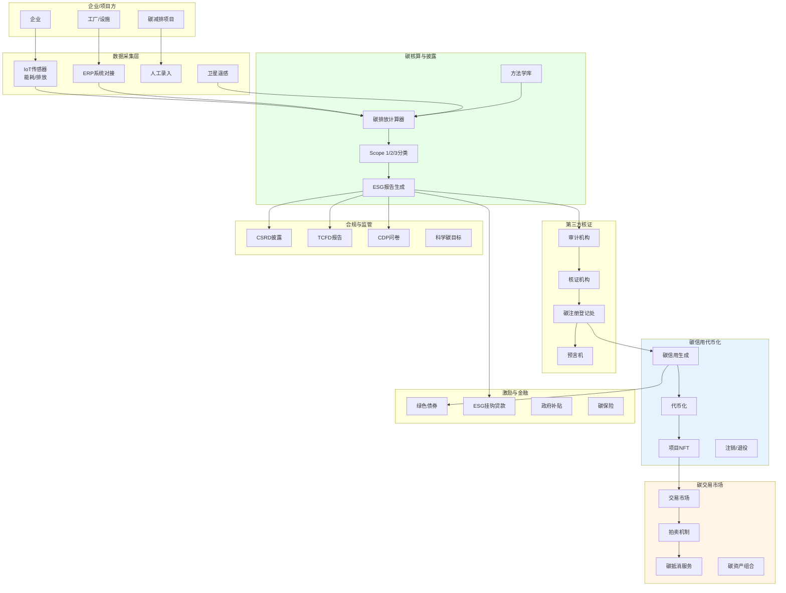
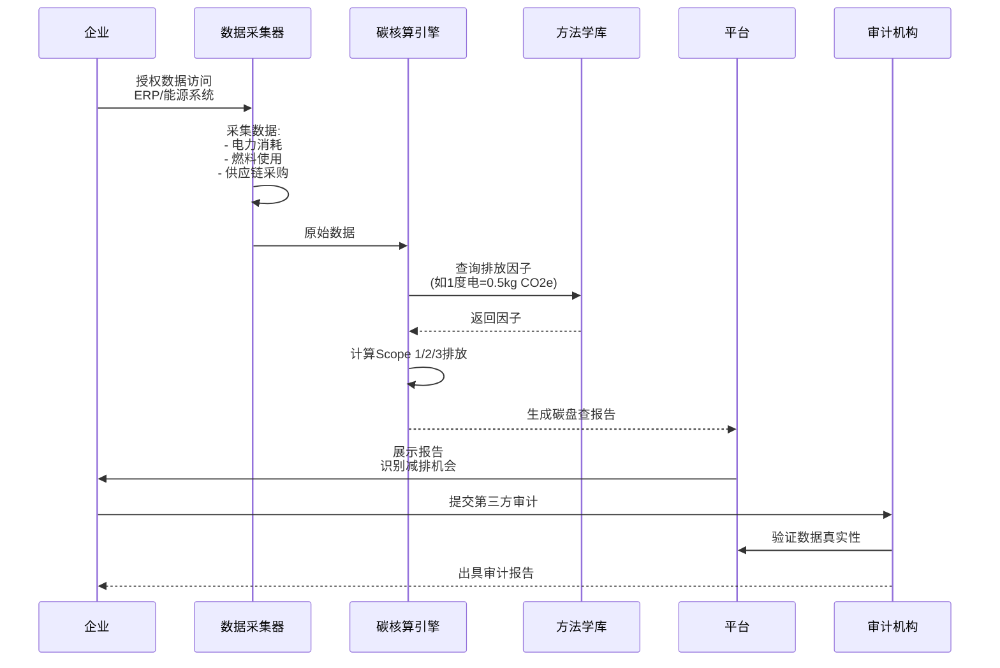
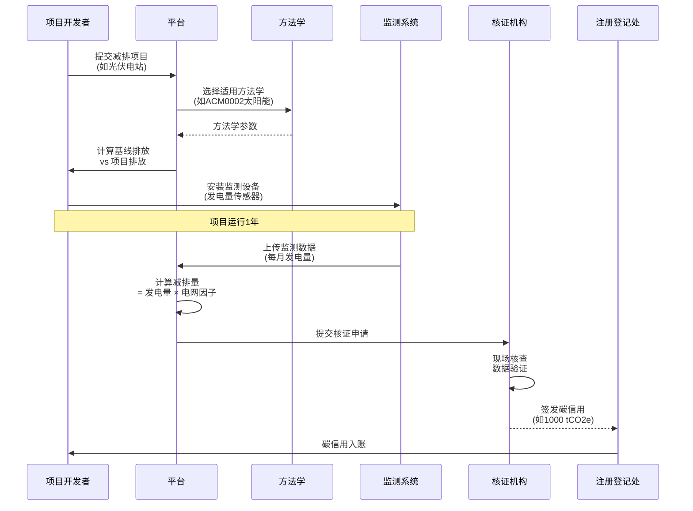
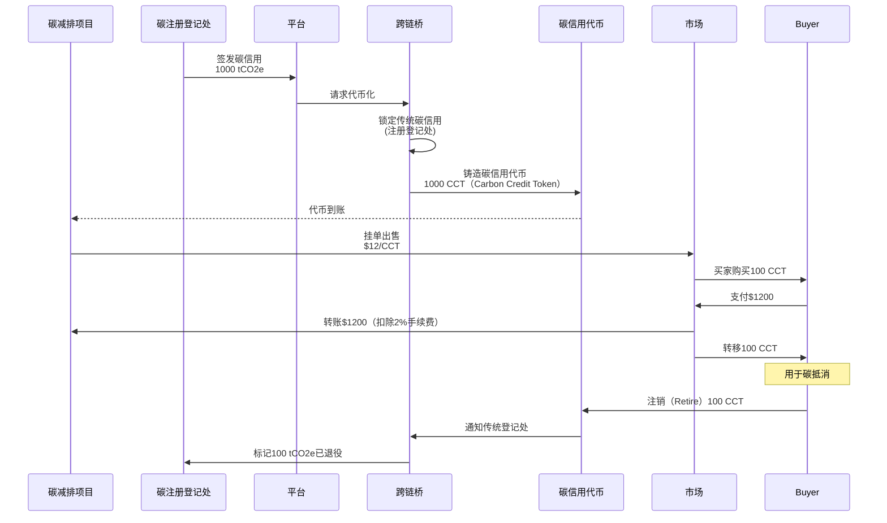
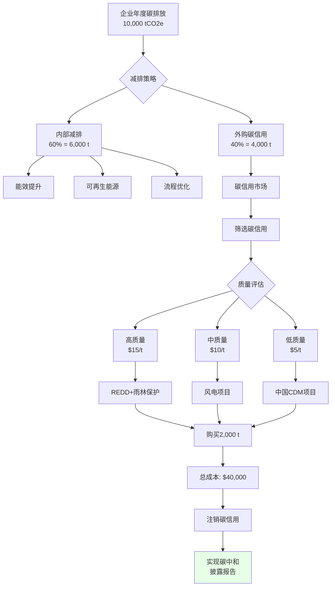
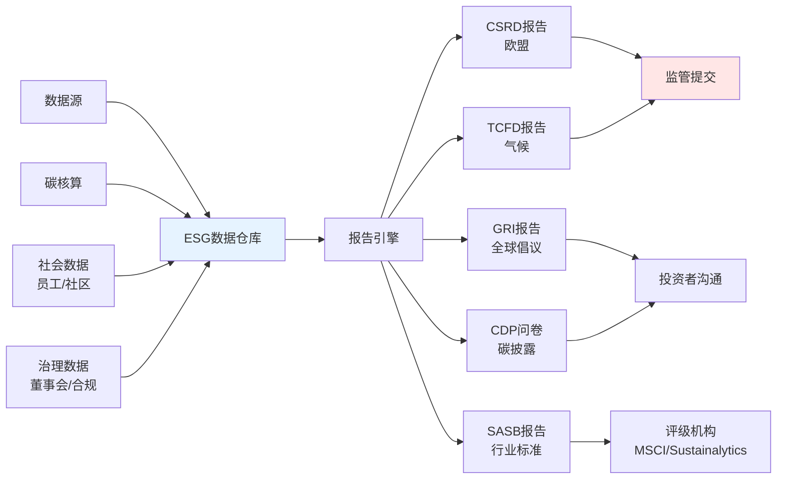

# J. ESG 与碳市场方案

## 方案概述

本方案为企业提供 ESG（环境、社会、治理）数据采集、碳核算、碳信用代币化、碳交易市场等一体化解决方案，帮助企业实现碳中和目标、满足监管披露要求、参与碳交易变现，同时提升ESG评级。

## 业务痛点

1. **数据采集难**：ESG数据分散在多个系统，人工统计耗时且易错
2. **碳核算复杂**：不同范围（Scope 1/2/3）计算方法不一，缺乏专业知识
3. **披露压力大**：CSRD、TCFD等法规要求详细披露，报告编制成本高
4. **碳信用真实性**：传统碳市场存在双重计算、虚假项目等问题
5. **流动性不足**：自愿碳市场交易低效，价格发现困难
6. **缺乏激励**：企业减排缺少直接经济回报

## 解决方案架构



## 核心业务流程

### 1. 企业碳盘查与核算



**Scope 1/2/3定义**：

| 范围 | 定义 | 示例 | 计算难度 |
|------|------|------|----------|
| Scope 1 | 直接排放 | 工厂燃煤、公司车辆 | 低 |
| Scope 2 | 间接排放（能源） | 外购电力、蒸汽 | 中 |
| Scope 3 | 价值链排放 | 供应商、员工通勤、产品使用 | 高 |

**碳核算公式**：
```
碳排放量 = 活动数据 × 排放因子

示例:
- 电力消耗: 100,000 kWh
- 排放因子: 0.5 kg CO2e/kWh（国家电网平均）
- Scope 2排放: 50,000 kg CO2e = 50 吨

总排放（Scope 1+2+3）:
- Scope 1: 120 吨
- Scope 2: 50 吨
- Scope 3: 300 吨（最大，最难核算）
- 合计: 470 吨 CO2e
```

### 2. 碳减排项目开发与核证



**常见减排项目类型**：

| 项目类型 | 减排原理 | 示例 | 单价范围 |
|----------|----------|------|----------|
| 可再生能源 | 替代化石能源 | 风电、光伏 | $5-15/tCO2e |
| 能效提升 | 减少能耗 | LED照明、节能电机 | $8-20/tCO2e |
| 碳捕集（CCS） | 直接捕获CO2 | 工业碳捕集 | $50-100/tCO2e |
| 造林/再造林 | 固碳 | 植树造林 | $3-10/tCO2e |
| 避免毁林（REDD+） | 保护森林 | 雨林保护 | $5-15/tCO2e |
| 甲烷回收 | 减少强GHG排放 | 垃圾填埋场沼气发电 | $10-25/tCO2e |

**方法学示例（CDM方法学）**：
```
项目: 10 MW光伏电站

基线排放 = 发电量 × 电网排放因子
项目排放 = 0（无化石燃料）

年发电量 = 10 MW × 1500小时 = 15,000 MWh
电网排放因子 = 0.8 tCO2e/MWh
年减排量 = 15,000 × 0.8 = 12,000 tCO2e

10年项目期 = 120,000 tCO2e碳信用
```

### 3. 碳信用代币化



**代币化优势**：

| 特性 | 传统碳信用 | 代币化碳信用 |
|------|------------|--------------|
| 流动性 | 低（OTC为主） | 高（24/7交易） |
| 可分割性 | 整数吨（1t起） | 小数（0.01t） |
| 透明度 | 低（注册信息滞后） | 高（链上实时） |
| 交易成本 | 高（中介费5-10%） | 低（<2%） |
| 结算时间 | T+7-30 | 即时 |
| 双重计算风险 | 有（跨注册登记处） | 低（链上唯一） |

**代币标准（伪代码）**：
```solidity
contract CarbonCreditToken is ERC20 {
    struct CreditMetadata {
        string projectId;
        string methodology;  // 如 "ACM0002"
        uint256 vintage;     // 年份 2024
        string geography;    // 如 "Brazil"
        string type;         // 如 "Renewable Energy"
        bool retired;        // 是否已注销
    }
    
    mapping(uint256 => CreditMetadata) public credits;
    
    // 铸造碳信用代币（仅桥接合约可调用）
    function mint(address to, uint256 amount, CreditMetadata memory metadata) 
        external onlyBridge {
        _mint(to, amount);
        credits[totalSupply()] = metadata;
    }
    
    // 注销碳信用（用于抵消）
    function retire(uint256 amount, string memory reason) external {
        _burn(msg.sender, amount);
        emit Retired(msg.sender, amount, reason);
        // 通知链下注册登记处
    }
}
```

### 4. 企业碳抵消购买



**碳信用质量评级**：

| 评级 | 标准 | 示例项目 | 溢价 |
|------|------|----------|------|
| AAA | 额外性强+永久性+co-benefits | 直接空气捕集（DAC） | +100% |
| AA | 独立核证+长期监测 | REDD+（经VCS认证） | +50% |
| A | 标准方法学 | CDM可再生能源 | 基准 |
| B | 质量存疑 | 旧年份项目 | -30% |
| C | 高风险 | 未核证项目 | -60% |

**购买决策因素**：
```python
# 伪代码
def select_carbon_credits(budget, target_tons, preferences):
    available_credits = query_market()
    
    # 过滤
    filtered = filter(credits, lambda c:
        c.quality_score >= preferences.min_quality and
        c.vintage >= preferences.min_vintage and  # 2020+
        c.geography in preferences.allowed_regions and
        c.sdg_alignment >= preferences.min_sdg  # 联合国SDG贡献
    )
    
    # 优化组合（性价比 + 分散）
    portfolio = optimize(
        credits=filtered,
        budget=budget,
        target=target_tons,
        constraints=[
            "max_single_project": 30%,  # 分散风险
            "prefer_cobenefits": True,  # 优先有社区效益的项目
        ]
    )
    
    return portfolio
```

### 5. ESG报告自动生成



**CSRD披露要求（欧盟）**：
```yaml
csrd_report:
  environmental:
    - climate_change: 碳排放、减排目标、气候风险
    - pollution: 空气/水污染、废弃物管理
    - water: 用水量、水资源压力
    - biodiversity: 生物多样性影响
    - circular_economy: 循环经济实践
  
  social:
    - workforce: 员工多样性、培训、健康安全
    - value_chain: 供应链劳工标准
    - communities: 社区影响、人权
    - consumers: 产品安全、数据隐私
  
  governance:
    - business_conduct: 反腐败、商业道德
    - board_diversity: 董事会多样性
    - risk_management: ESG风险管理
    
  double_materiality: 
    - impact_materiality: 企业对环境/社会的影响
    - financial_materiality: ESG对企业财务的影响
```

## 核心模块说明

### 1. 碳排放因子数据库

**全球排放因子**：
```json
{
  "electricity": {
    "US": {"factor": 0.386, "unit": "kgCO2e/kWh", "source": "EPA 2023"},
    "CN": {"factor": 0.581, "unit": "kgCO2e/kWh", "source": "MEE 2024"},
    "EU": {"factor": 0.255, "unit": "kgCO2e/kWh", "source": "EEA 2024"},
    "renewable": {"factor": 0.05, "unit": "kgCO2e/kWh", "note": "生命周期"}
  },
  "fuels": {
    "gasoline": {"factor": 2.31, "unit": "kgCO2e/liter"},
    "diesel": {"factor": 2.68, "unit": "kgCO2e/liter"},
    "natural_gas": {"factor": 2.03, "unit": "kgCO2e/m³"}
  },
  "transport": {
    "air_short": {"factor": 0.255, "unit": "kgCO2e/km"},
    "air_long": {"factor": 0.195, "unit": "kgCO2e/km"},
    "sea_freight": {"factor": 0.010, "unit": "kgCO2e/ton·km"},
    "truck": {"factor": 0.062, "unit": "kgCO2e/ton·km"}
  }
}
```

### 2. 卫星遥感监测

**应用场景**：
- **森林碳汇项目**：监测森林覆盖率变化，防止非法砍伐
- **可再生能源**：验证光伏板/风机是否正常运行
- **甲烷排放**：检测油气田甲烷泄漏
- **土地利用变化**：REDD+项目基线监测

**技术实现**：
```
数据源:
- Sentinel-2（欧空局，10m分辨率）
- Landsat-8/9（NASA/USGS，30m）
- Planet Labs（商业，3m）

分析:
- NDVI（归一化植被指数）→ 森林健康度
- SAR（合成孔径雷达）→ 穿透云层
- 甲烷检测卫星（GHGSat）→ 甲烷浓度

预言机:
卫星数据 → API → Chainlink预言机 → 智能合约
```

### 3. 碳信用注册登记处桥接

**传统注册登记处**：
- **Verra（VCS）**：全球最大自愿碳市场注册处
- **Gold Standard**：高质量碳信用标准
- **American Carbon Registry (ACR)**
- **Climate Action Reserve (CAR)**
- **国家CDM注册处**（各国）

**桥接机制**：
```
1. 项目方在传统注册处注销碳信用
2. 注销证书上传到桥接合约（Oracle验证）
3. 桥接合约铸造等量链上代币
4. 代币持有者注销时，通知传统注册处标记"已退役"

防止双重计算:
- 传统注册处标记"已桥接"
- 链上代币注销时，传统注册处同步标记
- 审计轨迹完整记录
```

### 4. 碳信用NFT

**项目级NFT**（非同质化）：
```solidity
// 伪代码
struct CarbonProjectNFT {
    string projectName;
    string location;
    uint256 totalCredits;  // 总减排量
    uint256 vintage;
    string[] sdgs;  // SDG贡献
    string verifier;  // 核证机构
    string methodology;
    string documentation;  // IPFS链接
}

// 用途
- 碳项目所有权凭证
- 收藏价值（如标志性环保项目）
- 碎片化所有权（多个投资者共同持有项目）
```

### 5. 动态碳定价

**市场定价机制**：
```
影响因素:
1. 合规市场价格（EU ETS作为锚定）
2. 质量溢价（高质量项目+20-100%）
3. 供需关系（自愿市场需求增长）
4. 年份折扣（旧年份项目-20%）
5. 地理偏好（本地项目溢价）

动态调整:
- 实时订单簿（Bid/Ask）
- 自动做市商（AMM）：恒定乘积 x*y=k
- 预言机喂价（链下市场价格）
```

## 应用场景示例

### 场景1：企业碳中和路径

**企业**：制造业公司，年排放10,000 tCO2e

**方案**：
1. **基准年（2024）**：碳盘查，确定排放10,000 t
2. **2025-2027**：内部减排30%（能效、可再生能源）
3. **2028-2030**：内部减排累计50%，剩余5,000 t购买碳信用
4. **2030**：实现碳中和
5. **2031+**：维持净零，出售富余碳信用

**投资回报**：
- 内部减排投资：$500K（光伏+节能设备）
- 节省能源成本：$100K/年
- 购买碳信用：$50K/年（5,000 t × $10）
- ROI：5年回本 + 长期节省

### 场景2：碳信用资产管理

**角色**：碳资产投资基金

**策略**：
1. 购买早期碳项目的未来碳信用（折价）
2. 持有至项目产生实际减排并核证
3. 代币化后在市场出售（溢价）
4. 收益：折价买入+溢价卖出+市场增值

**示例**：
- 投资巴西REDD+项目，$3/t购买未来10年碳信用
- 项目运行后核证，碳信用市价$12/t
- 代币化出售，实际成交$15/t（流动性溢价）
- 回报：5倍

### 场景3：个人碳足迹抵消

**场景**：消费者购买机票，自愿碳抵消

**流程**：
1. 航空公司计算航班碳足迹：1.2 tCO2e
2. 提示用户抵消选项：$18（$15/t）
3. 用户支付后，自动购买1.2 CCT并注销
4. 用户获得碳中和证书NFT（收藏+社交展示）

**B2C碳抵消市场**：
- 航空（最大）
- 电商（包裹配送）
- 活动（演唱会、会议）
- 订阅服务（"碳中和会员"）

### 场景4：绿色债券发行

**发行方**：可再生能源项目

**方案**：
1. 发行绿色债券（Green Bond），融资$10M
2. 债券条款：年化5%，期限10年
3. 还款来源：碳信用销售收入
4. 链上发行（STO），降低发行成本
5. 碳信用作为抵押品，增强信用

**投资者收益**：
- 固定收益：5%/年
- ESG标签：满足ESG投资配置需求
- 流动性：链上交易，随时退出

## 技术组件

### 智能合约架构

```
CarbonCredit.sol            # 碳信用代币
├── ERC20Burnable          # 可销毁（注销）
├── Metadata               # 项目元数据
├── Vintage                # 年份管理
└── Retirement             # 注销记录

CarbonMarketplace.sol      # 碳交易市场
├── OrderBook              # 订单簿
├── AMM                    # 自动做市商
├── Auction                # 拍卖
└── OffsetService          # 碳抵消服务

ESGDataOracle.sol          # ESG数据预言机
├── CarbonFootprint        # 碳足迹
├── SatelliteVerification  # 卫星验证
├── AuditorSignature       # 审计机构签名
└── ReportingStandards     # 报告标准
```

### 技术栈

- **区块链**：Polygon、Celo（低成本+环保）
- **存储**：IPFS（项目文档）、Arweave（永久记录）
- **预言机**：Chainlink（价格）、Tellor（卫星数据）
- **后端**：Python（碳核算）、Node.js（API）
- **前端**：React、D3.js（可视化）
- **数据分析**：Pandas、NumPy（排放建模）

## 合规与标准

### 国际标准

| 标准 | 机构 | 适用 |
|------|------|------|
| ISO 14064 | ISO | GHG核算与报告 |
| GHG Protocol | WRI/WBCSD | 企业碳核算（事实标准） |
| VCS | Verra | 自愿碳市场项目标准 |
| Gold Standard | GS | 高质量碳信用+SDG |
| CSRD | EU | 欧盟企业可持续披露 |
| TCFD | FSB | 气候相关财务披露 |

### 监管合规

**欧盟ETS**：
- 企业配额制
- 超额排放需购买配额
- 配额价格：€60-100/tCO2e（2024）

**中国碳市场**：
- 全国碳市场（发电行业）
- 地方试点（北京、上海等）
- 配额+CCER（中国核证自愿减排量）

**美国**：
- 加州总量控制（Cap-and-Trade）
- 联邦层面：税收抵免（IRA法案）

## 交付成果与KPI

### 核心KPI

| 指标 | 目标值 | 说明 |
|------|--------|------|
| 碳核算准确度 | >95% | vs 第三方审计 |
| 报告生成时间 | <1周 | vs 传统3-6个月 |
| 碳信用流动性 | 日成交>100笔 | 市场活跃度 |
| 双重计算率 | <0.1% | 链上唯一性 |
| ESG评级提升 | +10分 | MSCI/Sustainalytics |
| 客户减排量 | 累计>10万吨 | 环境影响 |

### 交付物清单

**第一阶段（MVP，6-8周）**
- [ ] 碳盘查工具（Scope 1/2）
- [ ] 基础碳核算
- [ ] ESG报告模板（GRI）
- [ ] 碳信用代币化（简单ERC20）
- [ ] Web门户

**第二阶段（Pro，8-14周）**
- [ ] Scope 3核算（供应链）
- [ ] 碳交易市场
- [ ] 项目NFT
- [ ] 卫星遥感集成
- [ ] CSRD/TCFD报告

**第三阶段（Enterprise，14-24周）**
- [ ] 多法域合规（EU/US/CN）
- [ ] AI减排建议
- [ ] 碳资产组合优化
- [ ] API生态（ERP/IoT对接）
- [ ] 碳保险产品

## 风险与应对

| 风险类型 | 描述 | 缓解措施 |
|----------|------|----------|
| 数据质量 | 企业数据不准确 | 第三方审计、IoT自动化采集 |
| 洗绿风险 | 虚假ESG声明 | 独立核证、链上透明度 |
| 监管变化 | 碳市场政策调整 | 灵活架构、多标准支持 |
| 市场波动 | 碳价格大幅波动 | 对冲工具、分散购买 |
| 技术风险 | 卫星数据失真 | 多数据源、交叉验证 |

## 成功案例参考

1. **Toucan Protocol**：代币化碳信用，桥接Verra注册处
2. **KlimaDAO**：碳信用储备支撑的算法碳货币
3. **Moss.Earth**：巴西亚马逊REDD+项目，代币化碳信用
4. **Nori**：碳移除市场，农业土壤固碳
5. **Pachama**：AI+卫星监测森林碳汇项目

## 下一步行动

1. **碳盘查**（2-4周）
   - 数据收集（能源、差旅、采购）
   - Scope 1/2/3计算
   - 识别减排机会

2. **减排策略设计**（2-3周）
   - 内部减排路线图
   - 碳抵消策略
   - 预算规划

3. **平台部署**（6-12周）
   - 碳核算系统
   - 报告自动化
   - 碳交易对接

4. **持续运营**
   - 季度/年度碳核算
   - ESG报告披露
   - 碳中和认证

---

**联系方式**：
- ESG咨询：[邮箱/专家团队]
- 碳核算服务：[在线计算器]
- 碳信用交易：[交易平台]

