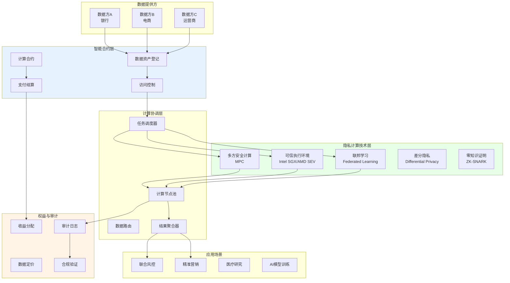
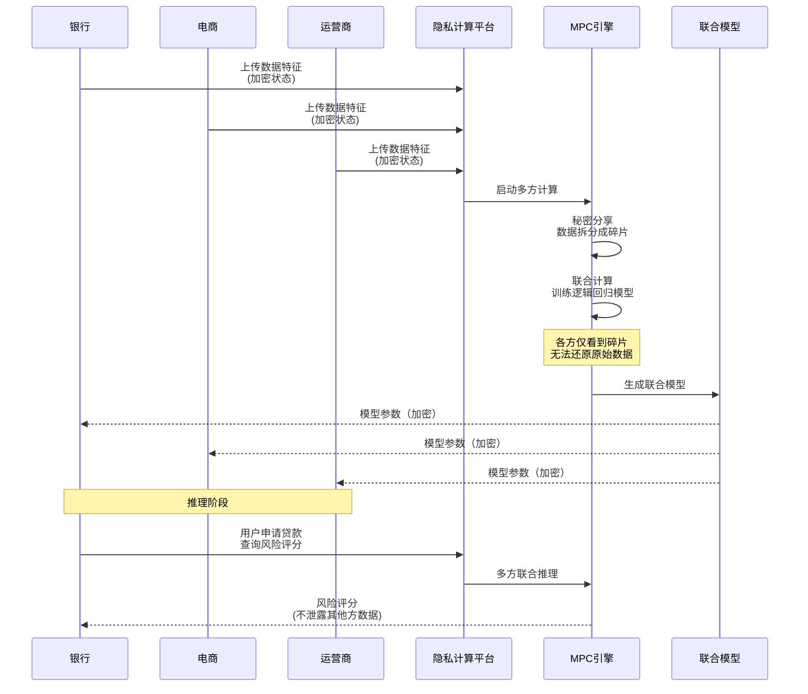
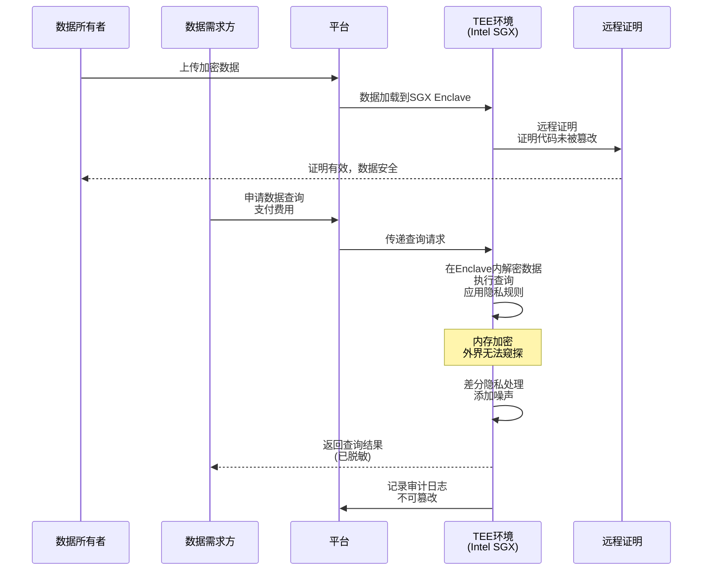
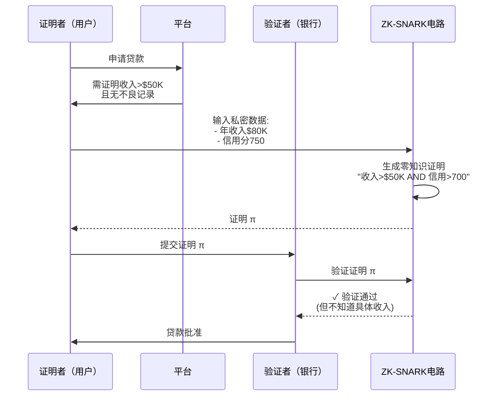
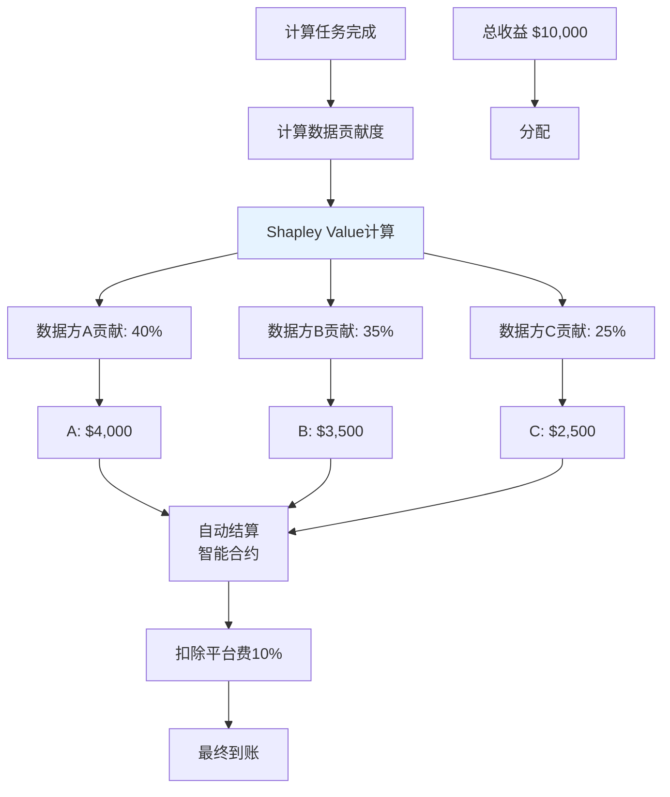

# K. 数据协作与隐私计算方案

## 方案概述

本方案为跨组织数据协作提供隐私保护技术方案，利用多方安全计算（MPC）、可信执行环境（TEE）、联邦学习、零知识证明等技术，实现"数据可用不可见"，支持金融风控、医疗研究、营销联盟等场景的数据联合计算。

## 业务痛点

1. **数据孤岛**：各组织数据割裂，无法联合分析产生更大价值
2. **隐私合规**：GDPR、PIPL等法规限制数据共享
3. **信任缺失**：担心数据泄露给竞争对手
4. **技术复杂**：传统加密技术性能差，难以实用化
5. **利益分配难**：数据贡献度难以量化，收益分配不公
6. **审计困难**：数据使用无法追溯，合规风险高

## 解决方案架构



## 核心业务流程

### 1. 联合风控建模



**联合建模价值**：

| 单方数据 | 联合数据（3方） | 提升 |
|----------|-----------------|------|
| 银行信用数据 | +电商消费+运营商行为 | - |
| 模型AUC: 0.72 | 模型AUC: 0.85 | +18% |
| 坏账率: 5% | 坏账率: 2.5% | ↓50% |

### 2. 可信执行环境（TEE）数据查询



**TEE优势**：
- **性能高**：接近原生计算速度（vs MPC慢100-1000倍）
- **编程友好**：可运行普通程序（C/Python）
- **硬件保护**：CPU级别隔离
- **远程证明**：数据方可验证计算环境安全

**TEE技术对比**：

| 技术 | 厂商 | 成熟度 | 性能 | 安全性 |
|------|------|--------|------|--------|
| Intel SGX | Intel | 高 | 95% | 中（有侧信道攻击） |
| AMD SEV | AMD | 中 | 98% | 高 |
| ARM TrustZone | ARM | 高 | 99% | 中 |
| AWS Nitro Enclaves | AWS | 中 | 90% | 高 |

### 3. 联邦学习（Federated Learning）

```mermaid
graph TB
    A[中心服务器<br/>初始模型] --> B[分发模型]
    
    B --> C[医院A<br/>本地训练]
    B --> D[医院B<br/>本地训练]
    B --> E[医院C<br/>本地训练]
    
    C --> F[上传梯度<br/>(加密)]
    D --> F
    E --> F
    
    F --> G[聚合梯度<br/>差分隐私]
    G --> H[更新全局模型]
    
    H --> I{收敛?}
    I -->|否| B
    I -->|是| J[最终模型]
    
    style C fill:#e6ffe6
    style D fill:#e6ffe6
    style E fill:#e6ffe6
```

**联邦学习场景：医疗AI**
```
问题: 训练疾病诊断AI，但医疗数据高度敏感，无法集中

方案:
1. 每家医院本地训练模型（数据不出院）
2. 仅上传模型梯度（加密）
3. 中心服务器聚合梯度，更新全局模型
4. 下发新模型，继续迭代

隐私保护:
- 梯度加密（同态加密/秘密分享）
- 差分隐私（梯度添加噪声）
- 安全聚合（多方计算聚合梯度）

效果:
- 模型效果等同于集中训练
- 数据全程不出本地
- 符合HIPAA/GDPR
```

### 4. 零知识证明（ZKP）数据验证



**ZKP应用场景**：
1. **选择性披露**：证明年龄>18，但不暴露生日
2. **合规证明**：证明资金来源合法，但不透露具体交易
3. **资格验证**：证明信用评分达标，但不暴露分数
4. **匿名投票**：证明有投票权且未重复投票

### 5. 数据定价与收益分配



**Shapley Value原理**：
```python
# 伪代码
def shapley_value(data_sources, model_performance):
    """
    计算每个数据源的边际贡献
    """
    contributions = {}
    
    # 遍历所有数据源组合
    for source in data_sources:
        marginal_value = 0
        
        # 计算该数据源的边际贡献
        for coalition in all_coalitions_without(source):
            performance_without = train_model(coalition)
            performance_with = train_model(coalition + [source])
            
            marginal_value += (performance_with - performance_without) * weight(coalition)
        
        contributions[source] = marginal_value
    
    return contributions

# 示例
数据方A单独: AUC = 0.70
数据方B单独: AUC = 0.68
A+B联合: AUC = 0.85

Shapley Value:
A的贡献 = (0.85 - 0.68) + (0.70 - 0) / 2 = 0.52
B的贡献 = (0.85 - 0.70) + (0.68 - 0) / 2 = 0.49

收益分配 ≈ 52% : 48%
```

## 核心模块说明

### 1. 多方安全计算（MPC）

**秘密分享方案**：
```
Shamir秘密分享 (t-out-of-n):
- 秘密 S 拆分成 n 份
- 任意 t 份可恢复秘密
- 少于 t 份无法获得任何信息

示例 (2-out-of-3):
秘密: S = 42

拆分:
- 份额1: (1, 23)
- 份额2: (2, 15)
- 份额3: (3, 7)

分发给3个计算方，任意2方可联合计算
```

**MPC加法/乘法电路**：
```
加法:
[[a]] + [[b]] = [[a+b]]
各方本地相加份额即可

乘法（复杂）:
[[a]] × [[b]] = [[a×b]]
需要交互式协议（如Beaver三元组）

复杂度:
- 加法: O(1)
- 乘法: O(n²) 通信
- 深度电路: 轮数增加，延迟高
```

### 2. 差分隐私（Differential Privacy）

**原理**：
```
查询结果添加噪声，使得单条记录无法被识别

定义:
对于相邻数据集 D 和 D'（仅差1条记录），
算法 M 满足ε-差分隐私，如果：

P[M(D) = r] ≤ e^ε × P[M(D') = r]

ε越小，隐私保护越强（但效用下降）
```

**实现方式**：

| 机制 | 适用 | 噪声类型 |
|------|------|----------|
| Laplace机制 | 数值查询 | Lap(Δf/ε) |
| 指数机制 | 选择查询 | 指数分布 |
| 高斯机制 | 数值查询 | N(0, σ²) |

**应用示例**：
```python
# 伪代码：统计平均工资（差分隐私）
def private_average_salary(salaries, epsilon=0.1):
    true_avg = sum(salaries) / len(salaries)
    sensitivity = (max_salary - min_salary) / len(salaries)
    noise = laplace_noise(scale=sensitivity/epsilon)
    return true_avg + noise

# 真实平均: $75,000
# 查询结果: $74,850（添加噪声）
# 隐私保护: 单个人工资无法被推断
```

### 3. 同态加密（Homomorphic Encryption）

**类型**：

| 类型 | 支持运算 | 性能 | 实用性 |
|------|----------|------|--------|
| 部分同态（PHE） | 仅加法或乘法 | 快 | 高（如Paillier） |
| 有限同态（SHE） | 有限次加法+乘法 | 中 | 中 |
| 全同态（FHE） | 任意计算 | 慢（10^6倍） | 低（研究阶段） |

**Paillier加密（加法同态）**：
```
特性: Enc(a) + Enc(b) = Enc(a+b)

应用: 安全求和
- 各方加密自己的数据
- 服务器累加密文（无需解密）
- 结果持有者解密得到总和

示例: 多家医院统计COVID患者总数
- 医院A: Enc(120)
- 医院B: Enc(85)
- 医院C: Enc(200)
- 累加: Enc(405)
- 解密: 405（各医院数据仍保密）
```

### 4. 可编程数据室（Data Clean Room）

**功能**：
```
安全环境，允许多方在受控条件下协作分析数据

规则引擎:
1. 白名单查询（仅允许预定义查询）
2. 结果过滤（k-匿名性，至少k条记录才返回）
3. 频率限制（防止攻击者通过多次查询推断）
4. 审计追踪（所有查询记录链上存储）

示例查询:
✓ "统计25-34岁男性用户数"（聚合查询）
✗ "列出所有25岁男性用户姓名"（个体查询）
✓ "返回>1000人的城市分布"（k-匿名）
✗ "返回所有城市分布"（可能暴露小城市个人）
```

### 5. 数据使用审计

**链上审计日志**：
```json
{
  "audit_id": "audit-12345",
  "timestamp": "2025-10-21T10:30:00Z",
  "data_source": "Bank-A-Customer-DB",
  "requester": "Fintech-Company-B",
  "purpose": "Credit Risk Assessment",
  "query_type": "ML Model Training",
  "data_scope": {
    "records": 50000,
    "features": ["age", "income", "credit_history"],
    "privacy_tech": "Federated Learning + Differential Privacy"
  },
  "consent": {
    "user_consent": true,
    "consent_mechanism": "Opt-in",
    "consent_expiry": "2026-10-21"
  },
  "result": {
    "model_auc": 0.82,
    "data_contribution": 0.35
  },
  "payment": {
    "amount": "$5000",
    "tx_hash": "0xabc..."
  },
  "merkle_root": "0xdef...",  // 链上存储
  "ipfs_link": "ipfs://QmXyz..."  // 详细日志
}
```

**监管审查**：
- 监管机构可查询特定用户数据被使用情况
- 用户可查询自己数据授权记录
- 自动生成合规报告（GDPR数据处理记录）

## 应用场景示例

### 场景1：银行联合反欺诈

**参与方**：多家银行

**问题**：欺诈团伙跨行作案，单家银行数据无法识别

**方案**：
1. 各银行上传可疑交易特征（MPC加密）
2. 联合训练欺诈检测模型
3. 实时查询：某用户在其他行是否有欺诈记录
4. 返回风险评分（不泄露具体银行或交易细节）

**价值**：
- 欺诈识别率提升40%
- 跨行欺诈损失减少60%
- 数据不出行，满足监管

### 场景2：广告联盟精准投放

**参与方**：电商平台 + 社交媒体 + 搜索引擎

**问题**：用户在不同平台行为割裂，难以精准投放

**方案**：
1. 各平台数据留在本地
2. 联邦学习训练用户兴趣模型
3. 广告主提交投放需求
4. MPC匹配目标用户（不暴露用户ID）
5. 各平台向匹配用户展示广告

**隐私保护**：
- 平台间不共享用户数据
- 广告主不知道用户在哪些平台
- 用户不被跟踪（vs 传统cookie）

**效果**：
- 转化率提升25%
- 广告支出ROI提升30%

### 场景3：药物研发数据联合

**参与方**：多家制药公司、医院

**问题**：临床数据分散，样本量不足影响研发

**方案**：
1. 各方贡献数据（患者基因组、病历、用药反应）
2. 联邦学习训练药物效果预测模型
3. TEE环境进行联合统计分析
4. 差分隐私保护个体隐私

**合规**：
- 符合HIPAA（美国医疗隐私法）
- 患者知情同意（链上记录）
- 数据不离开医院

**价值**：
- 研发周期缩短30%
- 药物成功率提升15%
- 节省临床试验成本$10M+

### 场景4：供应链ESG数据协作

**参与方**：品牌商 + 供应商 + 第三方审计

**问题**：供应商不愿分享敏感运营数据（能耗、排放、工资）

**方案**：
1. 供应商上传加密数据
2. 零知识证明：证明符合ESG标准（如"碳排放<阈值"）
3. 第三方审计在TEE中验证
4. 品牌商获得合规证明，但不知具体数据

**激励**：
- 高ESG评分供应商获得订单优先权
- 数据贡献者获得代币奖励

## 技术组件

### 智能合约架构

```
PrivacyCompute.sol          # 隐私计算核心
├── DataRegistry            # 数据资产登记
├── AccessControl           # 访问控制（RBAC+ABAC）
├── ComputeTask             # 计算任务管理
└── PaymentEscrow           # 支付托管

DataMarketplace.sol         # 数据市场
├── Pricing                 # 动态定价
├── RevenueShare            # 收益分配（Shapley）
├── Reputation              # 数据质量评分
└── Dispute                 # 争议解决

AuditTrail.sol              # 审计轨迹
├── EventLogger             # 事件记录
├── ConsentManagement       # 同意管理
├── ComplianceCheck         # 合规检查
└── RegulatoryReporting     # 监管报送
```

### 技术栈

- **MPC框架**：MP-SPDZ、Sharemind、PySyft
- **TEE**：Intel SGX SDK、Occlum（容器化）
- **联邦学习**：TensorFlow Federated、PySyft、FATE
- **同态加密**：SEAL（Microsoft）、HElib、Paillier
- **ZKP**：Circom、snarkjs、ZoKrates
- **区块链**：以太坊L2、Hyperledger Fabric
- **后端**：Python（ML）、Go（高性能）

## 合规与标准

### 数据保护法规

| 法规 | 地区 | 关键要求 |
|------|------|----------|
| GDPR | 欧盟 | 数据最小化、用途限定、同意管理 |
| PIPL | 中国 | 个人信息处理规则、跨境传输限制 |
| HIPAA | 美国 | 医疗数据保护、审计追踪 |
| CCPA | 加州 | 数据删除权、选择退出权 |

### 隐私增强技术标准

- **ISO/IEC 20889**：隐私增强数据去标识化技术
- **NIST Privacy Framework**：隐私风险管理
- **IEEE P7002**：数据隐私过程标准

## 交付成果与KPI

### 核心KPI

| 指标 | 目标值 | 说明 |
|------|--------|------|
| 计算性能损失 | <20% | vs 明文计算 |
| 隐私保护强度 | ε<1.0 | 差分隐私参数 |
| 数据泄露事件 | 0 | 零泄露目标 |
| 合规覆盖率 | 100% | 所有计算有审计 |
| 数据方满意度 | >85% | 愿意持续合作 |
| 模型效果提升 | >15% | vs 单方数据 |

### 交付物清单

**第一阶段（MVP，10-14周）**
- [ ] TEE数据查询服务
- [ ] 基础MPC（加法/比较）
- [ ] 简单联邦学习（逻辑回归）
- [ ] 数据资产登记
- [ ] 审计日志

**第二阶段（Pro，14-22周）**
- [ ] 高级MPC（神经网络训练）
- [ ] 差分隐私集成
- [ ] 同态加密查询
- [ ] 数据定价与分成
- [ ] 可编程数据室

**第三阶段（Enterprise，22-36周）**
- [ ] 跨平台联邦学习
- [ ] ZKP合规证明
- [ ] 自动化合规报告
- [ ] 数据交易市场
- [ ] 多法域合规

## 风险与应对

| 风险类型 | 描述 | 缓解措施 |
|----------|------|----------|
| 侧信道攻击 | TEE可能被侧信道攻击破解 | 定期安全更新、多技术组合 |
| 性能瓶颈 | MPC/FHE性能差 | 混合架构、硬件加速 |
| 数据质量 | 垃圾数据影响模型 | 数据质量评分、激励机制 |
| 法律风险 | 跨境数据流动限制 | 本地化部署、数据驻留 |
| 协调成本 | 多方协作沟通成本高 | 标准化接口、自动化流程 |

## 成功案例参考

1. **蚂蚁链摩斯**：多方安全计算平台，应用于金融风控
2. **百度PaddleFL**：联邦学习框架，医疗AI应用
3. **Microsoft Azure Confidential Computing**：TEE云服务
4. **Google联邦学习**：安卓键盘输入预测
5. **Oasis Labs**：隐私计算公链

## 下一步行动

1. **需求分析**（1-2周）
   - 识别数据协作场景
   - 评估隐私风险等级
   - 确定技术方案

2. **PoC验证**（4-6周）
   - 小规模数据测试
   - 性能基准测试
   - 安全性验证

3. **生产部署**（10-14周）
   - 平台开发
   - 多方联调
   - 试点项目

4. **规模化**
   - 生态伙伴招募
   - 标准化推广
   - 持续优化

---

**联系方式**：
- 技术咨询：[邮箱/专家团队]
- 隐私合规：[法律顾问]
- Demo演示：24小时内安排

