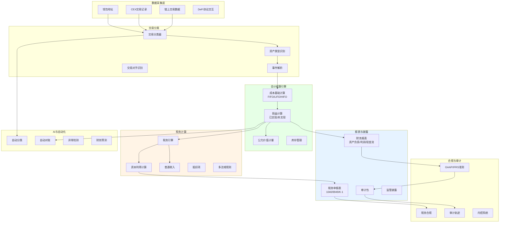
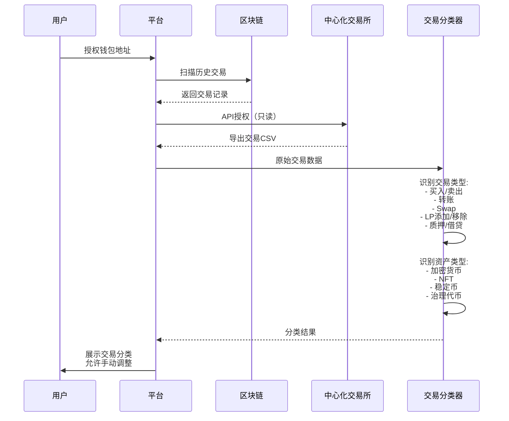
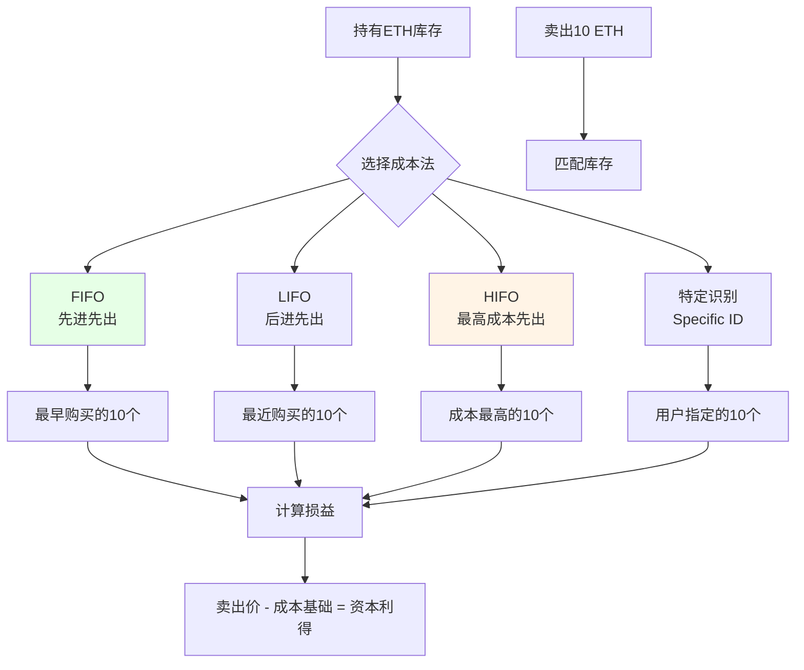
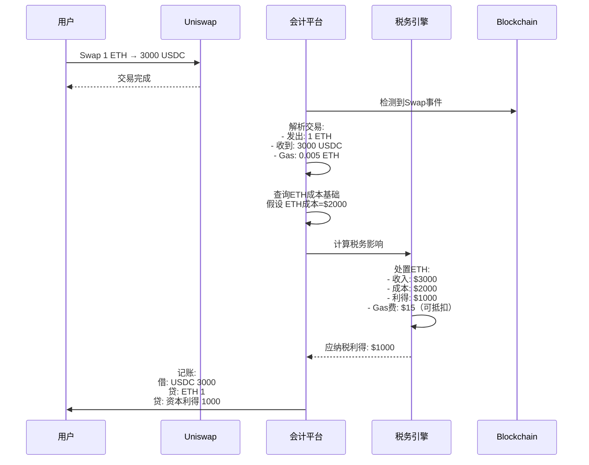
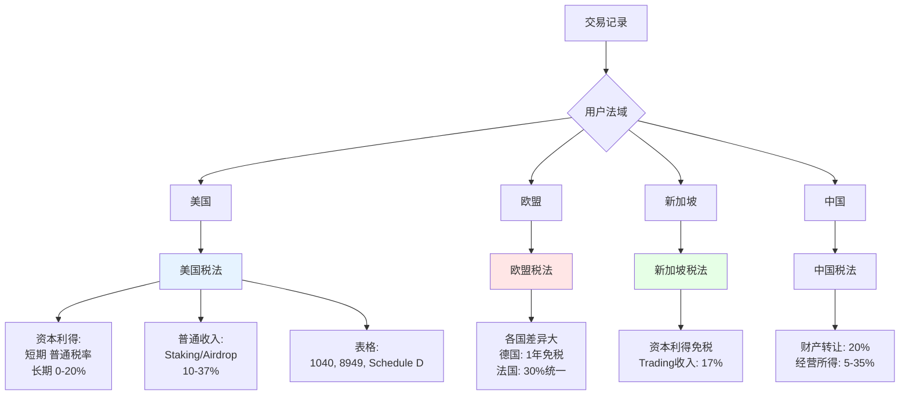
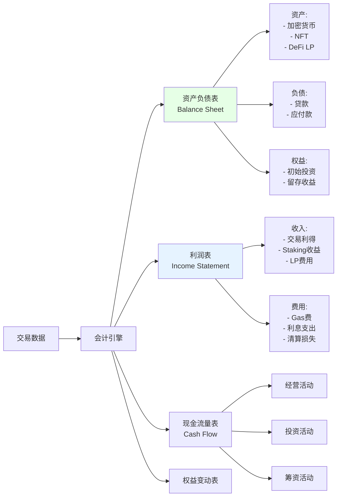

# L. 税务、会计与报告方案

## 方案概述

本方案为Web3企业、加密资产持有者、DeFi参与者提供专业的税务会计解决方案，实现链上交易自动记账、多币种成本计算、税务报表生成、合规披露等功能，满足全球主要法域的会计准则与税务要求。

## 业务痛点

1. **交易量大**：DeFi用户年交易可达数千笔，人工记账不现实
2. **跨链复杂**：资产分散在多链、多协议，难以统一核算
3. **成本基础难算**：加密货币成本法（FIFO/LIFO/特定识别）复杂
4. **税法不明确**：各国加密税法差异大，合规风险高
5. **审计困难**：传统审计师不熟悉区块链，审计成本高
6. **实时性差**：传统会计按月度/季度，无法实时掌握财务状况

## 解决方案架构



## 核心业务流程

### 1. 交易数据采集与分类



**交易类型分类**：

| 交易类型 | 税务处理 | 会计处理 | 示例 |
|----------|----------|----------|------|
| 买入 | 成本基础建立 | 资产增加 | CEX购买ETH |
| 卖出 | 资本利得/损失 | 资产减少+损益 | 卖出ETH换USDC |
| Swap | 应税事件（大部分法域） | 资产交换 | Uniswap: ETH→USDT |
| 转账（自己钱包间） | 非应税 | 内部转移 | 钱包A→钱包B |
| 空投/分叉 | 普通收入（FMV） | 资产增加 | 收到空投代币 |
| 质押收益 | 普通收入 | 利息收入 | Staking奖励 |
| 挖矿 | 普通收入/自雇收入 | 营业收入 | PoW挖矿 |
| 赠与 | 不同法域差异大 | 资产减少 | 赠送NFT给朋友 |
| LP手续费 | 普通收入 | 投资收益 | Uniswap LP费用 |

### 2. 成本基础计算（Cost Basis）



**成本法示例**：

```
库存:
2024-01-01: 买入10 ETH @$2000 = $20,000
2024-06-01: 买入5 ETH @$2500 = $12,500
2024-09-01: 买入8 ETH @$3000 = $24,000

2024-10-01: 卖出10 ETH @$3500 = $35,000

FIFO（先进先出）:
成本 = 10 ETH × $2000 = $20,000
利得 = $35,000 - $20,000 = $15,000

LIFO（后进先出）:
成本 = 8×$3000 + 2×$2500 = $29,000
利得 = $35,000 - $29,000 = $6,000

HIFO（最高成本先出，税务最优）:
成本 = 8×$3000 + 2×$2500 = $29,000
利得 = $35,000 - $29,000 = $6,000

特定识别:
用户选择：8个$3000的 + 2个$2000的
成本 = 8×$3000 + 2×$2000 = $28,000
利得 = $35,000 - $28,000 = $7,000
```

**税务优化策略**：
- 短期持有（<1年）：高税率（普通收入税率）
- 长期持有（≥1年）：低税率（资本利得税率，美国0-20%）
- **策略**：优先卖出长期持有的、高成本基础的资产

### 3. DeFi交易处理



**复杂DeFi场景**：

**流动性挖矿（LP）**：
```
1. 添加流动性: ETH + USDC → LP代币
   会计: 资产交换（ETH/USDC → LP）
   税务: 可能触发应税事件（法域依赖）

2. 持有LP，赚取手续费
   会计: 利息收入累计
   税务: 普通收入（实现时）

3. 移除流动性: LP → ETH + USDC
   会计: 资产交换（LP → ETH/USDC）
   税务: 
   - 计算LP代币的利得/损失
   - ETH/USDC相对添加时的价值变化
```

**借贷协议（Aave）**：
```
1. 存入抵押品（ETH）
   会计: 资产转换（ETH → aETH）
   税务: 非应税（仅形式变化）

2. 借出稳定币（USDC）
   会计: 负债增加
   税务: 非应税（贷款）

3. 支付利息
   会计: 利息费用
   税务: 可抵扣（投资利息）

4. 清算
   会计: 资产减少（抵押品）+ 负债减少
   税务: 可能触发资本利得（抵押品处置）
```

### 4. 多法域税务计算



**美国税务表格生成**：
```
Form 8949 (资本资产买卖明细):
┌────────┬──────┬───────┬──────┬──────┬──────┐
│资产    │买入日│卖出日 │成本  │收入  │利得  │
├────────┼──────┼───────┼──────┼──────┼──────┤
│1 ETH   │01/15 │06/20  │$2000 │$2800 │$800  │
│0.5 BTC │03/10 │09/15  │$20K  │$22K  │$2000 │
│...     │      │       │      │      │      │
└────────┴──────┴───────┴──────┴──────┴──────┘

Schedule D (资本利得汇总):
短期资本利得总额: $5,000
长期资本利得总额: $10,000

Schedule 1 (其他收入):
Staking收入: $2,500
Airdrop收入: $1,000
```

### 5. 财务报表生成



## 核心模块说明

### 1. 公允价值计量

**定价源层级**：
```yaml
Level 1 (活跃市场报价):
  - CEX现货价格（Binance/Coinbase）
  - DEX交易对（Uniswap V3 TWAP）
  
Level 2 (可观察输入):
  - 价格预言机（Chainlink）
  - 场外报价（OTC desk）
  
Level 3 (不可观察输入):
  - 估值模型（DCF/期权定价）
  - 内部估值（无市场的NFT）

优先级: Level 1 > Level 2 > Level 3
```

**NFT估值难题**：
```
问题: 大部分NFT无活跃市场，如何计税？

方案:
1. 地板价（Floor Price）: 同系列最低价
2. 特征定价模型: 稀有度加权
3. 最近交易法: 类似NFT近期成交
4. 专家评估: 艺术品评估师

税务处理:
- 收到NFT空投: 按FMV计入普通收入
- 卖出NFT: 资本利得 = 卖价 - 成本基础
```

### 2. 成本法选择优化

**AI推荐最优成本法**：
```python
# 伪代码
def recommend_cost_method(holdings, sale_amount, tax_bracket):
    """
    根据持有情况、税率推荐最优成本法
    """
    scenarios = {}
    
    for method in ['FIFO', 'LIFO', 'HIFO', 'SpecID']:
        tax_liability = calculate_tax(holdings, sale_amount, method, tax_bracket)
        scenarios[method] = tax_liability
    
    optimal = min(scenarios, key=scenarios.get)
    
    return {
        'recommended': optimal,
        'tax_savings': scenarios['FIFO'] - scenarios[optimal],
        'scenarios': scenarios
    }

# 示例输出
{
  'recommended': 'HIFO',
  'tax_savings': $5,200,
  'scenarios': {
    'FIFO': $15,000,
    'LIFO': $11,000,
    'HIFO': $9,800,
    'SpecID': $10,500
  }
}
```

### 3. 税损收割（Tax Loss Harvesting）

**策略**：
```
原理: 卖出亏损资产，实现资本损失以抵扣利得

示例:
1. 持有 ETH，成本$3000，现价$2000（浮亏$1000）
2. 卖出 ETH，实现损失$1000
3. 立即买回 ETH（保持敞口）
4. 用$1000损失抵扣其他利得，节省税款

注意:
- 美国Wash Sale Rule（洗售规则）: 
  30天内买回"实质相同证券"损失不可抵扣
- 加密货币: IRS尚未明确是否适用洗售规则
- 保守策略: 等待31天或买入类似资产（ETH→stETH）

自动化:
- 监控投资组合
- 识别亏损资产（浮亏>$1000）
- 年底前自动税损收割
- 计算最优执行时间
```

### 4. 多币种会计

**功能货币选择**：
```
场景: DAO财库管理多币种资产

GAAP/IFRS要求:
1. 确定功能货币（通常为运营所在国货币）
2. 外币交易需折算为功能货币

示例（功能货币: USD）:
交易: 2024-01-01 用10 ETH购买服务器
- ETH市价: $2,500
- 记账: 费用 $25,000（固定）
  
2024-12-31 资产负债表日:
- 剩余 50 ETH，市价$3,000
- 重新计量: 50 × $3,000 = $150,000
- vs 历史成本: 50 × $2,500 = $125,000
- 未实现利得: $25,000（计入其他综合收益或损益）
```

### 5. 审计包生成

**审计师需求**：
```yaml
audit_package:
  transaction_detail:
    - 所有买入/卖出记录（含哈希）
    - 第三方确认（CEX账单）
    - 区块链浏览器截图
  
  cost_basis_calculation:
    - 成本法说明（FIFO/LIFO）
    - 逐笔计算明细
    - 库存调节表
  
  fair_value_support:
    - 价格来源（Coinbase/Binance）
    - 估值方法学（NFT）
    - 独立评估报告
  
  internal_controls:
    - 地址白名单（防范盗窃）
    - 多签审批流程
    - 定期盘点（余额核对）
  
  tax_compliance:
    - 税务申报表副本
    - 税款支付凭证
    - 税务意见书
```

## 应用场景示例

### 场景1：DeFi重度用户

**用户画像**：全职DeFi收益农夫，年交易5000+笔

**挑战**：
- 跨10+协议（Uniswap/Aave/Curve/Convex）
- 涉及100+代币
- LP、Staking、借贷、Swap混合
- 无法人工记账

**方案**：
1. 自动采集所有链上交易
2. AI分类（准确率>95%）
3. 自动计算成本基础（HIFO优化）
4. 生成Form 8949（500+页）
5. 估算税款：$50K → 提前规划现金流

**价值**：节省会计师费用$5K，避免税务处罚

### 场景2：NFT收藏家

**用户**：持有200+个NFT，频繁交易

**税务处理**：
- 每次买卖NFT都是应税事件
- 地板价计算收到的NFT价值
- 特征定价模型（稀有度）

**方案**：
1. 连接OpenSea、Blur等市场
2. 自动记录每笔交易
3. 实时计算成本基础
4. 地板价追踪（每日快照）
5. 生成资本利得报表

**税损收割**：
- 识别浮亏NFT
- 年底前卖出实现损失
- 抵扣其他NFT利得

### 场景3：Web3创业公司

**公司**：DAO/协议方，持有国库资产

**需求**：
- 符合GAAP财务报表（投资者要求）
- 代币发行会计处理
- 员工代币薪酬
- 审计师年度审计

**方案**：
1. **代币发行会计**：
   - 权益工具 vs 负债（取决于条款）
   - 公允价值计量
   - 披露稀释效应

2. **国库管理**：
   - 多签钱包（Gnosis Safe）自动导入
   - 实时财务报表
   - 预算vs实际分析

3. **员工薪酬**：
   - 代币Grant（授予时FMV计入费用）
   - Vesting schedule追踪
   - 税务代扣（部分法域）

4. **审计准备**：
   - 完整交易记录
   - 智能合约代码审计
   - 内控文档

### 场景4：加密矿工/验证者

**业务**：PoW挖矿或PoS验证

**税务处理**：
```
挖矿收入（美国）:
- 作为自雇收入（Self-Employment Income）
- 按收到时FMV计入收入
- 需缴纳所得税 + 自雇税（~15.3%）
- 可抵扣费用：电费、设备折旧、场地租金

成本基础:
- 挖到的币成本 = 收到时FMV
- 后续卖出：资本利得 = 卖价 - FMV

示例:
2024-01-01 挖到1 ETH, FMV=$2000
- 收入: $2000（普通收入，税率37%）
- 税款: ~$740

2024-06-01 卖出1 ETH, 价格=$2500
- 成本: $2000
- 利得: $500（资本利得，税率20%）
- 税款: $100

总税负: $840 on $2500 = 33.6%
```

## 技术组件

### 技术栈

- **区块链索引**：The Graph、Covalent API、Etherscan API
- **CEX集成**：CCXT库（统一API）
- **后端**：Python（会计逻辑）、PostgreSQL（数据库）
- **前端**：React、Recharts（可视化）
- **报表**：ReportLab（PDF生成）、XlsxWriter（Excel）
- **税务引擎**：TaxJar API（美国）、自研多法域引擎

### 数据模型

```sql
-- 交易记录表
CREATE TABLE transactions (
  id UUID PRIMARY KEY,
  tx_hash TEXT,
  chain TEXT,
  timestamp TIMESTAMP,
  type TEXT,  -- buy/sell/swap/transfer
  from_asset TEXT,
  from_amount DECIMAL,
  to_asset TEXT,
  to_amount DECIMAL,
  fee_asset TEXT,
  fee_amount DECIMAL,
  tax_category TEXT,  -- capital_gain/income/non_taxable
  cost_basis DECIMAL,
  proceeds DECIMAL,
  gain_loss DECIMAL,
  holding_period_days INT
);

-- 成本基础表（库存）
CREATE TABLE inventory (
  asset TEXT,
  acquisition_date DATE,
  amount DECIMAL,
  cost_per_unit DECIMAL,
  total_cost DECIMAL,
  PRIMARY KEY (asset, acquisition_date)
);
```

## 合规与标准

### 会计准则

| 准则 | 适用 | 加密资产处理 |
|------|------|--------------|
| US GAAP | 美国上市公司 | 无形资产（减值测试）<br/>拟FASB更新：公允价值 |
| IFRS | 国际（除美国） | IAS 38无形资产<br/>或IAS 2存货 |
| AICPA指南 | 美国私人公司 | 实务指导 |

### 税务法域

| 国家 | 资本利得税率 | 持有期要求 | 备注 |
|------|--------------|------------|------|
| 美国 | 短期：10-37%<br/>长期：0-20% | 1年 | 需报Form 8949 |
| 德国 | 0%（免税） | 1年 | 免税政策 |
| 新加坡 | 0% | 无 | 非交易性持有免税 |
| 中国 | 20% | 无 | 财产转让所得 |
| 澳大利亚 | 50%折扣 | 1年 | 长期持有可减半 |

## 交付成果与KPI

### 核心KPI

| 指标 | 目标值 | 说明 |
|------|--------|------|
| 交易分类准确率 | >95% | vs 专业会计师 |
| 成本基础计算准确度 | >99.9% | 零容忍错误 |
| 报表生成时间 | <1分钟 | 实时查询 |
| 审计通过率 | 100% | 零修正意见 |
| 用户节省时间 | >100小时/年 | vs 手动记账 |
| 税务优化收益 | 平均15% | 合法避税 |

### 交付物清单

**第一阶段（MVP，6-8周）**
- [ ] 交易自动导入（主流链+CEX）
- [ ] 基础成本计算（FIFO）
- [ ] 资本利得报表
- [ ] 美国税表（Form 8949）
- [ ] Web仪表盘

**第二阶段（Pro，8-12周）**
- [ ] 多成本法（LIFO/HIFO/SpecID）
- [ ] DeFi交易解析
- [ ] NFT估值
- [ ] 税损收割建议
- [ ] 多法域支持（EU/SG）

**第三阶段（Enterprise，12-20周）**
- [ ] 完整财务报表（GAAP/IFRS）
- [ ] 审计包自动生成
- [ ] 企业级功能（多用户/权限）
- [ ] API对接（QuickBooks/Xero）
- [ ] AI税务规划

## 风险与应对

| 风险类型 | 描述 | 缓解措施 |
|----------|------|----------|
| 税法变化 | 各国加密税法快速演变 | 法律顾问、及时更新规则引擎 |
| 分类错误 | AI误判交易类型 | 人工审核、机器学习持续优化 |
| 数据不完整 | 用户未导入所有交易 | 多渠道数据源、差异提醒 |
| 审计风险 | 审计师不认可处理方式 | 咨询Big 4、保守会计政策 |
| 隐私泄露 | 财务数据敏感 | 端到端加密、合规存储 |

## 成功案例参考

1. **CoinTracker**：个人加密税务，50万+用户
2. **Koinly**：支持20+国家税法
3. **TaxBit**：企业级，服务Coinbase/FTX
4. **ZenLedger**：DeFi专项支持
5. **Accointing**：欧洲市场领先

## 下一步行动

1. **免费税务评估**（30分钟）
   - 导入钱包地址
   - 预估税务负担
   - 识别优化机会

2. **数据清理**（1-2周）
   - 导入所有交易
   - 修正分类错误
   - 补充缺失信息

3. **报表生成**（即时）
   - 生成税务报表
   - 财务报表
   - 审计包

4. **税务优化**（持续）
   - 税损收割建议
   - 成本法优化
   - 定期税务规划

---

**联系方式**：
- 税务咨询：[CPA合作伙伴]
- 产品演示：[在线Demo]
- 免费试用：[注册链接]

