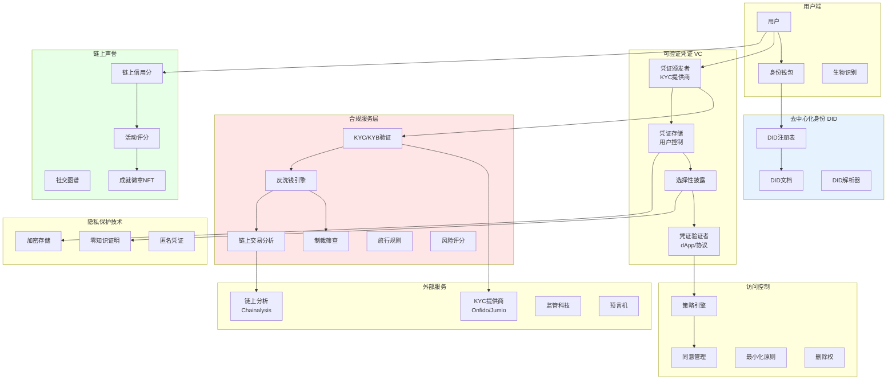
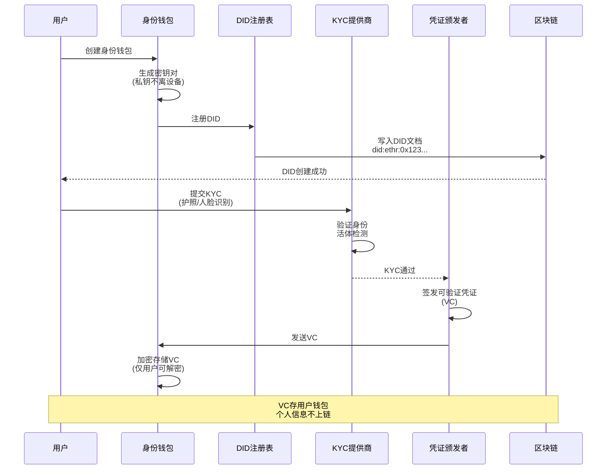
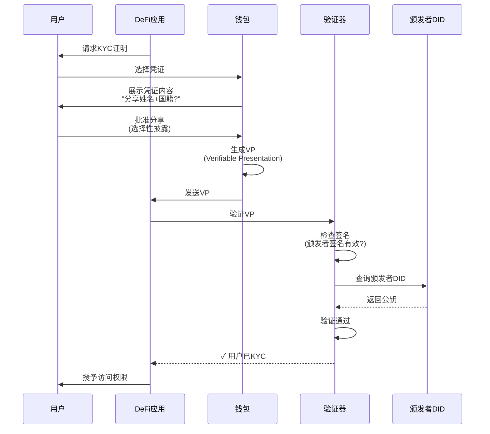
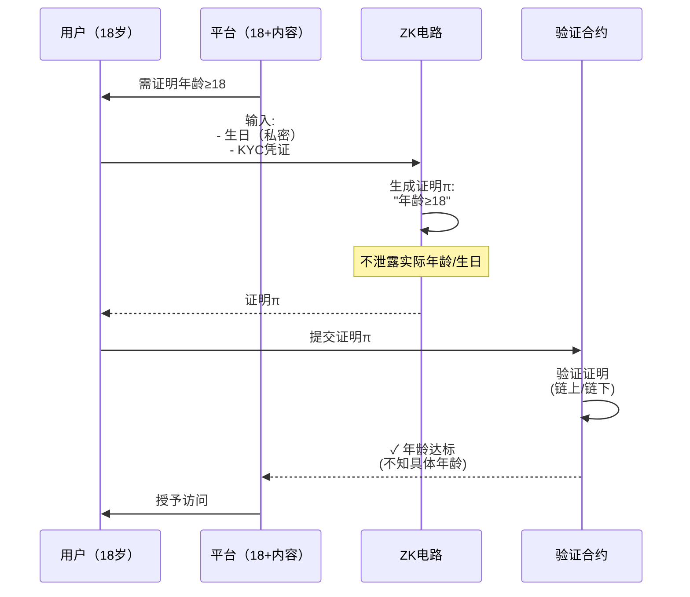
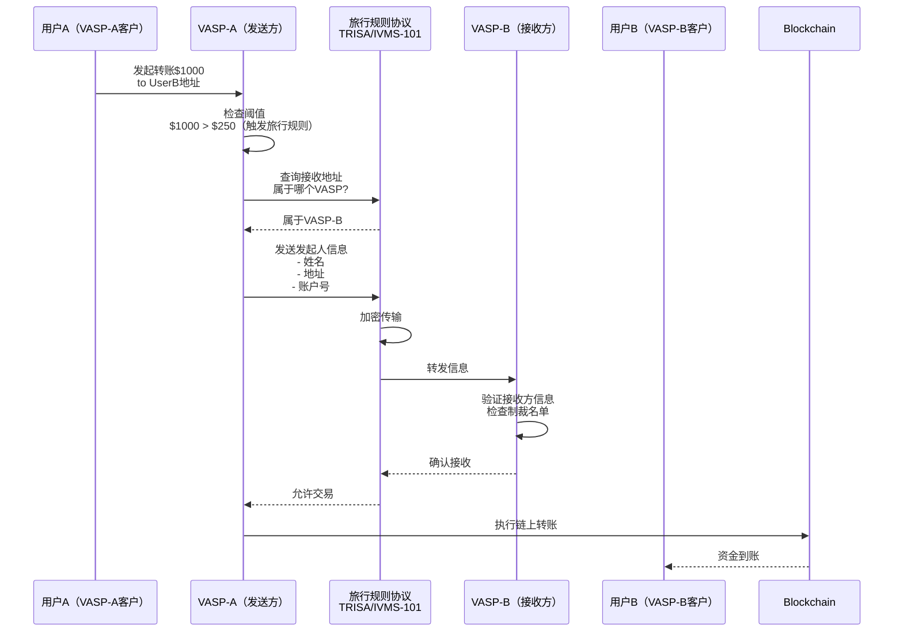
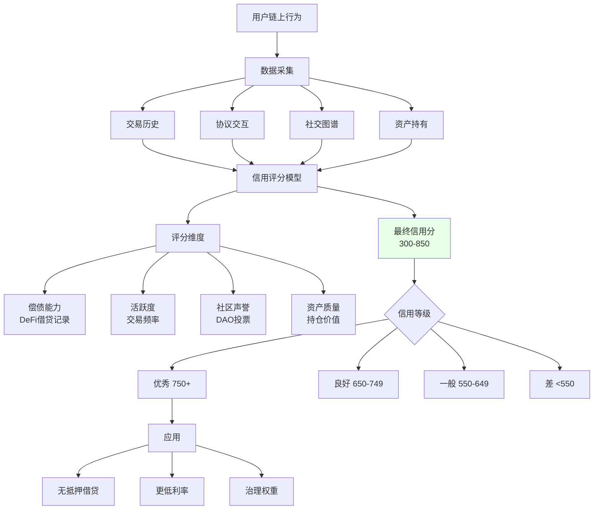

# M. 身份与合规基础设施方案

## 方案概述

本方案提供Web3原生的身份认证与合规基础设施，基于去中心化身份（DID）、可验证凭证（VC）、链上声誉系统，实现KYC/KYB、反洗钱、旅行规则、制裁筛查等合规能力，同时保护用户隐私与数据自主权。

## 业务痛点

1. **重复KYC**：用户需在每个平台重复提交身份信息，体验差
2. **隐私泄露**：中心化KYC存储敏感数据，数据泄露风险高
3. **跨境复杂**：不同法域KYC/AML要求差异大，成本高
4. **假身份泛滥**：女巫攻击、虚假账户影响协议治理
5. **合规成本高**：传统KYC服务商收费昂贵（$2-5/用户）
6. **数据孤岛**：身份数据无法跨平台复用

## 解决方案架构



## 核心业务流程

### 1. DID创建与KYC认证



**DID示例**：
```json
{
  "@context": "https://www.w3.org/ns/did/v1",
  "id": "did:ethr:0x1234567890abcdef",
  "verificationMethod": [{
    "id": "did:ethr:0x123...#key-1",
    "type": "EcdsaSecp256k1VerificationKey2019",
    "controller": "did:ethr:0x123...",
    "publicKeyHex": "0x04..."
  }],
  "authentication": ["did:ethr:0x123...#key-1"],
  "service": [{
    "type": "IdentityHub",
    "serviceEndpoint": "https://identity-hub.example.com"
  }]
}
```

### 2. 可验证凭证（VC）使用



**VC结构示例**：
```json
{
  "@context": ["https://www.w3.org/2018/credentials/v1"],
  "type": ["VerifiableCredential", "KYCCredential"],
  "issuer": "did:example:kyc-provider",
  "issuanceDate": "2025-01-01T00:00:00Z",
  "expirationDate": "2026-01-01T00:00:00Z",
  "credentialSubject": {
    "id": "did:ethr:0x123...",
    "givenName": "Alice",
    "familyName": "Smith",
    "birthDate": "1990-01-01",
    "nationality": "US",
    "kycLevel": "Full",
    "kycProvider": "Onfido",
    "verificationDate": "2025-01-01"
  },
  "proof": {
    "type": "EcdsaSecp256k1Signature2019",
    "created": "2025-01-01T00:00:00Z",
    "proofPurpose": "assertionMethod",
    "verificationMethod": "did:example:kyc-provider#key-1",
    "jws": "eyJhbGc...signature"
  }
}
```

### 3. 零知识证明（ZKP）身份验证



**ZKP应用场景**：
- **年龄证明**：>18, >21（不暴露生日）
- **国籍证明**：属于白名单国家（不暴露具体国家）
- **资产证明**：净资产>$1M（不暴露具体金额）
- **信用证明**：信用分>700（不暴露分数）
- **无犯罪记录**：通过背景调查（不暴露记录）

### 4. 旅行规则（Travel Rule）实施



**IVMS-101数据模型**（伪结构）：
```json
{
  "originator": {
    "name": "Alice Smith",
    "address": {
      "street": "123 Main St",
      "city": "New York",
      "country": "US"
    },
    "accountNumber": "VASP-A-001",
    "dateOfBirth": "1990-01-01"
  },
  "beneficiary": {
    "name": "Bob Johnson",
    "address": {...},
    "accountNumber": "VASP-B-002"
  },
  "amount": 1000,
  "currency": "USDC",
  "transactionReference": "TX-12345"
}
```

### 5. 链上信用评分



**评分因子**：
```python
# 伪代码
def calculate_credit_score(address):
    score = 300  # 基础分
    
    # 1. 借贷历史（40%权重）
    loans = get_defi_loans(address)
    if loans['total_borrowed'] > 0:
        repayment_rate = loans['repaid'] / loans['total_borrowed']
        score += repayment_rate * 200
    
    # 2. 账户年龄（15%权重）
    account_age_days = (now() - first_transaction(address)).days
    score += min(account_age_days / 10, 75)
    
    # 3. 交易活跃度（15%权重）
    tx_count = get_transaction_count(address)
    score += min(tx_count / 100, 75)
    
    # 4. 资产持有（20%权重）
    total_value = get_portfolio_value(address)
    if total_value > 100000:
        score += 100
    elif total_value > 10000:
        score += 50
    
    # 5. 社区声誉（10%权重）
    dao_participation = get_dao_votes(address)
    score += min(dao_participation * 5, 50)
    
    return min(score, 850)
```

## 核心模块说明

### 1. DID方法（DID Methods）

**常见DID方法**：

| 方法 | 示例 | 底层 | 特点 |
|------|------|------|------|
| did:ethr | did:ethr:0x123... | 以太坊 | 最广泛，ERC-1056 |
| did:pkh | did:pkh:eip155:1:0x123... | 多链 | CAIP-10兼容 |
| did:web | did:web:example.com | DNS | 易集成现有系统 |
| did:key | did:key:z6Mk... | 无链 | 自包含，不需注册 |

**did:ethr示例**：
```javascript
// 伪代码：创建DID
import { EthrDID } from 'ethr-did'

const keypair = EthrDID.createKeyPair()
const did = new EthrDID({
  address: keypair.address,
  privateKey: keypair.privateKey,
  provider: ethereumProvider
})

// 注册DID文档
await did.setAttribute({
  key: 'did/pub/Secp256k1/veriKey',
  value: keypair.publicKey
})

// 解析DID
const didDocument = await did.resolve()
```

### 2. 可验证数据注册表（VDR）

**链上注册表合约**：
```solidity
// 伪代码
contract CredentialRegistry {
    // 凭证状态
    enum Status { Active, Revoked, Suspended }
    
    // 凭证记录（仅哈希上链）
    struct CredentialRecord {
        bytes32 credentialHash;
        address issuer;
        address subject;
        Status status;
        uint256 issuedAt;
        uint256 expiresAt;
    }
    
    mapping(bytes32 => CredentialRecord) public credentials;
    
    // 颁发凭证
    function issueCredential(
        bytes32 _credentialHash,
        address _subject,
        uint256 _expiresAt
    ) external {
        require(isIssuer[msg.sender], "Not authorized issuer");
        
        credentials[_credentialHash] = CredentialRecord({
            credentialHash: _credentialHash,
            issuer: msg.sender,
            subject: _subject,
            status: Status.Active,
            issuedAt: block.timestamp,
            expiresAt: _expiresAt
        });
        
        emit CredentialIssued(_credentialHash, _subject);
    }
    
    // 吊销凭证
    function revokeCredential(bytes32 _credentialHash) external {
        require(credentials[_credentialHash].issuer == msg.sender);
        credentials[_credentialHash].status = Status.Revoked;
        emit CredentialRevoked(_credentialHash);
    }
    
    // 验证凭证状态
    function verify(bytes32 _credentialHash) external view returns (bool) {
        CredentialRecord memory cred = credentials[_credentialHash];
        return (
            cred.status == Status.Active &&
            block.timestamp < cred.expiresAt
        );
    }
}
```

### 3. 灵魂绑定代币（SBT）

**特性**：
- **不可转让**：绑定到地址，无法买卖
- **可吊销**：颁发者可吊销（如学历造假）
- **可组合**：多个SBT构建完整身份

**应用场景**：
```
教育凭证:
- 大学毕业证（SBT）
- 专业认证（SBT）
- 培训证书（SBT）

职业履历:
- 工作经历（公司颁发SBT）
- 项目贡献（DAO颁发SBT）
- 技能徽章（平台颁发SBT）

社区声誉:
- DAO成员身份
- 治理参与度徽章
- 社区贡献奖

金融信用:
- 借贷记录（DeFi协议颁发）
- 还款信誉（按时还款→信誉徽章）
```

**SBT合约示例**：
```solidity
// 伪代码
contract SoulboundToken is ERC721 {
    // 禁止转账
    function _transfer(address from, address to, uint256 tokenId) 
        internal override {
        revert("Soulbound: Transfer not allowed");
    }
    
    // 仅颁发者可销毁
    function burn(uint256 tokenId) external {
        require(msg.sender == issuer, "Only issuer can burn");
        _burn(tokenId);
    }
}
```

### 4. 隐私保护技术

**匿名凭证（Anonymous Credentials）**：
```
场景: 证明"我是某大学学生"，但不暴露姓名

技术: BBS+签名（盲签名）
1. 大学签发凭证（包含姓名、学号、专业）
2. 用户生成零知识证明："我持有大学签发的有效凭证"
3. 验证者验证证明（不知道是谁）

应用:
- 学生折扣（证明学生身份，不暴露学校）
- 会员专区（证明会员，不暴露ID）
- 投票（证明资格，匿名投票）
```

**差分隐私（Differential Privacy）**：
```
场景: 聚合统计用户数据，保护个体隐私

示例: "18-25岁用户中，持有>10 ETH的比例"
方法: 
1. 查询真实数据：32%
2. 添加拉普拉斯噪声：+/-3%
3. 返回结果：35%（近似真实，但单个用户无法被识别）
```

### 5. 同意管理（Consent Management）

**GDPR合规**：
```yaml
consent_record:
  user_did: "did:ethr:0x123..."
  data_controller: "DeFi-Protocol-XYZ"
  purpose: "Credit Risk Assessment"
  data_categories:
    - transaction_history
    - wallet_balance
  consent_given: true
  consent_timestamp: "2025-01-01T00:00:00Z"
  expiry: "2026-01-01T00:00:00Z"
  withdraw_right: true
  
actions:
  - 用户可随时撤销同意
  - 撤销后，协议需停止处理数据
  - 30天内删除用户数据
```

**链上同意记录**（哈希）：
```solidity
// 伪代码
contract ConsentManager {
    struct Consent {
        bytes32 consentHash;  // 同意内容哈希
        uint256 timestamp;
        uint256 expiry;
        bool withdrawn;
    }
    
    mapping(address => mapping(address => Consent)) public consents;
    
    function giveConsent(address _dataController, bytes32 _consentHash, uint256 _expiry) 
        external {
        consents[msg.sender][_dataController] = Consent({
            consentHash: _consentHash,
            timestamp: block.timestamp,
            expiry: _expiry,
            withdrawn: false
        });
    }
    
    function withdrawConsent(address _dataController) external {
        consents[msg.sender][_dataController].withdrawn = true;
    }
    
    function hasConsent(address _user, address _dataController) 
        external view returns (bool) {
        Consent memory c = consents[_user][_dataController];
        return (
            !c.withdrawn &&
            block.timestamp < c.expiry
        );
    }
}
```

## 应用场景示例

### 场景1：DeFi协议合规KYC

**协议**：去中心化借贷平台

**需求**：遵守反洗钱法规，但保护用户隐私

**方案**：
1. 用户完成KYC（通过第三方如Onfido）
2. 获得KYC凭证（VC）存入钱包
3. 访问协议时，提交ZK证明："我已通过KYC且非制裁名单"
4. 协议验证证明（不知道用户身份）
5. 授予访问权限

**隐私保护**：
- 协议不知道用户真实身份
- KYC数据不上链
- 监管审查时可提供KYC记录（链下）

### 场景2：DAO治理权重

**DAO**：协议治理需防范女巫攻击

**方案**：
1. 基于链上信用评分的治理权重
2. 新用户：1票（基础）
3. 高信用用户（>750分）：3票
4. 持有SBT（贡献者徽章）：+2票
5. 长期持有者（>1年）：+1票

**公平性**：
- 基于贡献而非财富
- 防止鲸鱼控制
- 激励长期参与

### 场景3：跨平台身份复用

**用户痛点**：每个DeFi协议都要重新KYC

**解决方案**：
1. 用户一次KYC，获得VC
2. VC存储在用户钱包（自托管）
3. 访问任何支持VC的协议，一键授权
4. 选择性披露（协议A需要国籍，协议B需要年龄）

**生态效应**：
- 用户体验提升
- 协议降低KYC成本
- 数据主权归用户

### 场景4：信用借贷

**DeFi协议**：基于链上信用的无抵押借贷

**风控模型**：
```
信用额度 = f(
    链上信用分（0-850）,
    历史还款记录,
    链上资产净值,
    社区声誉,
    职业凭证SBT
)

示例:
- 信用分800 + 10次准时还款 + 持有$50K资产
→ 额度: $5,000无抵押贷款，年化8%

vs 传统DeFi:
- 需抵押$7,500（150%抵押率）
→ 资本效率低
```

## 技术组件

### 技术栈

- **DID**：did:ethr、did:pkh、DID resolver
- **VC**：Veramo SDK、Ceramic Network（存储）
- **ZKP**：Circom、snarkjs、Polygon ID
- **SBT**：ERC-5192标准
- **KYC集成**：Onfido、Jumio、Sumsub、Persona
- **链上分析**：Chainalysis、Elliptic、TRM Labs
- **旅行规则**：TRISA协议、Notabene
- **智能合约**：Solidity（EVM）、Move（Aptos/Sui）

### 数据存储

```
链上:
- DID注册（DID文档哈希）
- 凭证状态（颁发/吊销）
- 同意记录（哈希）
- SBT（不可转让NFT）

链下（用户控制）:
- VC完整内容（加密存储）
- 个人身份信息
- KYC文档

去中心化存储:
- IPFS（公开凭证模板）
- Ceramic（加密用户数据）
- Arweave（永久存证）
```

## 合规与标准

### 身份标准

| 标准 | 机构 | 内容 |
|------|------|------|
| W3C DID | W3C | 去中心化身份规范 |
| W3C VC | W3C | 可验证凭证数据模型 |
| ERC-1056 | Ethereum | 轻量级身份注册表 |
| ERC-725/735 | Ethereum | 链上身份与声明 |
| ERC-5192 | Ethereum | 灵魂绑定代币 |
| SIOP | OIDF | 自主身份OpenID |

### 合规框架

| 法规 | 地区 | 要求 |
|------|------|------|
| GDPR | 欧盟 | 数据最小化、同意、删除权 |
| FATF Travel Rule | 全球 | VASP间信息交换 |
| KYC/AML | 各国 | 身份验证、风险评估 |
| eIDAS | 欧盟 | 电子身份与信任服务 |

## 交付成果与KPI

### 核心KPI

| 指标 | 目标值 | 说明 |
|------|--------|------|
| KYC通过率 | >95% | 自动化KYC成功率 |
| 验证速度 | <2秒 | VC验证时间 |
| 用户体验 | NPS>70 | 用户满意度 |
| 隐私保护 | 零泄露 | 个人数据不上链 |
| 生态采用 | 100+协议 | 集成身份方案的dApp |
| 成本节省 | ↓80% | vs 传统KYC |

### 交付物清单

**第一阶段（MVP，8-10周）**
- [ ] DID注册与解析
- [ ] VC颁发与验证
- [ ] 基础KYC集成（Onfido）
- [ ] 身份钱包（Web/移动）
- [ ] 示例dApp集成

**第二阶段（Pro，10-16周）**
- [ ] 选择性披露（ZKP）
- [ ] SBT标准实现
- [ ] 链上信用评分
- [ ] 旅行规则（TRISA）
- [ ] 多法域合规

**第三阶段（Enterprise，16-24周）**
- [ ] 企业KYB方案
- [ ] 高级隐私（匿名凭证）
- [ ] 跨链身份互操作
- [ ] 监管报告自动化
- [ ] SDK与API生态

## 风险与应对

| 风险类型 | 描述 | 缓解措施 |
|----------|------|----------|
| 私钥丢失 | 用户丢失身份钱包 | 社交恢复、多设备备份 |
| 凭证伪造 | 假冒KYC凭证 | 链上注册、颁发者验证 |
| 隐私泄露 | 链上关联分析 | 混币、多地址、ZKP |
| 监管不确定性 | DID/VC法律地位 | 法律顾问、标准合规 |
| 互操作性 | 不同DID方法不兼容 | 通用解析器、标准API |

## 成功案例参考

1. **Polygon ID**：ZK身份验证，隐私优先
2. **Galxe（原Project Galaxy）**：凭证数据网络，300万+用户
3. **BrightID**：社交图谱身份，防女巫
4. **Worldcoin**：生物识别身份，全球普惠
5. **Gitcoin Passport**：链上声誉聚合

## 下一步行动

1. **身份规划**（1-2周）
   - 确定应用场景（DeFi/DAO/游戏）
   - 选择DID方法
   - 设计凭证类型

2. **技术集成**（6-10周）
   - DID/VC基础设施
   - KYC服务商对接
   - 智能合约开发

3. **试点上线**（小规模）
   - 邀请早期用户
   - 验证隐私保护
   - 收集反馈

4. **生态推广**
   - 协议集成
   - 开发者文档
   - 社区建设

---

**联系方式**：
- 身份方案咨询：[邮箱/专家]
- 技术演示：[在线Demo]
- 开发者文档：[文档链接]

