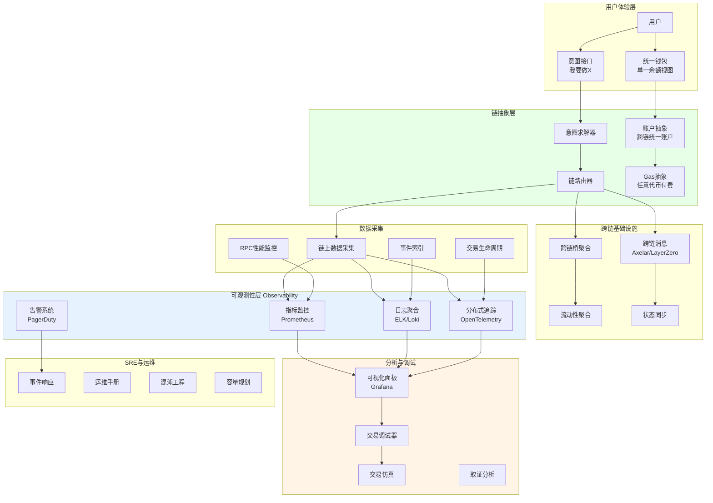
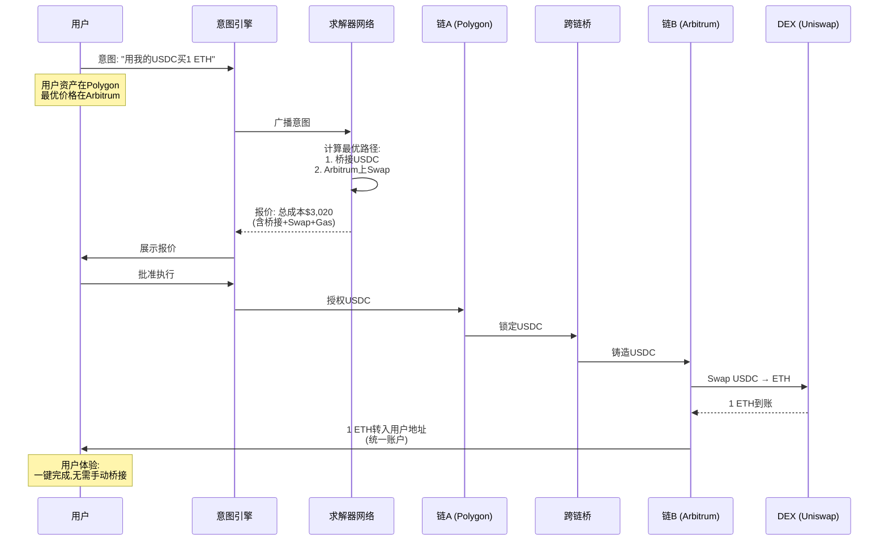
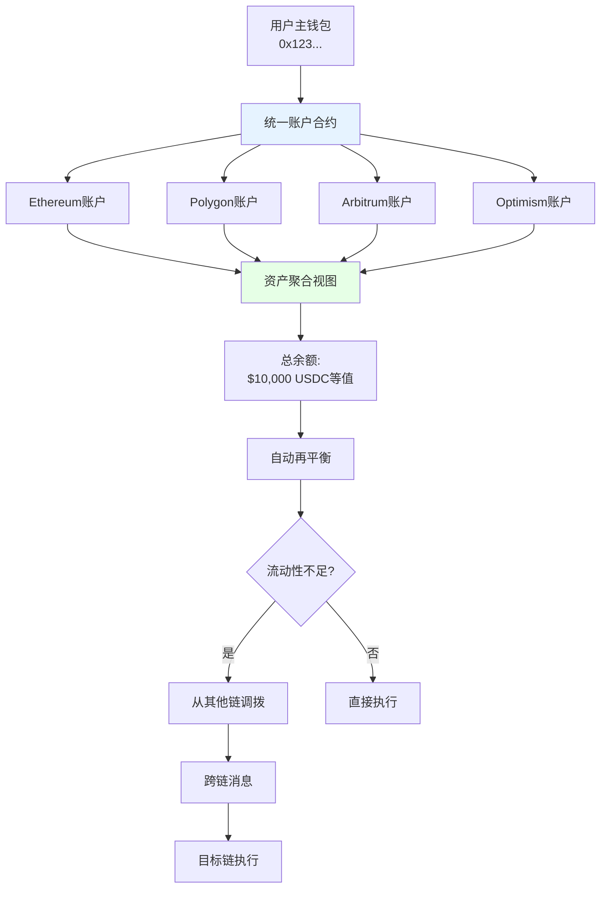
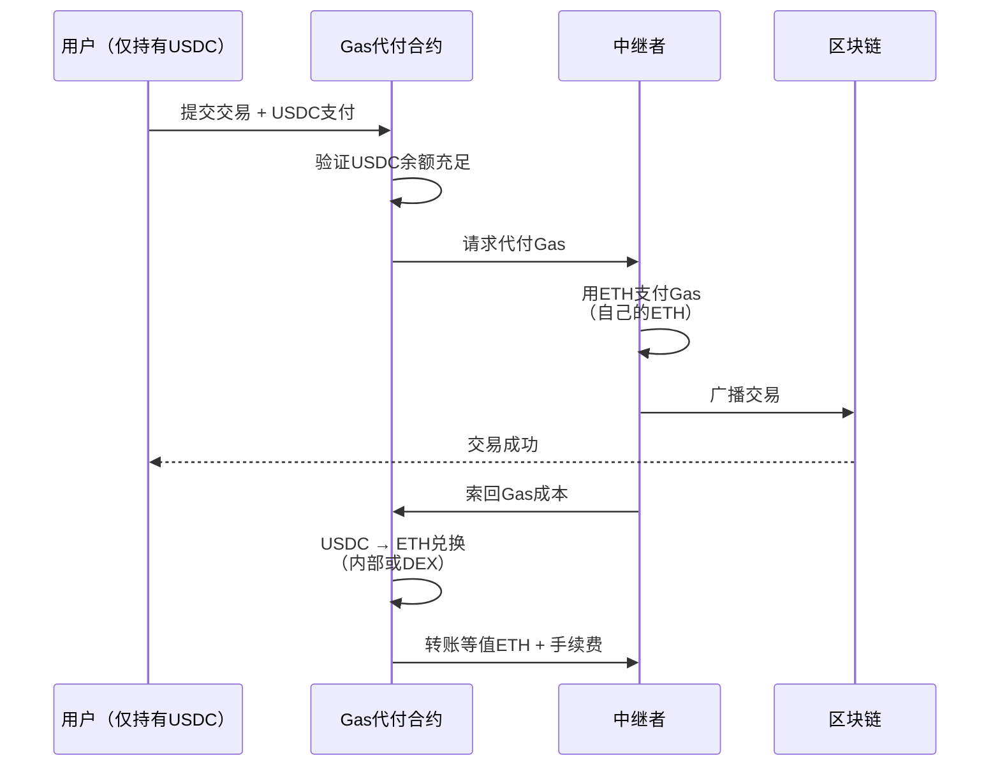
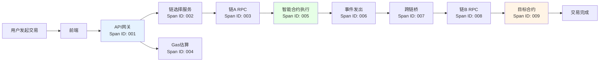
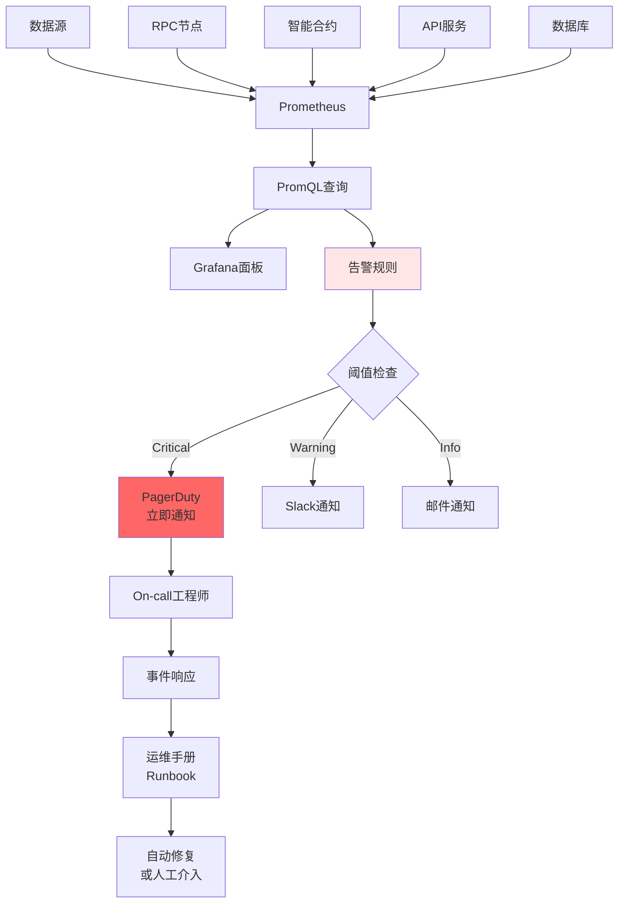

# N. 链抽象与可观测方案

## 方案概述

本方案提供跨链基础设施与全栈可观测性解决方案，实现链抽象（Chain Abstraction）让用户无感知跨链操作，同时提供完整的监控、追踪、告警、调试能力，确保系统稳定性与用户体验。

## 业务痛点

1. **用户体验差**：跨链操作复杂（桥接、Gas费、多钱包）
2. **流动性割裂**：资产分散在多链，无法统一管理
3. **开发复杂**：开发者需适配多链SDK与RPC
4. **故障排查难**：分布式系统，交易失败难以定位
5. **监控盲区**：链上链下割裂，缺乏统一可观测性
6. **成本不透明**：Gas费波动，用户难以预测成本

## 解决方案架构



## 核心业务流程

### 1. 链抽象：意图式跨链交易



**意图式交易优势**：

| 传统方式 | 意图式（链抽象） |
|----------|------------------|
| 1. 手动选择链 | 自动路由最优链 |
| 2. 桥接资产（10-30分钟） | 自动桥接，用户无感 |
| 3. 准备Gas（需持有原生代币） | Gas抽象，任意代币付费 |
| 4. 手动Swap | 一键完成 |
| 总耗时：30-60分钟 | 总耗时：2-5分钟 |

### 2. 统一账户抽象（Unified Account）



**统一账户功能**：
```typescript
// 伪代码API
class UnifiedAccount {
  // 跨链余额查询
  async getTotalBalance(token: string): Promise<number> {
    const chains = ['ethereum', 'polygon', 'arbitrum'];
    const balances = await Promise.all(
      chains.map(chain => this.getBalance(chain, token))
    );
    return balances.reduce((sum, bal) => sum + bal, 0);
  }
  
  // 智能执行（自动选链）
  async executeIntent(intent: Intent): Promise<Transaction> {
    // 1. 分析意图
    const analysis = await this.analyzeIntent(intent);
    
    // 2. 选择最优链
    const optimalChain = await this.selectChain({
      liquidity: analysis.requiredLiquidity,
      gasPrice: 'lowest',
      executionTime: 'fastest'
    });
    
    // 3. 自动桥接（如需要）
    if (this.currentChain !== optimalChain) {
      await this.bridge(this.currentChain, optimalChain, intent.amount);
    }
    
    // 4. 执行交易
    return await this.execute(optimalChain, intent);
  }
}
```

### 3. Gas抽象：任意代币付费



**ERC-4337 Paymaster示例**：
```solidity
// 伪代码
contract ERC20Paymaster {
    // 接受ERC20代币支付Gas
    function validatePaymasterUserOp(
        UserOperation calldata userOp,
        bytes32 userOpHash,
        uint256 maxCost
    ) external returns (bytes memory context) {
        address token = abi.decode(userOp.paymasterAndData[20:], (address));
        uint256 tokenAmount = calculateTokenAmount(token, maxCost);
        
        // 验证用户有足够代币
        require(IERC20(token).balanceOf(userOp.sender) >= tokenAmount);
        
        return abi.encode(token, tokenAmount, userOp.sender);
    }
    
    function postOp(
        PostOpMode mode,
        bytes calldata context,
        uint256 actualGasCost
    ) external {
        (address token, uint256 tokenAmount, address user) = 
            abi.decode(context, (address, uint256, address));
        
        // 扣除用户代币
        IERC20(token).transferFrom(user, address(this), tokenAmount);
        
        // 兑换为ETH（补充Paymaster余额）
        swapToETH(token, tokenAmount);
    }
}
```

### 4. 分布式追踪（Distributed Tracing）



**OpenTelemetry追踪示例**：
```typescript
// 伪代码
import { trace } from '@opentelemetry/api';

class CrossChainService {
  async bridgeAsset(from: Chain, to: Chain, amount: number) {
    const tracer = trace.getTracer('cross-chain-service');
    
    // 创建父span
    return tracer.startActiveSpan('bridge_asset', async (parentSpan) => {
      parentSpan.setAttribute('from_chain', from);
      parentSpan.setAttribute('to_chain', to);
      parentSpan.setAttribute('amount', amount);
      
      try {
        // 子span: 锁定资产
        await tracer.startActiveSpan('lock_asset', async (span) => {
          await this.lockAsset(from, amount);
          span.setStatus({ code: SpanStatusCode.OK });
        });
        
        // 子span: 跨链消息
        await tracer.startActiveSpan('send_message', async (span) => {
          await this.sendCrossChainMessage(to, amount);
          span.setStatus({ code: SpanStatusCode.OK });
        });
        
        // 子span: 铸造资产
        await tracer.startActiveSpan('mint_asset', async (span) => {
          await this.mintAsset(to, amount);
          span.setStatus({ code: SpanStatusCode.OK });
        });
        
        parentSpan.setStatus({ code: SpanStatusCode.OK });
      } catch (error) {
        parentSpan.recordException(error);
        parentSpan.setStatus({ code: SpanStatusCode.ERROR });
        throw error;
      } finally {
        parentSpan.end();
      }
    });
  }
}
```

### 5. 实时监控与告警



**告警规则示例**：
```yaml
# Prometheus告警配置
groups:
  - name: blockchain_alerts
    rules:
      # RPC节点延迟
      - alert: HighRPCLatency
        expr: rpc_request_duration_seconds{quantile="0.95"} > 2
        for: 5m
        labels:
          severity: warning
        annotations:
          summary: "RPC延迟过高"
          description: "{{ $labels.chain }} RPC p95延迟 {{ $value }}s"
      
      # 交易失败率
      - alert: HighTransactionFailureRate
        expr: |
          (
            rate(transactions_failed_total[5m])
            /
            rate(transactions_total[5m])
          ) > 0.05
        for: 10m
        labels:
          severity: critical
        annotations:
          summary: "交易失败率过高"
          description: "失败率 {{ $value | humanizePercentage }}"
      
      # Gas价格飙升
      - alert: GasPriceSpike
        expr: |
          (
            gas_price_gwei - gas_price_gwei offset 1h
          ) / gas_price_gwei offset 1h > 1
        labels:
          severity: info
        annotations:
          summary: "Gas价格剧烈波动"
          description: "1小时内上涨 {{ $value | humanizePercentage }}"
      
      # 跨链桥延迟
      - alert: BridgeDelayed
        expr: bridge_pending_duration_seconds > 3600
        labels:
          severity: critical
        annotations:
          summary: "跨链桥严重延迟"
          description: "交易pending超过1小时"
```

## 核心模块说明

### 1. 跨链消息协议

**协议对比**：

| 协议 | 类型 | 安全模型 | 延迟 | 成本 |
|------|------|----------|------|------|
| LayerZero | 轻客户端 | 预言机+中继者 | 快 | 低 |
| Axelar | 验证者网络 | PoS共识 | 中 | 中 |
| Wormhole | 守护者网络 | 多签 | 快 | 低 |
| IBC | 轻客户端 | Cosmos生态 | 快 | 低 |
| Chainlink CCIP | 预言机 | DON网络 | 中 | 中高 |

**消息流程**（LayerZero示例）：
```
1. 源链: 用户调用send()
2. 预言机: 监听事件，提交区块头到目标链
3. 中继者: 提交交易证明到目标链
4. 目标链: 验证证明，执行receive()
```

### 2. 链路由优化

**多维度路由决策**：
```python
# 伪代码
def selectOptimalChain(intent, constraints):
    candidates = getAllChains()
    scored = []
    
    for chain in candidates:
        score = 0
        
        # 1. Gas成本（权重30%）
        gas_cost = estimateGas(chain, intent)
        score += (1 - normalize(gas_cost)) * 0.3
        
        # 2. 流动性（权重25%）
        liquidity = getliquidity(chain, intent.asset)
        score += normalize(liquidity) * 0.25
        
        # 3. 执行速度（权重20%）
        speed = getBlockTime(chain)
        score += (1 - normalize(speed)) * 0.2
        
        # 4. 滑点（权重15%）
        slippage = estimateSlippage(chain, intent)
        score += (1 - normalize(slippage)) * 0.15
        
        # 5. 可靠性（权重10%）
        uptime = getChainUptime(chain)
        score += uptime * 0.1
        
        scored.append((chain, score))
    
    # 返回得分最高的链
    return max(scored, key=lambda x: x[1])[0]
```

### 3. 交易生命周期追踪

**状态机**：
```
Created → Validating → Signed → Submitted 
  → Pending → Confirming → Confirmed → Finalized

或失败路径:
  → Failed (reason)
  → Stuck (超时)
  → Dropped (被替换)
```

**详细追踪**：
```typescript
// 交易元数据
interface TransactionTrace {
  txHash: string;
  from: string;
  to: string;
  chain: string;
  status: TxStatus;
  timeline: {
    created: timestamp,
    signed: timestamp,
    submitted: timestamp,
    pending: timestamp,
    confirmed: timestamp,
    finalized: timestamp
  };
  gasUsed: number;
  gasPrice: number;
  blockNumber: number;
  events: Event[];
  errors: Error[];
  
  // 跨链信息（如适用）
  crossChain?: {
    sourceChain: string,
    targetChain: string,
    bridgeTxHash: string,
    status: 'pending' | 'completed' | 'failed'
  };
}
```

### 4. 性能指标（Metrics）

**关键指标**：
```
# RPC性能
rpc_request_duration_seconds{chain, method, quantile}
rpc_request_total{chain, method, status}

# 交易指标
transactions_total{chain, status}
transactions_duration_seconds{chain, quantile}
transactions_gas_used{chain, type}

# 跨链桥
bridge_volume_total{from_chain, to_chain, asset}
bridge_duration_seconds{from_chain, to_chain, quantile}
bridge_failed_total{from_chain, to_chain, reason}

# 系统健康
chain_block_height{chain}
chain_peers_connected{chain}
mempool_size{chain}
```

### 5. 成本优化

**Gas优化策略**：
```yaml
strategies:
  batch_transactions:
    description: "批量交易降低平均成本"
    savings: "30-50%"
  
  optimal_timing:
    description: "低峰期执行非紧急交易"
    savings: "20-40%"
  
  layer2_routing:
    description: "路由到L2降低成本"
    savings: "90-95%"
  
  eip1559_optimization:
    description: "动态调整maxFee和priorityFee"
    savings: "10-20%"
  
  flashbots_bundles:
    description: "打包交易避免竞价"
    savings: "5-15%"
```

**实时成本监控**：
```typescript
// 伪代码
class CostMonitor {
  async estimateTotalCost(intent: Intent): Promise<CostBreakdown> {
    return {
      gasCost: await this.estimateGas(intent),
      bridgeFee: intent.needsBridge ? await this.getBridgeFee() : 0,
      slippage: await this.estimateSlippage(intent),
      protocolFee: await this.getProtocolFee(intent),
      
      total: sum(above),
      
      // 对比其他方案
      alternatives: [
        { chain: 'Arbitrum', cost: 50 },
        { chain: 'Optimism', cost: 48 },
        { chain: 'Polygon', cost: 5 }
      ]
    };
  }
}
```

## 应用场景示例

### 场景1：多链DeFi聚合器

**用户需求**：在所有链上找到最佳收益

**链抽象方案**：
1. 用户输入："我有10K USDC，帮我找最高收益"
2. 系统扫描所有链（Ethereum/Arbitrum/Polygon等）
3. 发现Arbitrum上Aave收益最高（6.5% APY）
4. 自动桥接USDC到Arbitrum
5. 自动存入Aave
6. 用户一键完成，无需切换网络

**可观测性**：
- 实时监控各链APY变化
- 追踪桥接进度
- 告警：若APY下降>1%，提示用户重新分配

### 场景2：NFT跨链交易

**场景**：用户在Polygon拥有NFT，买家在Ethereum

**传统方式**：
1. 手动桥接NFT到Ethereum（风险高、成本高）
2. 或买家桥接资产到Polygon

**链抽象方案**：
1. 用户挂单："卖出NFT，接受任意链付款"
2. 买家出价（Ethereum ETH）
3. 系统：
   - 锁定卖家NFT（Polygon）
   - 托管买家ETH（Ethereum）
   - 原子交换（通过跨链消息）
4. 双方各自收到资产（无需桥接）

### 场景3：企业级系统监控

**企业**：DeFi协议运营方

**监控需求**：
- 7×24小时监控系统健康
- 交易失败立即告警
- 性能瓶颈识别
- 用户体验追踪

**部署方案**：
```
监控栈:
- Prometheus: 指标采集（RPC/合约/API）
- Grafana: 可视化面板（40+仪表盘）
- Loki: 日志聚合（智能合约日志、API日志）
- Jaeger: 分布式追踪（跨链交易全流程）
- AlertManager: 告警路由（PagerDuty、Slack、邮件）

SLO（服务水平目标）:
- 可用性: 99.9%（每月<43分钟宕机）
- 交易成功率: >99.5%
- API延迟: p95 < 200ms, p99 < 500ms
- RPC延迟: p95 < 1s

On-call轮值:
- 24/7工程师值班
- 平均响应时间: <5分钟
- 平均恢复时间: <30分钟
```

## 技术组件

### 技术栈

**链抽象**：
- **跨链消息**：LayerZero、Axelar、Hyperlane
- **账户抽象**：ERC-4337、Biconomy、Safe
- **意图协议**：Anoma、Essential、SUAVE
- **桥聚合**：Socket、Li.Fi、Bungee

**可观测性**：
- **指标**：Prometheus、VictoriaMetrics
- **日志**：Loki、Elasticsearch、Clickhouse
- **追踪**：Jaeger、Tempo、Zipkin
- **可视化**：Grafana、Kibana
- **告警**：AlertManager、PagerDuty、Opsgenie

**基础设施**：
- **容器**：Docker、Kubernetes
- **IaC**：Terraform、Pulumi
- **CI/CD**：GitHub Actions、ArgoCD
- **服务网格**：Istio（高级追踪）

### 部署架构

```yaml
production_stack:
  monitoring:
    prometheus:
      replicas: 3
      retention: 30d
      storage: 1TB
    
    grafana:
      replicas: 2
      datasources: [prometheus, loki, jaeger]
    
    loki:
      replicas: 3
      retention: 15d
      storage: 500GB
    
  alerting:
    alertmanager:
      replicas: 3
      routes:
        - critical: pagerduty
        - warning: slack
        - info: email
  
  tracing:
    jaeger:
      collector_replicas: 3
      query_replicas: 2
      storage: elasticsearch
      retention: 7d
  
  high_availability:
    - multi_region: true
    - auto_scaling: true
    - disaster_recovery: automated
```

## 合规与安全

### 安全监控

**异常检测**：
```
监控指标:
1. 大额异常交易（>$100K）
2. 频繁失败交易（同地址>10次/小时）
3. Gas价格异常飙升（>100 gwei）
4. 合约升级事件
5. 权限变更（Owner transfer）

自动响应:
- 触发告警
- 暂停高风险操作
- 通知安全团队
- 生成事件报告
```

### 合规审计

**审计日志留存**：
```
要求:
- 所有交易完整记录
- 7年留存期（金融监管）
- 不可篡改（区块链+备份）
- 快速检索（索引优化）
- 监管机构可访问接口
```

## 交付成果与KPI

### 核心KPI

| 指标 | 目标值 | 说明 |
|------|--------|------|
| 跨链成功率 | >99% | 桥接+执行成功率 |
| 端到端延迟 | p95<5分钟 | 跨链交易完成时间 |
| Gas节省 | >30% | vs 用户手动操作 |
| 系统可用性 | 99.9% | 月度SLA |
| MTTR | <30分钟 | 平均恢复时间 |
| 交易追踪覆盖率 | 100% | 所有交易可追溯 |

### 交付物清单

**第一阶段（MVP，10-12周）**
- [ ] 基础链抽象（2-3条链）
- [ ] 统一余额视图
- [ ] Prometheus+Grafana监控
- [ ] 基础告警

**第二阶段（Pro，12-18周）**
- [ ] 完整链抽象（10+链）
- [ ] Gas抽象（任意代币付费）
- [ ] 分布式追踪（OpenTelemetry）
- [ ] 日志聚合（Loki）
- [ ] 高级告警与自动响应

**第三阶段（Enterprise，18-30周）**
- [ ] 意图式交易
- [ ] 多链账户抽象
- [ ] 完整SRE工具链
- [ ] 混沌工程测试
- [ ] 7×24运维支持

## 风险与应对

| 风险类型 | 描述 | 缓解措施 |
|----------|------|----------|
| 跨链桥风险 | 桥接失败、资金卡住 | 多桥聚合、保险、快速响应 |
| 性能瓶颈 | 监控系统过载 | 水平扩展、采样策略 |
| 数据丢失 | 日志/指标丢失 | 多副本、定期备份 |
| 告警疲劳 | 过多告警导致忽视 | 告警分级、降噪 |
| 单点故障 | 监控系统宕机 | 高可用部署、灾备 |

## 成功案例参考

1. **Socket**：跨链桥聚合，集成15+桥
2. **Safe（原Gnosis Safe）**：多签钱包，链抽象账户
3. **Biconomy**：Gas抽象与账户抽象基础设施
4. **Tenderly**：Web3可观测平台，交易仿真与监控
5. **Dune Analytics**：链上数据分析与可视化

## 下一步行动

1. **需求评估**（1-2周）
   - 确定支持链列表
   - 评估监控需求
   - SLA目标设定

2. **基础设施搭建**（8-12周）
   - 跨链基础设施
   - 监控栈部署
   - 告警配置

3. **试运行**（小流量）
   - Beta用户测试
   - 监控指标验证
   - 性能调优

4. **正式上线**
   - 全流量切换
   - 7×24运维
   - 持续优化

---

**联系方式**：
- 技术咨询：[邮箱/Telegram]
- 架构设计：[架构师团队]
- 演示预约：24小时内安排

