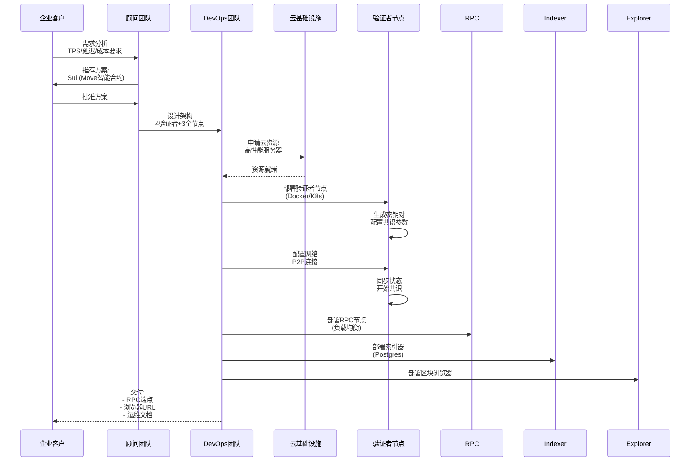
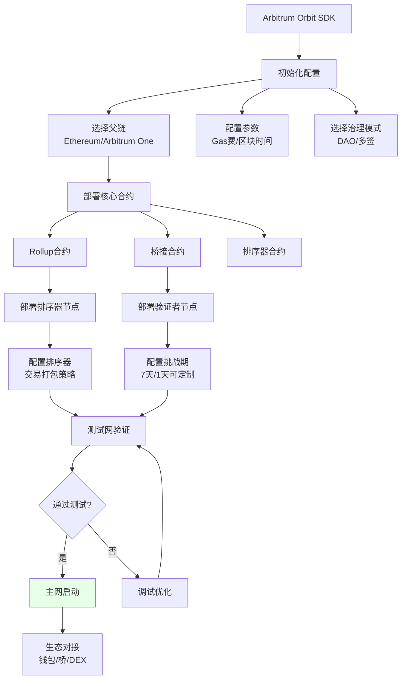
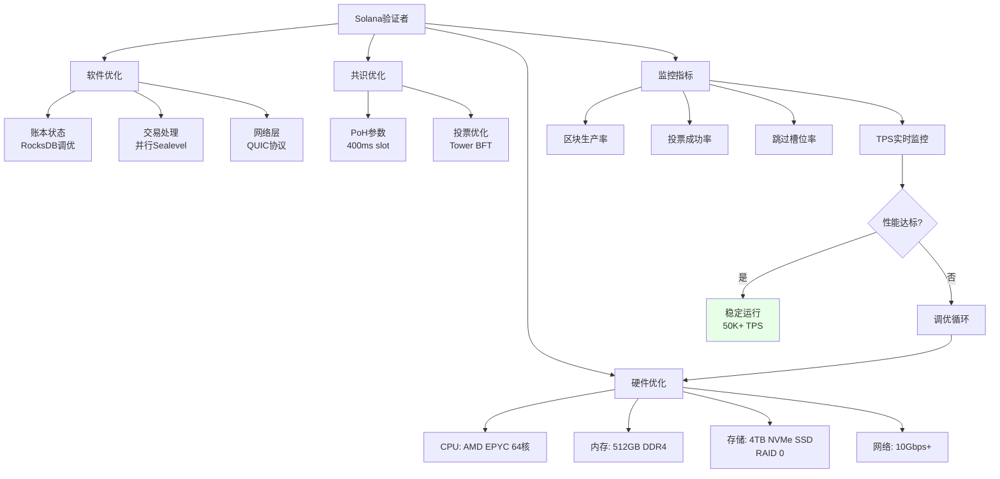
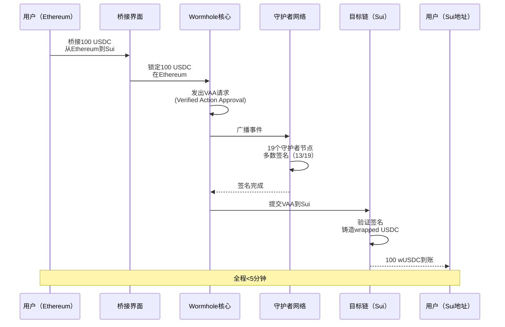

# O. 高性能区块链部署与互操作方案
## (Solana / Sui / Aptos / Arbitrum Orbit 等)

## 方案概述

本方案为企业提供高性能区块链（Solana、Sui、Aptos）和Layer 2（Arbitrum Orbit、OP Stack）的定制化部署、性能优化与跨链互操作解决方案，实现企业级吞吐量(>10K TPS)、低延迟(<500ms)、可定制治理的区块链基础设施。

## 业务痛点

1. **以太坊性能瓶颈**：TPS低(~15)、Gas费高、确认慢
2. **公链局限性**：无法定制参数（Gas费、区块时间、权限）
3. **技术门槛高**：自建区块链需要深厚技术储备
4. **互操作性差**：不同链间资产和数据无法流通
5. **运维复杂**：节点部署、监控、升级需专业团队
6. **生态割裂**：流动性、用户、开发者分散在多链

## 解决方案架构

```mermaid
graph TB
    subgraph 高性能链选型["高性能链选型"]
        Solana[Solana<br/>60K TPS, 400ms]
        Sui[Sui<br/>120K TPS, 500ms<br/>并行执行]
        Aptos[Aptos<br/>160K TPS, <1s<br/>Move语言]
        Arbitrum[Arbitrum Orbit<br/>定制L2, 40K TPS]
        OP_Stack[OP Stack<br/>定制L2, 4K TPS]
    end

    subgraph 定制部署["定制化部署"]
        Validator[验证者网络<br/>自建/托管]
        RPC[RPC端点<br/>高可用集群]
        Indexer[索引器<br/>实时数据]
        Explorer[区块浏览器]
        Faucet[水龙头<br/>测试代币]
    end

    subgraph 性能优化["性能优化"]
        HW_Optimization[硬件优化<br/>GPU/高速SSD]
        Network_Tuning[网络调优<br/>低延迟]
        Consensus_Config[共识参数<br/>定制]
        StateDB_Optimization[状态数据库优化]
        Parallel_Execution[并行执行引擎]
    end

    subgraph 互操作层["跨链互操作"]
        Bridge[跨链桥<br/>Wormhole/Axelar]
        Messaging[消息传递<br/>LayerZero]
        LiquidityAggregator[流动性聚合]
        CrossChainToken[跨链代币标准]
    end

    subgraph 开发者工具["开发者工具"]
        SDK[SDK<br/>Rust/TypeScript/Move]
        SmartContract[智能合约框架]
        Wallet[钱包集成]
        TestFramework[测试框架]
        Documentation[文档与教程]
    end

    subgraph 运维与监控["运维与监控"]
        NodeMonitoring[节点监控]
        PerformanceMetrics[性能指标]
        Alerting[告警系统]
        AutoScaling[自动扩容]
        DisasterRecovery[灾备]
    end

    subgraph 治理与经济["治理与代币经济"]
        Governance[链上治理]
        TokenDesign[代币经济设计]
        FeeStructure[费用结构]
        ValidatorIncentive[验证者激励]
    end

    Solana --> Validator
    Sui --> Validator
    Aptos --> Validator
    Arbitrum --> Validator
    OP_Stack --> Validator
    
    Validator --> HW_Optimization
    Validator --> Network_Tuning
    
    Validator --> Bridge
    Bridge --> Messaging
    
    Validator --> SDK
    SDK --> SmartContract
    
    Validator --> NodeMonitoring
    NodeMonitoring --> Alerting
    
    Validator --> Governance
    Governance --> TokenDesign

    style 高性能链选型 fill:#e6ffe6
    style 性能优化 fill:#fff4e6
    style 互操作层 fill:#e6f3ff
```



## 高性能链技术对比

| 特性 | Solana | Sui | Aptos | Arbitrum Orbit | OP Stack |
|------|--------|-----|-------|----------------|----------|
| **TPS峰值** | 65K | 120K | 160K | 40K | 4K |
| **确认时间** | 400ms | 500ms | <1s | 250ms | 2s |
| **共识机制** | PoH+PoS | Narwhal+Bullshark | AptosBFT | Optimistic Rollup | Optimistic Rollup |
| **智能合约语言** | Rust(Solana) | Move | Move | Solidity | Solidity |
| **并行执行** | ✓ | ✓✓ (对象模型) | ✓ (Block-STM) | 部分 | 否 |
| **定制化程度** | 低 | 中 | 中 | 高 | 高 |
| **部署难度** | 高 | 中 | 中 | 中 | 低 |
| **生态成熟度** | 高 | 中 | 中 | 高（继承Arbitrum） | 高（继承OP） |
| **适用场景** | DEX/Game | 游戏/支付 | DeFi/Game | 企业定制L2 | 企业定制L2 |

## 核心业务流程

### 1. Sui 区块链定制部署



**Sui验证者配置示例**：
```yaml
# validator.yaml
network:
  listen_address: "0.0.0.0:9000"
  external_address: "validator-1.example.com:9000"
  p2p_config:
    seed_peers:
      - address: "/dns/validator-2.example.com/tcp/9000"
      - address: "/dns/validator-3.example.com/tcp/9000"

consensus:
  max_pending_transactions: 100000
  max_batch_size: 5000
  min_batch_size: 500
  max_batch_delay_ms: 200

database:
  path: "/data/sui"
  cache_size_mb: 10000

metrics:
  enabled: true
  port: 9091
```

### 2. Arbitrum Orbit L2 定制部署



**Arbitrum Orbit优势**：
```yaml
custom_features:
  gas_token:
    - 可使用任意ERC20作为Gas（如USDC）
    - 无需持有ETH
  
  governance:
    - DAO治理（投票决定升级）
    - 多签治理（快速决策）
    - 混合模式
  
  sequencer:
    - 自托管排序器（完全控制）
    - 去中心化排序器网络（未来）
  
  data_availability:
    - Ethereum L1（最安全，贵）
    - Celestia/EigenDA（中）
    - 自建DA（最便宜，自担风险）
  
  fraud_proofs:
    - 挑战期：1-7天可配置
    - 欺诈证明机制：WASM/Interactive
```

### 3. Solana高性能优化



**Solana验证者硬件需求**：
```
生产环境（主网）:
CPU: AMD EPYC 7003/7004系列，≥16核
RAM: 256GB (推荐512GB)
存储: 
  - 账本: 2TB+ NVMe SSD (Gen4)
  - 账户: 500GB+ NVMe SSD
网络: 
  - 上行: 300Mbps+
  - 下行: 1Gbps+
  - 低延迟(<50ms到其他验证者)
GPU: 可选，用于PoH验证加速

测试网:
CPU: 16核
RAM: 128GB
存储: 1TB NVMe
网络: 100Mbps

成本估算:
- 硬件采购: $10K-20K
- 月租服务器: $500-1500
- 网络带宽: $100-300/月
- 总成本: ~$2K/月（托管）
```

### 4. 跨链互操作实现



**跨链桥技术选择**：

| 桥方案 | 安全模型 | 支持链 | 延迟 | 成本 | 推荐场景 |
|--------|----------|--------|------|------|----------|
| **Wormhole** | 守护者网络(19节点) | 30+ | 快(2-5分钟) | 中 | 通用跨链 |
| **Axelar** | PoS验证者 | 50+ | 中(5-15分钟) | 中高 | 企业级 |
| **LayerZero** | 轻客户端+预言机 | 50+ | 快(1-3分钟) | 低 | 消息传递 |
| **Circle CCTP** | Circle官方 | 8链 | 快(10分钟) | 最低 | USDC专用 |
| **原子交换** | 无信任 | 有限 | 慢(1小时+) | 低 | 点对点 |

### 5. Move智能合约开发（Sui/Aptos）

```move
// Sui Move智能合约示例
module example::defi {
    use sui::coin::{Self, Coin};
    use sui::balance::{Self, Balance};
    use sui::object::{Self, UID};
    use sui::transfer;
    use sui::tx_context::{Self, TxContext};

    // 流动性池对象
    struct LiquidityPool<phantom CoinA, phantom CoinB> has key {
        id: UID,
        coin_a: Balance<CoinA>,
        coin_b: Balance<CoinB>,
        lp_supply: u64,
    }

    // 创建流动性池
    public entry fun create_pool<CoinA, CoinB>(
        coin_a: Coin<CoinA>,
        coin_b: Coin<CoinB>,
        ctx: &mut TxContext
    ) {
        let pool = LiquidityPool {
            id: object::new(ctx),
            coin_a: coin::into_balance(coin_a),
            coin_b: coin::into_balance(coin_b),
            lp_supply: 0,
        };
        transfer::share_object(pool);
    }

    // Swap函数（恒定乘积）
    public entry fun swap_a_to_b<CoinA, CoinB>(
        pool: &mut LiquidityPool<CoinA, CoinB>,
        coin_a_in: Coin<CoinA>,
        ctx: &mut TxContext
    ) {
        let amount_in = coin::value(&coin_a_in);
        let reserve_a = balance::value(&pool.coin_a);
        let reserve_b = balance::value(&pool.coin_b);
        
        // x * y = k公式
        let amount_out = (amount_in * reserve_b) / (reserve_a + amount_in);
        
        balance::join(&mut pool.coin_a, coin::into_balance(coin_a_in));
        let coin_b_out = coin::take(&mut pool.coin_b, amount_out, ctx);
        
        transfer::public_transfer(coin_b_out, tx_context::sender(ctx));
    }
}
```

**Move语言优势**：
- **资源安全**：资产不能被复制或丢失（线性类型）
- **并行执行**：对象模型天然支持并行
- **形式化验证**：Move Prover保证合约正确性
- **Gas效率**：字节码优化，Gas成本低

## 核心模块说明

### 1. 验证者节点部署（多链支持）

**Docker Compose部署示例（Sui）**：
```yaml
version: '3.8'

services:
  sui-validator:
    image: mysten/sui:mainnet
    container_name: sui-validator
    volumes:
      - ./config:/root/.sui/config
      - ./data:/data
    ports:
      - "9000:9000"  # P2P
      - "9091:9091"  # Metrics
    command: >
      sui-node
      --config-path /root/.sui/config/validator.yaml
    restart: unless-stopped
    resources:
      limits:
        cpus: '32'
        memory: 256G
  
  sui-rpc:
    image: mysten/sui:mainnet
    container_name: sui-rpc
    ports:
      - "9000:9000"
    command: sui-node --config-path /config/fullnode.yaml
    restart: unless-stopped
  
  prometheus:
    image: prom/prometheus
    volumes:
      - ./prometheus.yml:/etc/prometheus/prometheus.yml
    ports:
      - "9090:9090"
  
  grafana:
    image: grafana/grafana
    ports:
      - "3000:3000"
    environment:
      - GF_SECURITY_ADMIN_PASSWORD=admin
```

### 2. RPC端点高可用架构

```
           ┌─────────────┐
           │ Load Balancer│
           │ (NGINX/HAProxy)│
           └──────┬───────┘
                  │
         ┌────────┼────────┐
         │        │        │
    ┌────▼───┐ ┌─▼────┐ ┌─▼────┐
    │RPC Node│ │RPC Node│ │RPC Node│
    │  #1    │ │  #2   │ │  #3   │
    └────┬───┘ └──┬───┘ └──┬────┘
         │        │        │
         └────────┼────────┘
                  │
           ┌──────▼───────┐
           │ Full Node Pool│
           │ (Read Replica)│
           └──────────────┘

策略:
- 健康检查: 每10秒ping一次
- 失败转移: 节点失败自动摘除
- 流量分配: 加权轮询（按性能分配）
- 缓存: Redis缓存热点查询
- 速率限制: 按API Key限流
```

### 3. 索引器架构（The Graph风格）

**Sui索引器示例**：
```typescript
// 伪代码
import { SuiClient } from '@mysten/sui.js';

class SuiIndexer {
  async indexTransactions(fromCheckpoint: number, toCheckpoint: number) {
    for (let cp = fromCheckpoint; cp <= toCheckpoint; cp++) {
      const checkpoint = await this.client.getCheckpoint({ id: cp });
      
      for (const tx of checkpoint.transactions) {
        // 解析交易类型
        if (tx.type === 'MoveCall') {
          await this.indexMoveCall(tx);
        } else if (tx.type === 'TransferObject') {
          await this.indexTransfer(tx);
        }
        
        // 解析事件
        for (const event of tx.events) {
          await this.indexEvent(event);
        }
      }
      
      // 存入PostgreSQL
      await this.db.saveCheckpoint(checkpoint);
    }
  }
  
  async indexMoveCall(tx) {
    // 提取合约调用信息
    const contractCall = {
      tx_hash: tx.digest,
      package: tx.package,
      module: tx.module,
      function: tx.function,
      arguments: tx.arguments,
      timestamp: tx.timestamp
    };
    
    await this.db.saveContractCall(contractCall);
    
    // 针对特定合约的特殊处理
    if (tx.package === DEFI_PACKAGE) {
      await this.indexDeFiActivity(tx);
    }
  }
}
```

### 4. 性能基准测试

**TPS压力测试脚本**：
```rust
// Rust压测工具伪代码
use sui_sdk::SuiClient;
use tokio::task;

async fn benchmark_tps() {
    let client = SuiClient::new("https://rpc.mainnet.sui.io");
    let num_transactions = 10000;
    let concurrent_tasks = 100;
    
    let start_time = std::time::Instant::now();
    
    let mut handles = vec![];
    for i in 0..concurrent_tasks {
        let client_clone = client.clone();
        let handle = task::spawn(async move {
            for j in 0..(num_transactions / concurrent_tasks) {
                // 发送转账交易
                let _ = client_clone.transfer(
                    sender,
                    recipient,
                    amount,
                ).await;
            }
        });
        handles.push(handle);
    }
    
    // 等待所有任务完成
    for handle in handles {
        handle.await.unwrap();
    }
    
    let elapsed = start_time.elapsed().as_secs_f64();
    let tps = num_transactions as f64 / elapsed;
    
    println!("TPS: {:.2}", tps);
    println!("平均延迟: {:.2}ms", (elapsed * 1000.0) / num_transactions as f64);
}
```

**性能优化清单**：
```yaml
bottleneck_checklist:
  network:
    - latency: 测量P2P延迟，目标<50ms
    - bandwidth: 确保带宽充足（1Gbps+）
    - packet_loss: 丢包率<0.1%
  
  storage:
    - iops: SSD IOPS >100K
    - latency: 读写延迟<1ms
    - capacity: 留足增长空间（>50%可用）
  
  cpu:
    - utilization: CPU使用率<80%
    - core_count: 多核并行（32核+）
    - cache: L3 cache足够（64MB+）
  
  memory:
    - size: 内存充足（256GB+）
    - swap: 禁用swap（影响性能）
  
  database:
    - rocksdb_config: 调优RocksDB参数
    - connection_pool: 连接池大小优化
    - index: 建立合适索引
```

### 5. 跨链代币标准

**统一代币接口（xERC20）**：
```solidity
// 伪代码
interface IxERC20 {
    // 跨链铸造（桥接入）
    function mint(address to, uint256 amount) external;
    
    // 跨链销毁（桥接出）
    function burn(address from, uint256 amount) external;
    
    // 设置桥接限额
    function setLimits(
        address bridge,
        uint256 mintLimit,
        uint256 burnLimit
    ) external;
    
    // 查询桥接额度
    function mintingCurrentLimitOf(address bridge) external view returns (uint256);
    function burningCurrentLimitOf(address bridge) external view returns (uint256);
}

// 优势
- 多桥接支持（Wormhole/Axelar/LayerZero同时使用）
- 限额控制（防止单个桥风险）
- 标准化接口（易于集成）
```

## 应用场景示例

### 场景1：游戏公司定制Sui链

**需求**：MMO游戏，需要高TPS处理装备交易

**方案**：
1. **部署Sui验证者网络**（4节点）
2. **定制功能**：
   - Gas代币：游戏代币（非SUI）
   - 免费交易：游戏内操作无Gas费
   - 快速确认：500ms最终性
3. **桥接主网**：资产可跨链到Sui主网交易
4. **NFT铸造**：游戏装备NFT化

**成本**：
- 初始部署：$50K（开发+审计）
- 月度运营：$5K（4验证者托管）
- vs 以太坊L2：相似成本，但TPS高10倍

### 场景2：企业Arbitrum Orbit私有L2

**企业**：供应链金融平台

**需求**：
- 隐私（不暴露交易细节）
- 合规（KYC/AML集成）
- 低成本（大量交易）
- 以太坊兼容（现有合约迁移）

**方案**：
1. **Arbitrum Orbit部署**：
   - 父链：Arbitrum One（降低L1成本）
   - DA：Celestia（成本<L1的1/10）
   - Gas代币：USDC
2. **许可模式**：仅白名单地址可访问
3. **定制排序器**：企业自运营
4. **桥接**：企业资产可桥接到公链变现

**效果**：
- TPS：40K（vs 以太坊15）
- Gas费：$0.0001/笔（vs $1-10）
- 合规：完全控制节点与数据

### 场景3：DeFi协议Solana迁移

**协议**：以太坊DEX，受Gas费困扰

**迁移方案**：
1. **双链部署**：以太坊（现有）+ Solana（新）
2. **跨链流动性**：Wormhole桥接资产
3. **UI统一**：用户无感切换链
4. **激励迁移**：Solana上交易手续费减半

**技术挑战**：
- Solidity → Rust重写合约
- Solana账户模型适配
- 跨链价格预言机

**收益**：
- 用户Gas费降低95%
- 交易速度提升50倍
- 吸引Solana生态用户

## 技术组件

### 技术栈对比

| 组件 | Solana | Sui | Aptos | Arbitrum Orbit |
|------|--------|-----|-------|----------------|
| **语言** | Rust | Move | Move | Solidity |
| **节点** | Rust | Rust | Rust | Go(Geth fork) |
| **存储** | RocksDB | RocksDB | AptosDB | LevelDB |
| **网络** | QUIC | TCP | TCP | P2P |
| **SDK** | @solana/web3.js | @mysten/sui.js | aptos-sdk | ethers.js |

### 部署工具链

```yaml
deployment_tools:
  infrastructure:
    terraform: 自动化云资源
    ansible: 配置管理
    docker: 容器化节点
    kubernetes: 编排与扩容
  
  monitoring:
    prometheus: 指标采集
    grafana: 可视化
    alertmanager: 告警
    loki: 日志聚合
  
  security:
    vault: 密钥管理
    fail2ban: 防暴力破解
    firewall: iptables/UFW
    ddos_protection: Cloudflare
  
  ci_cd:
    github_actions: 自动化部署
    argocd: GitOps
```

## 合规与治理

### 许可链 vs 无许可链

| 特性 | 许可链 | 无许可链 |
|------|--------|----------|
| 验证者准入 | 需批准 | 任何人可加入 |
| 合规性 | 高（KYC/AML） | 低 |
| 性能 | 高（节点可控） | 中（公开网络） |
| 去中心化 | 低 | 高 |
| 适用场景 | 企业/联盟 | 公共应用 |

### 治理机制设计

**Arbitrum Orbit治理示例**：
```
治理结构:
1. Security Council（安全委员会）
   - 9-12人多签
   - 紧急升级权限
   - 3/12签名即可执行

2. DAO投票
   - 代币持有者投票
   - 7天投票期
   - Quorum: 3%
   - 通过阈值: 66%

3. 时间锁
   - 升级需24-48小时延迟
   - 给用户退出时间

权限分级:
- Critical（关键）: Security Council + DAO
- Major（重大）: DAO投票
- Minor（次要）: 多签即可
```

## 交付成果与KPI

### 核心KPI

| 指标 | 目标值 | 说明 |
|------|--------|------|
| TPS | >10K | 实际吞吐量 |
| 确认时间 | <2秒 | p95延迟 |
| 交易成功率 | >99.9% | 扣除用户错误 |
| 节点在线率 | >99.5% | 验证者SLA |
| Gas成本 | <$0.01/笔 | vs 以太坊$1-10 |
| 部署时间 | 6-10周 | 从签约到上线 |

### 交付物清单

**第一阶段（测试网，6-8周）**
- [ ] 验证者网络部署（4节点）
- [ ] RPC端点（高可用）
- [ ] 区块浏览器
- [ ] 水龙头（测试代币）
- [ ] 基础监控
- [ ] 开发者文档

**第二阶段（主网准备，8-12周）**
- [ ] 安全审计（智能合约+基础设施）
- [ ] 压力测试（TPS验证）
- [ ] 跨链桥集成
- [ ] 钱包集成（MetaMask/Phantom）
- [ ] 灾备方案
- [ ] 运维手册

**第三阶段（主网与生态，12-24周）**
- [ ] 主网启动
- [ ] 生态项目对接（DEX/NFT市场）
- [ ] 治理DAO设立
- [ ] 代币经济启动
- [ ] 社区建设
- [ ] 7×24运维支持

## 风险与应对

| 风险类型 | 描述 | 缓解措施 |
|----------|------|----------|
| 技术风险 | 节点故障、共识失败 | 冗余部署、监控告警、快速恢复 |
| 安全风险 | 私钥泄露、合约漏洞 | 多签、审计、Bug Bounty |
| 运营风险 | 团队离职、运维中断 | 文档完备、备份团队、托管服务 |
| 市场风险 | 生态冷启动、流动性不足 | 激励计划、合作伙伴、流动性挖矿 |
| 合规风险 | 监管政策变化 | 法律顾问、灵活架构、多法域 |

## 成功案例参考

1. **Sei Network**：Cosmos SDK定制，游戏链，10K TPS
2. **Immutable X**：游戏NFT专用L2，StarkWare技术
3. **Ronin**：Axie Infinity私有侧链，高峰400K DAU
4. **Arbitrum Nova**：Arbitrum游戏链，AnyTrust DA
5. **OP Mainnet**：Optimism主网，Coinbase/Worldcoin采用

## 下一步行动

1. **技术咨询**（1-2周）
   - 需求分析（TPS/成本/合规）
   - 链选型建议
   - 架构设计

2. **概念验证PoC**（4-6周）
   - 小规模部署（单验证者）
   - 性能测试
   - 成本估算

3. **测试网部署**（6-8周）
   - 完整网络搭建
   - 压力测试
   - 合作伙伴试用

4. **主网启动**
   - 安全审计
   - 正式上线
   - 生态建设
   - 长期运维

---

**联系方式**：
- 区块链架构：[技术团队]
- 商务合作：[BD邮箱]
- 技术演示：24小时内安排
- GitHub：[示例代码]

